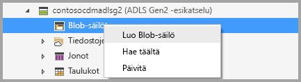
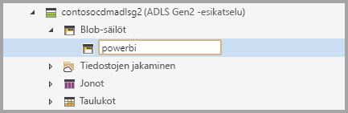
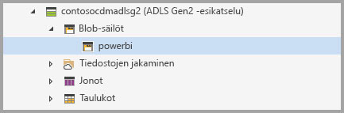
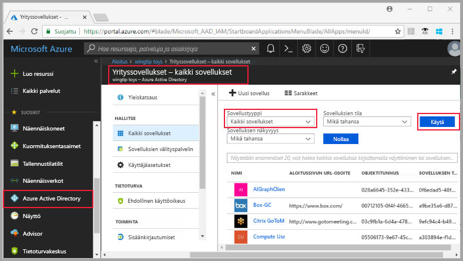
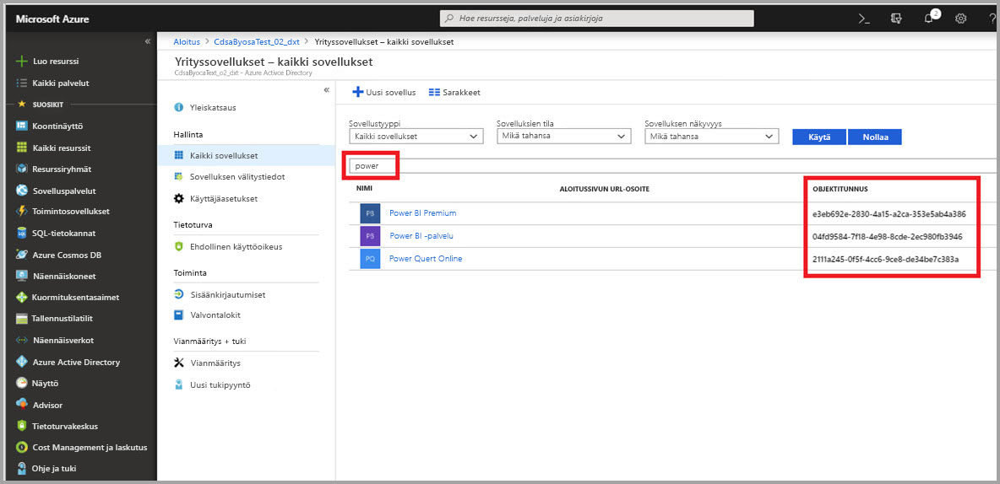
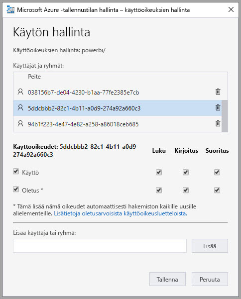
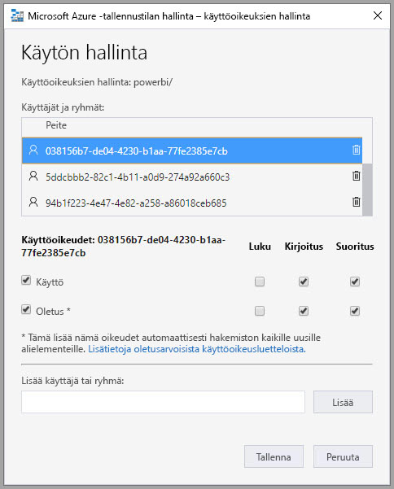
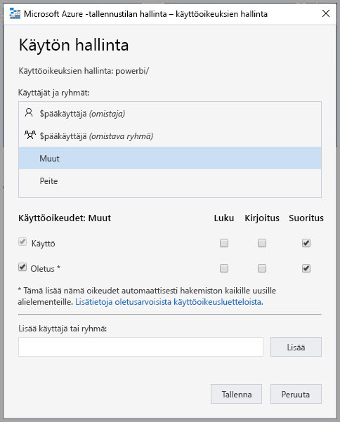
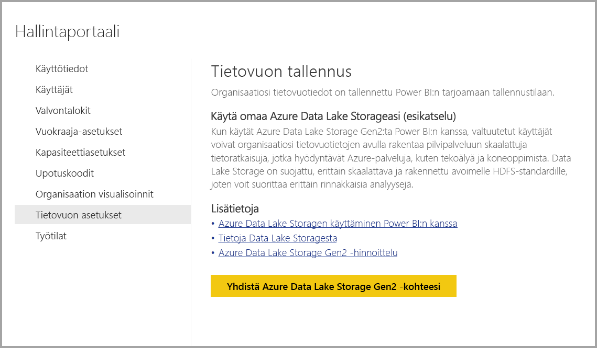
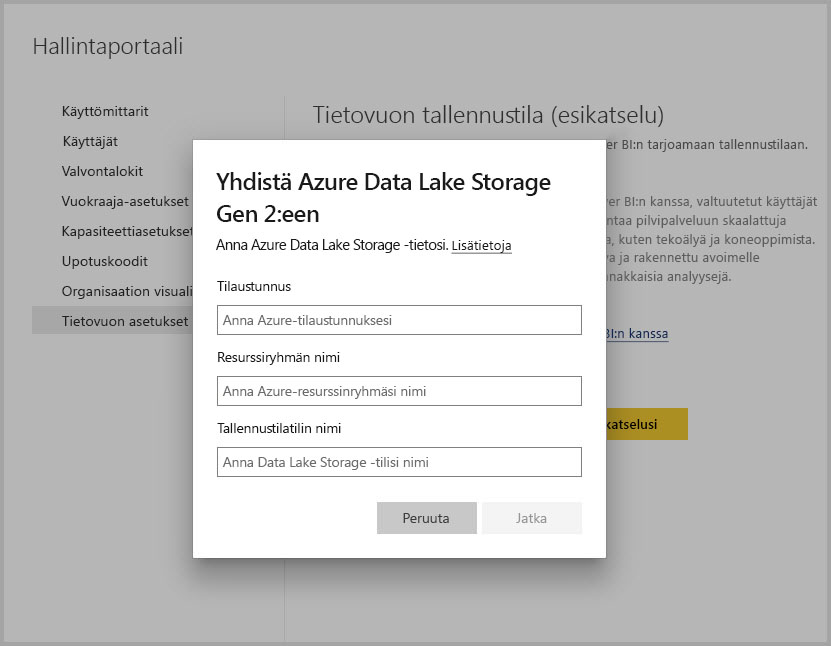

# Azure Data Lake Storage Gen2:n yhdistäminen tietovuon tallentamiseksi

Power BI:n työtilat voidaan määrittää tallentamaan tietovuot organisaatiosi Azure Data Lake Storage Gen2 -tilille. Tässä artikkelissa kuvataan yleisiä vaiheita tämän tekemiseksi sekä annetaan samalla ohjeita ja parhaita käytäntöjä. Työtilojen määrittämisessä on joitakin etuja tietovuon määritelmien ja tietotiedostojen tallentamiseksi Data Lakeen, kuten seuraavat:

* Azure Data Lake Storage Gen2 tarjoaa valtavan skaalattavan tallennusvälineen tiedoille
* IT-osaston kehittäjät voivat hyödyntää tietovuon tietoja ja määritelmätiedostoja Azure-tietojen ja tekoälyn (AI) palvelujen hyödyntämiseksi, kuten [Azure-tietopalvelujen GitHub-malleissa](https://aka.ms/cdmadstutorial) on näytetty.
* Organisaatiosi kehittäjät voivat integroida tietovuon tiedot sisäisiin sovelluksiin ja tärkeisiin liiketoimintaratkaisuihin käyttämällä tietovoiden ja Azuren kehittäjäresursseja

Jos haluat käyttää Azure Data Lake Storage Gen2:ta tietovoita varten, tarvitset seuraavat:

* **Power BI -vuokraaja:** – vähintään yhden tilin Azure Active Directory (AAD) -vuokraajassa on oltava rekisteröinyt Power BI:hin
* **Yleinen järjestelmänvalvoja -tili** – tätä tiliä vaaditaan yhdistämiseen ja Power BI:n määrittämiseen tietovuon määritelmän ja tietojen tallentamiseksi Azure Data Lake Storage Gen2 -tilille
* **Azure-tilaus** – tarvitset Azure-tilauksen Azure Data Lake Storage Gen2:n käyttämiseksi
* **Resurssiryhmä** – käytä olemassa olevaa resurssiryhmää tai luo uusi
* **Azure-tallennustili, jossaa on Data Lake Storage Gen2 -ominaisuus käytössä** 

> [!TIP]
> Jos sinulla ei ole Azure-tilausta, luo [ilmainen tili](https://azure.microsoft.com/free/) ennen aloittamista.

> [!WARNING]
> Kun tietovuon tallennussijainti on määritetty, sitä ei voi muuttaa. Lisätietoja muista tärkeistä seikoista on tämän artikkelin lopussa olevassa [huomioon otettavia seikkoja ja rajoituksia](#considerations-and-limitations) käsittelevässä osassa.

## Azure Data Lake Storage Gen2:n valmisteleminen Power BI:tä varten

Ennen kuin voit määrittää Power BI:hin Azure Data Lake Storage Gen2 -tilin, sinun on luotava ja määritettävä tallennustili. Tarkastellaanpa Power BI:n vaatimuksia:

1. Tallennustili on luotava samassa AAD-vuokraajassa kuin Power BI -vuokraajasi.
2. Tallennustili on luotava samalla alueella kuin Power BI -vuokraajasi. Jos haluat tietää, missä Power BI -vuokraajasi sijaitsee, katso artikkelia [Missä Power BI -vuokraajani sijaitsee](service-admin-where-is-my-tenant-located.md).
3. Tallennustilillä on oltava käytössä *Hierarkkinen nimitila* -ominaisuus.
4. Power BI -palvelulle on myönnettävä *Lukija*- ja *Tietoyhteys*-roolit tallennustilillä.
5. Sinun on luotava tiedostojärjestelmä nimeltä **powerbi**.
6. Power BI -palvelut on valtuutettava käyttämään luomaasi **powerbi**-tiedostojärjestelmää.

Seuraavissa osioissa käydään tarkemmin läpi vaiheita, joita tarvitaan Azure Data Lake Storage Gen2 -tilisi määrittämiseen.

### Tallennustilin luominen

Noudata artikkelin [Azure Data Lake Storage Gen2 -tallennustilin luominen](https://docs.microsoft.com/azure/storage/blobs/data-lake-storage-quickstart-create-account) ohjeita.

1. Varmista, että valitset saman sijainnin kuin Power BI -vuokraajasi, ja määritä tallennustilaksi **StorageV2 (yleinen tarkoitus v2)**
2. Varmista, että otat käyttöön Hierarkkinen nimitila -ominaisuuden
3. Suosittelemme, että määrität replikoinnin asetukseksi **Maantieteellisesti vikasietoiseksi hajautetun tallennuksen (RA-GRS) lukijaoikeudet**

### Lukijan ja tietojen käytön roolin myöntäminen Power BI -palvelulle

Seuraavaksi sinun on myönnettävä Power BI -palvelulle lukija- ja tietoyhteysroolit luomallesi tallennustilille. Ne molemmat ovat sisäänrakennettuja rooleja, joten vaiheet ovat yksinkertaisia. 

Noudata [Sisäisen RBAC-roolin määrittäminen](https://docs.microsoft.com/azure/storage/common/storage-auth-aad-rbac#assign-a-built-in-rbac-role) -artikkelin ohjeita.

Valitse **Lisää roolimääritys** -ikkunassa **Lukija**- ja **Tietoyhteys**-roolit, jotka määritetään Power BI -palvelulle. Etsi sitten haun avulla **Power BI -palvelu**. 

> [!NOTE]
> Odota käyttöoikeuden välittymistä Power BI:hin portaalista vähintään 30 minuuttia. Aina kun muutat käyttöoikeuksia portaalissa, kyseisten käyttöoikeuksien näkyminen Power BI:ssä voi kestää 30 minuuttia. 

### Luo tiedostojärjestelmä Power BI:tä varten

Sinun on luotava tiedostojärjestelmä nimeltä *powerbi*, ennen kuin tallennustilasi voidaan lisätä Power BI:hin. Tällaisen tiedostojärjestelmän voi luoda monella tavalla, kuten Azure Databricksin, HDInsightin, AZCopyn tai Azure Storage Explorerin avulla. Tässä osiossa näytetään, miten voit luoda helposti tiedostojärjestelmän Azure Storage Explorerin avulla.

Tämä vaihe edellyttää, että asennat Azure Storage Explorerin version 1.6.2 tai uudemman version. Jos haluat asentaa Azure Storage Explorerin Windows-, Macintosh- tai Linux-käyttöjärjestelmään, katso artikkelia [Azure Storage Explorer](https://azure.microsoft.com/features/storage-explorer/).

1. Kun olet asentanut Azure Storage Explorerin, näet ensimmäisen käynnistyksen yhteydessä Microsoft Azure Storage Explorerin Muodosta yhteys -ikkunan. Vaikka Storage Explorer tarjoaa useita keinoja muodostaa yhteyden tallennustileihin, vain yhtä keinoa tuetaan nykyisin vaaditulle määritykselle. 

2. Etsi vasemmasta ruudusta aiemmin luomasi tallennustili ja laajenna sitä.

3. Napsauta hiiren oikealla painikkeella Blob-säilöt ja valitse pikavalikosta Luo blob-säilö.

   

4. Blob-säilöt-kansion alle tulee tekstiruutu. Anna nimi *powerbi* 

   

5. Paina Enter, kun olet valmis luomaan blob-säilön

   

Seuraavassa osiossa myönnät Power BI -palveluperheelle täydet käyttöoikeudet luomaasi tiedostojärjestelmään. 

### Myönnä Power BI -käyttöoikeudet tiedostojärjestelmään

Jotta voit myöntää käyttöoikeudet tiedostojärjestelmään, sinun on sovellettava käyttöoikeuksien hallintapalvelun (ACL, Access Control List) asetuksia, jotka myöntävät Power BI -palvelun käyttöoikeuden. Tätä varten sinun on ensiksi saatava Power BI -palvelujen käyttäjätiedot vuokraajassasi. Voit tarkastella Azure Active Directory (AAD) -sovelluksia Azure-portaalin **Yrityssovellukset**-osiossa.

Etsi vuokraajan sovelluksia seuraavasti:

1. Valitse [Azure-portaalissa](https://portal.azure.com/)**Azure Active Directory** siirtymisruudusta.
2. Valitse Azure **Active Directory** -ruudussa **Yrityssovellukset**.
3. Valitse avattavasta **Sovellustyyppi**-valikosta **Kaikki sovellukset** ja valitse sitten **Käytä**. Esiin tulee seuraavan kuvan kaltainen vuokraajan sovellusten malli.

    

4. Kirjoita hakupalkkiin *Power* ja esiin tulee Power BI:n ja Power Query -sovellusten objektitunnusten kokoelma. Tarvitset jokaista kolmea arvoa seuraavissa vaiheissa.  

    

5. Valitse ja kopioi Power BI Premium -palvelun ja Power Query Onlinen molemmat objektitunnukset hakutuloksistasi. Valmistaudu liittämään nämä arvot myöhemmissä vaiheissa.

6. Siirry sitten **Azure Storage Explorerin** avulla *powerbi*-tiedostojärjestelmään, jonka loit edellisessä osiossa. Noudata [Käyttöoikeuksien hallinta](https://docs.microsoft.com/azure/storage/blobs/data-lake-storage-how-to-set-permissions-storage-explorer#managing-access) -osion ohjeita, jotka löytyvät artikkelista [Tiedostojen ja hakemistotason käyttöoikeuksien määrittäminen Azure Storage Explorerin avulla](https://docs.microsoft.com/azure/storage/blobs/data-lake-storage-how-to-set-permissions-storage-explorer).

7. Määritä vaiheessa 5 noudetulle kummallekin Power BI Premium -objektitunnukselle **Luku**-, **Kirjoitus**- ja **Suoritus**-käyttöoikeus ja oletusarvoiset käyttöoikeusluettelot *powerbi*-tiedostojärjestelmään.

   

8. Määritä vaiheessa 4 noudetulle Power Query Online -objektitunnukselle **Kirjoitus**- ja **Suoritus**-käyttöoikeus ja oletusarvoiset käyttöoikeusluettelot *powerbi*-tiedostojärjestelmään.

   

9. Määritä lisäksi myös **Muut**-vaihtoehdolle **Suoritus**-käyttöoikeus ja oletusarvoiset käyttöoikeusluettelot.

    

## Azure Data Lake Storage Gen2:n yhdistäminen Power BI:hin

Kun olet määrittänyt Azure Data Lake Storage Gen2 -tilisi Azure-portaalissa, yhdistät sen Power BI:hin **Power BI -hallintaportaalissa**. Hallitset myös Power BI -tietovuon tallennusta Power BI -hallintaportaalin **Tietovuon tallennus** -asetusosiossa. Katso tarkempia ohjeita käynnistyksestä ja perustason käytöstä artikkelista [Siirtyminen hallintaportaaliin](service-admin-portal.md).

Voit yhdistää **Azure Data Lake Storage Gen2** -tilisi seuraavasti:

1. Siirry **Power BI -hallintaportaalin** **Tietovuon asetukset** -välilehteen.

     

2. Valitse **Yhdistä Azure Data Lake Storage Gen2** -painike. Näyttöön avautuu seuraava ikkuna.

     

3. Anna **tilaustunnus** tallennustilille.
4. Anna **resurssiryhmän nimi**, johon tallennustilisi luotiin.
5. Anna **tallennustilin nimi**.
6. Valitse **Muodosta yhteys**.

Kun nämä vaiheet on suoritettu, Azure Data Lake Storage Gen2 -tilisi on yhdistetty Power BI:hin. 

> [!NOTE]
> Jotta voit määrittää yhteyden Azure Data Lake Storage Gen2:een Power BI -hallintaportaalissa, tarvitset yleisen järjestelmänvalvojan oikeudet. Yleiset järjestelmänvalvojat eivät kuitenkaan voi muodostaa yhteyttä ulkoiseen säilöön hallintaportaalissa.  

Sinun on seuraavaksi sallittava organisaatiosi työntekijöiden määrittää työtilansa, jotta ne voivat käyttää tallennustiliä tietovuon määritykseen ja tietojen tallennukseen. Tehdään se seuraavassa osiossa. 

## Salli järjestelmänvalvojien määrittää työtiloja

Tietovuon määritys ja tietotiedostot tallennetaan oletusarvoisesti Power BI:n tarjoamaan tallennustilaan. Jotta työtilan järjestelmänvalvojat voivat käyttää tietovuon tiedostoja omalla tallennustililläsi, heidän on ensin määritettävä työtila sallimaan tietovoiden määritys ja tallennus uudella tallennustilillä. Ennen kuin työtilan järjestelmänvalvojat voivat määrittää tietovuon tallennusasetukset, järjestelmänvalvojan on myönnettävä tallennustilan määrityksen käyttöoikeudet **Power BI -hallintaportaalissa**.

Jotta voit myöntää tallennustilan määrityksen käyttöoikeudet, siirry **Tietovuon asetukset** -välilehteen **Power BI -hallintaportaalissa**. Täällä on valintanappi *Salli työtilan järjestelmänvalvojien määrittää työtilat tälle tallennustilille*, jonka arvoksi on määritettävä **Salli**. Kun olet ottanut liukusäätimen käyttöön, valitse **Käytä**-painike, jotta muutos tulee voimaan. 

 

Siinä kaikki! Power BI -työtilan järjestelmänvalvojat voivat nyt määrittää työnkulkuja luomaasi tiedostojärjestelmään.

## Huomioitavat asiat ja rajoitukset

Tämä ominaisuus on esikatseluominaisuus, ja sen toiminta saattaa muuttua ennen sen julkaisua. Ota huomioon seuraavat seikat ja rajoitukset tietovuon tallennustilan käytön aikana:

* Kun tietovuon tallennussijainti on määritetty, sitä ei voi muuttaa.
* Vain Azure Data Lake Storage Gen2:een tallennetun tietovuon omistajat voivat käyttää sen tietoja oletusarvoisesti. Jotta muut henkilöt voivat käyttää Azureen tallennettuja tietovoita, sinun on lisättävä heidät tietovuon CDM-kansioon. 
* Tietovoiden luominen linkitettyjen entiteettien kanssa on mahdollista vain, kun ne on tallennettu samalle tallennustilille.
* Power BI:n jaettujen kapasiteettien paikallisia tietolähteitä ei tueta tietovoissa, jotka on tallennettu organisaatiosi Data Lake-järjestelmään.
* Tilannevedoksia ei poisteta automaattisesti ADLS Gen 2:ssa. Jos haluat vapauttaa tilaa, voit luoda Azure-funktion, joka poistaa vanhat tilannevedokset säännöllisesti.

Tähän liittyy myös joitakin tunnettuja ongelmia, kuten tässä osiossa on kuvattu.

Power BI Desktop -asiakkaat eivät voi käyttää **Azure Data Lake Storage -tilille** tallennettuja tietovoita, elleivät ne ole tietovuon omistajia tai niille ei ole myönnetty valtuutta käyttää CDM-kansiota Lake-järjestelmässä. Skenaario on seuraava:

1. Anna on luonut uuden työtilan ja määrittänyt sen tallentamaan tietovuot organisaation Data Lake -järjestelmään. 
2. Ben, joka on myös Annan luoman työtilan jäsen, haluaa noutaa tietoja Annan luomasta tietovuosta Power BI Desktopin ja tietovuon liittimen avulla.
3. Ben saa samankaltaisen virheen, koska häntä ei ole lisätty tietovuon CDM-kansion valtuutetuksi käyttäjäksi Lake-järjestelmässä.

Yleisiä kysymyksiä ja vastauksia ovat muun muassa seuraavat:

**Kysymys:** Entä jos olen aiemmin luonut tietovoita työtilassa ja haluan muuttaa niiden tallennussijaintia?

**Vastaus**: Et voi muuttaa tietovuon tallennussijaintia sen luomisen jälkeen. 

**Kysymys:** Milloin voin muuttaa työtilan tietovuon tallennussijaintia?

**Vastaus**: Voit muuttaa työtilan tietovuon tallennussijaintia vain, jos työtila ei sisällä mitään tietovoita.

## Seuraavat vaiheet

Tässä artikkelissa annetaan ohjeita siitä, miten voit yhdistää Azure Data Lake Gen2:n tietovuon tallennustilaan. Lisätietoja saat seuraavista artikkeleista:

Lisätietoja tietovoista, CDM:stä ja Azure Data Lake Storage Gen2:sta on seuraavissa artikkeleissa:

* [Tietovuot ja Azure Data Lake -integrointi (esikatselu)](service-dataflows-azure-data-lake-integration.md)
* [Määritä työtilan tietovuoasetukset (esikatselu)](service-dataflows-configure-workspace-storage-settings.md)
* [Lisää CDM-kansio Power BI:hin tietovuona (esikatselu)](service-dataflows-add-cdm-folder.md)

Lisätietoja tietovoista yleisesti on seuraavissa artikkeleissa:

* [Tietovoiden luominen ja käyttäminen Power BI:ssä](service-dataflows-create-use.md)
* [Laskettujen entiteettien käyttäminen Power BI Premiumissa](service-dataflows-computed-entities-premium.md)
* [Tietovoiden käyttö paikallisiin tietolähteisiin](service-dataflows-on-premises-gateways.md)
* [Kehittäjien resurssit Power BI -tietovoille](service-dataflows-developer-resources.md)

Lisätietoja Azure-tallennustilasta on seuraavissa artikkeleissa:
* [Azure-tallennuksen suojausopas](https://docs.microsoft.com/azure/storage/common/storage-security-guide)

Lisätietoja Common Data Modelista on sen yleiskatsauksen sisältävässä artikkelissa:
* [Common Data Model – yleiskatsaus](https://docs.microsoft.com/powerapps/common-data-model/overview)
* [CDM-kansiot](https://go.microsoft.com/fwlink/?linkid=2045304)
* [CDM-mallitiedoston määritys](https://go.microsoft.com/fwlink/?linkid=2045521)

Voit myös yrittää [esittää kysymyksiä Power BI -yhteisössä](https://community.powerbi.com/).
