# Tietovoiden luominen ja käyttäminen Power BI:ssä

**Power BI:n** kehittyneen tietojen valmistelun ansiosta voit luoda tietovuoksi kutsutun tietokokoelman, jonka avulla voit yhdistää eri lähteistä tulevat liiketoimintatiedot, puhdistaa tiedot, muuntaa ne ja ladata ne Power BI -tallennustilaan.

**Tietovuo** on kokoelma *entiteettejä* (entiteetit muistuttavat taulukoita), jotka luodaan ja joita hallitaan sovellustyötiloissa Power BI -palvelussa. Voit lisätä ja muokata entiteettejä tietovuossa, sekä hallita tietojen päivitysaikatauluja suoraan työtilasta, jossa tietovuo luotiin.

Kun olet luonut tietovuon, voit luoda **Power BI Desktopin** ja **Power BI -palvelun** avulla tietojoukkoja, raportteja, koontinäyttöjä ja sovelluksia, jotka perustuvat Power BI -tietovoihin lisäämiisi tietoihin ja tarjoavat merkityksellisiä tietoja yritystoiminnastasi.

Tietovuon käyttämisessä on kolme ensisijaista vaihetta:

1. Tietovuon tekeminen Microsoft-työkaluilla, jotka on suunniteltu tähän tarkoitukseen
2. Tietovuohon tuotavien tietojen päivitystiheyden määrittäminen
3. Tietojoukon luominen tietovuon ja Power BI Desktopin avulla 

Seuraavissa osioissa tarkastellaan näitä vaiheita ja tutustutaan kunkin vaiheen suorittamisessa tarvittaviin työkaluihin. Aloitetaanpa.

## Tietovuon luominen
Luo tietovuo käynnistämällä Power BI -palvelu selaimessa ja valitsemalla **sovellustyötila** (tietovuot eivät ole käytettävissä *omassa työtilassa* Power BI -palvelussa) vasemmasta siirtymisruudusta seuraavan kuvan mukaisesti. Voit myös luoda uuden työtilan, jossa luot uuden tietovuon. 

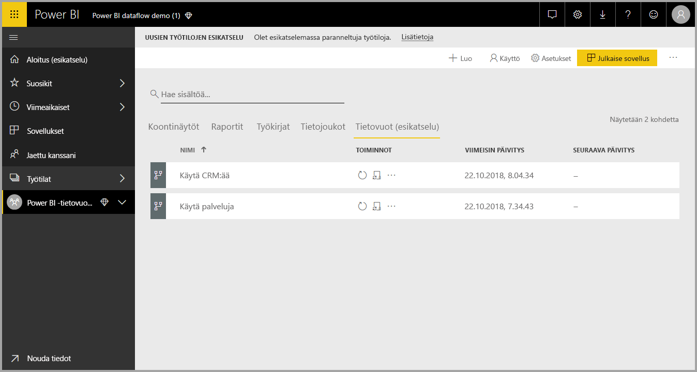

Kun olet **sovellustyötilassa**, jossa voit luoda tietovuon, **+ Luo** -painike näkyy pohjan oikeassa yläkulmassa. Valitse **+ Luo** -painike, ja valitse sitten avattavasta luettelosta **Tietovuo**. 

On tärkeää muistaa, että tietovoissa on vain *yksi omistaja*, joka on tietovuon luonut henkilö. Vain omistaja voi muokata tietovuota. Kaikki **sovellustyötilan** jäsenet, joilla on tietovuon luomiseen käytetyn sovellustyötilan luku- tai kirjoitusoikeudet, voivat muodostaa yhteyden tietovuohon **Power BI Desktopista** tässä artikkelissa myöhemmin kuvatulla tavalla.

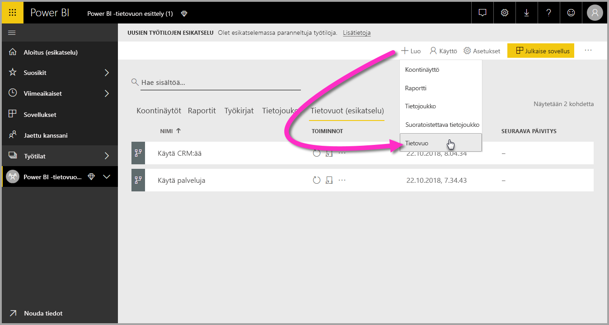

Tästä voit lisätä **entiteettejä**, joihin tutustutaan tarkemmin seuraavassa osiossa.

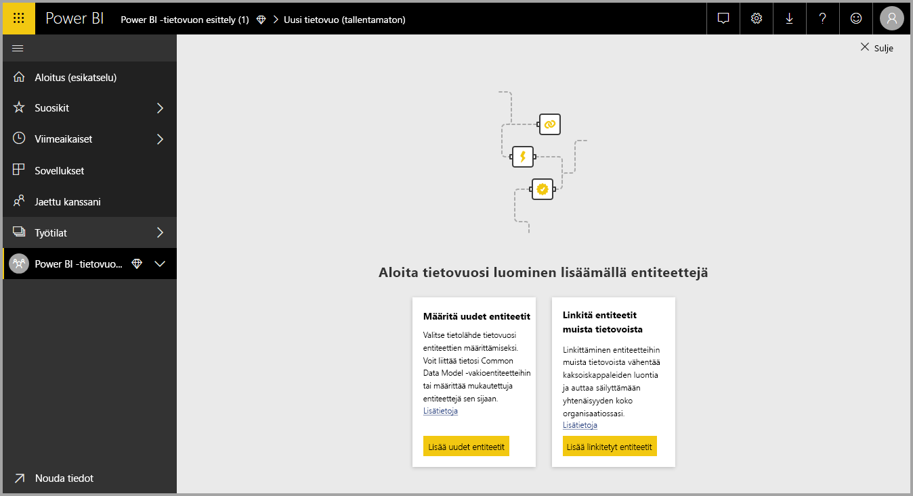

### Lisää entiteettejä

**Entiteetti** on tietokannan taulukkoa muistuttava kenttäjoukko, jota käytetään tietojen tallentamiseen. Seuraavassa kuvassa näet tietolähteet, joiden tietoja voit käyttää Power BI:ssä.

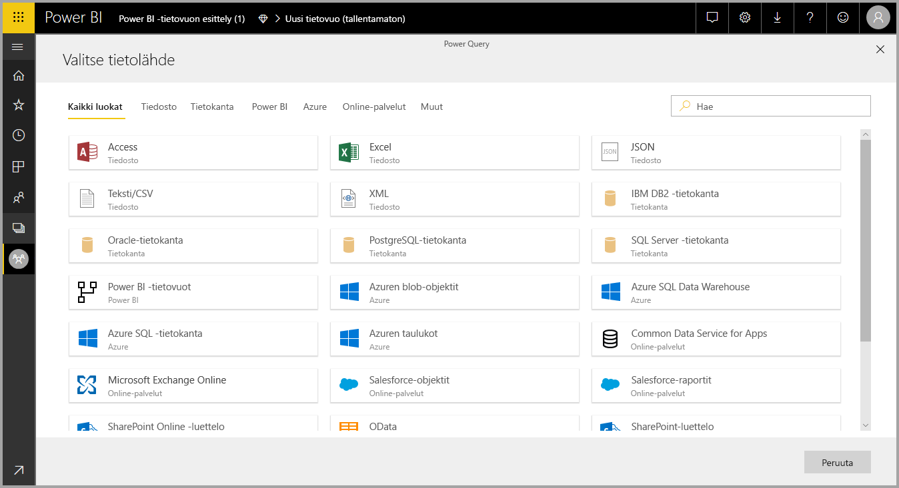

Kun valitset tietolähteen, sinua pyydetään antamaan yhteysasetukset, mukaan lukien tili, jota käytetään muodostettaessa yhteyttä tietolähteeseen, seuraavan kuvan mukaisesti.

Kun yhteys on muodostettu, voit valita, mitä tietoja entiteettiin käytetään. Kun valitset tiedot ja tietolähteen, Power BI muodostaa myöhemmin uudelleen yhteyden tietolähteeseen, jotta tietovuon tiedot päivittyvät määritysprosessin myöhemmässä vaiheessa valitsemasi aikataulun mukaisesti.

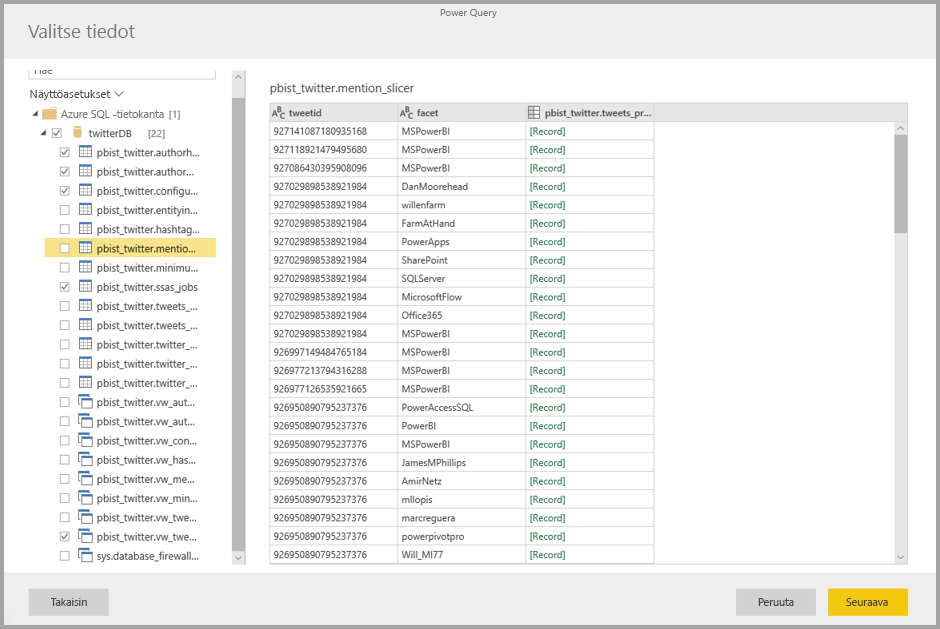

Kun valitset entiteettiin käytettävät tiedot, voit tietovuoeditorin avulla muokata tai muuntaa tiedot tietovuon käytössä tarvittavaan muotoon.

### Tietovuoeditorin käyttö

Kun valitset mitä tietolähteen tietoja entiteetissä käytetään, voit muokata tietovalinnan muodon entiteettiin parhaiten sopivaksi Power Query -muokkauksen avulla (vastaa **Power Query -editoria** **Power BI Desktopissa**). Lue lisätietoja Power Querysta (Power Query sisältyy Power BI Desktopiin Power Query -editorina) [Kyselyn yleiskatsaus](desktop-query-overview.md) Power BI Desktopissa -artikkelista. 

Jos haluat nähdä koodin, jonka kyselyeditori luo jokaisessa vaiheessa, tai jos haluat luoda oman muotoilukoodin, voit käyttää **laajennettua editoria**. 

### Tietovuot ja Common Data Model (CDM)

Tietovoiden entiteeteissä on uusia työkaluja, joiden avulla voit helposti yhdistää yritystietosi Common Data Modeliin (Microsoftin standardoitu rakenne), täydentää niitä Microsoftin ja kolmansien osapuolten tiedoilla ja saada yksinkertaistetun pääsyn koneoppimiseen. Näitä uusia ominaisuuksia voidaan hyödyntää älykkäiden merkityksellisten tietojen tarjoamisessa, joiden pohjalta voidaan tehdä yritystietoja koskevia toimia. Kun olet suorittanut Muokkaa kyselyitä -vaiheen muunnokset, voit yhdistää tietolähdetaulukoiden sarakkeet vakioentiteettikenttiin Common Data Modelin mukaisesti. Common Data Model määrittää vakioentiteettien tunnetun rakenteen.

Katso lisätietoja tästä menettelytavasta ja Common Data Modelista [Mikä on Common Data Model](https://docs.microsoft.com/powerapps/common-data-model/overview) -artikkelista.

Voit hyödyntää Common Data Modelia tietovuossa napsauttamalla **Yhdistä vakioon** -muunnosta **Muokkaa kyselyitä** -valintaikkunassa. Näkyviin tulevassa **Yhdistä entiteetit** -näytössä voit valita vakioentiteetin, johon haluat yhdistää.

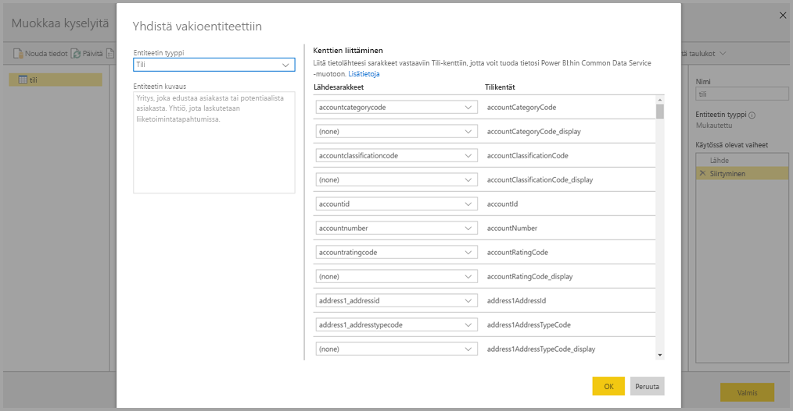

Kun yhdistät lähdesarakkeen vakiokenttään, tapahtuu seuraavaa:

1. Lähdesarake ottaa vakiokentän nimen (sarake nimetään uudelleen, jos nimet eroavat toisistaan)
2. Lähdesarake saa vakiokentän tietotyypin

Common Data Modelin vakioentiteetin säilyttämiseksi kaikki vakiokentät, joita ei ole yhdistetty, saavat *tyhjäarvon*.

Kaikki lähdesarakkeet, joita ei ole yhdistetty, pysyvät ennallaan, jotta yhdistämisen tuloksena on mukautettuja kenttiä sisältävä vakioentiteetti.

Kun olet tehnyt valintasi ja entiteettisi ja sen tietoasetukset ovat valmiita tallennettaviksi, voit valita **Tallenna** valikosta. Huomaa, että voit luoda useita entiteettejä valitsemalla **Lisää entiteettejä** -painikkeen ja että voit entiteettejä muokkaamalla tarkentaa kyselyjä ja luomiasi entiteettejä.

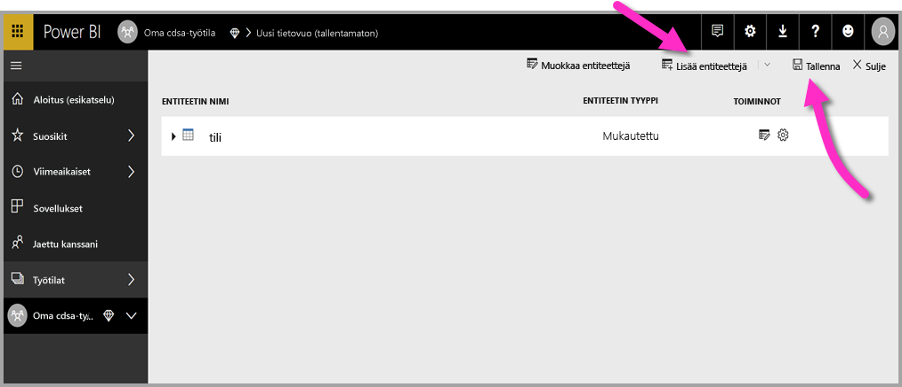

Kun valitset **Tallenna**, sinua pyydetään nimeämään tietovuo ja kirjoittamaan kuvaus.

Kun olet valmis ja valitset **Tallenna**-painikkeen, näyttöön tulee ikkuna, joka ilmoittaa **tietovuon** luomisesta. 

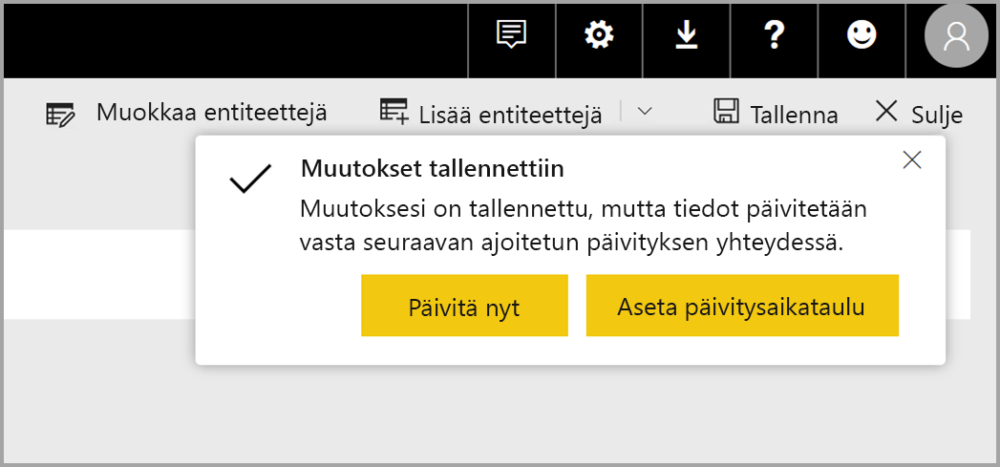

Hienoa – nyt olet valmis siirtymään seuraavaan vaiheeseen, joka on tietolähteiden päivitystiheyden määrittäminen.

## Määritä päivitystiheys

Kun tietovuo on tallennettu, voit määrittää yhdistettyjen tietolähteiden päivitystiheyden.

Tietosi pysyvät ajan tasalla Power BI -tietovoiden käyttämän Power BI:n tietojen päivitysprosessin ansiosta. **Power BI -palvelun** **sovellustyötilassa** on alueiden kokoelma, jossa tiedot voidaan luetella, mukaan lukien tietovuot, seuraavan kuvan mukaisesti.

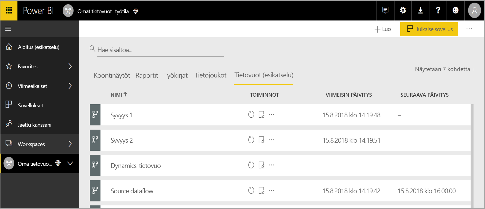

Edellisen kuvan *Dynamics-tietovuomerkintä* on edellisessä osiossa luomamme tietovuo. Ajoita päivitys valitsemalla **Ajoita päivitys** -kuvake **Toiminnot**-osassa seuraavan kuvan mukaisesti. 

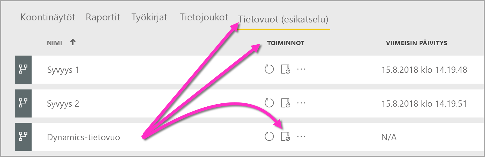

Kun valitset **Ajoita päivitys** -kuvakkeen, siirryt **Ajoita päivitys** -ruutuun, jossa voit määrittää tietovuon päivitystiheyden ja -ajankohdan.

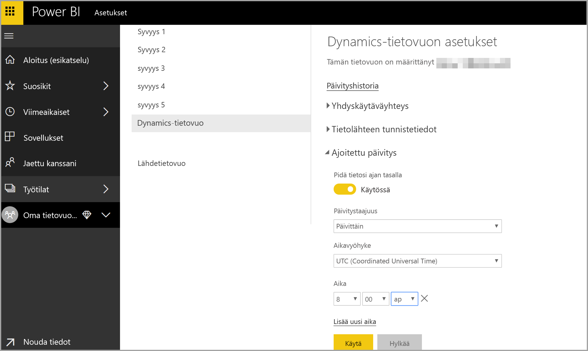

Lisätietoja päivityksen ajoittamisesta saat artikkelista [Ajoitetun päivityksen määrittäminen](refresh-scheduled-refresh.md), jossa kerrotaan Power BI -tietojoukkojen päivittämisestä. Tietovoiden päivitysasetukset toimivat samalla tavalla kuin Power BI -tietojoukkojen. 

## Yhdistä tietovuohon Power BI Desktopissa

Kun olet luonut tietovuon ja ajoittanut kaikkien malliin lisättävien tietolähteiden päivitykset, olet valmis kolmanteen ja viimeiseen vaiheeseen, joka on tietovuohon yhdistäminen **Power BI Desktopissa**. 

Yhdistä tietovuohon Power BI Desktopissa valitsemalla **Nouda tiedot > Power BI > Power BI -tietovuot (beeta)** seuraavan kuvan mukaisesti.

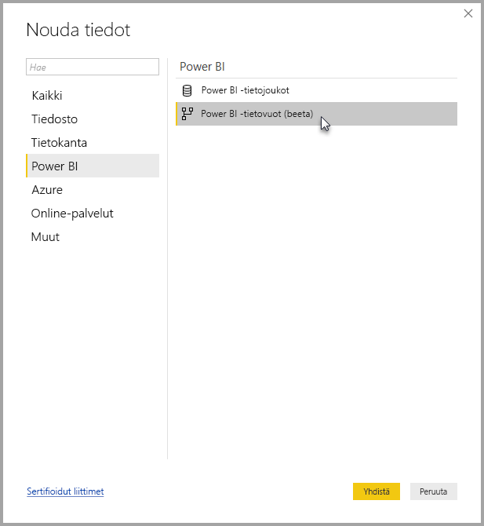

Siirry sieltä **sovellustyötilaan**, johon tallensit tietovuon, valitse tietovuo ja valitse sitten luomasi entiteetit luettelosta.

Voit myös käyttää ikkunan yläreunassa olevaa **hakupalkkia**, jos haluat löytää nopeasti tietovuon nimen tai entiteetin useiden tietovuon entiteettien joukosta.

Kun valitset entiteetin ja sen jälkeen **Lataa**-painikkeen, entiteetit näkyvät **Kentät**-ruudussa **Power BI Desktopissa**. Ne toimivat samalla tavalla kuin minkä tahansa tietojoukon **taulukot**.

## Azure Data Lake Storage Gen2:een tallennettujen tietovoiden käyttäminen

Jotkut organisaatiot haluavat ehkä käyttää omaa tallennustilaansa tietovoiden luontiin ja hallintaan. Voit integroida tietovuot Azure Data Lake Storage Gen2:een noudattamalla oikein vaatimuksia ja hallintaoikeuksia. Tätä lähestymistapaa koskevat kaikki vaatimukset löytyvät yleiskatsausasiakirjasta, [Tietovuot ja Azure Data Lake -integrointi (esikatselu)](service-dataflows-azure-data-lake-integration.md).

## Tietoyhteyksien vianmääritys

Joskus voi käydä niin, että tietovuon yhteyden muodostamisessa tietolähteeseen on ongelmia. Tässä osiossa on vianmääritysvihjeitä, jos tällaisia ongelmia esiintyy. 

* **Salesforce-liitin** – Salesforce-kokeilutilin ja tietovuon käyttö on aiheuttanut yhteysvirheen eikä mitään tietoja ole annettu. Voit ratkaista ongelman käyttämällä tuotannon Salesforce-tiliä tai kehittäjätiliä testaamiseen.

* **SharePoint-liitin** – Varmista, että annat SharePoint-sivuston pääosoitteen ilman alikansioita tai tiedostoja. Käytä esimerkiksi seuraavankaltaista linkkiä: https://microsoft.sharepoint.com/teams/ObjectModel/ 

* **JSON-tiedostoyhdistin** – tällä hetkellä voit muodostaa yhteyden JSON-tiedostoon vain perustodentamista.  Yhdistämistä JSON-tiedostoon antamalla tunnistetiedot URL-osoitteessa (esimerkiksi https://XXXXX.blob.core.windows.net/path/file.json?sv=2019-01-01&si=something&sr=c&sig=123456abcdefg...) **ei** tällä hetkellä tueta.  

* **Azure SQL Data Warehouse** – tietovuot eivät tällä hetkellä tue Azure SQL Data Warehousen Azure Active Directory (AAD) -todentamista. Käytä tähän skenaarioon perustodentamista.

## Seuraavat vaiheet

Tässä artikkelissa kerrottiin, miten voit luoda oman **tietovuon** sekä luoda tietojoukon ja raportin **Power BI Desktopissa** ja hyödyntää niitä. Seuraavissa artikkeleissa on lisätietoja ja esimerkkitilanteita tietovoiden käytöstä:

* [Omatoiminen tietojen valmistelu tietovoiden avulla](service-dataflows-overview.md)
* [Laskettujen entiteettien käyttäminen Power BI Premiumissa](service-dataflows-computed-entities-premium.md)
* [Tietovoiden käyttö paikallisiin tietolähteisiin](service-dataflows-on-premises-gateways.md)
* [Kehittäjien resurssit Power BI -tietovoille](service-dataflows-developer-resources.md)
* [Tietovuot ja Azure Data Lake -integrointi (esikatselu)](service-dataflows-azure-data-lake-integration.md)

Lisätietoja Common Data Modelista on sen yleiskatsauksen sisältävässä artikkelissa:
* [Common Data Model – yleiskatsaus](https://docs.microsoft.com/powerapps/common-data-model/overview)
* [Lue lisää Common Data Modelin rakenteesta ja entiteeteistä GitHubissa](https://github.com/Microsoft/CDM)

Aiheeseen liittyvät Power BI Desktop -artikkelit:

* [Tietojoukkoihin yhdistäminen Power BI -palvelussa Power BI Desktopista](desktop-report-lifecycle-datasets.md)
* [Kyselyn yleiskatsaus Power BI Desktopissa](desktop-query-overview.md)

Aiheeseen liittyvät Power BI -palvelun artikkelit:
* [Ajoitetun päivityksen määrittäminen](refresh-scheduled-refresh.md)
