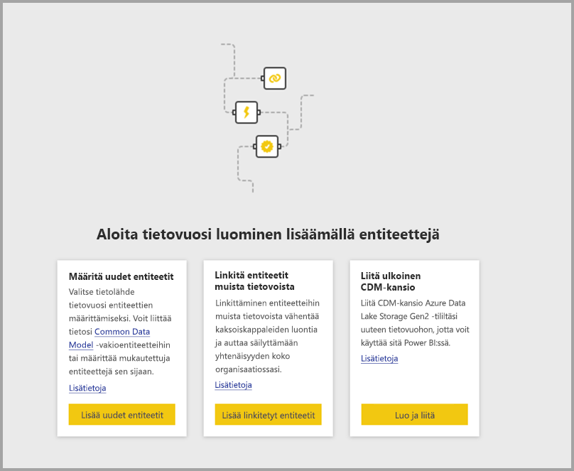
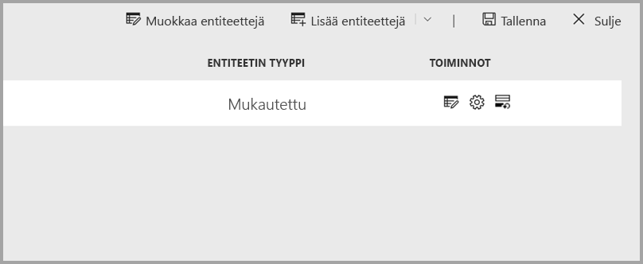
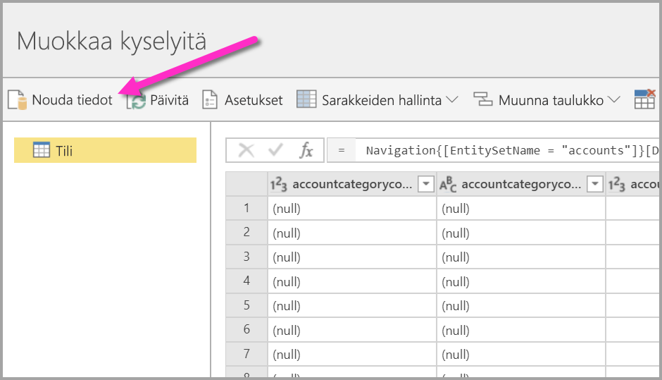
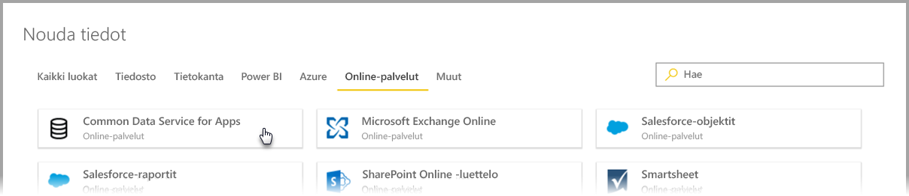
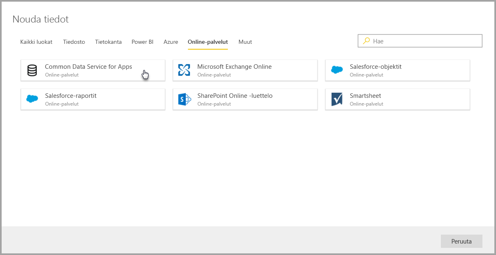
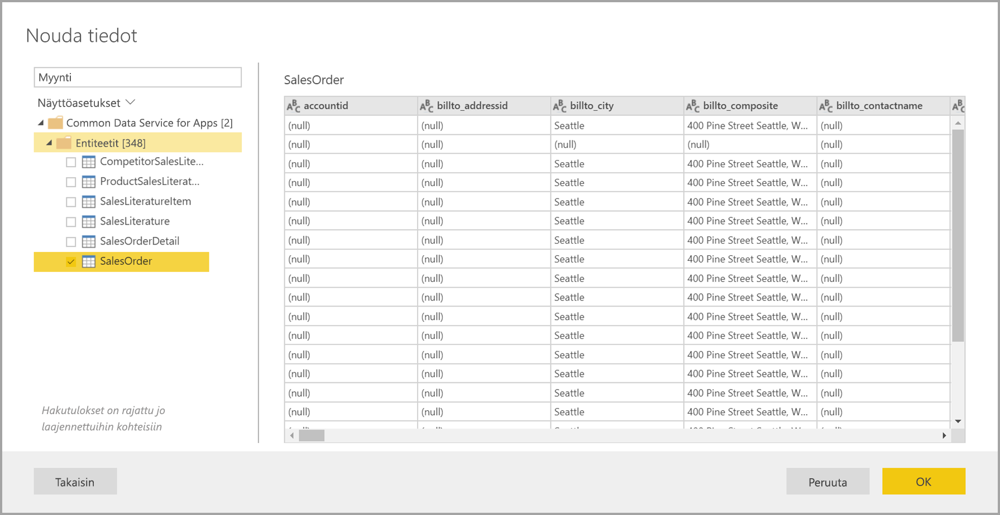
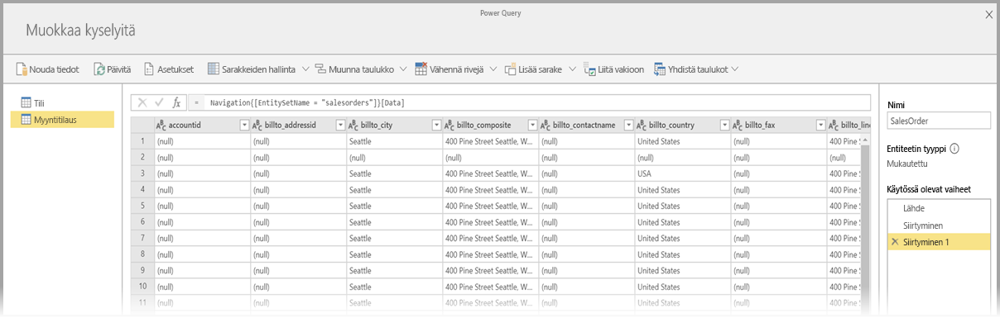
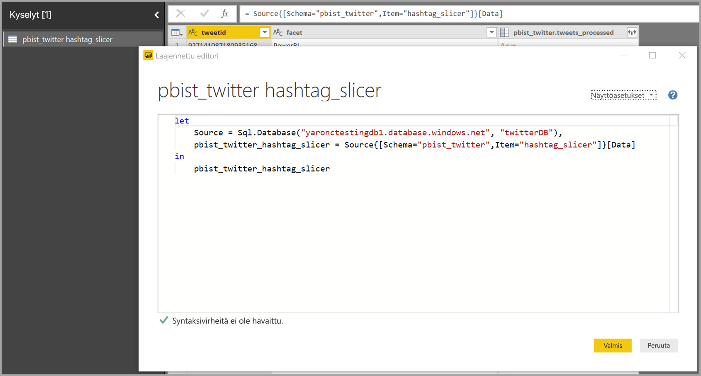
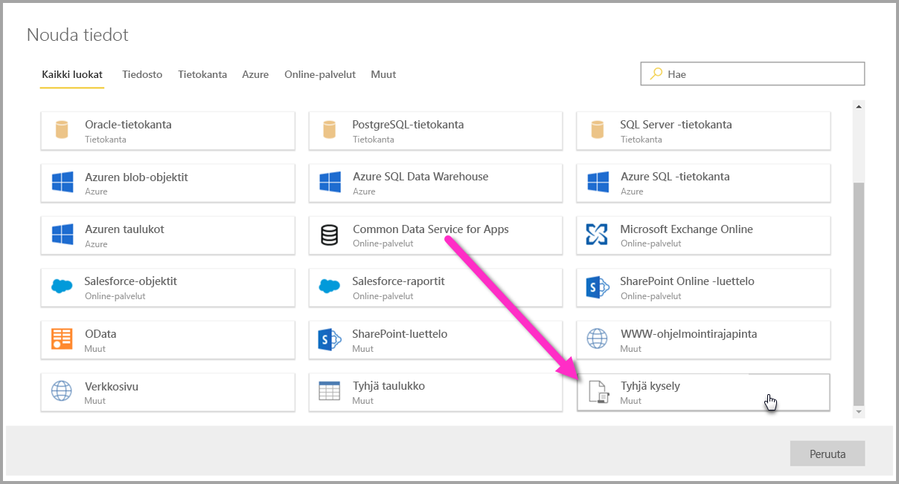
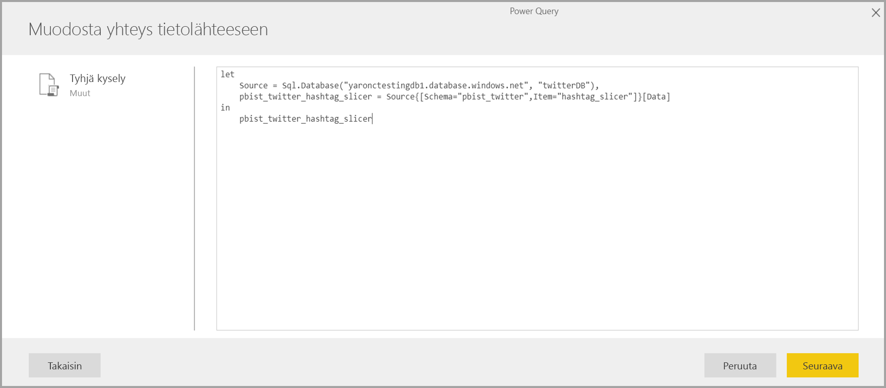

# Yhteyden muodostaminen tietolähteisiin Power BI dataflows varten

Voit Power BI -tietovoiden avulla muodostaa yhteyden moniin eri tietolähteisiin uusien tietovoiden luomiseksi tai uusien entiteettien lisäämiseksi olemassa olevaan tietovuohon.

Tässä artikkelissa on luettelo monista saatavilla olevista tietolähteistä tietovoiden luomiseksi tai lisäämiseksi. Siinä kuvataan myös sitä, miten näitä tietovoita voidaan luoda näiden tietolähteiden avulla.

Katso, miten voit luoda ja käyttää dataflows yhteenveto [luomisesta ja käyttämisestä dataflows Power BI](service-dataflows-create-use.md).

## Tietovuon luominen tietolähteestä

Voit muodostaa yhteyden tietoihin **Power BI -palvelusta** valitsemalla **+ Luo** -valikkokohteen ja valitsemalla sitten **tietovuon** esiin tulevasta valikosta. Kun se on valittu, Power BI -palvelun piirtoalustalle tulee seuraava kuva. 

Jos tietovuo on jo olemassa, voit lisätä uusia entiteettejä tietovuohon valitsemalla alla näytetyn **Lisää entiteettejä** -vaihtoehdon tai valitsemalla **Nouda tiedot** -vaihtoehdon tietovuon luontityökalusta.

Seuraavassa kuvassa näytetään **Nouda tiedot** -painike tietovuon luontityökalussa. 

## Tietovoiden tietolähteet

Voit tarkastella saatavilla olevia tietolähteitä valitsemalla **Nouda tiedot** -vaihtoehdon tietovuon luontityökalusta. Se näyttää sitten valintaikkunan luokkien ja jokaisen tietolähteen valitsemiseksi seuraavassa kuvassa näytetyn mukaisesti.

Tietovoiden tietolähteet on järjestetty seuraaviin luokkiin, jotka ilmestyvät **Nouda tiedot** -valintaikkunan yläosaan:

* Kaikki luokat
* Tiedosto
* Tietokanta
* Power BI
* Azure
* Online-palvelut
* Muut

**Kaikki luokat** -luokka sisältää kaikki tietolähteet kaikista luokista. 

**Tiedosto**-luokka sisältää seuraavat saatavilla olevat tietovoiden tietoyhteydet:

* Käyttöoikeudet
* Excel
* JSON
* Teksti/CSV
* XML

**Tietokanta**-luokka sisältää seuraavat saatavilla olevat tietovoiden tietoyhteydet:

* IBM DB2 -tietokanta
* MySQL-tietokanta
* Oracle-tietokanta
* PostgreSQL-tietokanta
* SQL Server -tietokanta
* Sybase-tietokanta
* Teradata-tietokanta
* Vertica

**Power BI** -luokka sisältää seuraavat saatavilla olevat tietovoiden tietoyhteydet:

* Power BI -tietovuot

**Azure**-luokka sisältää seuraavat saatavilla olevat tietovoiden tietoyhteydet:

* Azuren blob-objektit
* Azure Data Explorer
* Azure SQL Data Warehouse
* Azure SQL -tietokanta
* Azuren taulukot

**Online-palvelut** sisältää seuraavat saatavilla olevat tietovoiden tietoyhteydet:

* Amazon Redshift
* Common Data Service for Apps
* Microsoft Exchange Online
* Salesforce-objektit
* Salesforce-raportit
* SharePoint Online -luettelo
* Smartsheet

**Muut**-luokka sisältää seuraavat saatavilla olevat tietovoiden tietoyhteydet:

* Active Directory
* OData
* SharePoint List
* WWW-ohjelmointirajapinta
* Verkkosivu
* Tyhjä taulukko
* Tyhjä kysely

## Yhteyden muodostaminen tietolähteeseen

Voit muodostaa yhteyden tietolähteeseen valitsemalla tietolähteen. Näytämme prosessin toiminnan yhden esimerkin avulla, mutta tietovoiden jokainen tietoyhteys on prosessissa samankaltainen. Eri liittimet voivat vaatia tiettyjä tunnistetietoja tai muita tietoja, mutta työnkulku on samankaltainen. Näet esimerkissä seuraavan kuvan, jossa **Common Data Service for Apps** on valittu **Online-palvelujen** tietoyhteysluokasta.

Esiin tulee valitun tietoyhteyden yhteysikkuna. Jos tunnistetietoja vaaditaan, sinua pyydetään antamaan ne. Seuraavassa kuvassa näytetään palvelimen URL-osoite, joka syötetään yhteyden muodostamiseksi Common Data Service for Apps -palvelimeen.

Kun olet antanut palvelimen URL-osoitteen tai resurssiyhteyden tiedot, valitse **Kirjaudu sisään** tunnistetietojen syöttämiseksi tietojen käyttöä varten ja valitse sitten **Seuraava**.

**Power Query Online** käynnistää ja muodostaa yhteyden tietolähteeseen ja esittää sitten saatavilla olevat taulukot tästä tietolähteestä **Siirtymistoiminto**-ikkunassa, joka näytetään seuraavassa kuvassa.

Voit valita taulukot ja ladattavat tiedot valitsemalla niiden viereisen valintaruudun vasemmassa ruudussa. Lataa tiedot valitsemalla **OK** **Siirtymistoiminto**-ruudun alareunasta. Esiin tulee Power Query Online -valintaikkuna, jossa voit muokata kyselyjä ja suorittaa muut haluamasi muunnokset valituille tiedoille.

Siinä kaikki. Muilla tietolähteillä on samankaltaisia työnkulkuja. Power Query Onlinen avulla voit muokata ja muuntaa tietovuohon tuomiasi tietoja.

## Yhteyden muodostaminen muihin tietolähteisiin

Voit käyttää myös muita tietoliittimiä, joita ei näytetä Power BI -tietovoiden käyttöliittymässä, suorittamalla pari muuta vaihetta. 

Voit seuraavien vaiheiden avulla muodostaa yhteyden liittimeen, jota ei näytetä käyttöliittymässä:

1. Avaa **Power BI Desktop** ja valitse **Nouda tiedot**.
2. Avaa **Power Query -editori** Power BI Desktopissa ja napsauta sitten hiiren oikealla painikkeella asianomaista kyselyä ja avaa **Laajennettu editori** seuraavassa kuvassa näytetyn mukaisesti. Voit sieltä kopioida M-komentosarjan, joka ilmestyy laajennettuun editoriin.

     

3. Avaa Power BI -tietovuo ja valitse **Nouda tiedot** tyhjää kyselyä varten seuraavassa kuvassa näytetyn mukaisesti.

     

4. Liitä kopioitu kysely tyhjään kyselyyn tietovuota varten.

     

Komentosarja muodostaa sitten yhteyden tietolähteeseen, jonka määritit. 

Seuraavassa luettelossa näytetään, mitä liittimiä voit käyttää tällä hetkellä M-kyselyn kopioimiseen ja liittämiseen tyhjään kyselyyn:

* SAP Business Warehouse 
* Azure Analysis Services
* Adobe Analytics
* ODBC
* OLE DB
* Kansio
* SharePoint Online -kansio
* SharePoint-kansio
* Hadoop HDFS
* Azure HDInsight (HDFS)
* Hadoop-tiedosto HDFS
* Informix (beeta)

Tässä kaikki, joka sinun tarvitsee tietää yhteyden muodostamiseksi tietolähteisiin Power BI -tietovoissa.

## Seuraavat vaiheet

Tässä artikkelissa näytettiin, mitkä tietolähteet voit yhdistää tietovoihin. Seuraavissa artikkeleissa perehdytään tarkemmin tietovoiden yleisiin käyttöskenaarioihin. 

* [Omatoiminen tietojen valmistautuminen Power BI](service-dataflows-overview.md)
* [Tietovoiden luominen ja käyttäminen Power BI:ssä](service-dataflows-create-use.md)
* [Laskettuja entiteettejä käyttämällä Power BI Premium](service-dataflows-computed-entities-premium.md)
* [Dataflows käyttö paikallisiin tietolähteisiin](service-dataflows-on-premises-gateways.md)
* [Power BI dataflows Kehittäjien resurssit](service-dataflows-developer-resources.md)
* [Tietovuot ja Azure Data Lake -integrointi (esikatselu)](service-dataflows-azure-data-lake-integration.md)

Lisätietoja Power Querysta ja ajoitetusta päivityksestä on seuraavissa artikkeleissa:
* [Kyselyn yleiskatsaus Power BI Desktopissa](desktop-query-overview.md)
* [Ajoitetun päivityksen määrittäminen](refresh-scheduled-refresh.md)

Lisätietoja Common Data Modelista on sen yleiskatsauksen sisältävässä artikkelissa:
* [Common Data Model – yleiskatsaus](https://docs.microsoft.com/powerapps/common-data-model/overview)

