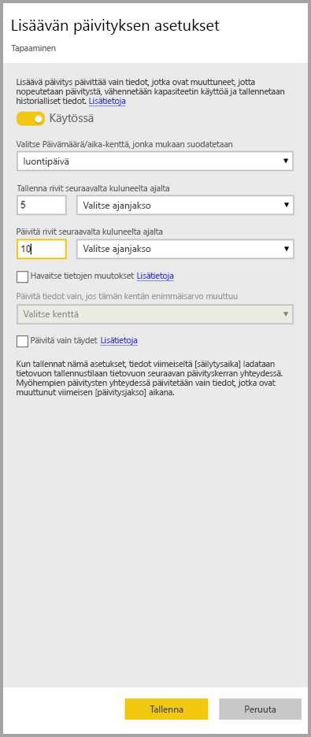
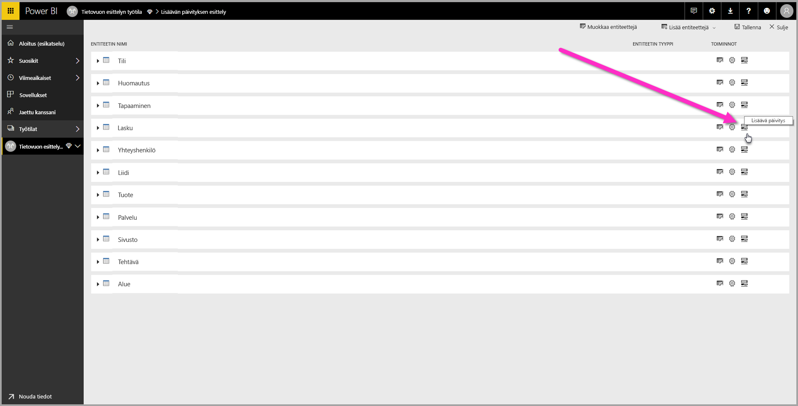
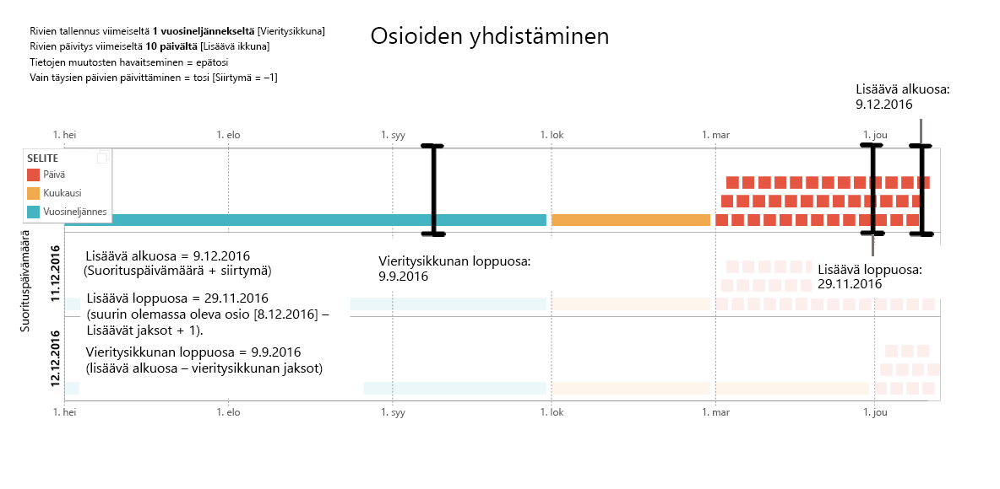
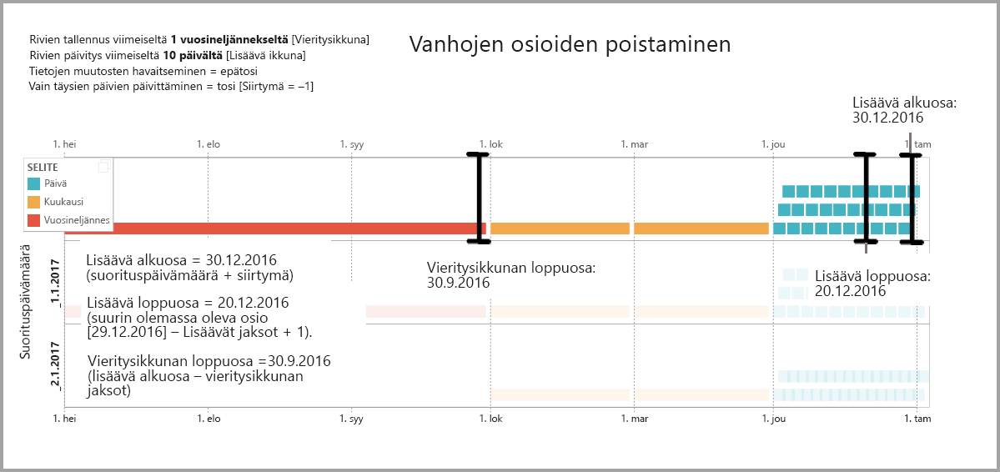
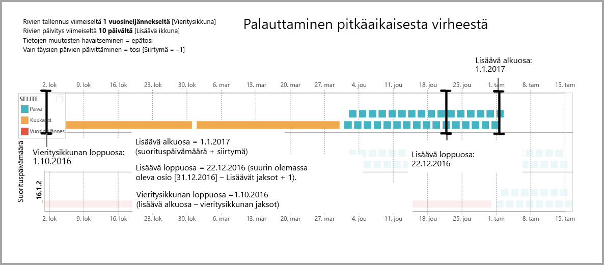

# Lisäävän päivityksen käyttäminen Power BI -tietovoiden kanssa

Tietovoiden avulla voit tuoda suuria tietomääriä Power BI:hin ja luoda kiinnostavia raportteja ja analyyseja. Joissain tapauksissa ei kuitenkaan kannata päivittää täydellistä kopiota tietolähteestä jokaisen päivityksen yhteydessä. Hyvä vaihtoehto on **lisäävä päivitys**, joka tarjoaa seuraavat edut tietovoille:

* **Päivitys tapahtuu nopeammin**. Vain muutetut tiedot on päivitettävä. Päivitä esimerkiksi vain viimeiset viisi päivää 10 vuoden tietovuosta.
* **Päivitys on luotettavampi**. Ei ole esimerkiksi tarpeen säilyttää pitkäkestoisia yhteyksiä lyhytkestoisiin lähdejärjestelmiin.
* **Resurssien kulutus on vähäisempää**. Kun päivitettäviä tietoja on vähemmän, muistin ja muiden resurssien yleinen kulutus on pienempi.

Lisäävän päivityksen käyttäminen Power BI -tietovoissa edellyttää, että työtila, jossa tietovuo sijaitsee, on [Premium-kapasiteetissa](service-premium-what-is.md), ja tietovuossa käsitellyllä tietolähteellä on oltava *päivämäärä/aika*-kenttä, jonka mukaan lisäävä päivitys voidaan suodattaa. 

## Lisäävän päivityksen määrittäminen tietovoille

Tietovuo voi sisältää useita entiteettejä. Lisäävä päivitys määritetään entiteettitasolla, jolloin tietovuo voi sisältää sekä täysin päivitetyt entiteetit että lisäävästi päivitetyt entiteetit.

Jos haluat määrittää lisäävästi päivitetyn entiteetin, aloita määrittämällä entiteetti aivan kuin mikä tahansa muu entiteetti. Lisätietoja tietovuon määrittämisestä on artikkelissa [Omatoiminen tietojen valmistelu Power BI:ssä](service-dataflows-overview.md).

Kun tietovuo on luotu ja tallennettu, valitse **lisäävän päivityksen** kuvake entiteettinäkymässä seuraavassa kuvassa esitetyllä tavalla:

Kun napsautat kuvaketta, avautuu **Lisäävän päivityksen asetukset** -ikkuna. Kun otat lisäävän päivityksen **käyttöön**, voit määrittää lisäävän päivityksen.

Seuraavassa luettelossa kerrotaan lisää **Lisäävän päivityksen asetukset** -ikkunan asetuksista. 

1. **Lisäävä päivitys käytössä / ei käytössä** – Tällä liukusäätimellä otetaan lisäävä päivityskäytäntö käyttöön tai poistetaan käytöstä entiteetissä.
2. **Suodatin-kentän avattava luettelo** – Valitsee kyselykentän, jonka mukaan entiteetin lisäykset pitäisi suodattaa. Tämä kenttä sisältää vain *päivämäärä/aika*-kentät. Et voi käyttää lisäävää päivitystä, jos entiteetti ei sisällä *päivämäärä/aika*-kenttää.
3. **Tallenna rivit seuraavalta kuluneelta ajalta** – Seuraava esimerkki auttaa selittämään seuraavat asetukset.

    Tässä esimerkissä määritetään päivityskäytäntö tallentamaan yhteensä viiden vuoden tiedot ja päivittämään lisäävästi 10 päivän tiedot. Jos entiteetti päivitetään päivittäin, kunkin päivitystoiminnon osalta suoritetaan seuraavat:

    * Lisää uusi tietopäivä.
    * Päivitä 10 päivää nykyiseen päivämäärään saakka.
    * Poista kalenterivuodet, jotka ovat aikaisempia kuin viisi vuotta ennen nykyistä päivämäärää. Esimerkiksi jos nykyinen päivämäärä on 1.1.2019, vuosi 2013 poistetaan.

    Ensimmäinen tietovuon päivitys voi kestää jonkin aikaa kaikkien viiden vuoden tietojen tuomiseksi, mutta myöhemmät päivitykset vievät todennäköisesti vain murto-osan ensimmäisen päivityksen kestosta.

4. **Tietojen muutosten havaitseminen** – 10 päivän lisäävä päivitys on paljon tehokkaampi kuin 5 vuoden koko päivitys, mutta tehokkuutta voidaan parantaa entisestään. Kun valitset **Havaitse tietojen muutokset** -valintaruudun, voit valita päivämäärä/aika-sarakkeen, jonka avulla tunnistetaan ja päivitetään vain päivät, joiden tiedot ovat muuttunut. Tällöin oletetaan, että lähdejärjestelmässä on kyseinen sarake, joka on yleensä valvontaa varten. Tämän sarakkeen suurin arvo lasketaan jokaisen lisäävän alueen ajanjakson osalta. Jos kyseinen tieto ei ole muuttunut viimeisen päivityksen jälkeen, ajanjaksoa ei tarvitse päivittää. Esimerkissä lisäävästi päivitettävien päivien määrä voisi vähentyä kymmenestä ehkä kahteen.

> [!TIP]
> Nykyinen rakenne edellyttää, että sarake on pysyvä ja tallennettu välimuistiin tietojen muutosten havaitsemiseksi. Kannattaa harkita jotakin seuraavista tekniikoista kardinaliteetin ja muistin kulutuksen pienentämiseksi:
>
>    * Säilytä vain sarakkeen suurin arvo päivityshetkellä mahdollisesti Power Query -funktion avulla.
>    * Vähennä tarkkuus tasolle, joka on hyväksyttävä päivitystaajuutta koskevien vaatimustesi mukaisesti.

5. **Päivitä vain täydet jaksot** – Kuvittele, että päivitys on ajoitettu suoritettavaksi klo 4.00 joka aamu. Jos lähdejärjestelmässä esiintyy tietoja kyseisten vuorokauden ensimmäisten neljän tunnin aikana, et ehkä halua ottaa niitä huomioon. Joitakin liiketoiminnan arvoja, esimerkiksi barreleita päivässä öljy- ja kaasualalla, ei ole käytännöllistä tai mielekästä ottaa huomioon, kun kyseessä ovat osittaiset päivät.

    Toinen esimerkki, jossa vain täysien jaksojen päivittäminen on asianmukaista, on taloushallinnon järjestelmän tietojen päivittäminen. Kuvittele taloushallinnon järjestelmä, jossa edellisen kuukauden tiedot hyväksytään kuun 12. päivänä. Voit määrittää lisäävän alueen yhdelle kuukaudelle ja ajoittaa päivityksen suoritettavaksi kuukauden 12. päivänä. Kun tämä asetus on valittuna, se päivittää tammikuun tiedot (uusin valmis kuukausittainen jakso) helmikuun 12. päivänä.

> [!NOTE]
> Tietovuon lisäävä päivitys määrittää päivämäärät seuraavan logiikan mukaan: jos päivitys ajoitetaan, tietovoiden lisäävä päivitys käyttää päivityskäytännössä määritettyä aikavyöhykettä. Jos päivitykselle ei ole aikataulua, lisäävä päivitys käyttää päivityksen suorittavan tietokoneen aikaa.

## Lisäävän päivityksen kysely

Kun lisäävä päivitys on määritetty, tietovuo muuttaa kyselyä automaattisesti sisältämään suodatuksen päivämäärän mukaan. Voit muokata automaattisesti luotua kyselyä hienosäätämällä tai mukauttamalla päivitystä **laajennetun Power Query -editorin** avulla. Lue lisää lisäävästä päivityksestä ja sen toiminnasta seuraavasta osiosta.

## Lisäävä päivitys ja linkitetyt vs. lasketut entiteetit

*Linkitetyissä* entiteeteissä lisäävä päivitys päivittää lähde-entiteetin. Koska linkitetyt entiteetit vain osoittavat alkuperäiseen entiteettiin, lisäävä päivitys ei vaikuta linkitettyyn entiteettiin. Kun lähde-entiteetti päivitetään määritetyn päivityskäytäntönsä mukaan, linkitetyn entiteetin tulee olettaa, että lähteen tiedot päivitetään.

*Lasketut* entiteetit perustuvat tietosäilössä suoritettaviin kyselyihin. Tietosäilö voi olla toinen tietovuo. Näin ollen lasketut entiteetit toimivat samalla tavalla kuin linkitetyt entiteetit.

Koska lasketut ja linkitetyt entiteetit toimivat samalla tavalla, vaatimukset ja määritysvaiheet ovat samat molemmissa. Yksi ero on, että laskettujen entiteettien tietyissä kokoonpanoissa lisäävää päivitystä ei voi suorittaa optimoidusti osioiden laatimistavan vuoksi. 

## Vaihtaminen lisäävän ja täyden päivityksen välillä

Tietovuot tukevat päivityskäytännön vaihtamista lisäävän ja täyden päivityksen välillä. Kun vaihto tapahtuu jompaankumpaan suuntaan (täydestä lisäävään tai lisäävästä täyteen päivitykseen), muutos vaikuttaa tietovuohon seuraavan päivityksen jälkeen.

Kun siirrät tietovuon täydestä päivityksestä lisäävään, uusi päivityslogiikka päivittää tietovuon päivitysikkunan mukaan ja lisäyksen lisäävän päivityksen asetuksissa määritetyn mukaisesti.

Kun siirrät tietovuon lisäävästä täyteen päivitykseen, täydessä päivityksessä määritetty käytäntö korvaa kaikki lisäävään päivitykseen kertyneet tiedot. Sinun on hyväksyttävä tämä toiminto.

## Tietovuon lisäävä päivitys ja tietojoukot

Tietovuon lisäävä päivitys ja tietojoukon lisäävä päivitys on suunniteltu toimimaan yhdessä. On hyväksyttävää ja tuettua käyttää lisäävästi päivitettävää entiteettiä tietovuossa, joka ladataan kokonaan tietojoukkoon, tai kokonaan ladattua entiteettiä tietovuossa, joka ladataan lisäävästi tietojoukkoon. 

Kumpaakin tapaa käytetään päivitysasetusten määritysten mukaan.
Lisätietoja lisäävästä päivityksestä on artikkelissa [Lisäävä päivitys Power BI Premiumissa](service-premium-incremental-refresh.md).

## Lisäävän päivityksen aikavyöhykkeen tuki

Tietovuon lisäävä päivitys riippuu sen suoritusajasta. Kyselyn suodatus riippuu sen suorituspäivästä.

Näiden riippuvuuksien noudattamiseksi ja tietojen yhtenäisyyden varmistamiseksi tietovoiden lisäävä päivitys käyttää seuraavaa heuristiikkaa *Päivitä nyt* -skenaarioissa:

* Jos ajoitettu päivitys on määritetty järjestelmään, lisäävä päivitys käyttää päivityksen ajoituksen aikavyöhykeasetuksia. Tämä varmistaa, että aikavyöhyke on aina järjestelmän määrityksen mukainen tietovuon päivittävän henkilön aikavyöhykkeestä riippumatta.

* Jos päivityksen ajoitusta ei määritetä, tietovuot käyttävät päivittävän käyttäjän tietokoneen aikavyöhykettä.

Lisäävä päivitys voidaan käynnistää myös ohjelmointirajapintojen avulla. Tässä tapauksessa ohjelmointirajapinnan kutsu saattaa säilyttää päivityksessä käytettävän aikavyöhykeasetuksen. Ohjelmointirajapinnoista voi olla hyötyä testauksessa ja vahvistuksessa.

## Lisäävän päivityksen käyttöönottotiedot

Tietovuot käyttävät osiointia lisäävässä päivityksessä. Kun Power BI Premiumin XMLA-päätepisteet ovat käytettävissä, osiot tulevat näkyviin. Tietovoiden lisäävä päivitys säilyttää osioiden vähimmäismäärän päivityskäytännön vaatimusten noudattamiseksi. Alueen ulkopuoliset vanhat osiot jätetään pois ja vieritysikkuna säilytetään. Osiot yhdistetään mahdollisuuksien mukaan, mikä pienentää vaadittujen osioiden kokonaismäärää. Tämä parantaa pakkaamista ja voi joissakin tapauksissa tehostaa kyselyiden toimintaa.

Tämän osion esimerkeissä käytetään seuraavaa päivityskäytäntöä:

* Rivien tallennus viimeiseltä vuosineljännekseltä
* Rivien päivitys viimeiseltä 10 päivältä
* Tietojen muutosten havaitseminen = epätosi
* Vain täysien päivien päivittäminen = tosi

### Osioiden yhdistäminen

Tässä esimerkissä päivän osiot yhdistetään automaattisesti kuukausitasoon, kun ne ylittävät lisäävän alueen. Lisäävän alueen osiot on pidettävä päivän tarkkuudella, jotta vain kyseiset päivät päivitetään.
Päivitystoiminto *suorita päivä 11.12.2016* yhdistää marraskuun päivät, koska ne eivät kuulu lisäävään alueeseen.

### Vanhojen osioiden poistaminen

Vanhat osiot, jotka eivät kuulu kokonaisalueeseen, poistetaan. Päivitystoiminto *suorita päivä 2.1.2017* jättää pois vuoden 2016 3. vuosineljänneksen osion, koska se ei kuulu kokonaisalueeseen.

### Palauttaminen pitkäaikaisesta virheestä

Tässä esimerkissä esitetään, miten järjestelmä palautetaan pitkäaikaisesta virheestä. Oletetaan, että päivitys ei onnistu, koska tietolähteen tunnistetiedot ovat vanhentuneet, ja ongelman ratkaisemiseen kuluu 13 päivää. Lisäävä alue on vain 10 päivää.

Seuraavan onnistuneen päivitystoiminnon, *suorita päivä 15.1.2017*, on täydennettävä puuttuvat 13 päivää ja päivitettävä ne. Sen on päivitettävä myös edelliset 9 päivää, koska niitä ei päivitetty normaalin aikataulun mukaisesti. Toisin sanoen lisäävä alue on kasvanut 10 päivästä 22 päivään.

Seuraava päivitystoiminto, *suorita päivä 16.1.2017*, yhdistää joulukuun ja vuoden 2016 4. vuosineljänneksen kuukausien päivät.

## Seuraavat vaiheet

Tässä artikkelissa kuvattiin tietovoiden lisäävä päivitys. Seuraavassa on lisää artikkeleita, joista voi olla hyötyä.

* [Omatoiminen tietojen valmistelu tietovoiden avulla](service-dataflows-overview.md)
* [Tietovoiden luominen ja käyttäminen Power BI:ssä](service-dataflows-create-use.md)
* [Tietovoiden käyttö paikallisiin tietolähteisiin](service-dataflows-on-premises-gateways.md)
* [Kehittäjien resurssit Power BI -tietovoille](service-dataflows-developer-resources.md)

Lisätietoja Power Querysta ja ajoitetusta päivityksestä on seuraavissa artikkeleissa:
* [Kyselyn yleiskatsaus Power BI Desktopissa](desktop-query-overview.md)
* [Ajoitetun päivityksen määrittäminen](refresh-scheduled-refresh.md)

Lisätietoja Common Data Modelista on sen yleiskatsauksen sisältävässä artikkelissa:
* [Common Data Model – yleiskatsaus](https://docs.microsoft.com/powerapps/common-data-model/overview)

