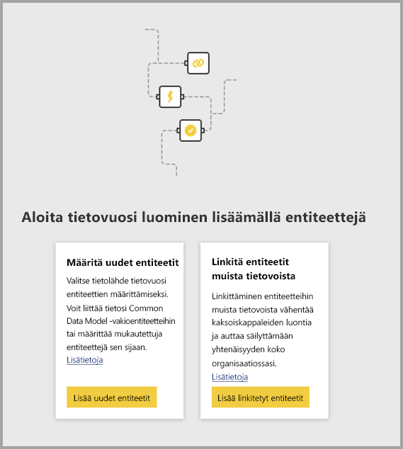
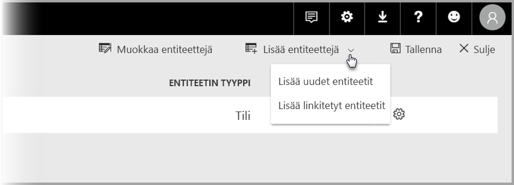

# Entiteettien linkittäminen tietovoiden välillä Power BI:ssä (esikatselu)

Power BI:n tietovoiden ansiosta voit saada yhden organisatoristen tietojen säilön lähteen, jossa yritysanalyytikot voivat valmistella ja hallita tietoja kertaheitolla ja sitten käyttää niitä uudelleen eri analyysisovellusten välillä organisaatiossa. 

Kun linkität entiteettejä tietovoiden välillä, voit käyttää uudelleen entiteettejä, joita muiden omistamat muut tietovuot ovat jo käsitelleet, puhdistaneet ja muuntaneet, ilman näiden tietojen ylläpitämistä. Linkitetyt entiteetit vain osoittavat entiteetteihin muissa tietovoissa, *eivätkä* ne kopioi tai monista tietoja.

Linkitetyt entiteetit ovat **vain luku** -tilassa. Jos haluat luoda linkitetyn entiteetin muunnoksia, sinun on luotava uusi laskettu entiteetti, joka viittaa linkitettyyn entiteettiin.

## Linkitetyn entiteetin saatavuus

Linkitettyjen entiteettien päivitys edellyttää [Power BI Premium](service-premium.md) -tilausta. Linkitetyt entiteetit ovat saatavilla missä tahansa tietovuossa työtilassa, jota isännöidään Power BI Premium -kapasiteetissa. Lähteen tietovuohon ei liity rajoituksia.

Linkitetyt entiteetit toimivat kunnolla vain uusissa Power BI -työtiloissa. Lue lisää [uusista Power BI -työtiloista](service-create-the-new-workspaces.md). Kaikkien linkitettyjen tietovoiden on sijaittava uusissa työtiloissa, jotta ne toimivat kunnolla.

> [!NOTE]
> Entiteetit eroavat sen mukaan, ovatko ne vakioentiteettejä vai laskettuja entiteettejä. Vakioentiteetit (joita nimitetään usein vain entiteeteiksi) kyselevät ulkoisesta tietolähteestä, kuten SQL-tietokannasta. Lasketut entiteetit edellyttävät Power BI:n Premium-kapasiteettia ja soveltavat muunnoksia Power BI -säilössä jo oleviin tietoihin. 
>
>Jos tietovuo ei ole Premium-kapasiteetin työtilassa, voit edelleen viitata yksittäiseen kyselyyn tai yhdistää kaksi kyselyä tai useamman kyselyn, kunhan muunnoksia ei määritetä säilön sisäisiksi muunnoksiksi. Tällaisia viittaukset pidetään vakioentiteetteinä. Poista tässä tapauksessa käytöstä **Ota lataus käyttöön** -vaihtoehto viitatuille kyselyille, jotta tietoja ei muodosteta eikä niitä sisällytetä säilöön. Voit täältä viitata näihin **Ota lataus käyttöön = epätosi** -kyselyihin ja määrittää **Ota lataus käyttöön** -vaihtoehdon arvoksi **Käytössä** vain niille tuloksena saaduille kyselyille, jotka haluat muodostaa.

## Entiteettien linkittäminen tietovoiden välillä

Entiteettejä voi linkittää parilla tavalla tietovoiden välillä Power BI:ssä. Voit valita **Lisää linkitetyt entiteetit** tietovoiden luontityökalusta seuraavan kuvan mukaisesti. 

Voit myös valita **Lisää linkitetyt entiteetit** **Lisää entiteetit** -valikkovaihtoehdosta Power BI -palvelussa.

Jotta voit linkittää entiteetit, sinun on kirjauduttava sisään Power BI:n tunnistetiedoilla.

Esiin avautuu **Siirtymistoiminto**-ikkuna, jossa voit valita entiteetit, joihin muodostat yhteyden. Näytetyt entiteetit ovat entiteettejä, joihin sinulla on käyttöoikeudet Power BI -vuokraajasi kaikissa työtiloissa. 

Kun olet valinnut linkitetyt entiteetit, ne näkyvät tietovuon entiteettiluettelossa luontityökalussa ja ne on merkitty erityisellä kuvakkeella linkitetyiksi entiteeteiksi.

Voit myös tarkastella lähteen tietovuota linkitetyn entiteetin tietovuon asetuksista.

## Linkitettyjen entiteettien päivityslogiikka
Linkitettyjen entiteettien oletuspäivityslogiikka muuttuu sen mukaan, sijaitseeko lähteen tietovuo samassa työtilassa kohteen tietovuossa. Seuraavissa osioissa kuvataan kunkin logiikan toimintaa.

### Työtilojen väliset linkit

Linkkien päivitys eri työtilojen entiteeteistä toimii kuten ulkoinen tietolähde. Kun tietovuo päivitetään, se poimii entiteetin uusimmat tiedot lähteen tietovuosta. Jos lähteen tietovuo päivitetään, se ei automaattisesti vaikuta kohteen tietovuon tietoihin.

### Linkit samassa työtilassa

Kun lähteen tietovuon tietoja päivitetään, tapahtuma käynnistää automaattisesti riippuvaisten entiteettien päivitysprosessin kaikissa kohteen tietovoissa samassa työtilassa, mukaan lukien niihin perustuvat mahdolliset lasketut entiteetit. Kohteen tietovuon kaikki muut entiteetit päivitetään tietovuon aikataulun mukaisesti. Entiteetit, jotka riippuvat useammasta kuin yhdestä lähteestä, päivittävät tietonsa aina, kun jokin niiden lähteistä päivitetään onnistuneesti.

On hyödyllistä panna merkille, että koko päivitysprosessi suoritetaan kerralla. Sen vuoksi, jos kohteen tietovuon päivitys ei onnistu, lähteen tietovuota ei voida myöskään päivittää.

## Käyttöoikeudet tarkasteltaessa raportteja tietovoista

Kun luot Power BI -raportin, joka sisältää tietovuohon perustuvia tietoja, käyttäjät voivat nähdä linkitetyt entiteetit vain, kun käyttäjällä on lähteen tietovuon käyttöoikeudet.

## Rajoitukset ja huomioitavat asiat

Linkitettyjen entiteettien käsittelyn aikana on hyvä pitää mielessä pari rajoitusta:

* Viitehyppyjä voi olla korkeintaan viisi
* Linkitettyjen entiteettien syklisiä riippuvuuksia ei sallita
* Tietovuon on sijaittava [uudessa Power BI -työtilassa](service-create-the-new-workspaces.md)

## Seuraavat vaiheet

Seuraavista artikkeleista voi olla hyötyä, kun luot tai käsittelet tietovoita. 

* [Omatoiminen tietojen valmisteleminen Power BI:ssä (esikatselu)](service-dataflows-overview.md)
* [Tietovoiden luominen ja käyttäminen Power BI:ssä](service-dataflows-create-use.md)
* [Laskettujen entiteettien käyttäminen Power BI Premiumissa (esikatselu)](service-dataflows-computed-entities-premium.md)
* [Tietovoiden käyttäminen paikallisten tietolähteiden kanssa (esikatselu)](service-dataflows-on-premises-gateways.md)
* [Kehittäjien resurssit Power BI -tietovoille (esikatselu)](service-dataflows-developer-resources.md)

Lisätietoja Power Querysta ja ajoitetusta päivityksestä on seuraavissa artikkeleissa:
* [Kyselyn yleiskatsaus Power BI Desktopissa](desktop-query-overview.md)
* [Ajoitetun päivityksen määrittäminen](refresh-scheduled-refresh.md)

Lisätietoja Common Data Modelista on sen yleiskatsauksen sisältävässä artikkelissa:
* [Common Data Model – yleiskatsaus](https://docs.microsoft.com/powerapps/common-data-model/overview)

