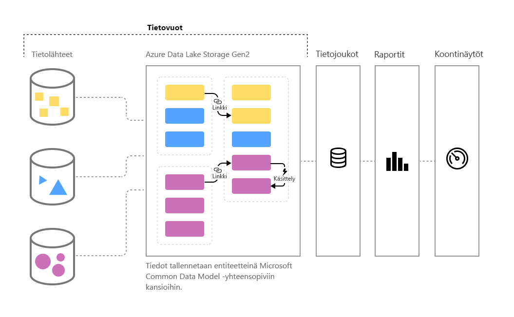

# Omatoiminen tietojen valmistelu Power BI:ssä (esikatselu)

Tietojen määrä kasvaa jatkuvasti, ja on yhä haasteellisempaa saattaa tiedot käyttökelpoiseen, käsiteltävään muotoon. Tietojen halutaan olevan valmiita analysoitaviksi ja visualisointeihin, raportteihin ja koontinäyttöihin lisättäviksi, joten tietomäärät voidaan muuntaa nopeasti merkityksellisiksi tiedoiksi. Power BI:n massadatan **omatoimisen tietojen valmistelun** avulla muutat datan Power BI:n merkityksellisiksi tiedoiksi muutamalla napsautuksella.

Power BI:n **tietovoiden** avulla organisaatiot voivat yhdistää eri lähteistä olevia tietoja ja valmistella ne mallinnusta varten. Analyytikot voivat luoda helposti tietovoita tutuilla, omatoimisilla työkaluilla. Tietovoiden avulla voidaan käyttää, muuntaa, yhdistää ja täydentää massadataa määrittämällä tietolähdeyhteyksiä, keräämis-, muuntamis- ja lataamislogiikka, päivitysaikatauluja ja paljon muuta. Lisäksi uusi mallipohjainen laskentamoottori, joka on osa tietovoita, helpottaa tietojen valmistelun hallintaa ja määritystä sekä keventää sekä tietoanalyytikkojen että raporttien luojien työtaakkaa. Samaan tapaan kuin laskentataulukot käsittelevät kaikkien kaavojen uudelleenlaskennat, tietovuot hallitsevat entiteetin tai tietoelementin muutoksia puolestasi automatisoimalla päivitykset ja helpottamalla aiemmin vaivalloisia ja aikaa vieviä logiikan tarkistuksia jopa perustason tietojen päivityksen osalta. Tehtävät, joita valvomaan tarvittiin ennen datatutkijoita (ja lukuisia työtunteja tai -päiviä), voidaan nyt tietovoiden avulla hoitaa muutamalla analyytikon ja raportin luojan tekemällä napsautuksella. 

Tiedot tallennetaan entiteetteinä [**Common Data Modeliin**](https://docs.microsoft.com/powerapps/common-data-model/overview) Azure Data Lake Storage Gen2:ssa. Tietovoita luodaan ja hallitaan sovellustyötiloissa Power BI -palvelun avulla.  

> [!NOTE]
> Tietovuotoiminto on esikatselutilassa, ja sitä voidaan muuttaa ja päivittää ennen kuin se on yleisesti saatavilla.

 
**Tietovuot** on suunniteltu käyttämään **Common Data Modelia**, joka on Microsoftin julkaisema standardoitu, modulaarinen ja laajennettava kokoelma tietorakenteita, joiden avulla tietojen luominen, käyttäminen ja analysoiminen on entistä helpompaa. Tämän mallin avulla voit siirtyä tietolähteistä Power BI -raporttinäkymiin vaivattomasti.

Tietovoiden avulla voit käyttää tietoja suuresta ja kasvavasta joukosta tuettuja paikallisia ja pilvipohjaisia tietolähteitä, joita ovat esimerkiksi Dynamics 365, Salesforce, Azuren SQL-tietokanta, Excel ja SharePoint.

Voit liittää tiedot Common Data Model -mallin vakioentiteetteihin, muokata ja laajentaa olemassa olevia entiteettejä ja luoda mukautettuja entiteettejä. Kokeneet käyttäjät voivat luoda täysin mukautettavia tietovoita omatoimisen, koodittoman tai vain vähän koodia käyttävän, valmiin Power Query -luontiominaisuuden avulla, joka muistuttaa miljoonille Power BI Desktop- ja Excel-käyttäjille jo tuttua Power Query -käyttökokemusta.  

Kun olet luonut tietovuon, voit luoda Power BI Desktopin ja Power BI -palvelun avulla tietojoukkoja, raportteja, raporttinäkymiä ja sovelluksia, jotka hyödyntävät Common Data Modelia kattavien merkityksellisten tietojen tarjoamiseksi yritystoiminnastasi. 

Tietovuon päivityksen ajoittamista hallitaan suoraan työtilasta, jossa tietovuo luotiin, samaan tapaan kuin tietojoukkoja. 

## Tietovoiden toiminta

Tässä on joitakin esimerkkejä siitä, miten voit käyttää tietovoita:

* Organisaatiot voivat liittää tietonsa Common Data Modelin vakioentiteetteihin tai luoda omia mukautettuja entiteettejä. Näitä entiteettejä voidaan käyttää rakenneosina valmiiden raporttien, raporttinäkymien ja sovelluksien luomiseen ja jakaa niitä koko organisaation käyttäjille. 

* Microsoftin laajaa tietoliitinvalikoimaa hyödyntämällä organisaatiot voivat yhdistää omia tietolähteitään tietovoihin ja Power Queryn avulla liittää tiedot alkuperästään ja tuoda ne Power BI:hin. Kun tietovuo on tuonut tiedot (ja päivittänyt ne määritetyllä tiheydellä), kyseisiä tietovuon entiteettejä voidaan käyttää Power BI Desktop -sovelluksessa kiinnostavien raporttien ja raporttinäkymien luomiseen. 

## Tietovoiden käyttäminen

Edellisessä osiossa kuvailtiin muutamia tapoja luoda nopeasti tehokkaita analyyseja Power BI:ssä tietovoiden avulla. Tässä osiossa kerrotaan, miten voit luoda nopeasti merkityksellisiä tietoja käyttämällä tietovoita organisaatiossa, sekä käydään pikaisesti läpi, miten BI-asiantuntijat voivat luoda omia tietovoitaan ja mukauttaa merkityksellisiä tietoja omalle organisaatiolleen.

> [!NOTE]
> Tietovoiden käyttämiseksi tarvitset maksetun Power BI-tilin, kuten Power BI Pro- tai Power BI Premium -tilin, mutta tietovoiden käyttämisestä ei veloiteta erikseen. 

### Common Data Modelin laajentaminen liiketoimintatarpeisiisi
Organisaatioissa, jotka haluavat laajentaa Common Data Modelia (CDM), BI-asiantuntijat voivat mukauttaa vakioentiteettejä tai luoda uusia tietovoiden avulla. Tätä tietomallin mukauttamisen omatoimista lähestymistapaa voidaan käyttää tietovoiden kanssa organisaatiolle räätälöityjen sovellusten ja Power BI -raporttinäkymien luomiseen.

### Tietovoiden määrittäminen ohjelmallisesti
Haluat ehkä myös kehittää omia ohjelmallisia ratkaisuja tietovoiden luomiseen. Hyödyntämällä julkisia ohjelmointirajapintoja ja mahdollisuutta luoda ohjelmallisesti mukautetun tietovuon määritystiedostoja (model.json) voit luoda mukautetun ratkaisun, joka sopii organisaatiosi yksilöllisiin tieto- ja analyysitarpeisiin. 

Julkiset ohjelmointirajapinnat tarjoavat kehittäjille yksinkertaisen ja helpon tavan käyttää Power BI:tä ja tietovoita.

### Ominaisuuksien laajentaminen Azuren avulla
Azure Data Lake Storage Gen2 sisältyy jokaiseen maksulliseen Power BI -tilaukseen (10 Gt käyttäjää kohti, 100 Tt P1-solmua kohti). Voit siis aloittaa helposti Azure Data Laken omatoimisen tietojen valmistelun. 

Power BI voidaan määrittää tallentamaan tietovuotiedot organisaatiosi Azure Data Lake Storage Gen2 -tilille. Kun Power BI on yhdistetty Azure-tilauksesi, datakehittäjät ja -tutkijat voivat hyödyntää tehokkaita Azure-tuotteita, kuten Azuren automaattianalyysipalveluja, Azure Databricksiä, Azure Data Factorya ja muita.

Power BI voi muodostaa yhteyden myös rakenteellisia tietoja Common Data Model -muodossa sisältäviin kansioihin, jotka on tallennettu organisaatiosi Azure Data Lake Storage -tilille. Tällaisia kansioita voivat luoda esimerkiksi Azure-tietopalvelut. Muodostamalla yhteyden näihin kansioihin analyytikot voivat käsitellä tietoja saumattomasti Power BI:ssä. 

Katso lisätietoja Azure Data Lake Storage Gen2:sta ja tietovoiden integroinnista, mukaan lukien siitä, miten voit luoda tietovoita, jotka sijaitsevat organisaatiosi Azure Data Lakessa, artikkelista [Tietovuot ja Azure Data Lake -integrointi (esikatselu)](service-dataflows-azure-data-lake-integration.md).

## Tietovuon ominaisuudet Power BI Premiumissa

Jotta tietovuon ominaisuudet ja kuormitukset toimivat Power BI Premium -tilauksessa, tietovuokuormituksen on oltava käytössä kyseisessä Premium-kapasiteetissa. Lisätietoja Power BI Premiumista on artikkelissa [Mikä on Power BI Premium?](service-premium.md). 

Seuraavassa taulukossa kuvataan tietovuon ominaisuudet ja niiden kapasiteetit, kun käytössä on Power BI Pro -tili, sekä verrataan niitä Power BI Premiumiin.

|Tietovuon ominaisuus | Power BI Pro |   Power BI Premium |
|---------|---------|---------|
|Ajoitettu päivitys| 8 päivässä|  48|
|Tallennustilaa yhteensä| 10 Gt/käyttäjä  |100 Tt/solmu|
|Tietovuon luominen Power Query Onlinen kanssa|    +   |+|
|Tietovuon hallinta Power BI:ssä|   +|  +|
|Tietovoiden tietoliitin Power BI Desktopissa|  +|  +|
|Azure-integrointi|    +|  +|
|Lasketut entiteetit (tallennustilan muunnokset M:n kautta) | |   +|
|Uudet liittimet|    +|  +|
|Tietovuon lisäävä päivitys|  |   +|
|Toiminta Power BI Premium -kapasiteetissa / muunnosten rinnakkaissuoritus|   |   +|
|Tietovuon linkitetyt entiteetit| |        +|
|Standardoitu rakenne / Common Data Modelin sisäinen tuki|  +|  +|

Lisätietoja tietovuokuormitusten käyttöönotosta Premium-kapasiteetissa saat Power BI Premiumia koskevasta [Kuormitusten määrittäminen](service-admin-premium-manage.md#configure-workloads) -osiosta. Tietovuokuormituksia ei ole nykyisin saatavilla Multi-Geo-kapasiteeteissa.

## Yhteenveto massadatan omatoimisesta tietojen valmistelusta Power BI:ssä
Kuten aiemmin tässä artikkelissa mainittiin, on olemassa useita skenaarioita ja esimerkkejä, joissa voit **tietovoiden** avulla hallita yritystietojasi entistä paremmin ja saada merkityksellisiä tietoja nopeammin. Käyttämällä Common Data Modelin määrittämää vakiotietomallia (rakennetta) tietovuot voivat tuoda arvokkaita yritystietoja ja valmistella tiedot mallinnusta ja merkityksellisten BI-tietojen luomista varten erittäin lyhyessä ajassa, mihin aiemmin kului kuukausia tai pidempään. 

Tallentamalla yritystietoja standardoidussa **Common Data Model** -muodossa BI-asiantuntijat (tai kehittäjät) voivat luoda sovelluksia, jotka tuottavat visualisointeja ja raportteja nopeasti, helposti ja automaattisesti. Näitä ovat muun muassa seuraavat:

* tietojen liittäminen vakioentiteetteihin Common Data Modelissa, jotta tietoja voidaan yhdistää ja tunnettua rakennetta hyödyntää valmiiden merkityksellisten tietojen tuottamiseksi
* omien mukautettujen entiteettien luominen koko organisaation tietojen yhdistämiseksi 
* **ulkoisten tietojen** käyttäminen ja päivittäminen osana tietovuota ja kyseisten tietojen tuonnin mahdollistaminen merkityksellisten tietojen tuottamiseksi
* tietovoiden käytön aloittaminen kehittäjille.

## Seuraavat vaiheet

Tässä artikkelissa annettiin yleiskatsaus massadatan omatoimisesta tietojen valmistelusta Power BI:ssä ja esitettiin useita tapoja sen käyttämiseen. Seuraavissa artikkeleissa perehdytään tarkemmin tietovoiden yleisiin käyttöskenaarioihin. 

* [Tietovoiden luominen ja käyttäminen Power BI:ssä](service-dataflows-create-use.md)
* [Laskettujen entiteettien käyttäminen Power BI Premiumissa (esikatselu)](service-dataflows-computed-entities-premium.md)
* [Tietovoiden käyttäminen paikallisten tietolähteiden kanssa (esikatselu)](service-dataflows-on-premises-gateways.md)
* [Kehittäjien resurssit Power BI -tietovoille (esikatselu)](service-dataflows-developer-resources.md)
* [Tietovuot ja Azure Data Lake -integrointi (esikatselu)](service-dataflows-azure-data-lake-integration.md)

Lisätietoja Power Querysta ja ajoitetusta päivityksestä on seuraavissa artikkeleissa:
* [Kyselyn yleiskatsaus Power BI Desktopissa](desktop-query-overview.md)
* [Ajoitetun päivityksen määrittäminen](refresh-scheduled-refresh.md)

Lisätietoja Common Data Modelista on sen yleiskatsauksen sisältävässä artikkelissa:
* [Common Data Model – yleiskatsaus](https://docs.microsoft.com/powerapps/common-data-model/overview)

