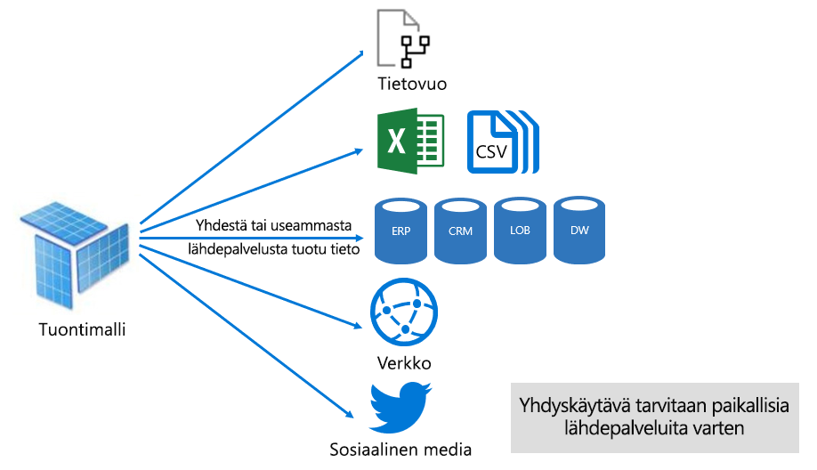
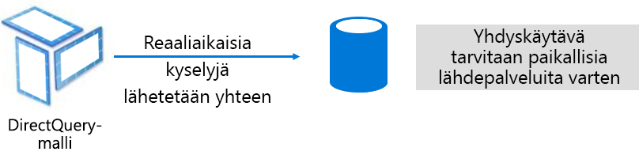
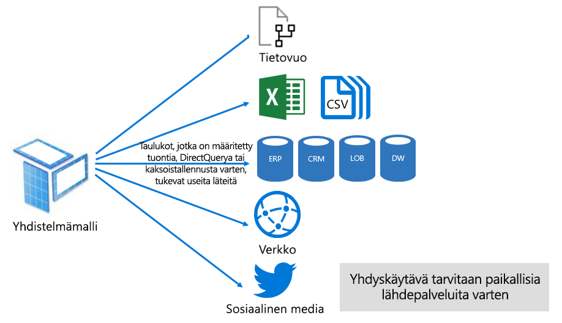

# Tietojoukkojen tilat Power BI -palvelussa

Tässä artikkelissa on Power BI -tietojoukkotilojen tekninen selitys. Selitys koskee tietojoukkoja, jotka edustavat reaaliaikaista yhteyttä ulkoisesti isännöityyn Analysis Services -malliin, sekä Power BI Desktopissa kehitettyjä malleja. Artikkelissa painotetaan kunkin tilan käyttöperusteita ja mahdollisia vaikutuksia Power BI -kapasiteetin resursseihin.

Kolme tietojoukkotilaa ovat seuraavat:

- [Tuonti](#import-mode)
- [DirectQuery](#directquery-mode)
- [Yhdistelmä](#composite-mode)

## Tuontitila

_Tuonti_tila on yleisin mallien kehittämiseen käytetty tila. Tämä tila tarjoaa erittäin nopean suoritustehon muistissa olevien kyselyiden ansiosta. Sen avulla mallintajat voivat myös hyödyntää suunnittelun joustavuutta, minkä lisäksi se tukee tiettyjä Power BI -palvelun ominaisuuksia (Q&A, Nopeat merkitykselliset tiedot yms.). Näiden vahvuuksien vuoksi se on oletustila, kun luodaan uutta Power BI Desktop -ratkaisua.

On tärkeää ymmärtää, että tuodut tiedot tallennetaan aina levylle. Kun tietoihin kohdistetaan kysely tai päivitys, tiedot on ladattava täysin Power BI -kapasiteetin muistiin. Kun tuontimallit ovat muistissa, kyselyiden tulokset voidaan saada niiden avulla hyvin nopeasti. On myös tärkeää ymmärtää, että tuontimallia ei voida ladata osittain muistiin.

Kun tuontimalli päivitetään, tiedot pakataan ja optimoidaan, minkä jälkeen VertiPaq-säilömoduuli tallentaa sen levylle. Jos se ladataan levyltä muistiin, on mahdollista saada 10X-pakkaus. On siis kohtuullista odottaa, että 10 Gt lähdetietoja voi pakatessa pienentyä kooltaan noin 1 Gt. Tallennuskoko levyllä voi pienentyä 20 % pakatusta koosta. (Kokoero voidaan määrittää vertaamalla Power BI Desktop -tiedostokokoa Tehtävienhallinnassa näkyvään tiedoston muistinkäyttöön.)

Rakenteen joustavuus voidaan toteuttaa kolmella tavalla. Tietojen mallintajat voivat:

- Integroida tietoja tallentamalla välimuistiin tietovoiden ja ulkoisten tietolähteiden tietoja, olipa tietolähteen laji tai muoto mikä tahansa
- Hyödyntää kaikkia [Power Query -kaavakielen](/powerquery-m/) (vapaamuotoisesti ”M”) funktioita, kun tietojen valmistelukyselyitä luodaan
- Hyödyntää kaikkia [Data Analysis Expressions (DAX)](/dax/) -funktioita, kun mallia parannetaan liiketoimintalogiikalla. Laskettuja sarakkeita, laskettuja taulukoita ja mittareita tuetaan.

Kuten seuraavasta kuvasta näkyy, tuontimalli voi integroida tietoja kuinka monesta tuetusta tietolähdetyypistä tahansa.

Tuontimalleihin liittyy houkuttelevia hyötyjä, mutta haittapuoliakin on:

- Koko malli on ladattava muistiin, ennen kuin Power BI voi suorittaa mallissa kyselyn, mikä voi aiheuttaa painetta käytettävissä oleviin kapasiteettiresursseihin, varsinkin kun tuontimallien määrä ja koko kasvavat
- Mallitiedot ovat vain yhtä ajankohtaisia kuin viimeisin päivitys, joten tuontimallit on päivitettävä, mikä tehdään yleensä ajoitetusti
- Täysi päivitys poistaa kaikki tiedot kaikista taulukoista ja lataa sen uudelleen tietolähteestä. Tämä operaatio saattaa vaatia paljon aikaa sekä resursseja Power BI -palvelulta ja tietolähteiltä.

    > [!NOTE]
    > Power BI voi toteuttaa lisäävän päivityksen, jolloin kokonaisia taulukoita ei tarvitse katkaista ja ladata uudelleen. Tätä toimintoa tuetaan kuitenkin vain, jos tietojoukkoa isännöidään Premium-kapasiteettien työtiloissa. Lisätietoja on artikkelissa [Lisäävä päivitys Power BI Premiumissa](service-premium-incremental-refresh.md).

Power BI -palvelun resurssien näkökulmasta tuontimallit vaativat:

- Tarpeeksi muistia, jotta malli voidaan ladata, kun siihen kohdistetaan kysely tai se päivitetään
- Käsittelyresursseja ja lisää muistiresursseja tietojen päivitystä varten

## DirectQuery-tila

_DirectQuery_-tila on Tuontitilan vaihtoehto. DirectQuery-tilassa kehitetyt mallit eivät tuo tietoja. Sen sijaan ne koostuvat vain metatiedoista, jotka määrittävät mallin rakenteen. Kun malliin kohdistetaan kysely, alkuperäisten kyselyiden avulla noudetaan tiedot pohjana olevasta tietolähteestä.

DirectQuery-mallin kehittämistä kannattaa harkita kahdesta syystä:

- Jos tietomäärät ovat liian suuria – jopa [tietojen vähentämismetodeita](guidance/import-modeling-data-reduction.md) käytettäessä – että niitä voisi ladata malliin tai käytännöllisesti päivittää
- Jos raporttien ja koontinäyttöjen tulee toimittaa ”lähes reaaliaikaisia” tietoja, minkä ajoitetun päivityksen rajoitukset estävät. (Ajoitetun päivityksen rajoitukset ovat kahdeksan kertaa päivässä jaetun kapasiteetin osalta ja 48 kertaa päivässä Premium-kapasiteetin osalta.)

DirectQuery-malleihin liittyy useita etuja:

- Tuontimallin kokorajoitukset eivät päde
- Mallit eivät vaadi tietojen päivitystä
- Raporttien käyttäjät näkevät uusimmat tiedot käyttäessään raporttien suodattimia ja osittajia. Lisäksi raporttien käyttäjät voivat päivittää koko raportin ja saada uusimmat tiedot.
- Reaaliaikaisia raportteja voidaan kehittää käyttämällä [Automaattinen sivun päivitys](desktop-automatic-page-refresh.md) -toimintoa
- DirectQuery-malleihin perustuvat koontinäytön ruudut voivat päivittyä automaattisesti 15 minuutin välein

DirectQuery-malleilla on kuitenkin tiettyjä rajoituksia:

- DAX-kaavat on rajoitettu käyttämään vain funktioita, jotka voidaan transponoida alkuperäisiksi kyselyiksi, jotka tietolähde ymmärtää. Laskettuja taulukoita ei tueta.
- Q&A- ja Nopeat merkitykselliset tiedot -toimintoja ei tueta.

Power BI -palvelun resurssien näkökulmasta DirectQuery-mallit vaativat:

- Vain vähän muistia mallin lataamiseen (vain metatiedot), kun malliin kohdistetaan kysely
- Joskus Power BI -palvelun on käytettävä huomattavasti prosessorin resursseja, jotta se saa luotua ja käsiteltyä tietolähteeseen lähetetyt kyselyt. Jos tällainen tilanne ilmenee, siirtomäärä voi kärsiä, erityisesti jos useat käyttäjät tekevät malliin kyselyitä.

Lisätietoja on kohdassa [DirectQueryn käyttö Power BI Desktopissa](desktop-use-directquery.md).

## Yhdistelmämalli

_Yhdistelmämalli_ voi yhdistellä tuonti- ja DirectQuery-tiloja tai integroida useita DirectQuery-tietolähteitä. Yhdistelmämallissa kehitetyt mallit tukevat tallennustilan määrittämistä kullekin mallitaulukolle. Tämä tila tukee myös laskettuja taulukoita (määritetty DAXin avulla).

Taulukon tallennustilaksi voidaan määrittää Tuonti, DirectQuery tai Kaksois. Kaksois-tallennustilaan määritetty taulukko on sekä Tuonti että DirectQuery, ja tämän asetuksen avulla Power BI -palvelu voi kyselykohtaisesti määrittää tehokkaimman käytettävän tilan.

Yhdistelmämallit pyrkivät toteuttamaan sekä tuonti- että DirectQuery-tilan parhaat puolet. Kun ne on määritetty oikein, ne voivat yhdistää muistissa olevien mallien suorituskyvyn mahdollisuuteen noutaa tietolähteistä lähes reaaliaikaisia tietoja.

Yhdistelmämalleja kehittävät tietomallintajat määrittävät luultavasti ulottuvuustyyppisiä taulukoita kaksois- tai tuontitallennustilassa sekä faktatyyppisiä taulukoita DirectQuery-tilassa. Lisätietoja mallitaulukkojen rooleista on artikkelissa [Tutustu tähtirakenteeseen ja sen merkitykseen Power BI:ssä](guidance/star-schema.md).

Ajatellaan esimerkiksi mallia, jossa on ulottuvuustyyppinen **Tuote**-taulukko Kaksois-tilassa ja faktatyyppinen **Myynti**-taulukko DirectQuery-tilassa. **Tuote**-taulukkoon voidaan lähettää kysely nopeasti ja tehokkaasti muistista raportin osittajan hahmonnusta varten. Myös **Myynti**-taulukkoon voidaan lähettää kysely DirectQuery-tilassa käyttämällä liittyvää **Tuote**-taulukkoa. Jälkimmäinen kysely mahdollistaa yhden tehokkaan alkuperäisen SQL-kyselyn luonnin, joka yhdistää **Tuote**- ja **Myynti**-taulukon sekä suodattaa osittajan arvojen perusteella.

Yleisesti ottaen yhdistelmämallien edut ja haitat liittyvät tuonti- ja DirectQuery-malleihin sen mukaan, kuinka kukin taulukko on määritetty.

Jos haluat lisätietoja, katso [Yhdistelmämallien käyttäminen Power BI Desktopissa](desktop-composite-models.md).

## Seuraavat vaiheet

- [Tietojoukot Power BI -palvelussa](service-dataset-modes-understand.md)
- [Tallennustilan tila Power BI Desktopissa](desktop-storage-mode.md)
- [DirectQueryn käyttäminen Power BI:ssä](desktop-directquery-about.md)
- [Yhdistelmämallien käyttäminen Power BI Desktopissa](desktop-composite-models.md)
- Onko sinulla kysyttävää? [Voit esittää kysymyksiä Power BI -yhteisössä](https://community.powerbi.com/)
