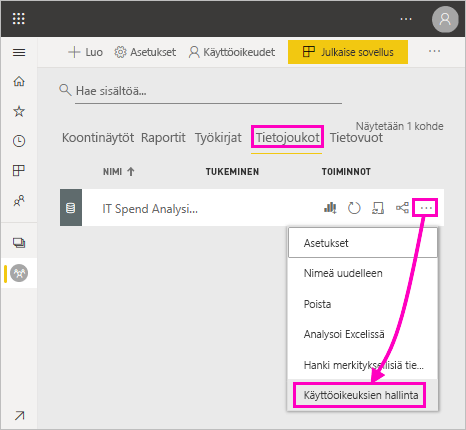
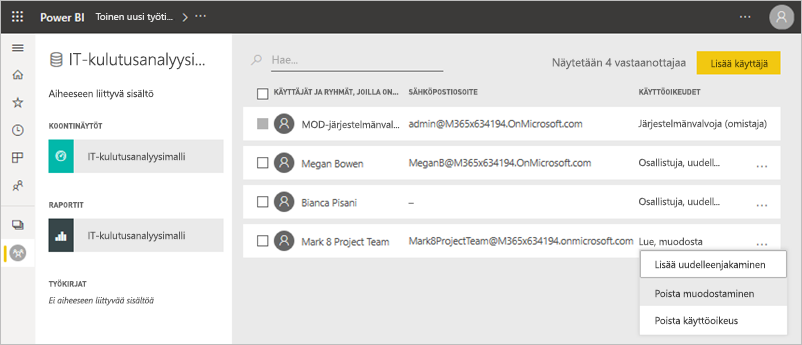
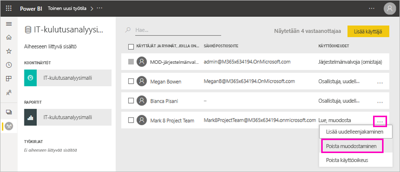
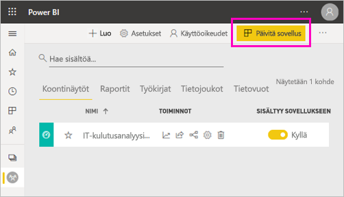
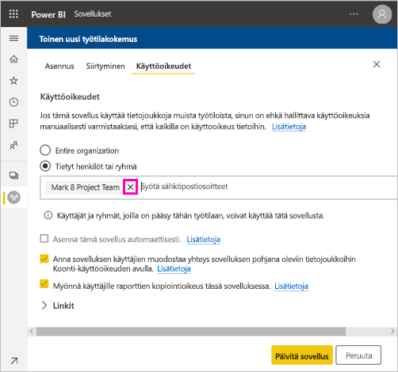
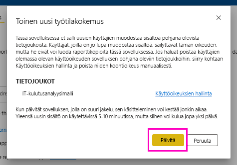

# Jaettujen tietojoukkojen muodostamisoikeus (esiversio)

Power BI Desktopin *tietomallien* luojana voit jakaa niitä *tietojoukkoina* Power BI -palvelussa. Tämän jälkeen raporttien tekijät voivat helposti etsiä ja käyttää uudelleen jakamiasi tietojoukkoja. Lue ohjeet siihen, miten voit hallita tietojen käyttöä muodostamisoikeuden avulla.

Muodostamisoikeus koskee vain tietojoukkoja. Kun annat käyttäjille muodostamisoikeuksia, he voivat luoda uutta sisältöä tietojoukkoon, esimerkiksi raportteja, koontinäyttöjä, Q&A;n kiinnitettyjä ruutuja ja merkityksellisten tietojen hakuja. Käyttäjät voivat luoda uutta sisältöä tietojoukkoon myös Power BI:n ulkopuolella, esimerkiksi Excel-laskentataulukoita Analysoi Excelissä -toiminnolla, XMLA:lla ja viemällä pohjana olevat tiedot.

## Tapoja antaa muodostamisoikeus

Tietojoukon muodostamisoikeuden voi antaa muutamalla eri tavalla:

- Työtilan jäsenet, joilla on vähintään Osallistuja-rooli, saavat automaattisesti tietojoukon muodostamisoikeuden kyseiseen työtilaan sekä oikeuden kopioida raportti.
 
- Tietojoukon sisältävän työtilan jäsenet voivat määrittää oikeuden tietyille käyttäjille tai käyttöoikeusryhmille käyttöoikeuskeskuksessa. Jos olet työtilan jäsen, valitse **Enemmän vaihtoehtoja** (…) tietojoukon vierestä > **Käyttöoikeuksien hallinta**.

    

    Tämä avaa kyseisen tietojoukon käyttöoikeuskeskuksen, jossa voit määrittää ja muokata käyttöoikeuksia.

    

- Sen työtilan, jossa tietojoukko sijaitsee, jäsen tai järjestelmänvalvoja voi päättää sovelluksen julkaisemisen yhteydessä, että sovelluksen käyttöoikeuden saavat käyttäjät saavat muodostamisoikeudet myös taustalla oleviin tietojoukkoihin. Lisätietoja on kohdassa [Tietojoukon jakaminen](service-datasets-share.md).

- Oletetaan, että sinulla on tietojoukossa oikeudet muodostamiseen ja uudelleenjakamiseen. Kun jaat raportin tai koontinäytön, joka on muodostettu tähän tietojoukkoon, voit määrittää, että myös vastaanottajat saavat muodostamisoikeudet taustalla olevaan tietojoukkoon.

    

Voit poistaa henkilöltä tietojoukon muodostamisoikeuden. Jos teet näin, käyttäjät näkevät yhtä jaettuun tietojoukkoon perustuvan raportin, mutta he eivät voi enää muokata sitä. Lisätietoja on seuraavassa osiossa.

## Poista tietojoukon muodostamisoikeus

Jossakin vaiheessa sinun on ehkä poistettava muodostamisoikeus joiltakin jaetun tietojoukon käyttäjiltä. 

1. Siirry työtilassa **Tietojoukot**-luettelosivulle. 
1. Valitse **Enemmän vaihtoehtoja** (...) tietojoukon vierestä > **Käyttöoikeuksien hallinta**.

    

1. Valitse **Enemmän vaihtoehtoja** (...) nimen vierestä > **Poista muodostaminen**.

    

    Käyttäjät näkevät yhtä jaettuun tietojoukkoon perustuvan raportin, mutta he eivät voi enää muokata sitä.

### Poista tietojoukon muodostamisoikeus sovelluksessa

Oletetaan, että olet jakanut sovelluksen työtilasta ryhmälle henkilöitä. Myöhemmin päätät poistaa sovelluksen käyttöoikeuden joiltakin käyttäjiltä. Sovelluksen käyttöoikeuden poistaminen ei poista automaattisesti muodostamis-ja uudelleenjakamisoikeuksia. Tämä on ylimääräinen vaihe. 

1. Valitse työtilan luettelosivulla **Päivitä sovellus**. 

    

1. Poista henkilö tai ryhmä valitsemalla **X** **Käyttöoikeudet**-välilehdellä. 

    
1. Valitse **Päivitä sovellus**.

    Näyttöön tulee viesti, jossa kerrotaan, että sinun on siirryttävä kohtaan **Käyttöoikeuksien hallinta**, jos haluat poistaa muodostamisoikeuden käyttäjiltä, joilla on olemassa oleva käyttöoikeus. 

    

1. Valitse **Päivitä**.

1. Siirry työtilassa **Tietojoukot**-luettelosivulle. 
1. Valitse **Enemmän vaihtoehtoja** (...) tietojoukon vierestä > **Käyttöoikeuksien hallinta**.

    

1. Valitse **Enemmän vaihtoehtoja** (...) haluamasi nimen vierestä > **Poista muodostaminen**.

    

    Käyttäjät näkevät yhtä jaettuun tietojoukkoon perustuvan raportin, mutta he eivät voi enää muokata sitä.

## Lisää eriytettyjä käyttöoikeuksia

Power BI:n muodostamisoikeus otettiin käyttöön kesäkuussa 2019 täydentämään olemassa olevia oikeuksia (luku- ja uudelleenjakamisoikeus). Kaikki käyttäjät, joilla oli jo lukuoikeudet tietojoukkoihin sovellusoikeuksien, jakamisen tai työtilan käytön kautta kesäkuussa 2019, saivat myös muodostamisoikeuden samoihin tietojoukkoihin. He saivat muodostamisoikeudet automaattisesti, koska lukuoikeus antoi heille jo oikeuden luoda uutta sisältöä tietojoukkoon Analysoi Excelissä -toiminnolla tai viemällä.

Tämän eriytetymmän muodostamisoikeuden avulla voit valita, ketkä voivat ainoastaan tarkastella olemassa olevaa raporttia tai koontinäyttöä ja ketkä voivat luoda sisältöä, joka on yhteydessä taustalla oleviin tietojoukkoihin.

Jos tietojoukkoasi käytetään raportissa tietojoukon työtilan ulkopuolella, et voi poistaa kyseistä työtilaa. Saat sen sijaan virheilmoituksen.

Voit poistaa muodostamisoikeuden. Jos poistat oikeuksia, käyttäjät, joiden oikeudet poistat, näkevät yhä raportin, mutta he eivät voi enää muokata sitä tai viedä pohjana olevia tietoja. Käyttäjät, joilla on vain lukuoikeus, voivat yhä viedä yhteenvedettyjä tietoja. 

## Seuraavat vaiheet

- [Tietojoukkojen käyttö eri työtiloissa (esikatselu)](service-datasets-across-workspaces.md)
- Onko sinulla kysyttävää? [Voit esittää kysymyksiä Power BI -yhteisössä](https://community.powerbi.com/)
