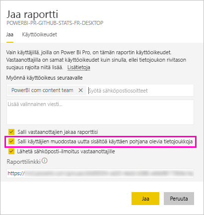

# Tietojoukon jakaminen (esikatselu)

Power BI Desktopin *tietomallien* luojana voit jakaa niitä *tietojoukkoina* Power BI -palvelussa. Tämän jälkeen raporttien tekijät voivat helposti etsiä ja käyttää uudelleen jakamiasi tietojoukkoja. Lue ohjeet niiden jakamiseen sekä siihen, miten voit hallita niiden käyttöä muodostamiskäyttöoikeudella.

## Tietojoukon jakamisohjeet

1. Aloita luomalla .pbix-tiedosto tietomallin avulla Power BI Desktopissa. Jos aiot tarjota tätä tietojoukkoa muille raporttien luomiseen, et ehkä edes suunnittele raporttia .pbix-tiedostossa.

    Paras käytäntö on tallentaa .pbix-tiedosto Office 365 -ryhmään.

1. Julkaise .pbix-tiedosto Power BI -palvelun [uuden käyttöliittymän työtilaan](service-create-the-new-workspaces.md).
    
    Tämän työtilan muut jäsenet voivat jo luoda raportteja muihin tähän tietojoukkoon perustuviin työtiloihin.

1. Voit myös [julkaista sovelluksen](service-create-distribute-apps.md) tästä työtilasta. Kun teet sen, voit määrittää **käyttöoikeuksien** sivulla, kenellä on mitkäkin käyttöoikeudet.

    > [!NOTE]
    > Jos valitset **Koko organisaatio**, kellään organisaatiossa ei ole muodostamiskäyttöoikeuksia. Tämä on jo tunnettu ongelma. Määritä sen sijaan sähköpostiosoitteet **tiettyjen henkilöiden tai ryhmien** kohdassa.  Jos haluat antaa muodostamisoikeudet koko organisaatiolle, määritä sähköpostialias koko organisaatiolle.

    

1. Valitse **Julkaise sovellus**. Jos sovellus on jo julkaistu, valitse **Päivitä sovellus**.

## Jaettujen tietojoukkojen muodostamisoikeudet

Muodostamiskäyttöoikeus koskee vain tietojoukkoja. Sen avulla käyttäjät voivat luoda uutta sisältöä tietojoukkoon, esimerkiksi raportteja, koontinäyttöjä, Q&A;n kiinnitettyjä ruutuja ja merkityksellisten tietojen hakuja. Käyttäjät voivat luoda uutta sisältöä tietojoukkoon myös Power BI:n ulkopuolella, esimerkiksi Excel-laskentataulukoita Analysoi Excelissä -toiminnolla, XMLA:lla ja viemällä.

Käyttäjät voivat hankkia muodostamisoikeudet eri tavoin:

- Jos olet työtilan jäsen ja sinulla on vähintään Osallistuja-rooli, sinulla on automaattisesti tietojoukon muodostamisoikeus ja oikeus kopioida raportti.
 
- Sen työtilan, jossa tietojoukko sijaitsee, jäsen voi määrittää oikeuden tietyille käyttäjille tai käyttöoikeusryhmille käyttöoikeuskeskuksessa. Valitse kolme pistettä (... ) tietojoukon vieressä ja valitse sitten **Käyttöoikeuksien hallinta**.

    

    Tämä avaa kyseisen tietojoukon käyttöoikeuskeskuksen, jossa voit määrittää ja muokata käyttöoikeuksia.

    

- Sen työtilan, jossa tietojoukko sijaitsee, jäsen tai järjestelmänvalvoja voi päättää sovelluksen julkaisemisen yhteydessä, että sovelluksen käyttöoikeuden saavat käyttäjät saavat muodostamisoikeudet myös taustalla oleviin tietojoukkoihin. Lisätietoja on tämän artikkelin kohdassa [Tietojoukon jakamisohjeet](#steps-to-sharing-your-dataset).

- Oletetaan, että sinulla on tietojoukossa oikeudet muodostamiseen ja uudelleenjakamiseen. Kun jaat raportin tai koontinäytön, joka perustuu tähän tietojoukkoon, voit määrittää, että myös vastaanottajat saavat muodostamisoikeudet taustalla olevaan tietojoukkoon.

    

Voit poistaa henkilöltä tietojoukon muodostamisoikeudet. Jos teet näin, käyttäjät näkevät yhtä jaettuun tietojoukkoon perustuvan raportin, mutta he eivät voi enää muokata sitä.

## Lisää eriytettyjä käyttöoikeuksia

Power BI:n muodostamisoikeus otettiin käyttöön kesäkuussa 2019 täydentämään olemassa olevia oikeuksia (luku- ja uudelleenjakamisoikeus). Kaikki käyttäjät, joilla oli jo lukuoikeudet tietojoukkoihin sovellusoikeuksien, jakamisen tai työtilan käytön kautta kesäkuussa 2019, saivat myös muodostamisoikeudet samoihin tietojoukkoihin. He saivat muodostamisoikeudet automaattisesti, koska lukuoikeus antoi heille jo oikeuden luoda uutta sisältöä tietojoukkoon Analysoi Excelissä -toiminnolla tai viemällä.

Tämän eriytetymmän muodostamisoikeuden avulla voit valita, ketkä voivat ainoastaan tarkastella olemassa olevaa raporttia tai koontinäyttöä ja ketkä voivat luoda sisältöä, joka on yhteydessä taustalla oleviin tietojoukkoihin.

Jos tietojoukkoasi käytetään raportissa tietojoukon työtilan ulkopuolella, et voi poistaa kyseistä työtilaa. Saat sen sijaan virheilmoituksen.

Voit poistaa muodostamisoikeuksia. Jos poistat oikeuksia, käyttäjät, joiden oikeudet poistat, näkevät yhä raportin, mutta he eivät voi enää muokata sitä.

## Tietojoukon käytön seuranta

Kun sinulla on työtilassasi jaettu tietojoukko, sinun täytyy ehkä tietää, mitkä muiden työtilojen raportit perustuvat siihen.

1. Valitse Tietojoukot-luettelonäkymässä **Näytä aiheeseen liittyvät**.

    

1. Näet kaikki liittyvät kohteet **aiheeseen liittyvän sisällön** valintaikkunasta. Näet luettelosta tähän työtilaan ja **muihin työtiloihin** liittyvät kohteet.
 
    

## Seuraavat vaiheet

- [Tietojoukkojen käyttö eri työtiloissa (esikatselu)](service-datasets-across-workspaces.md)
- Onko sinulla kysyttävää? [Voit esittää kysymyksiä Power BI -yhteisössä](http://community.powerbi.com/)
