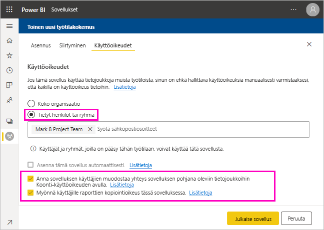

# Tietojoukon jakaminen (esikatselu)

Power BI Desktopin *tietomallien* luojana luot *tietojoukkoja*, joita voit jakaa Power BI -palvelussa. Sen jälkeen muut raporttien luojat voivat käyttää tietojoukkojasi omien raporttiensa pohjana. Tässä artikkelissa kerrotaan, miten tietojoukkoja jaetaan. Lisätietoja siitä, miten voit antaa ja poistaa jaettujen tietojoukkojen käyttöoikeuksia, on artikkelissa [Muodostamisoikeus](service-datasets-build-permissions.md).

## Tietojoukon jakamisohjeet

1. Aloita luomalla .pbix-tiedosto tietomallin avulla Power BI Desktopissa. Jos aiot tarjota tätä tietojoukkoa muille raporttien luomiseen, et ehkä edes suunnittele raporttia .pbix-tiedostossa.

    Paras käytäntö on tallentaa .pbix-tiedosto Office 365 -ryhmään.

1. Julkaise .pbix-tiedosto Power BI -palvelun [uuden käyttöliittymän työtilaan](service-create-the-new-workspaces.md).
    
    Tämän työtilan muut jäsenet voivat jo luoda raportteja muihin tähän tietojoukkoon perustuviin työtiloihin.

1. Voit myös [julkaista sovelluksen](service-create-distribute-apps.md) tästä työtilasta. Kun teet sen, voit määrittää **käyttöoikeuksien** sivulla, kenellä on mitkäkin käyttöoikeudet.

    > [!NOTE]
    > Jos valitset **Koko organisaatio**, kellään organisaatiossa ei ole muodostamisoikeutta. Tämä on jo tunnettu ongelma. Määritä sen sijaan sähköpostiosoitteet **tiettyjen henkilöiden tai ryhmien** kohdassa.  Jos haluat antaa muodostamisoikeuden koko organisaatiolle, määritä sähköpostialias koko organisaatiolle.

    

1. Valitse **Julkaise sovellus**. Jos sovellus on jo julkaistu, valitse **Päivitä sovellus**.

## Tietojoukon käytön seuranta

Kun sinulla on työtilassasi jaettu tietojoukko, sinun täytyy ehkä tietää, mitkä muiden työtilojen raportit perustuvat siihen.

1. Valitse Tietojoukot-luettelonäkymässä **Näytä aiheeseen liittyvät**.

    

1. Näet kaikki liittyvät kohteet **aiheeseen liittyvän sisällön** valintaikkunasta. Näet luettelosta tähän työtilaan ja **muihin työtiloihin** liittyvät kohteet.
 
    

## Seuraavat vaiheet

- [Tietojoukkojen käyttö eri työtiloissa (esikatselu)](service-datasets-across-workspaces.md)
- Onko sinulla kysymyksiä? [Voit esittää kysymyksiä Power BI -yhteisössä](https://community.powerbi.com/)
