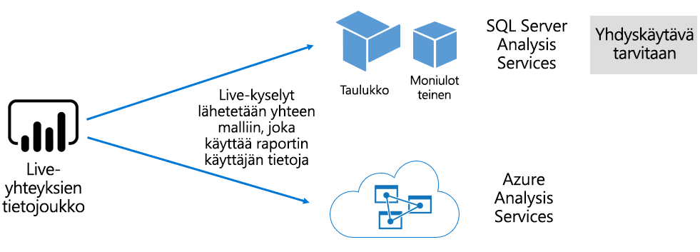

# Tietojoukot Power BI -palvelussa

Tässä artikkelissa on Power BI -tietojoukkojen tekninen selitys.

## Tietojoukkojen tyypit

Power BI -palvelun tietojoukot toimivat sellaisten tietojen lähteinä, jotka ovat valmiina raportointia ja visualisointia varten. Tietojoukkotyyppejä on viisi erilaista, ja niitä luodaan seuraavilla tavoilla:

- Yhteyden muodostaminen aiemmin luotuun tietomalliin, jota ei isännöidä Power BI -kapasiteetissa
- Mallin sisältävän Power BI Desktop -tiedoston lataaminen palvelimeen
- Excel-työkirjan (joka sisältää vähintään yhden Excel-taulukon ja/tai työkirjan tietomallin) lataaminen palvelimeen tai CSV-tiedoston (pilkuin erotellut arvot) lataaminen palvelimeen
- [Push-tietojoukon](developer/automation/walkthrough-push-data.md) luominen Power BI -palvelun avulla
- [Virtautettavan tai hybridivirtautettavan tietojoukon](service-real-time-streaming.md) luominen Power BI -palvelun avulla

Virtautettavia tietojoukkoja lukuun ottamatta tietojoukko vastaa tietomallia, joka hyödyntää [Analysis Services](/analysis-services/analysis-services-overview) -palvelun kypsiä mallinnustekniikoita.

> [!NOTE]
> Joskus dokumentaatiossa samasta asiasta voidaan käyttää sekä termiä _tietojoukko_ että _malli_. Power BI -palvelun näkökulmasta kyseessä on **tietojoukko**, ja kehitysnäkökulmasta kyseessä on **malli**. Dokumentaatiomme kontekstissa nämä voivat tarkoittaa jotakuinkin samaa asiaa.

### Ulkoisesti isännöidyt mallit

Ulkoisesti isännöityjä malleja on kahdenlaisia: SQL Server Analysis Services -malli ja [Azure Analysis Services](/azure/analysis-services/analysis-services-overview) -malli.

Yhteyden muodostaminen SQL Server Analysis Services -malliin edellyttää [paikallisen tietoyhdyskäytävän](service-gateway-onprem.md) asentamista, olipa kyseessä paikallinen tai näennäiskoneen isännöimä infrastruktuuri palveluna (IaaS). Azure Analysis Services ei edellytä yhdyskäytävää.

Yhteyden muodostaminen Analysis Services -malliin on usein järkevää, kun olemassa on mallisijoituksia, jotka ovat yleensä osa yrityksen tietovarastoa (EDW). Power BI voi muodostaa _reaaliaikaisen yhteyden_ Analysis Servicesiin ja valvoa tietojen käyttöoikeuksia käyttämällä Power BI -raportin käyttäjän käyttäjätietoja. SQL Server Analysis Servicesin osalta tuetaan sekä moniulotteisia malleja (kuutioita) että taulukkomalleja. Kuten seuraavassa kuvassa näytetään, reaaliaikaisten yhteyksien tietojoukko välittää kyselyt ulkoisesti isännöityihin malleihin.

### Power BI Desktopin kehitetyt mallit

Power BI Desktop on Power BI -kehittämiseen tarkoitettu asiakassovellus, jota voidaan käyttää mallin kehittämiseen. Malli on käytännössä Analysis Services -taulukkomalli. Malleja voidaan kehittää tuomalla tietoja tietovoista, jotka voidaan sitten integroida ulkoisiin tietolähteisiin. Vaikka mallintamisen toteuttamista ei käsitellä tässä artikkelissa, on tärkeää ymmärtää, että Power BI Desktopin avulla malleja voidaan toteuttaa kolmea eri tyyppiä eli _tilaa_. Nämä tilat määrittävät, tuodaanko tiedot malliin vai pysyvätkö ne tietolähteessä. Kolme tilaa ovat seuraavat: Tuonti, DirectQuery ja Yhdistelmä. Lisätietoja kustakin tilasta on [Tietojoukkojen tilat Power BI -palvelussa](service-dataset-modes-understand.md) -artikkelissa.

Ulkoisesti isännöidyt mallit ja Power BI Desktop -mallit voivat pakottaa rivitason suojauksen (RLS), joka rajoittaa tietylle käyttäjälle noudettavia tietoja. Esimerkiksi **Myyjät**-käyttöoikeusryhmään määritetyt käyttäjät voivat tarkastella vain niiden myyntialueiden raporttitietoja, joihin heidät on määritetty. RLS-roolit ovat _dynaamisia_ tai _staattisia_. Dynaamiset roolit suodatetaan raportin käyttäjän mukaan, kun taas staattiset roolit käyttävät samoja suodattimia kaikille rooliin määritetyille käyttäjille. Lisätietoja on artikkelissa [Rivitason suojaus (RLS) Power BI:ssä](service-admin-rls.md).

### Excel-työkirjamallit

Kun luodaan [Excel-työkirjoihin](service-excel-workbook-files.md) tai [CSV-tiedostoihin](service-comma-separated-value-files.md) perustuvia tietojoukkoja, seurauksena on automaattisesti luotu malli. Excel-taulukot ja CSV-tiedot tuodaan mallitaulukoiden luontia varten, kun taas Excel-työkirjan tietomalli transponoidaan Power BI -mallin luontia varten. Kaikissa tapauksissa tiedostotiedot tuodaan malliin.

## Yhteenveto

Malleja edustavia Power BI -tietojoukkoja voidaan siis erotella:

- niitä joko isännöidään Power BI palvelussa tai ne ovat Analysis Servicesin ulkoisesti isännöimiä.
- Ne voivat säilyttää tuotuja tietoja tai välittää läpivientikyselypyyntöjä pohjana oleviin tietolähteisiin, tai ne voivat käyttää näiden yhdistelmää.

Tässä on yhteenveto malleja edustaviin Power BI -tietojoukkoihin liittyvistä tärkeistä tiedoista:

- SQL Server Analysis Servicesissä isännöidyt mallit tarvitsevat yhdyskäytävän voidakseen suorittaa reaaliaikaisten yhteyksien kyselyitä.
- Power BI -isännöidyt mallit, jotka tuovat tietoja:
  - Tulee olla ladattuja muistiin kokonaisuudessaan, jotta niille voidaan tehdä kyselyitä.
  - Tarvitsevat tietojen päivittämistä, jotta tiedot pysyvät ajan tasalla, ja jos lähdetiedot eivät ole saatavilla suoraan internetissä, mallien täytyy sisältää yhdyskäytäviä.
- Power BI -isännöidyt mallit, jotka käyttävät [DirectQuery](desktop-directquery-about.md)-tallennustilaa, tarvitsevat yhteyden tietolähteeseen. Kun malliin tehdään kysely, Power BI lähettää kyselyt tietolähteeseen, jotta käytössä ovat nykyiset tiedot. Tämän mallin täytyy sisältää yhdyskäytäviä, jos lähdetiedot eivät ole saatavilla suoraan internetissä.
- Mallit saattavat pakottaa käyttöön RLS-sääntöjä, jotka pakottavat suodattimet rajoittamaan tietojen käyttöoikeuden tietyille käyttäjille.

## Huomioitavaa

Power BI:n käyttöönottoa ja hallinnointia varten on tärkeää ymmärtää, missä malleja isännöidään, mikä niiden tallennustilan tila on, ovatko ne riippuvaisia yhdyskäytävistä, tuotujen tietojen koko sekä päivitysten tyyppi ja toistumisväli. Kaikki nämä määritykset voivat vaikuttaa suuresti Power BI -kapasiteettiresursseihin. Lisäksi itse mallin rakenne, mukaan lukien siihen liittyvät tietojen valmistelukyselyt, suhteet ja laskutoimitukset, tulee mahdollisesti myös ottaa huomioon.

On myös tärkeää ymmärtää, että Power BI -isännöidyt tuontimallit voidaan päivittää aikataulun mukaisesti tai käynnistää pyydettäessä käyttäjän toimesta Power BI -palvelussa.

## Seuraavat vaiheet

- [Tietojoukkojen tilat Power BI -palvelussa](service-dataset-modes-understand.md)
- Onko sinulla kysyttävää? [Voit esittää kysymyksiä Power BI -yhteisössä](https://community.powerbi.com/)
