# Poista melkein mitä tahansa Power BI -palvelussa
Tässä artikkelissa opetetaan, miten Power BI -palvelussa poistetaan koontinäyttö, raportti, työkirja, tietojoukko, sovellus, visualisointi ja työtila.

## Koontinäytön poistaminen
Koontinäyttöjä voidaan poistaa. Koontinäytön poistaminen ei poista sen pohjana olevaa tietojoukkoa tai tähän koontinäyttöön liittyviä raportteja.

* Jos olet koontinäytön omistaja, voit poistaa sen. Jos olet jakanut koontinäytön työtovereiden kanssa, koontinäytön poistaminen Power BI -työtilastasi poistaa koontinäytön heidän Power BI -työtiloistaan.
* Jos koontinäyttö on jaettu kanssasi etkä enää halua nähdä sitä, voit poistaa sen.  Koontinäytön poistaminen ei poista sitä kenenkään muun käyttäjän Power BI -työtilasta.
* Jos koontinäyttö on osa [organisaation sisältöpakettia](service-organizational-content-pack-disconnect.md), ainoa tapa poistaa se on poistaa siihen liittyvä tietojoukko.

### Koontinäytön poistaminen
1. Valitse työtilassa **Koontinäytöt**-välilehti.
2. Etsi poistettava koontinäyttö ja valitse Poista-kuvake .

    

## Raportin poistaminen
Älä huolestu, raportin poistaminen ei poista tietojoukkoa, johon raportti perustuu.  Myös visualisoinnit, jotka olet kiinnittänyt raporttiin, ovat turvassa -- ne pysyvät koontinäytössä, kunnes poistat ne yksitellen.

### Raportin poistaminen
1. Valitse työtilassa **Raportit**-välilehti.
2. Etsi poistettava raportti ja valitse Poista-kuvake   .   

    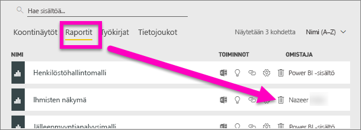
3. Vahvista poistaminen.

   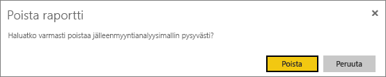

   > [!NOTE]
   > Jos raportti on osa [sisältöpakettia](service-organizational-content-pack-introduction.md), et voi poistaa sitä tällä menetelmällä.  Katso [Organisaation sisältöpaketin yhteyden poistaminen](service-organizational-content-pack-disconnect.md).
   >
   >

## Työkirjan poistaminen
Työkirjoja voidaan poistaa. Työkirjan poistaminen poistaa kuitenkin myös kaikki raportit ja koontinäyttöruudut, jotka sisältävät tietoja tästä työkirjasta.

Jos työkirja on tallennettu OneDrive for Businessissa, sen poistaminen Power BI:stä ei poista sitä OneDrivesta.

### Työkirjan poistaminen
1. Valitse työtilassa **Työkirjat**-välilehti.
2. Etsi poistettava työkirja ja valitse Poista-  kuvake.

    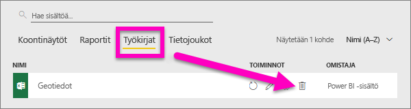
3. Vahvista poistaminen.

   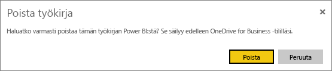

## Tietojoukon poistaminen
Tietojoukkoja voi poistaa. Tietojoukon poistaminen poistaa kuitenkin myös kaikki raportit ja koontinäyttöruudut, jotka sisältävät tietojoukon tietoja.

Jos tietojoukko on osa vähintään yhtä [organisaation sisältöpakettia](service-organizational-content-pack-disconnect.md), ainoa tapa poistaa se on poistaa se sisältöpaketeista, joissa se on käytössä, odottaa sen käsittelemistä ja yrittää sitten poistaa se uudelleen.

### Tietojoukon poistaminen
1. Valitse työtilassa **Tietojoukot**-välilehti.
2. Etsi poistettava tietojoukko ja valitse kolme pistettä (...).  

    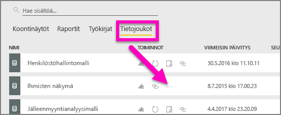
3. Valitse avattavasta valikosta **Poista**.

   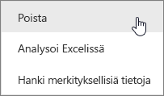
4. Vahvista poistaminen.

   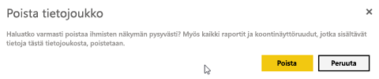

## Sovelluksen työtilan poistaminen
> [!WARNING]
> Kun luot sovelluksen työtilan, luot Office 365 -ryhmän. Ja kun poistat sovelluksen työtilan, poistat kyseisen Office 365 -ryhmän. Tämä tarkoittaa sitä, että ryhmä poistetaan myös muista O365-tuotteista, kuten SharePointista ja Microsoft Teamsista.
>
>

Sovelluksen työtilan tekijänä voit poistaa sen. Kun poistat sen, myös siihen liittyvä sovellus poistetaan kaikilta ryhmän jäseniltä ja omasta AppSourcesta, jos sovellus oli julkaistu koko organisaatiolle. Sovelluksen työtilan poistaminen on erilainen kuin sovelluksen työtilasta poistuminen.

### Sovelluksen työtilan poistaminen - jos olet järjestelmänvalvoja
1. Valitse vasemmassa siirtymispalkissa **Työtilat**

    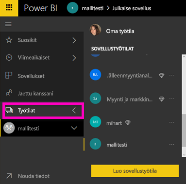
2. Valitse poistettavan työtilan oikealta puolelta kolme pistettä (...) ja valitse **Muokkaa työtilaa**.

   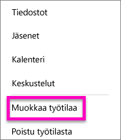
3. Valitse **Muokkaa työtilaa** -ikkunasta **Poista työtila** > **Poista**.

    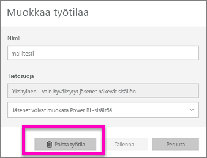

### Sovelluksen työtilan poistaminen luettelosta
Jos et enää halua olla sovelluksen työtilan jäsen, voit ***poistua*** siitä, jolloin se poistetaan luettelostasi. Työtilasta poistuminen jättää sen paikalleen kaikille muille työtilan jäsenille.  

> [!IMPORTANT]
> Jos olet sovelluksen työtilan ainoa järjestelmänvalvoja, Power BI ei salli poistumista.
>
>

1. Aloita poistettavasta sovelluksen työtilasta.
2. Valitse oikeasta yläkulmasta kolme pistettä (...) ja valitse **Poistu työtilasta** > **Poistu**.

      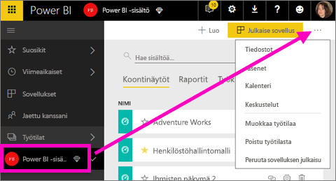

   > [!NOTE]
   > Avattavan valikon vaihtoehdot määräytyvät sen mukaan, oletko sovelluksen työtilan järjestelmänvalvoja vai jäsen.
   >
   >

## Sovelluksen poistaminen
Sovellukset voidaan helposti poistaa sovellusten luettelosivulta. Mutta vain sovelluksen järjestelmänvalvoja voi poistaa sovelluksen pysyvästi.

### Sovelluksen poistaminen sovelluksen luettelosivulta
Sovelluksen poistaminen sovelluksen luettelosivulta ei poista sovellusta muilta jäseniltä.

1. Avaa sovellusten luettelosivu valitsemalla vasemmassa siirtymispalkissa **Sovellukset**.
2. Pidä osoitinta poistettavan sovelluksen päällä ja valitse Poista  -kuvake.

   

   Jos poistat sovelluksen vahingossa, voit palauttaa sen usealla eri tavalla.  Voit pyytää sovelluksen tekijää lähettämään sen uudelleen, voit etsiä alkuperäisen sähköpostiviestin, joka sisältää linkin sovellukseen, voit tarkistaa [ilmoituskeskuksesta](service-notification-center.md), onko sovelluksen ilmoitus yhä luettelossa, tai voit tarkistaa organisaation [ AppSourcen](service-install-use-apps.md).

## Huomioon otettavat seikat ja vianmääritys
Tässä artikkelissa kuvattiin Power BI -palvelun pääosien poistaminen. Mutta on paljon muutakin, mitä voit poistaa Power BI:ssä.  

* [Suositellun koontinäytön poistaminen](service-dashboard-featured.md#change-the-featured-dashboard)
* [Koontinäytön poistaminen (suosikeista)](service-dashboard-favorite.md)
* [Raporttisivun poistaminen](service-delete.md)
* [Koontinäyttöruudun poistaminen](service-dashboard-edit-tile.md)
* [Raportin visualisoinnin poistaminen](service-delete.md)

Onko sinulla muuta kysyttävää? [Kokeile Power BI -yhteisöä](http://community.powerbi.com/)
