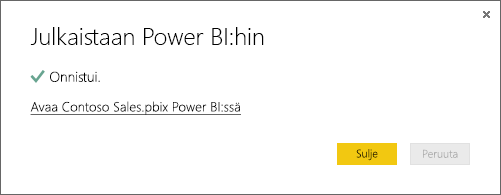

# Tietojen hakeminen Power BI Desktop -tiedostoista

**Power BI Desktop** tekee liiketoimintatiedon hallinnasta ja raportoinnista helppoa. Oletpa sitten olet muodostamassa yhteyttä moniin eri tietolähteisiin, tekemässä kyselyitä ja muokkaamassa tietoja, mallintamassa tietoja tai luomassa tehokkaita ja dynaamisia raportteja, **Power BI Desktopin** avulla liiketoimintatiedon hallintatehtävät sujuvat intuitiivisesti ja nopeasti. Jos et ole aiemmin käyttänyt **Power BI Desktopia**, tutustu [Power BI Desktopin käytön aloittaminen](desktop-getting-started.md) -artikkeliin.

Kun olet tuonut tiedot **Power BI Desktopiin** ja luonut muutamia raportteja, on aika noutaa tallennettu tiedosto **Power BI -palveluun**.

## Tiedoston tallennussijainnilla on merkitystä
**Paikallinen** – Jos tallennat tiedoston tietokoneesi paikalliseen asemaan tai toiseen sijaintiin organisaatiossasi, voit *tuoda* tiedoston tai *julkaista* sen Power BI Desktopista siirtääksesi sen tiedot ja raportit Power BI:hin. Todellisuudessa tiedosto säilyy paikallisessa asemassa, joten koko tiedostoa ei ole varsinaisesti siirretty Power BI:hin. Käytännössä Power BI:hin luodaan uusi tietojoukko, johon Power BI Desktop -tiedoston tiedot ja tietomalli ladataan. Jos tiedostossa on raportteja, ne näkyvät Power BI -sivuston Raportit-kohdassa.

**OneDrive – yritys** – Ehdottomasti tehokkain tapa, jolla voit pitää Power Bi Desktop -työsi ja Power BI:n tietojoukon, raportit ja koontinäytöt synkronoituina, on käyttää OneDrive for Businessia ja kirjautua siihen sisään samalla tilillä kuin Power BI:hinkin. Koska sekä Power BI että OneDrive toimivat pilvipalvelussa, Power BI *muodostaa yhteyden* OneDrivessa sijaitsevaan tiedostoon noin tunnin välein. Jos muutoksia löytyy, Power BI:n tietojoukko, raportit ja koontinäytöt päivitetään automaattisesti.

**OneDrive – henkilökohtainen** – Jos tallennat tiedostot henkilökohtaiseen OneDrive-tiliisi, saat monia samoja etuja kuin käyttäessäsi OneDrive for Businessia. Suurin ero on, että kun muodostat ensimmäisen kerran yhteyden tiedostoon (valitsemalla Nouda tiedot > Tiedostot > OneDrive – henkilökohtainen), sinun on kirjauduttava OneDriveen Microsoft-tililläsi, joka on yleensä erilainen kuin Power BI -kirjautumisessa käyttämäsi tili. Kun kirjaudut OneDriveen käyttämällä Microsoft-tiliäsi, muista valita Pidä minut kirjautuneena -asetus. Näin Power BI voi muodostaa yhteyden tiedostoon noin tunnin välein ja varmistaa, että Power BI:n tietojoukko on synkronoitu.

**SharePoint-työryhmäsivustot** – Power BI Desktop -tiedostojen tallentaminen SharePoint-työryhmäsivustoihin tapahtuu lähes samoin kuin tallentaminen OneDrive for Businessiin. Suurin ero on siinä, miten yhteys Power BI:stä tiedostoon muodostetaan. Voit määrittää URL-osoitteen tai muodostaa yhteyden pääkansioon.

## Tiedoston tuominen tai yhteyden muodostaminen Power BI:stä Power BI Desktop -tiedostoon
>[!IMPORTANT]
>Power BI:hin tuotavan tiedoston enimmäiskoko on 1 gigatavu.

1. Valitse Power BI:n siirtymisruudussa ** Nouda tiedot **.
   
   
2. Valitse **Tiedostot**-kohdassa **Nouda**.
   
   
3. Etsi tiedosto. Power BI Desktop -tiedostojen tunniste on .PBIX.
   
   

## Tiedoston julkaiseminen Power BI Desktopista Power BI -sivustoon
Julkaiseminen Power BI Desktopista toimii käytännössä samoin kuin Power BI:n Nouda tiedot -toiminnon avulla tapahtuva tiedoston tuominen paikallisesta asemasta tai yhteyden muodostaminen siihen OneDrivessa.  Seuraavassa on lyhyt ohje. Tarkempia tietoja on [Power BI Desktopista julkaiseminen](desktop-upload-desktop-files.md) -artikkelissa.

1. Valitse Power BI Desktopissa **Tiedosto** > **Julkaise** > **Julkaise Power BI:hin**, tai napsauta valintanauhan **Julkaise**-painiketta.
   
   
2. Kirjaudu sisään Power BI:hin. Sinun on tehtävä tämä vain ensimmäisellä kerralla.
   
   Tämän jälkeen näkyviin tulee linkki, joka avaa raportin Power BI -sivustossa.
   
   

## Seuraavat vaiheet
**Tutki tietoja** – Kun olet noutanut tiedot ja raportit tiedostosta Power BI:hin, on aika tutkia niitä. Jos tiedostossa on jo raportteja, ne näkyvät siirtymisruudun **Raportit**-kohdassa. Jos tiedostossa on vain tietoja, voit luoda uusia raportteja. Napsauta hiiren kakkospainikkeella uutta tietojoukkoa ja valitse sitten **Tutki**.

**Päivitä ulkoiset tietolähteet** – Jos Power BI Desktop -tiedosto on yhteydessä ulkoisiin tietolähteisiin, voit määrittää ajoitetut päivitykset ja varmistaa näin, että tietojoukkosi on aina ajan tasalla. Useimmiten ajoitetun päivityksen määrittäminen on varsin helppoa, mutta sen tarkat ohjeet eivät kuulu tämän artikkelin piiriin. Lisätietoja asiasta on [Tietojen päivittäminen Power BI:ssä](refresh-data.md) -artikkelissa.

