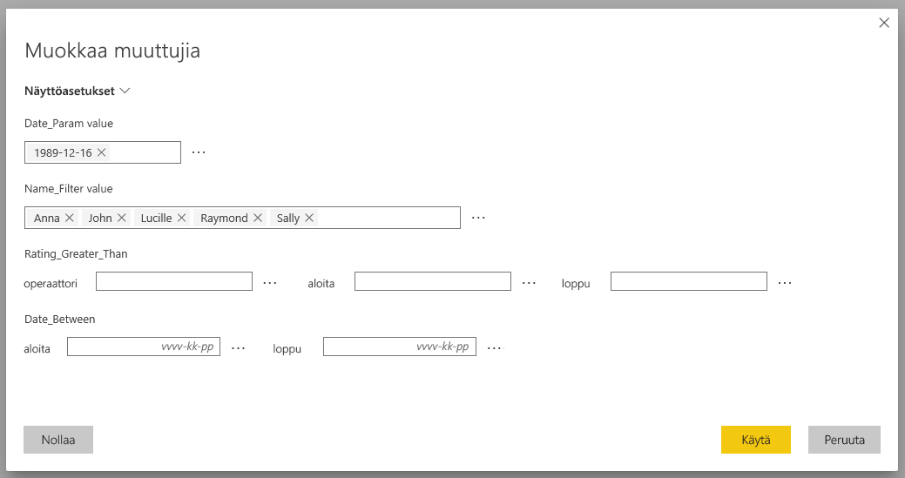
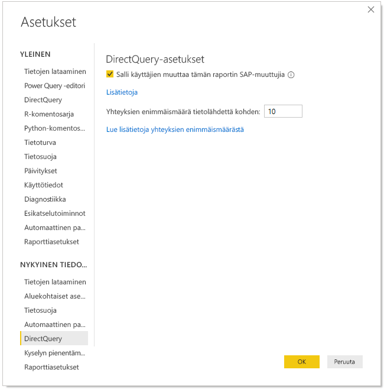
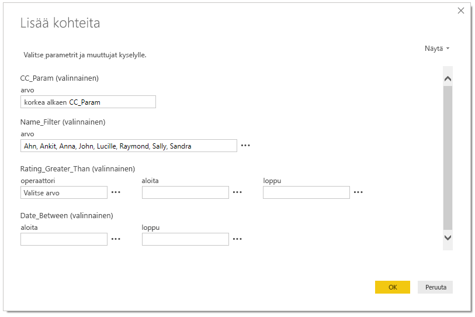
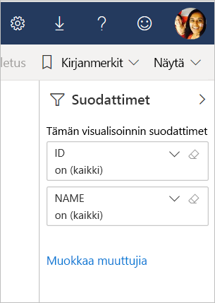

# SAP-muuttujien muokkaus Power BI -palvelussa (esikatselu)

Kun käytössä on SAP Business Warehouse tai SAP HANA ja DirectQuery, raporttien tekijät voivat nyt antaa käyttäjille luvan muokata SAP-muuttujia **Power BI -palvelun** Premium-työtiloissa.

Tässä asiakirjassa kuvataan Power BI -muuttujien muokkaamisvaatimukset, tämän esikatselutoiminnon ottaminen käyttöön ja muuttujien muokkaaminen Power BI -palvelussa.

## SAP-muokkausmuuttujien vaatimukset

SAP-muokkausmuuttujien käyttämiseen on joitakin vaatimuksia. Seuraavassa luettelossa kuvataan nämä vaatimukset.

**Uusi suodatuskokemus vaaditaan** – raportissa on oltava käytössä [uusi suodatuskokemus](power-bi-report-filter.md). Voit ottaa sen käyttöön raportissa seuraavasti Power BI Desktopissa:
- Valitse Power BI Desktopissa **Tiedosto** > **Asetukset ja vaihtoehdot** > **Asetukset**
- Valitse siirtymisruudussa **Nykyinen tiedosto** -kohdassa **Raportin asetukset**.
- Valitse **Suodatuskokemus**-kohdassa **Ota käyttöön päivitetty suodatinruutu**.

**DirectQuery-yhteydet vaaditaan**  – yhteys SAP-tietolähteeseen on muodostettava DirectQueryn avulla. Tuontiyhteyksiä ei tueta.

**Power BI Premium -tilaus vaaditaan** – SAP-muokkausmuuttujat toimivat tällä hetkellä vain Power BI Premium -tilauksissa.

**Kertakirjautuminen on määritettävä** – tämän toiminnon käyttö edellyttää, että kertakirjautuminen (SSO) on määritettävä. Lisätietoja on [kertakirjautumisen (SSO) yleiskatsauksessa](service-gateway-sso-overview.md).

**Uudet yhdyskäytäväbitit vaaditaan** – lataa uusin yhdyskäytävä ja päivitä nykyinen yhdyskäytäväsi. Lisätietoja on [palvelun yhdyskäytävässä](service-gateway-onprem.md).

**Moniulotteisuus vain SAP HANA:llw** – SAP HANA:lle SAP-muokkausmuuttujat toimivat vain moniulotteisissa malleissa. Ne eivät toimi suhteellisissa lähteissä.

**Ei tuettu maakohtaisissa pilvipalveluissa** – Power Query Online ei ole tällä hetkellä käytettävissä maakohtaisissa pilvipalveluissa; tästä syystä tätä ominaisuutta ei tueta maakohtaisissa pilvipalveluissa.

## Ominaisuuden ottaminen käyttöön

Jotta **SAP-muokkausmuuttujat** voidaan ottaa käyttöön, Power BI Desktop on yhdistettävä SAP HANA- tai SAP BW -tietolähteeseen. Valitse sitten **Tiedosto > Asetukset ja vaihtoehdot > Asetukset** ja valitse vasemmanpuoleisen ruudun Nykyinen tiedosto -osasta **DirectQuery**. Kun valitset tämän, näet oikeanpuoleisessa ruudussa DirectQuery-asetukset ja valintaruudun, jossa voit **antaa käyttäjien muuttaa SAP-muuttujia raportissa (esikatselu)** seuraavan kuvan mukaisesti.

## SAP-muokkausmuuttujien käyttäminen Power BI Desktopissa

Kun käytät SAP-muokkausmuuttujia Power BI Desktopissa, voit muokata muuttujia valitsemalla Muokkaa muuttujia -linkin valintanauhan **Muokkaa kyselyitä** -valikosta. Tämän jälkeen näyttöön avautuu seuraava valintaikkuna. Tämä ominaisuus on ollut käytettävissä Power BI Desktopissa jo jonkin aikaa. Raportin tekijät voivat valita raportin muuttujat seuraavan valintaikkunan avulla.

## SAP-muokkausmuuttujien käyttäminen palvelussa

Kun raportti on julkaistu Power BI -palvelussa, käyttäjät voivat tarkastella **Muokkaa muuttujia** -linkkiä uudessa suodatinruudussa. Jos julkaiset raportin ensimmäistä kertaa, Muokkaa muuttujia -linkin tuleminen näkyviin voi kestää jopa viisi minuuttia. Jos linkkiä ei näy, tietojoukko on päivitettävä manuaalisesti.
Se onnistuu seuraavasti:

1. Valitse Power BI -palvelussa **Tietojoukot**-välilehti työtilan sisältöluettelosta.

2. Etsi päivitettävä tietojoukko ja valitse **Päivitä**-kuvake.

    

3. Muokkaa muuttujia -linkin valitseminen tuo näkyviin **Muokkaa muuttujia** -valintaikkunan, jossa käyttäjät voivat ohittaa muuttujia. **Nollaa**-painikkeen valitseminen palauttaa muuttujat alkuperäisiin arvoihin, jotka olivat näkyvissä, kun tämä valintaikkuna avattiin.

    

4. **Muokkaa muuttujia** -valintaikkunassa tehdyt muutokset koskevat vain kyseistä käyttäjää (vastaava pysyvyys kuin muissa Power BI:n toiminnoissa). Kun valitaan **Palauta oletukset** seuraavan kuvan mukaisesti, raportti palautetaan takaisin raportin tekijän alkuperäiseen tilaan muuttujat mukaan luettuina.

    

Kun julkaistua raporttia käsitellään Power BI -palvelussa, jossa on käytössä SAP HANA tai SAP BW ja **Muokkaa muuttujia** -toiminto, raportin omistaja voi muuttaa kyseisiä oletusarvoja. Raportin omistaja voi muuttaa muuttujia muokkaustilassa ja tallentaa raportin, jotta näistä asetuksista tulee kyseisen raportin *uudet oletusasetukset*. Kuka tahansa muu käyttäjä, joka käyttää raporttia omistajan tekemien muutosten jälkeen, näkee nämä uudet asetukset oletusasetuksina.

## Ongelmat ja huomioitavat seikat

Tällä hetkellä SAP-muokkausmuuttujia ei tueta sovelluksissa.

## Seuraavat vaiheet

Lisätietoja SAP HANA:sta, SAP BW:stä ja DirectQuerystä on seuraavissa artikkeleissa:

- [SAP HANA -käyttö Power BI Desktopissa](desktop-sap-hana.md)
- [DirectQuery ja SAP Business Warehouse (BW)](desktop-directquery-sap-bw.md)
- [DirectQuery ja SAP HANA](desktop-directquery-sap-hana.md)
- [DirectQueryn käyttäminen Power BI:ssä](desktop-directquery-about.md)