# Upota raportin verkko-osa SharePoint Onlinessa

Power BI:n uuden, SharePoint Onlineen tarkoitetun raportin verkko-osan avulla voit helposti upottaa vuorovaikutteisia Power BI -raportteja SharePoint Onlinen sivuille.

Kun käytetään uutta **Upota SharePoint Onlinessa** asetusta, upotetut raportit ovat täysin suojattuja, jotta voit helposti luoda suojattuja sisäisiä portaaleja.

## Vaatimukset

- **Upota SharePoint Onlinessa** raporttien käyttöön, seuraavat vaaditaan:

* Power BI Pro-käyttöoikeus tai [Power BI Premium-kapasiteetti (EM tai P-Varastointiyksikköä)](service-premium-what-is.md) ja Power BI-käyttöoikeus.
* Power BI -verkko-osa SharePoint Onlineen edellyttää [moderneja sivuja](https://support.office.com/article/Allow-or-prevent-creation-of-modern-site-pages-by-end-users-c41d9cc8-c5c0-46b4-8b87-ea66abc6e63b).

## Upota raportti
Jos haluat upottaa raporttisi SharePoint Onlineen, sinun on raportin URL-osoite ja käyttää sitä SharePoint Onlinen uuden Power BI-verkko-osan.

### Hanki raportin URL-osoite

1. Tarkastele raporttia Power BI sisällä.

2. Valitse **tiedoston** valikosta, valitse **Upota SharePoint Onlinessa**.

    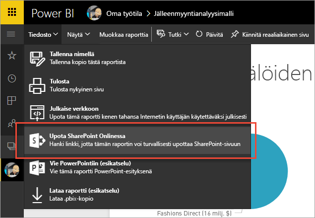

3. Kopioi raportin URL-osoite valintaikkunasta.

    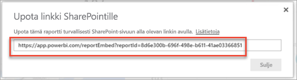

### Lisää Power BI -raportti SharePoint Online -sivuun

1. Avaa kohdesivu SharePoint Onlinessa ja valitse **Muokkaa**.

    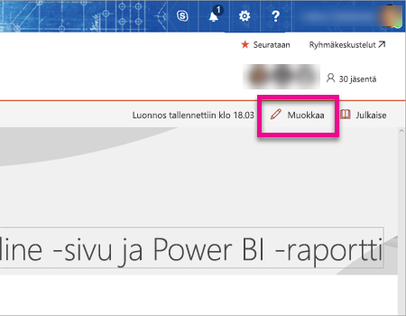

    Tai Sharepoint Onlineen, valitse **+ uusi** luoda uuden modernin sivuston sivun.

    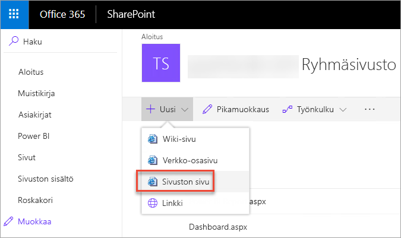

2. Valitse **+** avattava valikko ja valitse sitten **Power BI**.

    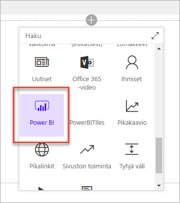

3. Valitse **Lisää raportti**.

    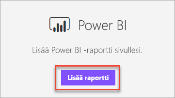  

4. Liitä aiemmin kopioitu raportin URL-osoite **Power BI-Raporttilinkki** ruudussa. Raportti latautuu automaattisesti.

    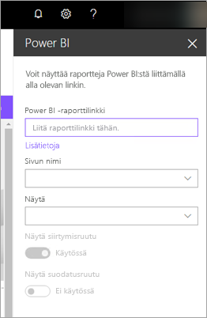

5. Valitse **Julkaise**, jotta muutos näkyy SharePoint Onlinen käyttäjille.

    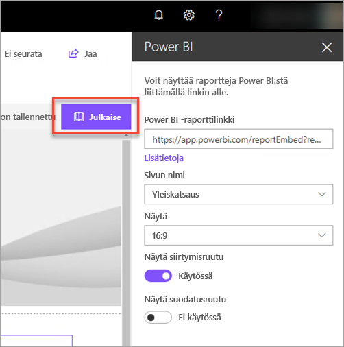

## Raporttien käyttöoikeuksien myöntäminen

Raportin upottaminen SharePoint Onlinessa ei automaattisesti antaa käyttäjille oikeuden raportin – sinun on asetettava tarkasteluoikeuksia Power BI.

> [!IMPORTANT]
> Katso Power BI -palvelussa, kuka saa nähdä raportin, ja myönnä käyttöoikeudet niille, jotka eivät ole luettelossa.

Power BI-raportin käyttöoikeuden kahdella eri tavalla. Ensimmäinen tapa, jos käytät Office 365-ryhmä SharePoint Online-työryhmäsivuston luomiseen, Lisää jäsen käyttäjä on **Power BI-palvelun sovellustyötilan** ja **SharePoint-sivuun**. Jos haluat lisätietoja, katso, miten voit [hallita sovelluksen työtilaa](service-manage-app-workspace-in-power-bi-and-office-365.md).

Toinen tapa on sovelluksen sisällä raportin upottaminen ja jakaa sen suoraan käyttäjien kanssa:  

1. Tekijä (on oltava Pro-käyttäjä) luo raportin sovelluksen työtilassa. Jakaminen **Power BI: n maksuttoman version käyttäjien**, sovelluksen työtilan on asetettava **Premium-työtila**.

2. Tekijä julkaisee sovelluksen ja asentaa sen. Tekijä on varmistaa, että asennat sovelluksen käyttöoikeudet raportin URL-osoite, jota käytetään upottaminen SharePoint Onlineen.

3. Kaikkien loppukäyttäjien on myös nyt asennettava sovellus. Voit myös käyttää **Asenna sovellus automaattisesti** toiminto, jonka haluat ottaa [Power BI-hallintaportaalissa](service-admin-portal.md), joka on asennettu valmiiksi käyttäjille sovelluksen.

   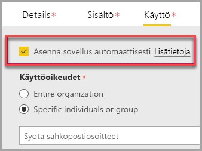

4. Laatija avaa sovelluksen ja siirtyy raporttiin.

5. Tekijä Kopioi raportti sovellus asennettuna Upota raportin URL-osoite. **Älä käytä alkuperäisen raportin URL-osoite sovelluksen työtilasta.**

6. Luo uusi työryhmäsivusto SharePoint Onlinessa.

7. Lisää Power BI-verkko-osa aiemmin kopioitu raportin URL-osoite.

8. Lisää kaikki loppukäyttäjät ja/tai ryhmät, jotka käyttävät tietoja SharePoint Online -sivulla ja Power BI -sovelluksessa, jonka olet luonut.

    > [!NOTE]
    > **Käyttäjien tai ryhmien on saatava käyttöoikeus sekä SharePoint Online -sivulle että Power BI -sovellukseen, jotta ne näkevät raportin SharePoint-sivulla.**

Loppukäyttäjä voi nyt siirtyä työryhmäsivustolle SharePoint Onlinessa ja tarkastella raportteja sivulla.

## Monimenetelmäinen todentaminen

Jos Power BI -ympäristösi edellyttää kirjautumista monimenetelmäistä todentamista käyttäen, sinua voidaan pyytää kirjautumaan suojauslaitteelta henkilöllisyytesi varmistamiseksi. Näin tapahtuu, jos ei Kirjaudu sisään SharePoint Onlineen käyttäen monimenetelmäistä todentamista, mutta Power BI-ympäristösi edellyttää suojauslaitetta vahvistaminen tiliä.

> [!NOTE]
> Azure Active Directory 2.0 ei tue multi-factor authentication-palvelun - käyttäjät näkevät virhesanoman. Jos käyttäjä kirjautuu uudelleen SharePoint Onlineen suojauslaitetta käyttäen, hän saattaa nähdä raportin.

## Verkko-osan asetukset

Alla ovat käytettävissä, voit säätää Power BI-verkko-osan SharePoint Onlineen.

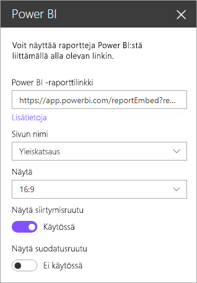

| Ominaisuus | Kuvaus |
| --- | --- |
| Sivun nimi |Määrittää verkko-osa sivun. Valitse arvo avattavasta luettelosta. Jos sivuja ei näy, raportissasi on vain yksi sivu tai liittämäsi URL-osoite sisältää sivun nimen. Valitse tietty sivu poistamalla raporttiosa URL-osoitteesta. |
| Näytä |Määrittää, miten raportti mahtuu SharePoint Online-sivulle. |
| Näytä siirtymisruutu |Näyttää tai piilottaa sivun siirtymisruudun. |
| Näytä suodatusruutu |Näyttää tai piilottaa suodatusruudun. |

## Raportit, joiden lataaminen ei onnistu

Jos raportti ei lataudu Power BI-verkko-osa, saatat nähdä seuraavan sanoman:

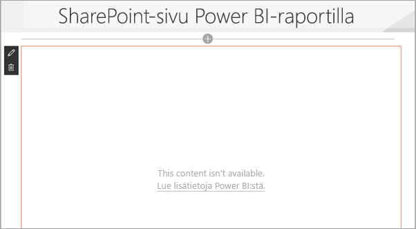

Tähän viestiin on kaksi yleistä syytä.

1. Sinulla ei ole raportin käyttöoikeudet.
2. Raportti on poistettu.

Omistajalta SharePoint Onlinen sivun ratkaisemaan ongelman.

## Käyttöoikeudet

Raporttia SharePointissa tarkastelevat käyttäjät tarvitsevat **Power BI Pro -käyttöoikeuden** tai sisällön on oltava työtilassa, joka on **[Power BI Premium -kapasiteetissa (EM- tai P-varastointiyksikkö)](service-admin-premium-purchase.md)** .

## Tunnetut ongelmat ja rajoitukset

* Virhe: ”Ilmeni virhe, kirjaudu ulos ja uudelleen sisään ja yritä avata tämä sivu uudelleen. Korrelaatiotunnus: määrittämätön, http-vastauksen tila: 400, palvelimen virhekoodi 10001, viesti: Päivitystunnus puuttuu”
  
  Jos saat tämän virheviestin, kokeile alla olevia vianmääritysohjeita.
  
  1. Kirjaudu ulos SharePointista ja kirjaudu uudelleen sisään. Muista sulkea kaikki selainikkunat, ennen kuin kirjaudut uudelleen sisään.

  2. Jos käyttäjätilisi edellyttää monimenetelmäisen todennuksen (MFA), kirjaudu sisään SharePointiin MFA laitteesi (esimerkiksi puhelinsovellus, älykortin) käyttämistä.
  
  3. Azuren B2B -vieraiden käyttäjätilejä ei tueta. Käyttäjät näkevät Power BI -logon, joka näyttää osan latautuvan, mutta raporttia ei näytetä.

* Power BI ei tue samoja lokalisoituja kieliä kuin SharePoint Online. Sen vuoksi et välttämättä näe oikeaa lokalisointia upotetussa raportissa.

* Ongelmia saattaa ilmetä, jos käytät Internet Explorer 10:tä. Voit tarkastella [Power BI:n](consumer/end-user-browsers.md) ja [Office 365:n](https://products.office.com/office-system-requirements#Browsers-section) tuettuja selaimia.

* Power BI -verkko-osa ei ole käytettävissä [kansallisissa pilvipalveluissa](https://powerbi.microsoft.com/clouds/).

* Perinteistä SharePoint-palvelinta ei tueta tässä verkko-osassa.

* [URL-suodattimia](service-url-filters.md) ei tueta SPO-verkko-osan kanssa.

## Seuraavat vaiheet

* [Modernin sivuston sivujen luomisen salliminen tai estäminen käyttäjille](https://support.office.com/article/Allow-or-prevent-creation-of-modern-site-pages-by-end-users-c41d9cc8-c5c0-46b4-8b87-ea66abc6e63b)  
* [Sovelluksen luominen ja jakaminen Power BI:ssä](service-create-distribute-apps.md)  
* [Koontinäytön jakaminen työtovereille ja muille](service-share-dashboards.md)  
* [Mikä on Power BI Premium?](service-premium-what-is.md)
* [Raportin upottaminen turvalliseen portaaliin tai sivustoon](service-embed-secure.md)

Onko sinulla kysyttävää? [Voit esittää kysymyksiä Power BI -yhteisössä](http://community.powerbi.com/)