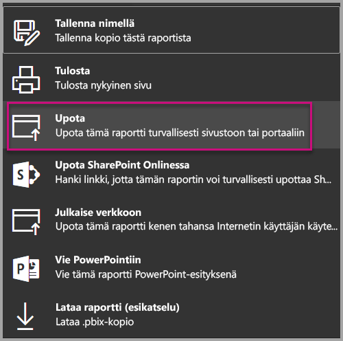
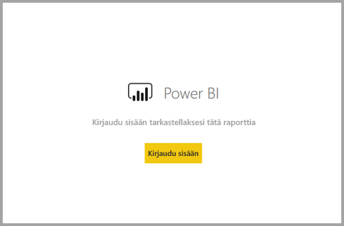
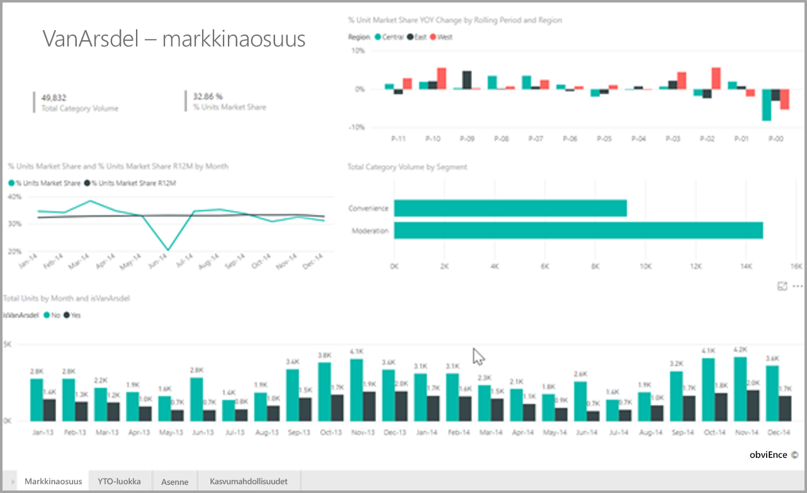

# <a name="embed-a-report-in-a-secure-portal-or-website"></a>Raportin upottaminen turvalliseen portaaliin tai sivustoon

Uuden Power BI -raporttien **Upotus**-ominaisuuden avulla voit antaa käyttäjille mahdollisuuden upottaa raportteja sisäisiin verkkoportaaleihin helposti ja turvallisesti. Nämä portaalit voivat olla **pilvipohjaisia** tai **isännöityjä paikallisesti**, kuten SharePoint 2019. Upotettuihin raportteihin sovelletaan kaikkia kohteille asetettuja käyttöoikeuksia ja tietosuojamenetelmiä [RLS:n (row-level security, rivitason suojaus)](service-admin-rls.md) avulla. Nämä mahdollistaa upottamisen ilman koodausta kaikkiin portaaleihin, jotka hyväksyvät upottamisen URL-osoitteen tai iFramen avulla. 

**Upota**-asetus tukee [URL-suodattimia](service-url-filters.md) ja URL-asetuksia. Voit integroida sisältöä portaaleihin ilman työlästä koodausta: perustiedot HTML:stä ja JavaScriptista riittävät.

## <a name="how-to-embed-power-bi-reports-into-portals"></a>Power BI -raporttien **upottaminen** portaaleihin

1. Uusi **Upota**-vaihtoehto näkyy kaikkien Power BI -palvelussa olevien raporttien **Tiedosto**-valikossa.

    

2. Valitse **Upota**-vaihtoehto. Näkyviin tulee valintaikkuna, jossa on linkki sekä iFrame, jota käytetään raportin turvalliseen upottamiseen.

    

3. Jos käyttäjä avaa raportin URL-osoitteen suoraan tai yhden verkkoportaaliin upotetun, raportin käyttö edellyttää todentamista. Seuraava näyttö tulee näkyviin, jos käyttäjä ei ole kirjautunut sisään Power BI:hin selainistunnossa. Kun käyttäjä napsauttaa **Kirjaudu sisään** -vaihtoehtoa, järjestelmä saattaa avata uuden selainikkunan tai -välilehden. Jos he eivät saa sisäänkirjautumiskehotetta, pyydä heitä tarkistamaan, onko ponnahdusikkunat estetty.

    

4. Kun käyttäjä on kirjautunut sisään, raportti aukeaa ja sen tiedot tulevat näkyviin ja voidaan siirtyä sivujen välillä ja määrittää suodattimia. Vain käyttäjät, joilla on tarkasteluoikeudet, näkevät raportin Power BI:ssä. Myös kaikkia [RLS](service-admin-rls.md)-sääntöjä sovelletaan. Lisäksi käyttäjällä täytyy olla riittävät tuotekäyttöoikeudet: raportin tarkasteluun tarvitaan Power BI Pro -käyttöoikeus, tai raportin on vaihtoehtoisesti oltava sellaisessa työtilassa, joka kuuluu Power BI Premium -kapasiteettiin. Käyttäjän on kirjauduttava sisään aina, kun hän avaa uuden selainikkunan. Kun olet kirjautunut sisään, muut raportit ladataan kuitenkin automaattisesti.

    

5. Kun käytät iFramea, sinun on ehkä muokattava **korkeutta** ja **leveyttä**, jotta se mahtuisi portaalin verkkosivulle.

    

## <a name="granting-report-access"></a>Raportin käyttöoikeuksien myöntäminen

**Upota**-asetus ei automaattisesti salli käyttäjien tarkastella raporttia. Käyttöoikeuksien näyttäminen on määritetty Power BI -palvelussa.

Power BI -palvelussa voit jakaa upotettuja raportteja käyttäjille, jotka tarvitsevat käyttöoikeuksia. Jos käytät Office 365 -ryhmää, voit lisätä käyttäjän työtilan jäseneksi. Lisätietoja on ohjeaiheessa [Työtilan hallinta Power BI:ssä ja Office 365:ssä](service-manage-app-workspace-in-power-bi-and-office-365.md).

## <a name="licensing"></a>Käyttöoikeudet

Käyttäjät tarvitsevat upotetun raportin tarkasteluun Power BI Pro -käyttöoikeuden, tai sisällön on vaihtoehtoisesti oltava työtilassa, joka kuuluu [Power BI Premium -kapasiteettiin (EM- tai P-varastointiyksikkö)](service-admin-premium-purchase.md).

## <a name="customize-your-embed-experience-using-url-settings"></a>Upotustoiminnon mukauttaminen URL-asetusten avulla

Voit mukauttaa käyttökokemusta upotettavan URL-osoitteen syöteasetusten avulla. Voit päivittää annetun iFrame-osoitteen **src** -asetukset.

| Ominaisuus  | Kuvaus  |  |  |  |
|--------------|-----------------------------------------------------------------------------------------------------------------------------------------------------------------------------------------------------------------------|---|---|---|
| pageName  | **pageName**-kyselymerkkijonoparametrin avulla voit määrittää, minkä raportin sivun haluat avata. Tämä arvo löytyy raportin URL-osoitteen lopusta, kun raporttia tarkastellaan Power BI -palvelussa, kuten alla. |  |  |  |
| URL-suodattimet  | Voit käyttää Power BI:n käyttöliittymästä saamassasi upotus-URL-osoitteessa [URL-suodattimia](service-url-filters.md) upotetun sisällön suodattamiseen. Näin voit luoda integraatioita HTML- ja JavaScript-perusosaamisella ilman työlästä koodaamista.  |  |  |  |

## <a name="set-which-page-opens-for-an-embedded-report"></a>Upotetun raportin avaavan sivun valitseminen 

**pageName**-arvo löytyy raportin URL-osoitteen lopusta, kun raporttia tarkastellaan Power BI -palvelussa.

1. Avaa raportti Power BI -palvelusta selaimeen ja kopioi URL-osoite osoitepalkista.

    

2. Liitä **pageName**-asetus URL-osoitteeseen.

    

## <a name="filter-report-content-using-url-filters"></a>Raportin sisällön suodattaminen URL-suodattimien avulla 

Voit käyttää [URL-suodattimia](service-url-filters.md) eri raporttinäkymien tarjoamiseen. Esimerkiksi alla oleva URL-osoite suodattaa raportin näyttämään energiateollisuutta koskevat tiedot.

**pageName**-asetuksen ja [URL-suodattimien](service-url-filters.md) yhteiskäyttö voi olla tehokasta. Voit luoda käyttötilanteita HTML- ja JavaScript-perustaidoilla.

Voit esimerkiksi lisätä tämän painikkeen HTML-sivuun:

```html
<button class="textLarge" onclick='show("ReportSection", "Energy");' style="display: inline-block;">Show Energy</button>
```

Valittuna painike kutsuu funktion, joka päivittää iFramen päivitetyllä URL-osoitteella, joka sisältää suodattimen energiateollisuuden tiedoille.

```javascript
function show(pageName, filterValue)

{

var newUrl = baseUrl + "&pageName=" + pageName;

if(null != filterValue && "" != filterValue)

{

newUrl += "&$filter=Industries/Industry eq '" + filterValue + "'";

}

//Assumes there’s an iFrame on the page with id=”iFrame”

var report = document.getElementById("iFrame")

report.src = newUrl;

}
```


Voit luoda mukautetun ja helposti koodattavan käyttökokemuksen lisäämällä erilaisia painikkeita. 

## <a name="considerations-and-limitations"></a>Huomioitavat asiat ja rajoitukset

* Sivutettuja raportteja tuetaan turvatuissa upotustilanteissa, ja myös URL-parametreja sisältäviä sivutettuja raportteja tuetaan. Lue lisää [raporttiparametrien välittämisestä sivutettuun raporttiin URL-osoitteessa](report-builder-url-pass-parameters.md).

* Ulkoisia käyttäjiä ei tueta yritystenvälisen yhteistyön (B2B) Azure-ratkaisuissa.

* Turvallinen upotus toimii Power BI -palvelussa julkaistuissa raporteissa.

* Käyttäjän on kirjauduttava sisään raportin tarkastelua varten aina, kun hän avaa uuden selainikkunan.

* Osa selaimista edellyttää sivun päivittämistä kirjautumisen jälkeen, erityisesti käytettäessä InPrivate- tai Incognito-tilaa.

* Saatat kohdata ongelmia, jos käytät selainversiota, jota ei tueta. Power BI tukee [seuraavia selaimia](power-bi-browsers.md).

* Perinteistä SharePoint-palvelinta ei tueta, koska se edellyttää Internet Explorer 11:tä aiempaa versiota tai yhteensopivuusnäkymätilan käyttöönottoa.

* Voit luoda kertakirjautumisella toimivan käyttökokemuksen [Upota SharePoint Onlineen -vaihtoehdon](service-embed-report-spo.md) avulla tai luomalla mukautetun integraation [käyttäjä omistaa tiedot](developer/embed-sample-for-your-organization.md) -upotusmenetelmällä. 

* **Upota**-vaihtoehdon tarjoama automaattisen todentamisen mahdollisuus ei toimi Power BI:n JavaScript-ohjelmointirajapinnan kanssa. Jos käytät Power BI:n JavaScript-ohjelmointirajapintaa, käytä upotuksessa [käyttäjä omistaa tiedot](developer/embed-sample-for-your-organization.md) -menetelmää. 

* Todennustunnuksen elinkaarta hallitaan AAD-asetusten mukaan. Kun todennustunnus vanhenee, käyttäjän on päivitettävä selain, jotta saat päivitetyn todennustunnuksen. Oletuselinikä on yksi tunti, mutta se voi olla lyhyempi tai pidempi organisaatiossasi.

## <a name="next-steps"></a>Seuraavat vaiheet

* [Töiden jakamistavat Power BI:ssä](service-how-to-collaborate-distribute-dashboards-reports.md)

* [Raportin suodattaminen URL-osoitteen kyselymerkkijonoparametrien avulla](service-url-filters.md)

* [Upota raportin verkko-osa SharePoint Onlinessa](service-embed-report-spo.md)

* [Power BI:n Julkaise verkkoon -toiminto](service-publish-to-web.md)
