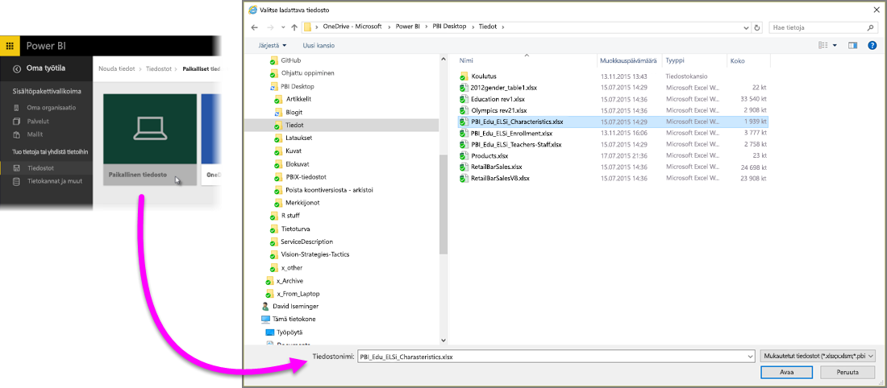
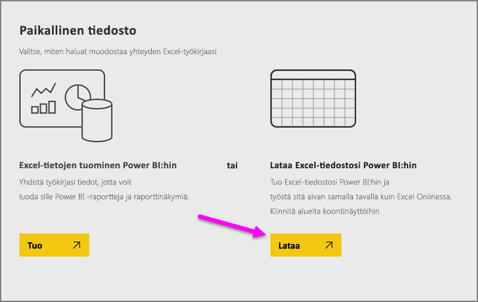
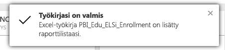
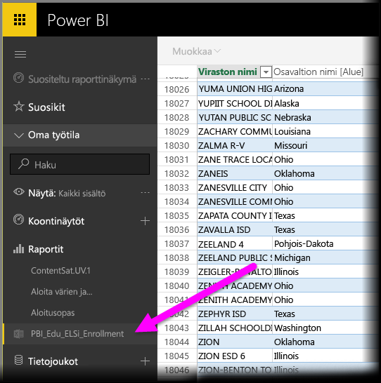

# Tietojen noutaminen Excel-työkirjatiedostoista

Microsoft Excel on yksi laajimmin käytetyistä yrityssovelluksista. Se on myös yksi yleisimmistä tavoista saada tietosi Power BI:hin.

## Minkä tyyppisiä työkirjoja Power BI tukee?
Power BI tukee Excel 2007:ssä ja uudemmissa versioissa luotujen työkirjojen tuomista ja niihin yhdistämistä. Työkirjat on tallennettava .xlsx- tai .xlsm-tiedostotyyppinä, ja niiden on oltava kooltaan alle 1 Gt. Osa tässä artikkelissa kuvatuista ominaisuuksista on käytettävissä vain Excelin uudemmissa versioissa.

### Tietojoukkoja tai -taulukoita sisältävät työkirjat
Jos työkirjassa on tietojoukkoja sisältäviä yksinkertaisia laskentataulukoita, muotoile tietojoukot taulukoiksi, jotta saat niistä kaiken hyödyn irti Power BI:ssä. Tällöin luodessasi raportteja Power BI:ssä näet Kentät-ruudussa nimettyjä taulukoita ja sarakkeita, mikä helpottaa tietojen visualisointia huomattavasti.

### Tietomalleja sisältävät työkirjat
Työkirja voi sisältää tietomallin, johon on ladattu yksi tai useampi tietotaulukko käyttämällä linkitettyjä taulukoita, Power Queryä (Hae ja muunna Excel 2016:ssa) tai Power Pivotia. Power BI tukee kaikkia tietomallin ominaisuuksia, kuten suhteita, mittayksiköitä, hierarkioita ja suorituskykyilmaisimia.

> [!NOTE]
> Tietomalleja sisältäviä työkirjoja ei voi jakaa Power BI -vuokraajien kesken. Esimerkiksi käyttäjä, joka kirjautuu sisään Power BI:hin *contoso.com*-tilillä, ei voi jakaa Excel-työkirjaa sellaisen käyttäjän kanssa, joka kirjautuu sisään käyttämällä Power BI -kirjautumistiliä kohteesta *woodgrovebank.com*.
> 
> 

### Ulkoisiin tietolähteisiin yhteyksiä sisältävät työkirjat
Jos muodostat yhteyden ulkoiseen tietolähteeseen Excelin avulla, sen jälkeen kun työkirjasi on Power BI:ssä voit luoda raportteja ja raporttinäkymiä kyseisen yhdistetyn tietolähteen tietojen perusteella. Voit myös määrittää ajoitetun päivityksen muodostamaan yhteyden automaattisesti suoraan tietolähteeseen ja saada päivitykset. Sinun ei enää tarvitse päivittää manuaalisesti Excelin Tiedot-valintanauhasta. Kaikki raporttien ja raporttinäkymien ruutujen visualisoinnit, jotka perustuvat kyseisestä tietolähteestä peräisin oleviin tietoihin, päivitetään automaattisesti. Lue lisää artikkelista [Tietojen päivittäminen Power BI:ssä](refresh-data.md).

### Power View -taulukoita, pivot-taulukoita ja kaavioita sisältävät työkirjat
PowerView-taulukoiden, pivot-taulukoiden ja kaavioiden näkyminen Power BI:ssä riippuu siitä, minne työkirjatiedosto on tallennettu ja miten saat sen Power BI:hin. Lisätietoja tästä on alla.

## Tietotyypit
Power BI tukee seuraavia tietotyyppejä: kokonaisluku, desimaaliluku, valuutta, päivämäärä, tosi/epätosi, teksti. Tietojen merkitseminen tietyiksi tietotyypeiksi Excelissä parantaa Power BI -kokemusta.

## Työkirjan valmisteleminen Power BI:tä varten
Tässä videossa on hyödyllisiä lisätietoja siitä, miten voit varmistaa, että Excel-työkirjasi ovat valmiita Power BI:hin.

<iframe width="500" height="281" src="https://www.youtube.com/embed/l2wy4XgQIu0" frameborder="0" allowfullscreen></iframe>

## Työkirjatiedoston tallennuspaikalla on merkitystä
**Paikallinen** – Jos tallennat työkirjatiedoston tietokoneesi paikalliseen asemaan tai muuhun organisaatiosi sijaintiin voit ladata tiedostosi Power BI:hin Power BI:n kautta. Todellisuudessa tiedosto säilyy paikallisessa asemassa, joten koko tiedostoa ei varsinaisesti tuoda Power BI:hin. Käytännössä Power BI:hin luodaan uusi tietojoukko, johon työkirjan tiedot ja mahdollinen tietomalli ladataan. Jos työkirjassa on Power View -taulukoita, ne näkyvät Power BI -sivuston Raportit-kohdassa. Excel 2016:ssa on myös **Julkaise**-ominaisuus (**Tiedosto**-valikossa). **Julkaise**-ominaisuus toimii käytännössä samalla tavoin kuin **Nouda tiedot > Tiedostot > Paikallinen tiedosto** Power BI:ssä, mutta usein on helpompaa päivittää tietojoukko Power BI:ssä, jos teet työkirjaan säännöllisesti muutoksia.

**OneDrive – yritys** – Ehdottomasti tehokkain tapa, jolla voit pitää Excel-työsi ja Power BI:n tietojoukon, raportit ja raporttinäkymät synkronoituina, on käyttää OneDrive for Businessia ja kirjautua siihen sisään samalla tilillä kuin Power BI:hinkin. Koska sekä Power BI että OneDrive toimivat pilvipalvelussa, Power BI *muodostaa yhteyden* OneDrivessa sijaitsevaan työkirjatiedostoon noin tunnin välein. Jos muutoksia löytyy, Power BI:n tietojoukko, raportit ja raporttinäkymät päivitetään automaattisesti. Samaan tapaan kuin paikalliseen asemaan tallennetun työkirjan kohdalla voit päivittää Power BI:n tietojoukon ja raportit heti Julkaise-ominaisuuden avulla. Muussa tapauksessa Power BI synkronoi automaattisesti, yleensä tunnin kuluessa.

**OneDrive – henkilökohtainen** – Jos tallennat työkirjatiedostot henkilökohtaiseen OneDrive-tiliisi, saat monia samoja etuja kuin käyttäessäsi OneDrive for Businessia. Suurin ero on, että sinun on kirjauduttava sisään OneDriveen käyttämällä Microsoft-tiliäsi, kun muodostat ensimmäisen kerran yhteyden tiedostoon (Nouda tiedot > Tiedostot > OneDrive - henkilökohtainen). Yleensä Microsoft-tili on eri kuin tili, jota käytetään Power BI:hin kirjautumiseen. Kun kirjaudut sisään OneDriveen käyttämällä Microsoft-tiliäsi, muista valita Pidä minut sisäänkirjautuneena -asetus. Näin Power BI voi muodostaa yhteyden työkirjatiedostoon noin tunnin välein ja varmistaa, että Power BI:n tietojoukko ja raportit on synkronoitu.

**SharePoint-työryhmäsivustot** – Power BI Desktop -tiedostojen tallentaminen SharePoint-työryhmäsivustoihin tapahtuu lähes samoin kuin tallentaminen OneDrive for Businessiin. Suurin ero on siinä, miten yhteys Power BI:stä tiedostoon muodostetaan. Voit määrittää URL-osoitteen tai muodostaa yhteyden pääkansioon.

## Yksi Excel-työkirja, kaksi käyttötapaa
Jos tallennat työkirjatiedostot **OneDriveen**, voit tarkastella tietojasi Power BI:ssä parilla tapaa

### Excel-tietojen tuominen Power BI:hin
Kun valitset **Tuo**, taulukoissa ja/tai tietomallissa tuetut tiedot tuodaan uuteen tietojoukkoon Power BI:ssä. Jos sinulla on Power View -taulukoita, ne luodaan uudelleen Power BI:ssä raportteina.

Voit jatkaa työkirjan muokkaamista. Kun tekemäsi muutokset tallennetaan, ne synkronoidaan Power BI:n tietojoukon kanssa yleensä tunnin kuluessa. Jos tarvitset tuloksia nopeammin, voit valita Julkaise uudelleen, jolloin muutokset viedään heti. Myös raporteissa ja raporttinäkymissä olevat visualisoinnit päivitetään.

Valitse tämä vaihtoehto, jos olet ladannut tiedot tietomalliin Hae ja muunna -ominaisuuden tai Power Pivotin avulla tai jos työkirjassa on visualisointeja sisältäviä Power View -taulukoita, jotka haluat nähdä Power BI:ssä.

Excel 2016:ssa voit valita myös Julkaise > Vie. Se on suunnilleen sama asia. Lue lisää artikkelista [Julkaiseminen Power BI:stä Excel 2016:een](service-publish-from-excel.md).

### Excel-tietojen yhdistäminen, hallitseminen ja näyttäminen Power BI:ssä
Kun valitset **Yhdistä**, työkirjasi näkyy Power BI:ssä aivan samalla tavalla kuin se näkyisi Excel Onlinessa. Mutta toisin kuin Excel Onlinessa, käytettävissäsi on käteviä ominaisuuksia, joilla voit kiinnittää laskentataulukoiden elementtejä suoraan raporttinäkymiin.

Työkirjaa ei voi muokata Power BI:ssä. Jos muutoksia on tehtävä, voit valita Muokkaa-vaihtoehdon ja sitten työkirjan muokkaamisen joko Excel Onlinessa tai tietokoneesi Excelissä. Tekemäsi muutokset tallennetaan työkirjaan OneDrivessa.

Kun valitaan tämä tapa, Power BI:ssä ei luoda tietojoukkoa. Työkirja näkyy Power BI -työtilan siirtymisruudussa Raportit-kohdassa. Yhdistetyissä työkirjoissa on erityinen Excel-kuvake.

Valitse tämä vaihtoehto, jos sinulla on vain tietoja laskentataulukoissa tai tietojoukkoja, pivot-taulukoita ja kaavioita, jotka haluat kiinnittää raporttinäkymiin.

Voit valita Excel 2016:ssa myös Julkaise > Lataa. Se on suunnilleen sama asia. Lue lisää artikkelista [Julkaiseminen Power BI:stä Excel 2016:een](service-publish-from-excel.md).

## Excel-työkirjan tuominen tai yhteyden muodostaminen siihen Power BI:stä
1. Valitse Power BI:n siirtymisruudussa **Nouda tiedot**.
   
   
2. Valitse Tiedostot-kohdassa **Nouda**.
   
   
3. Etsi tiedosto.
   
   
4. Jos työkirjatiedosto on OneDrivessa tai SharePoint – työryhmäsivustoissa, valitse **Tuo** tai **Yhdistä**.

## Paikalliset Excel-työkirjat
Voit myös käyttää paikallista Excel-tiedostoa ja ladata sen Power BI:hin. Valitse **Paikallinen tiedosto** edellisessä valikossa ja siirry Excel-työkirjojesi tallennuspaikkaan.

Kun asetus on valittu, lataa tiedosto Power BI:hin.

Kun työkirja on ladattu, saat ilmoituksen siitä, että työkirja on valmis.

Kun työkirja on valmis, löydät sen Power BI:n **Raportit**-osasta.

## Julkaiseminen Excel 2016:sta Power BI -sivustoon
Excel 2016:n **Julkaise Power BI:hin** -ominaisuutta käytetään käytännössä samaan tapaan kuin Power BI:n **Nouda tiedot** -ominaisuutta tiedoston tuomiseen tai yhteyden muodostamiseen siihen. Aihetta ei käydä tarkemmin läpi tässä, mutta voit lukea lisää artikkelista [Julkaiseminen Power BI:stä Excel 2016:een](service-publish-from-excel.md).

## Vianmääritys
Onko työkirjatiedosto liian suuri? Tutustu artikkeliin [Excel-työkirjan koon pienentäminen Power BI:ssä tarkastelu varten](reduce-the-size-of-an-excel-workbook.md).

Tällä hetkellä kun valitset Tuo-vaihtoehdon, Power BI tuo vain tiedot, jotka kuuluvat nimettyyn taulukkoon tai tietomalliin. Tällöin jos työkirja sisältää nimettömiä taulukoita, Power View -taulukoita tai Excel-tietomalleja, saatat nähdä tämän virheen: **Excel-työkirjasta ei löydy mitään tietoja**. [Tässä artikkelissa](service-admin-troubleshoot-excel-workbook-data.md) kerrotaan, miten voit korjata työkirjan ja tuoda sen uudelleen.

## Seuraavat vaiheet
**Tutki tietoja** – Kun olet noutanut tiedot ja raportit tiedostosta Power BI:hin, on aika tutkia niitä. Napsauta hiiren kakkospainikkeella uutta tietojoukkoa ja valitse sitten Tutki. Jos valitsit yhteyden muodostamisen työkirjatiedostoon OneDrivessa vaiheessa 4, työkirja näkyy Raportit-kohdassa. Kun napsautat sitä, se avautuu Power BI:ssä samaan tapaan kuin Excel Onlinessa.

**Ajoita päivitys** – Jos Excel-työkirjatiedosto on yhdistetty ulkoisiin tietolähteisiin, tai olet tuonut paikallisesta asemasta, voit määrittää ajoitetun päivityksen sen varmistamiseksi, että tietojoukko tai raportti on aina ajan tasalla. Useimmiten ajoitetun päivityksen määrittäminen on varsin helppoa, mutta tämä artikkeli ei sisällä tarkkoja ohjeita. Lue lisää artikkelista [Tietojen päivittäminen Power BI:ssä](refresh-data.md).

[Julkaiseminen Excel 2016:sta Power BI:hin](service-publish-from-excel.md)

[Power BI Publisher for Excel](publisher-for-excel.md)

[Tietojen päivittäminen Power BI:ssä](refresh-data.md)

