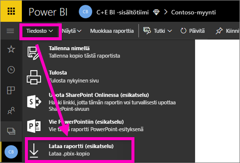
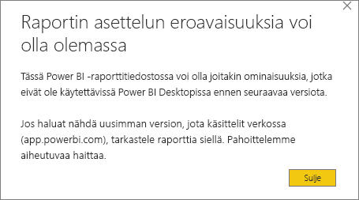
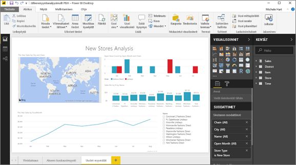

# Raportin vieminen Power BI -palvelusta työasemaan (esikatselu)
Voit viedä (tai *ladata*) Power BI Desktopissa raportin Power BI -palveluun tallentamalla raportti ja valitsemalla **Julkaise**. Voit myös viedä toiseen suuntaan ja ladata raportin Power BI -palvelusta työpöydälle. Vietävien tiedostojen tiedostopääte kumpaankin suuntaan on *.pbix*.

Tähän liittyy tiettyjä rajoituksia ja huomioitavia asioita, joita käsitellään tuonnempana tässä artikkelista.

## Lataa raportti .pbix-muodossa
Lataa .pbix-tiedosto toimimalla seuraavasti:

1. Avaa **Power BI-palvelussa** raportti, jonka haluat ladata [muokkausnäkymässä](consumer/end-user-reading-view.md).
2. Valitse valikkorivistä **Tiedosto > Lataa raportti**.
   
   > [!NOTE]
   > Raportti on [luotava käyttäen Power BI Desktopia](guided-learning/publishingandsharing.yml?tutorial-step=2) marraskuun 23. 2016 ja sen jälkeen tehdyissä päivityksissä raportin lataamiseksi. Jos näin ei ole, *Lataa raportti* -valikkovaihtoehto Power BI-palvelussa näkyy harmaana.
   > 
   > 
3. Kun .pbix-tiedostoa luodaan, edistyminen näkyy tilapalkissa. Kun tiedosto on valmis, sinua pyydetään avaamaan tai tallentamaan .pbix-tiedosto. Tiedoston nimi vastaa raportin otsikkoa.
   
    
   
    Voit nyt halutessasi avata .pbix-tiedoston Power BI -palvelussa (app.powerbi.com) tai Power BI Desktopissa.     
4. Avaa raportti työpöydällä heti valitsemalla **Avaa**. Jos haluat tallentaa tiedoston tiettyyn sijaintiin, valitse **Tallenna > Tallenna nimellä**. Jos et ole vielä tehnyt sitä, [asenna Power BI Desktop](desktop-get-the-desktop.md).
   
    Kun avaat raportin Desktopissa, näet ehkä varoituksen siitä, että jotkin ominaisuudet, jotka ovat käytettävissä Power BI -palvelun raportissa, ei ole välttämättä käytettävissä Desktopissa.
   
    

5. Desktopin raporttieditori ja Power BI -palvelun raporttieditori ovat hyvin samankaltaisia.  
   
    

## Huomioon otettavat seikat ja vianmääritys
On muutamia tärkeitä huomioon otettavia seikkoja ja rajoituksia, jotka liittyvät *.pbix* tiedoston lataamiseen (vientiin) Power BI -palvelusta.

* Jotta voit ladata tiedoston, sinulla on oltava muokkausoikeus raporttiin
* Raportti on pitänyt luoda käyttäen **Power BI Desktopia** ja *julkaista* **Power BI -palveluun**, tai .pbix on pitänyt *ladata* palveluun.
* Raporttien on oltava julkaistu tai päivitetty 23. marraskuuta 2016 jälkeen. Ennen sitä julkaistut raportit eivät ole ladattavissa.
* Tämä ominaisuus ei toimi raporteissa, jotka on alun perin luotu **Power BI-palvelussa**, mukaan lukien sisältöpaketit.
* Sinun tulee aina käyttää **Power BI Desktopin** uusinta versiota, kun avaat ladattuja tiedostoja. Ladatut *.pbix*-tiedostot eivät välttämättä avaudu muissa kuin nykyisissä **Power BI Desktopin** versioissa.
* Jos järjestelmänvalvojasi on poistanut käytöstä mahdollisuuden viedä tietoja, tämä ominaisuus ei ole näkyvissä **Power BI-palvelussa**.
* Tietojoukkoa, jossa on lisäävä päivitys, ei voi ladata *.pbix*-tiedostoon.

## Seuraavat vaiheet
Näytä minuutin **Kaveri kuutiossa** -video tästä ominaisuudesta:

<iframe width="560" height="315" src="https://www.youtube.com/embed/ymWqU5jiUl0" frameborder="0" allowfullscreen></iframe>

Lisäksi seuraavassa on joitakin artikkeleita, jotka auttavat sinua käyttämään **Power BI -palvelua**:

* [Raportit Power BI:ssä](consumer/end-user-reports.md)
* [Power BI:n peruskäsitteet](consumer/end-user-basic-concepts.md)

Kun olet asentanut **Power BI Desktopin**, seuraavan sisällön avulla voit aloittaa sen käytön nopeasti:

* [Power BI Desktopin käytön aloittaminen](desktop-getting-started.md)

Onko sinulla muuta kysyttävää? [Kokeile Power BI -yhteisöä](http://community.powerbi.com/)   

