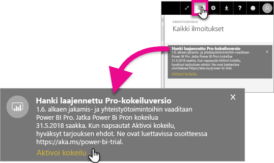
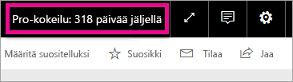

# Laajennetun Pro-kokeiluversion aktivointi
1.6.2017 lähtien kaikki oikeutetut käyttäjät voivat osallistua Power BI -palvelun laajennettuun Pro-kokeiluversioon.

<iframe width="640" height="360" src="https://www.youtube.com/embed/tPsNoPyY9aA?showinfo=0" frameborder="0" allowfullscreen></iframe>

Osana [3.5.2017 Power BI Premium -ilmoitusta](https://powerbi.microsoft.com/blog/microsoft-accelerates-modern-bi-adoption-with-power-bi-premium/) Microsoft ilmoitti maksuttoman Power BI -palvelun muutoksista, jotka astuvat voimaan 1.6.2017. Näihin muutoksiin sisältyy kaikkien tietolähteiden entistä laajempi käytettävyys, työtilan tallennusrajojen nosto ja maksuttoman palvelun päivitys- ja virtautusnopeuden nostaminen Power BI Prota vastaavaksi.

Samalla ilmoitettiin, että jakamis- ja yhteiskäyttöominaisuudet ovat vain Power BI Pro -käyttäjien käytettävissä. Näitä ominaisuuksia ovat koontinäytön vertaisjakaminen, ryhmätyötilat (uudelta nimeltään sovellustyötilat), vienti PowerPointiin ja Excel-analysointi Power BI -sovelluksilla. CSV-/Excel-tiedostoihin ja PowerPointiin viemisen ilmoitettiin 3.5. sisältyvän Power BI Pro -versioon, mutta käyttäjäyhteisön palautteen perusteella ominaisuus on päätetty tuoda myös maksuttoman version käyttäjien käyttöön.

1.6.2017 lähtien käyttäjät, jotka ovat olleet aktiivisia maksuttomassa palvelussa kuluneen vuoden aikana (tai ennen 2.5.2017) saavat 12 kuukauden laajennetun Power BI Pro -kokeiluversion ilmaiseksi. Yhteisölle kiitoksena annetun tarjouksen ansiosta käyttäjät voivat hyödyntää Power BI Pron täydellisiä ominaisuuksia ja sopeutua muutoksiin seuraavan vuoden ajan.

Oikeutetut käyttäjät saavat 1.6.2017 palveluun kirjautuessaan ilmoituksen voimaan astuneista muutoksista ja kehotteen, jonka kautta he voivat käyttää laajennetun Power BI Pro -kokeiluversion tarjouksen. Käyttäjän IT-järjestelmänvalvoja ei hallitse tuotteen sisäisiä ilmoituksia eikä voi rekisteröidä käyttäjää laajennettuun Power BI Pro -kokeiluversioon käyttäjän puolesta. Jokaisen oikeutetun käyttäjän on suoritettava toiminto erikseen.

Käyttäjä voi käyttää tarjouksen milloin tahansa sen 12 kuukauden voimassaoloaikana, mutta kaikkien käyttäjien laajennettu Pro-kokeilu päättyy 31.5.2018 riippumatta siitä, milloin tarjous käytettiin. Käyttäjillä on kyseisellä hetkellä mahdollisuus ostaa Power BI Pro. Jos käyttäjä ei osta Power BI Prota, hänet siirretään Power BI:n maksuttomaan versioon, jossa ei ole jakamis- ja yhteiskäyttöominaisuuksia.

Power BI Pro -versioon ei tehdä muutoksia. Muutoksilla ei ole vaikutusta sen käyttäjiin, eivätkä he saa ilmoituksia kirjautuessaan palveluun 1.6.2017 tai sen jälkeen. Käyttäjät, jotka hylkäävät laajennetun Power BI Pro -kokeiluversion tarjouksen tai jotka eivät ole oikeutettuja tarjoukseen käyttävät jatkossa Power BI:n maksutonta versiota, jossa ei ole jakamis- ja yhteiskäyttöominaisuuksia. Tällaiset käyttäjät voivat rekisteröityä tavallisen, 60 päivän Power BI Pro -kokeiluversion käyttäjiksi Power BI [-sivustolta](https://powerbi.microsoft.com/get-started/).

## Laajennetun Pro-kokeiluversion kelpoisuusvaatimukset
Tilisi on oikeutettu laajennetun Pro-kokeiluversion tarjoukseen, jos se täyttää seuraavat vaatimukset.

* Power BI:n maksuttoman version käyttäjät, jotka ovat aktiivisia 3.5.2016 ja 2.5.2017 välillä, ovat oikeutettuja laajennettuun Pro -kokeiluversioon.
* Käyttäjät, jotka ovat aiemmin käyttäneet tai käyttävät parhaillaan *tuotteen sisäistä 60 päivän Pro-kokeiluversiota*, ovat edelleen oikeutettuja laajennettuun Pro-kokeiluversioon.

> [!NOTE]
> Käyttäjät, joilla on Power BI Pro -tilaus tai Power BI Pro -kokeilutilaus Office 365:ssä, eivät ole oikeutettuja tähän tarjoukseen.
> 
> 

## Aktivoiminen
Laajennettu Pro-kokeiluversio voidaan aktivoida kahdella eri tavalla. Ensimmäinen tapa on Power BI:hin kirjautuessa. Jos jätät kyseisen kehotteen huomiotta, näet aktivointivaihtoehdon myös ilmoitusalueella.

> [!NOTE]
> Järjestelmänvalvoja ei hallitse tuotteen sisäisiä viestejä, vaan ne lähetetään tarjoukseen oikeutetuille käyttäjille.
> 
> 

### Aktivointi sisäänkirjauduttaessa
Jos olet oikeutettu tarjoukseen, saat ilmoituksen ponnahdusikkunassa, kun kirjaudut Power BI -palveluun. Valitse **Aloita kokeilu**, jos haluat aloittaa laajennetun Pro-kokeilun. Sinun ei tarvitse tehdä mitään muuta.

Voit tämän jälkeen käyttää kaikkia jaettuja koontinäyttöjä ja raportteja kokeilujakson ajan.

Jos valitsit **Ei nyt**, voit aktivoida laajennetun Pro-kokeiluversion milloin tahansa 31.5.2018 asti, jolloin kokeilujakso päättyy.

### Aktivointi myöhemmin
Jos hylkäsit ponnahdusikkunan valitsemalla **Ei nyt**, voit aktivoida laajennetun Pro-kokeiluversion milloin tahansa 31.5.2018 asti, jolloin kokeilujakso päättyy. Voit tehdä tämän **Ilmoituskeskuksesta**.

Näet ilmoituskeskuksessa laajennettua Pro-kokeiluversiota koskevan ilmoituksen. Ilmoitus on saatavilla, kunnes käyttäjä hylkää sen.

Voit aloittaa kokeilun valitsemalla ilmoituksesta **Aktivoi kokeilu**. Sinun ei tarvitse tehdä mitään muuta.

Voit tämän jälkeen käyttää kaikkia jaettuja koontinäyttöjä ja raportteja kokeilujakson ajan.

## Aktivoinnin jälkeen
Kun kokeilu on aktivoitu, näet jäljellä olevat kokeilupäivät oikeassa yläkulmassa.

Voit tarkistaa ehdot [laajennetun Pro-kokeiluversion käyttöehdoista](https://aka.ms/power-bi-trial). Laajennettu Pro-kokeilu on voimassa 31.5.2018 asti kaikille oikeutetuille käyttäjille.

## Usein kysyttyjä kysymyksiä
**Mitä tapahtuu uusille käyttäjille, jotka rekisteröityivät 3.5.2017 jälkeen?**

3.5.2017 ja sen jälkeen rekisteröityneet uudet Power BI:n ilmaisversion käyttäjät eivät ole oikeutettuja laajennettuun Pro-kokeiluversioon. He ovat kuitenkin oikeutettuja tavalliseen 60 päivän Pro-kokeiluversioon.

**Kuinka voin tarkistaa, ketkä organisaationi käyttäjät ovat oikeutettuja laajennettuun Pro-kokeiluversioon?**

Et voi tarkistaa tätä suoraan, mutta Azure Active Directoryn integroidut sovellukset -raportti Power BI:lle sisältää tiedon organisaatiosi käyttäjistä, jotka ovat olleet aktiivisia kuluneen 30 päivän aikana. Tästä voit saada käsityksen oikeutetuista käyttäjistä. Katso lisätiedot [Kirjautuneiden Power BI -käyttäjien etsiminen](service-admin-access-usage.md) -ohjeartikkelista.

Aktiiviset ilmaisversion käyttäjät saavat tarjoukseen oikeutettuna ajanjaksona ilmoituksen ponnahdusikkunassa. 

> [!NOTE]
> Azure AD -raportti ei ilmaise, onko käyttäjä Power BI:n maksuttoman tai Pro-version käyttäjä. Se ilmoittaa vain, ketkä käyttäjät ovat kirjautuneet Power BI:hin ja milloin he kirjautuivat sisään. Tässä raportissa mainitut käyttäjät eivät välttämättä ole oikeutettuna laajennettuun Pro-kokeiluversioon.
> 
> 

**Voivatko järjestelmänvalvojat estää käyttäjää aktivoimasta laajennettua Pro-kokeiluversiota?**

Nro Järjestelmänvalvojat eivät voi estää käyttäjiä aktivoimasta Power BI:n laajennettua Pro-kokeiluversiota tai palvelun sisäistä 60 päivän kokeiluversiota.

## Seuraavat vaiheet
[Laajennetun Pro-kokeiluversion käyttöehdot](https://aka.ms/power-bi-trial)  
[Yksittäisten käyttäjien Power BI -palvelusopimus](https://powerbi.microsoft.com/terms-of-service/)  
[Power BI Premium -ilmoitus](https://aka.ms/pbipremium-announcement)  
[Kirjautuneiden Power BI -käyttäjien etsiminen](service-admin-access-usage.md)

Ilmenikö muuta kysyttävää? [Voit esittää kysymyksiä Power BI -yhteisössä](https://community.powerbi.com/)

