# Microsoft Flow ja Power BI

[Microsoft Flow](https://flow.microsoft.com/en-us/documentation/getting-started) on SaaS:in tarjoama työnkulun automatisoimiseen tarkoitettu palvelu, joka toimii yhä useamman yrityskäyttäjän luottaman sovelluksen ja SaaS-palveluiden kanssa. Työnkulun avulla voit automatisoida tehtäviä integroimalla suosikkisovelluksesi ja -palvelusi, (Power BI mukaan lukien) saadaksesi ilmoituksia, synkronoidaksesi tiedostoja, kerätäksesi tietoja ja paljon muuta. Toistuvista tehtävistä tulee helppoja työnkulun automatisoinnin ansiosta.

[Aloita Flow’n käyttö nyt.](https://flow.microsoft.com/documentation/getting-started)

Katso, miten Sirui luo työnkulun, joka lähettää yksityiskohtaisen sähköpostin kollegoille, kun Power BI -ilmoitus käynnistyy. Kokeile sitten itse noudattamalla videon alapuolella olevia vaiheittaisia ohjeita.

<iframe width="560" height="315" src="https://www.youtube.com/embed/YhmNstC39Mw" frameborder="0" allowfullscreen></iframe>

## Power BI -tietoilmoitusten käynnistämän työnkulun luominen

### Edellytykset
Tässä opetusohjelmassa kerrotaan, miten voit luoda kaksi erilaista työnkulkua; yhden mallin pohjalta ja toisen alusta alkaen. Seuraa ohjeita ja [luo tietoilmoitusta Power BI:ssä](service-set-data-alerts.md), Luo ilmainen Slack-tili sekä [rekisteröidy Microsoft Flow’hun](https://flow.microsoft.com/en-us/#home-signup) (Se on ilmaista!).

## Power BI -mallin mukaisen työnkulun luominen
Tässä tehtävässä käytämme mallia luodaksemme yksinkertaisen työnkulun, joka käynnistyy Power BI -tietoilmoituksesta.

1. Kirjaudu sisään Microsoft Flow’hun (flow.microsoft.com).
2. Valitse **Omat työnkulut**.
   
   
3. Valitse **Luo mallista**.
   
    
4. Etsi Power BI-malleja hakuruudun avulla ja valitse **Lähetä sähköpostiviesti mille tahansa kohderyhmälle, kun Power BI-tietohälytys käynnistetään > Jatka**.
   
    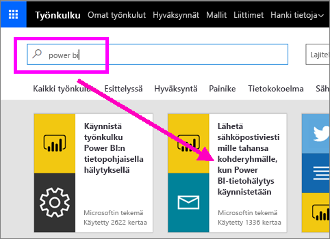

### Työnkulun muodostaminen
Tässä mallissa on yksi käynnistin (Power BI-tietohälytys Irlannin uusia olympiamitaleita varten) ja yksi toiminto (lähetä sähköpostiviesti). Valitessasi kentän, Flow näyttää siihen lisättävissä olevaa dynaamista sisältöä.  Tässä esimerkissä lisäämme ruutuarvon ja ruudun URL-osoitteen sanoman tekstiosaan.

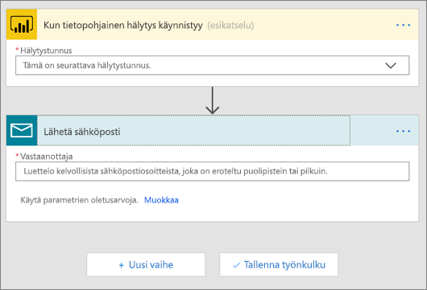

1. Valitse avattavasta valikosta käynnistimen, Power BI -tietoilmoitus. Valitse **Irlannin uudet mitalit**. Oppiaksesi luomaan ilmoituksen, katso [Tietoilmoitukset Power BI:ssä](service-set-data-alerts.md).
   
   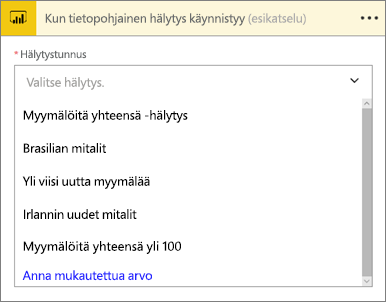
2. Syötä yksi tai useampi kelvollinen sähköpostiosoite ja valitse sitten **Muokkaa** (alla) tai **Lisää dynaamista sisältöä**. 
   
   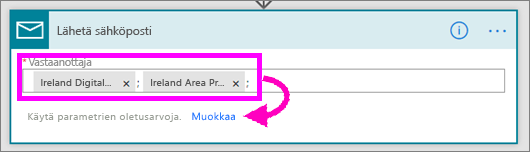

3. Flow luo otsikon ja sanoman, jotka voit säilyttää sellaisenaan tai joita voit muokata. Kaikki Power BI -ilmoitusta luotaessa syötetyt arvot ovat käytettävissäsi -- aseta vain kohdistin niiden ylle ja valitse harmaalla korostettu alue. 

   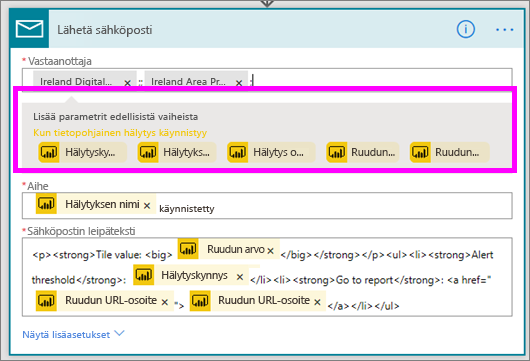

1.  Jos luot esimerkiksi Power BI -ilmoituksen otsikolla **Voitimme uuden mitalin**, voit valita **Ilmoituksen otsikko** -kohdan, lisätäksesi kyseisen tekstin sähköpostiviestin Aihe-kenttään.

    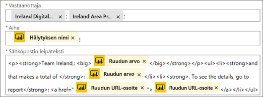

    Voit myös hyväksyä oletusarvoisen sähköpostiviestin tai luoda omasi. Yllä oleva esimerkki sisältää muutaman viestiin tehdyn muutoksen.

1. Kun olet valmis, valitse **Luo työnkulku** tai **Tallenna työnkulku**.  Työnkulku luodaan ja tarkastetaan.  Flow kertoo, jos siitä löydetään virheitä.
2. Jos virheitä löytyy, valitse **Muokkaa työnkulkua** korjataksesi ne tai valitse **Valmis** suorittaaksesi uuden työnkulun.
   
   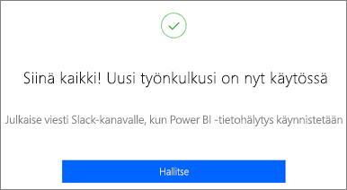
5. Kun tietoilmoitus käynnistyy, lähetetään sähköpostiviesti antamiisi osoitteisiin.  
   
   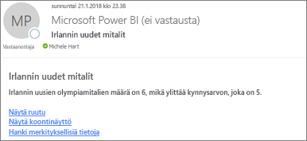

## Luo työnkulku, jota Power BI käyttää - alusta asti (tyhjä)
Seuraavaksi luomme yksinkertaisen työnkulun alusta alkaen, joka käynnistyy Power BI -tietoilmoituksella.

1. Kirjaudu sisään Microsoft Flow'hun.
2. Valitse **Omat työnkulut** > **Luo tyhjästä**.
   
   
3. Käytä hakuruutua hakeaksesi Power BI -käynnistimiä ja valitse **Power BI - tietopohjaisen ilmoituksen käynnistyminen**.

### Työnkulun luominen
1. Valitse avattavasta valikosta ilmoituksesi nimi.  Oppiaksesi luomaan ilmoituksen, katso [Tietoilmoitukset Power BI:ssä](service-set-data-alerts.md).
   
    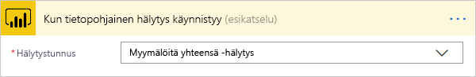
2. Valitse **Uusi vaihe** > **Lisää toiminto**.
   
   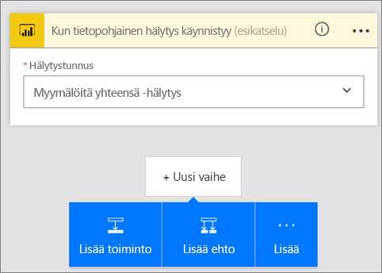
3. Syötä hakuun **Outlook** ja valitse **Luo tapahtuma**.
   
   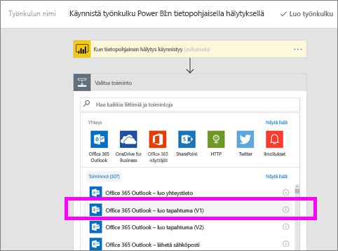
4. Täytä tapahtumakentät. Valitessasi kentän, Flow näyttää siihen lisättävissä olevaa dynaamista sisältöä.
   
   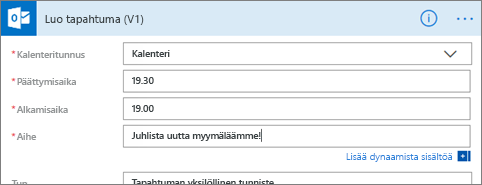
5. Valitse **Luo työnkulku** kun olet valmis.  Flow tallentaa ja tarkastaa työnkulun. Jos virheitä ei löydetä, valitse **Valmis** ja voit suorittaa tämän työnkulun.  Uusi työnkulku lisätään **Omat työnkulut** -sivulle.
   
   
6. Kun Power BI -tietoilmoitus käynnistää työnkulun, näyttöön ilmestyvä Outlook -tapahtumailmoitus näyttää suunnilleen tältä.
   
    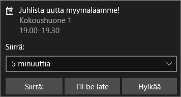

## Seuraavat vaiheet
* [Aloita Microsoft Flow’n käyttö](https://flow.microsoft.com/en-us/documentation/getting-started/)
* [Määritä Power BI -palvelun tietoilmoitukset ](service-set-data-alerts.md)
* [Määritä tietoilmoitukset iPhonellasi](mobile-set-data-alerts-in-the-mobile-apps.md)
* [Määritä tietoilmoitukset Power BI Windows 10 -mobiilisovelluksella](mobile-set-data-alerts-in-the-mobile-apps.md)
* Ilmenikö muuta kysyttävää? [Kokeile Power BI -yhteisöä](http://community.powerbi.com/)

