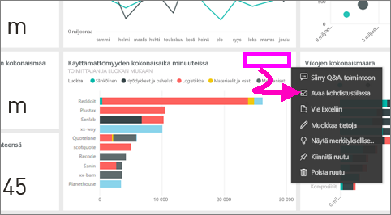
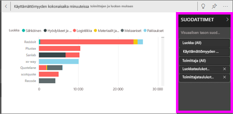
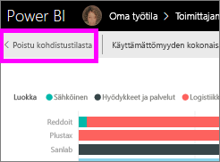
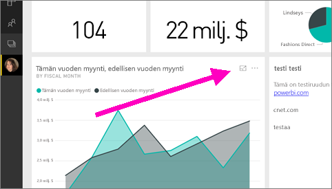
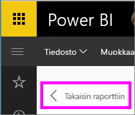

# Koontinäytön ruudun tai raporttivisualisoinnin näyttäminen kohdistustilassa
<iframe width="560" height="315" src="https://www.youtube.com/embed/dtdLul6otYE" frameborder="0" allowfullscreen></iframe>

## Mikä on kohdistustila?
***Kohdistustilan*** avulla voit laajentaa (avata ponnahdusikkunassa) koontinäytön ruudun tai raportin visualisoinnin nähdäksesi enemmän yksityiskohtia.  Kohdistustilassa voit tarkastella ja muokata tätä visualisointia luotaessa käytettyjä suodattimia.  

> [!NOTE]
> Kohdistus on erilainen kuin [koko näytön tila](service-fullscreen-mode.md).
> 
## Koontinäytön ruutujen kohdistustila
1. Pidä hiirtä ruudun visualisoinnin yllä, valitse kolme pistettä (...) ja valitse **Avaa kohdistustilassa** 

    .
   
2. Ruutu aukeaa ja täyttää koko raportin. 

   

3. Laajenna Suodattimet-ruutu nähdäksesi kaikki tähän visualisaatioon käytetyt suodattimet.
   
   

4. Jatka tutustumista muokkaamalla suodattimia, ja jos huomaat jotain kiinnostavaa, kiinnitä visualisointi raporttinäkymään.

5. Poistu kohdistustilasta ja palaa raporttinäkymään valitsemalla **< Poistu kohdistustilasta** (visualisoinnin oikeassa yläkulmassa).
   
        

## Kohdistustila raportin visualisointeja varten

1. Pidä hiirtä raportin visualisoinnin päällä ja valitse **kohdistustila**kuvake .  
   
   
2. Visualisointi aukeaa ja täyttää koko raportin. 

   
   
3. Laajenna Suodattimet-ruutu nähdäksesi kaikki tähän visualisaatioon käytetyt suodattimet.
   
   
4. Jatka tutustumista muokkaamalla suodattimia, ja jos huomaat jotain kiinnostavaa, kiinnitä visualisointi raporttinäkymään.   
5. Poistu kohdistustilasta ja palaa raporttiin valitsemalla **Takaisin raporttiin** (visualisoinnin vasemmassa yläkulmassa). 
   
      

## Kohdistustilasta koko näytön tilaan siirtyminen
Kohdistustilassa ruutua tai visualisointia voidaan [katsella koko näytön tilassa (TV-tila).](service-fullscreen-mode.md) Koko näytön tila näyttää ruudun tai visualisoinnin ilman valikoiden ja navigointipainikkeiden aiheuttamaa häiriötä.

## Huomioon otettavat seikat ja vianmääritys
* Kun käytät kohdistustilaa raportin visualisoinnissa, voit nähdä ja muokata kaikkia suodattimia: visualisointitasolla, sivutasolla ja raporttitasolla.    
* Kun käytät kohdistustilaa koontinäytön visualisoinnissa, voit nähdä ja muokata vain visualisointitason suodattimia.

Onko sinulla muuta kysyttävää? [Kokeile Power BI -yhteisöä](http://community.powerbi.com/)

