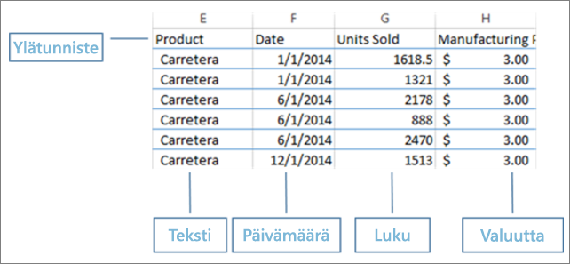
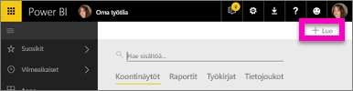
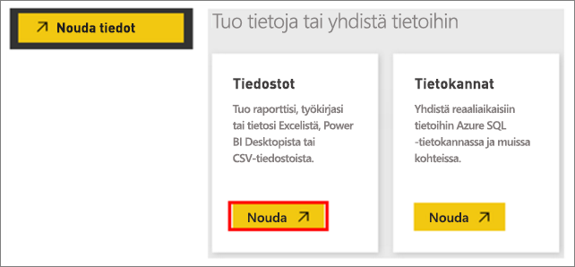
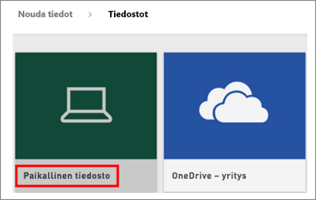
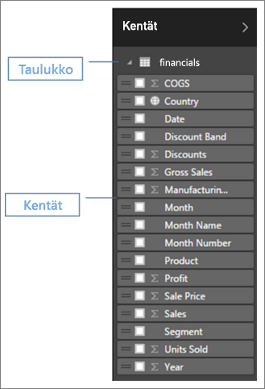
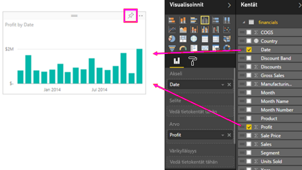
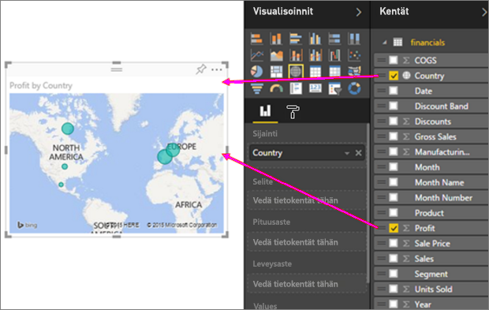
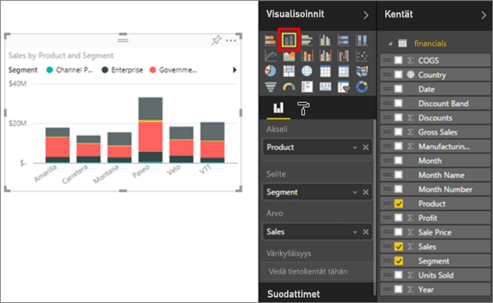
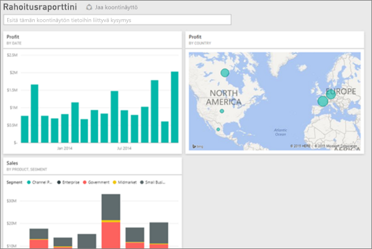
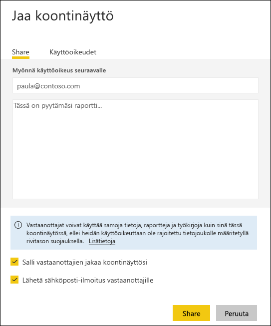

# Excel-työkirjasta upeaksi raportiksi Power BI -palvelussa
Esimiehesi haluaa raportin viimeisimmistä myyntiluvuista yhdistettynä viimeisimmän kampanjan näyttökertoihin vielä tämän päivän aikana. Uusimmat tiedot sijaitsevat kuitenkin erilaisissa kolmannen osapuolen järjestelmissä ja kannettavan tietokoneesi tiedostoissa. Aiemmin visualisointien luominen ja raportin muotoilu on vienyt tunteja. Tunnet, kuinka ahdistus alkaa vallata alaa.

Ei huolta. Power BI:llä voit luoda näyttävän raportin hetkessä.

Tässä esimerkissä lataamme Excel-tiedoston paikallisesta järjestelmästä, luomme uuden raportin ja jaamme sen työtovereille – ja teemme kaiken tämän Power BI -ohjelmassa.

## Tietojen valmistelu
Otetaan esimerkiksi yksinkertainen Excel-tiedosto. 

1. Ennen kuin voit ladata Excel-tiedostosi Power BI:hin, tiedot on järjestettävä taulukoksi, jonka ulkoasu on litteä. Litteässä taulukossa kukin sarake sisältää samaa tietotyyppiä, esimerkiksi tekstiä, päivämääriä, lukuja tai valuuttoja. Taulukossa on oltava otsikkorivi, mutta ei summia näyttäviä sarakkeita tai rivejä.

   

2. Seuraavaksi tiedot muotoillaan taulukoksi. Valitse Excelin **Aloitus**-välilehden **Tyylit**-ryhmässä **Muotoile taulukoksi**. 

3. Valitse laskentataulukossa käytettävä taulukkotyyli. 

   Excel-laskentataulukko on nyt valmis ladattavaksi Power BI:hin.

   

## Lataa Excel-tiedostosi Power BI -palveluun
Power BI -palvelu muodostaa yhteyden useisiin tietolähteisiin, kuten tietokoneessasi oleviin Excel-tiedostoihin. 

 > [!NOTE] 
 > Käytä tämän opetusohjelman loppuun suorittamisessa [Talousmalli-työkirjaa](sample-financial-download.md).

1. Aloita kirjautumalla sisään Power BI -palveluun. Jos et ole vielä rekisteröinyt, [voit tehdä sen maksutta](https://powerbi.com).

2. Haluat luoda uuden koontinäytön. Avaa **Oma työtila** ja valitse **Luo**-kuvake.

   

3. Valitse **Koontinäyttö**, kirjoita nimi ja valitse sitten **Luo**. 

   Uusi koontinäyttö tulee näkyviin ilman tietoja.

   

4. Valitse vasemman siirtymisruudun alareunasta **Nouda tiedot**. 

5. Valitse **Nouda tiedot** -sivun **Tiedostot**-ruudusta **Luo uutta sisältöä** -kohdan alta **Nouda**.

   

6. Valitse **Tiedostot**-sivulla **Paikallinen tiedosto**. Siirry tietokoneella olevan Excel-työkirjatiedoston kohdalle ja valitse se ladattavaksi Power BI -palveluun valitsemalla **Avaa**. 

   

7. Valitse **Paikallinen tiedosto** -sivulta **Tuo**.

## Raportin luominen
Kun Power BI -palvelu on tuonut Excel-tiedoston, voit aloittaa raportin luomisen. 

1. Kun näyttöön tulee **Tietojoukkosi on valmiina** -ilmoitus, valitse **Näytä tietojoukko**.  

   Power BI avautuu muokkausnäkymässä ja näyttää raporttipohjan. Oikealla puolella sijaitsevat **Visualisoinnit**-, **Suodattimet**- ja **Kentät**-ruudut. Huomaa, että Excel-työkirjan taulukkotiedot näkyvät **Kentät**-ruudussa. Power BI näyttää sarakeotsikot taulukon nimen alla yksittäisten kenttien luettelona.

   

2. Nyt voit aloittaa visualisointien luomisen. Oletetaan, että esimiehesi haluaa tarkastella tuottoa ajan mukaan. Etsi **Kentät**-ruudussa **Tuotto** ja vedä se raporttipohjaan. 

   Power BI näyttää oletusarvoisesti palkkikaavion. 

3. Vedä **Päivämäärä** raporttipohjaan. 

   Power BI päivittää palkkikaavion näyttämään tuoton päivämäärän mukaan.

   

   > [!TIP]
   > Jos kaavio ei vastaa odotuksiasi, tarkista koosteet. Voit esimerkiksi napsauttaa **Arvo**-kohdassa hiiren kakkospainikkeella juuri lisäämääsi kenttää ja varmistaa, että tiedot on koostettu haluamallasi tavalla. Tässä esimerkissä käytetään **Summaa**.
   > 

Esimiehesi haluaa tietää, mitkä maat tuottavat eniten voittoa. Tee häneen vaikutus karttavisualisoinnilla. 

1. Valitse tyhjä alue raporttipohjassa. 

2. Vedä **Kentät**-ruudusta **Maa**- ja **Tuotto**-kentät raporttipohjaan.

   Power BI luo karttavisualisoinnin, jonka kuplat edustavat kunkin sijainnin suhteellista tuottoa.

   

Entäpä visualisointi, joka kuvaa myyntiä tuotteittain ja markkinasegmenteittäin? Helppoa. 

1. Valitse **Kentät**-ruudussa **Myynti**-, **Tuote**- ja **Segmentti**-kentät. 
   
   Power BI luo palkkikaavion välittömästi. 

2. Voit muuttaa kaaviotyyppiä valitsemalla haluamasi kuvakkeen **Visualisoinnit**-valikosta. Voit esimerkiksi muuttaa kaavion **pinotuksi pylväskaavioksi**. 

3. Jos haluat lajitella kaavion, valitse **Enemmän vaihtoehtoja** (...) > **Lajitteluperuste**.

   

Kiinnitä kaikki visualisoinnit koontinäyttöön. Nyt voit jakaa sen työtovereillesi.

   

## Koontinäytön jakaminen
Oletetaan, että haluat jakaa koontinäytön esimiehellesi. Voit jakaa koontinäytön ja siihen liittyvän raportin kenelle tahansa työtoverillesi, jolla on Power BI -tili. Työtoverisi voivat käsitellä raporttia, mutta muutoksia ei voi tallentaa.

1. Voit jakaa raportin valitsemalla koontinäytön yläreunassa **Jaa**.

   

   Power BI:hin avautuu **Jaa koontinäyttö** -sivu. 

2. Anna vastaanottajien sähköpostiosoitteet **Anna sähköpostiosoitteet** -ruutuun ja lisää viesti osoitekentän alla olevaan ruutuun. 

3. Jos sallit vastaanottajien jakaa koontinäyttösi muille, valitse **Salli vastaanottajien jakaa koontinäyttösi**. Valitse **Jaa**.

   

## Seuraavat vaiheet

* [Power BI -palvelun käytön aloittaminen](service-get-started.md)
* [Aloita Power BI Desktopin käyttö](desktop-getting-started.md)
* [Power BI -palvelun peruskäsitteitä suunnittelijoille](service-basic-concepts.md)

Onko sinulla kysyttävää? [Kokeile Power BI -yhteisöä](http://community.powerbi.com/).

