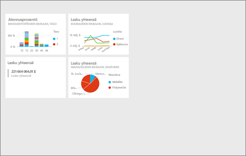
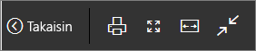
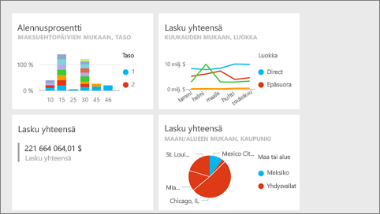
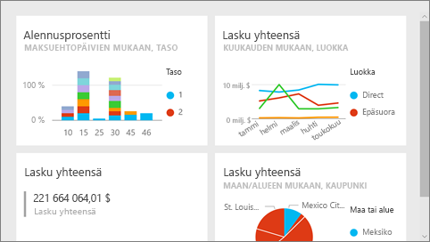
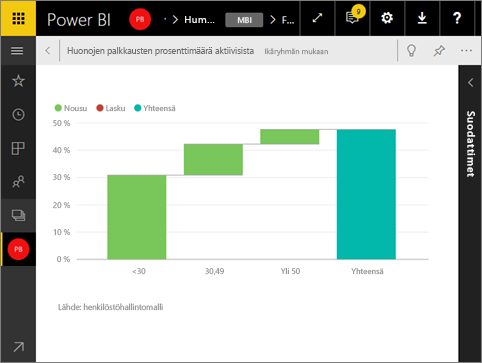
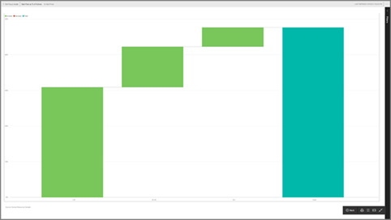

# Koko näytön tila Power BI -palvelussa
## Mikä on koko näytön tila?

Näytä Power BI -sisältösi (koontinäytöt, raporttisivut, ruudut ja visualisoinnit) ilman valikoiden ja siirtymispalkkien aiheuttamia häiriöitä.  Saat sisältösi aidon, koko näytön näkymän yhdellä silmäyksellä keskeytyksettä. Tätä kutsutaan joskus myös TV-tilaksi. Koko näytön tilassa käytettävissä olevat toiminnot vaihtelevat sisällön mukaan. 

Jos käytät Power BI mobiilisovellusta, [koko näytön tila on käytettävissä Windows 10 -mobiilisovelluksia varten](mobile-windows-10-app-presentation-mode.md). Power BI Desktopissa ei ole koko näytön tilaa raporteille tai visualisoinneille, mutta siinä on Sovita sivulle -toiminto [Suhteet-näkymää](desktop-report-view.md) varten ja [kohdistustila raportin visualisointeja varten](service-focus-mode.md).

 

Koko näytön tilan käyttötapoja:

* koontinäytön, ruudun, visualisoinnin tai raportin esittäminen kokouksessa tai konferenssissa
* esittäminen toimistossa erillisellä suurella näytöllä tai projektorilla
* tarkasteleminen pienessä näytössä
* tarkasteleminen lukitussa tilassa – voit koskettaa näyttöä tai viedä hiiren ruutujen päälle ilman että taustalla oleva raportti tai koontinäyttö avautuu

> **HUOMAUTUS**: koko näytön tila ei ole sama kuin [kohdistustila (ponnahdusikkunatila)](service-focus-mode.md).
> 
> 

Katso, miten Amanda avaa ja liikkuu koontinäytössään koko näytön tilassa ja käyttää sitten URL-parametreja oletusnäytön hallitsemiseen. Kokeile sitten itse noudattamalla videon alapuolella olevia vaiheittaisia ohjeita.

<iframe width="560" height="315" src="https://www.youtube.com/embed/c31gZkyvC54" frameborder="0" allowfullscreen></iframe>

## Koontinäytön ja raportit koko näytön tilassa
1. Valitse koontinäytön tai raportin yläpuolella olevasta Power BI -valikkorivistä **koko näyttö** -kuvake  . Koontinäytön pohja tai raporttisivu täyttää koko näytön. Alla olevassa esimerkissä on koontinäyttö.
   
      
2. Koko näytön tilassa on useita valikkovaihtoehtoja.  Saat valikon näkyviin liikuttamalla hiirtä tai kohdistinta. 
   
     Koontinäyttöjen valikko    
         
   
     Raporttisivujen valikko    
        
   
        
    Palaa edelliselle sivulle selaimessa **Takaisin**-painikkeella. Jos edellinen sivu oli Power BI -sivu, sekin näkyy koko näytön tilassa.  Koko näytön tila pysyy käytössä, kunnes poistut siitä.
   
        
    Tämän painikkeen avulla voit tulostaa koontinäytön tai raporttisivun koko näytön tilassa. 
   
        
    Käytä **Sovita näyttöön** -painiketta, kun haluat näyttää koontinäytön suurimmassa mahdollisessa koossa ilman vierityspalkkeja.     
   
    
   
           
    Joskus vierityspalkit lähinnä ärsyttävät, mutta haluat silti nähdä koontinäytön koko käytettävissä olevan tilan leveydeltä. Valitse **Sovita leveyteen** -painike.    
   
    
   
           
    Voit siirtyä raportin sivulta toiselle koko näytön raporteissa näiden nuolten avulla.    
3. Jos haluat poistua koko näytön tilasta, valitse **Poistu koko näytön tilasta** -kuvake.
   
      

## Visualisoinnit ja koontinäyttöruudut koko näytön tilassa
1. Jos haluat nähdä koontinäytön ruudut ja raportin visualisoinnit koko näytön tilassa, sinun on aloitettava siten, että kyseinen ruutu tai visualisointi on jo [kohdistustilassa](service-focus-mode.md). 
   
    
2. Valitse sitten Koko näyttö -kuvake   kyseisessä ruudussa tai visualisoinnissa. Ruutu tai visualisointi näkyy koko näytön kokoisena ilman valikoita tai siirtymispalkkeja.
   
    

## Seuraavat vaiheet
[Koontinäytöt Power BI:ssä](service-dashboards.md)  
[Kohdistustila](service-focus-mode.md)    

Onko sinulla muuta kysyttävää? [Kokeile Power BI -yhteisöä](http://community.powerbi.com/)

