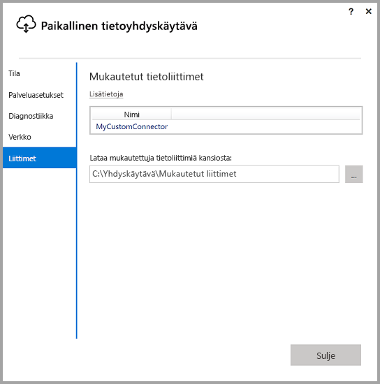
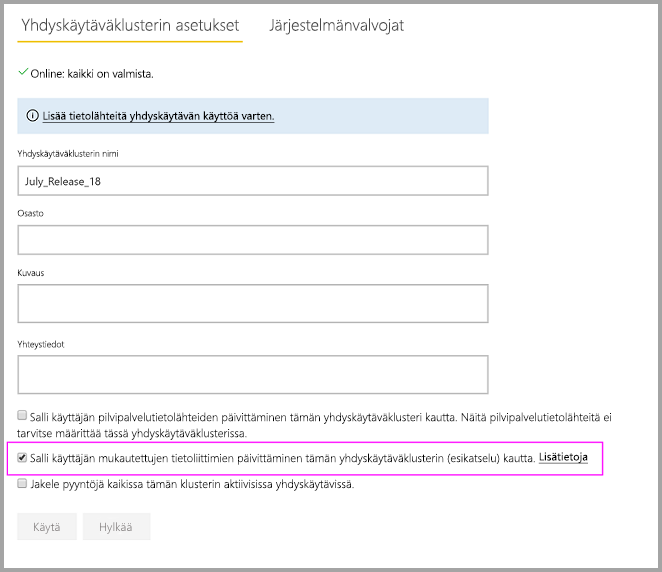
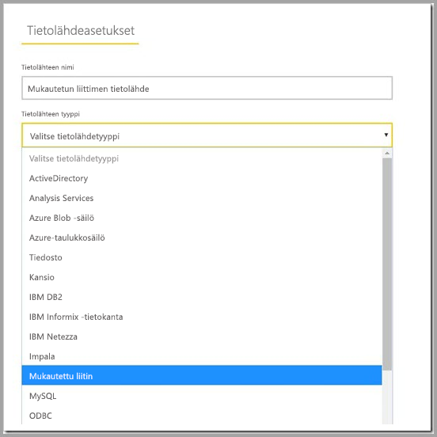

# Mukautettujen tietoliittimien käyttäminen paikallisen tietoyhdyskäytävän kanssa

Power BI:n tietoliittimien avulla voit muodostaa yhteyden sovelluksen, palvelun tai tietolähteen tietoihin ja käyttää niitä sieltä. Voit kehittää mukautettuja tietoliittimiä ja käyttää niitä Power BI Desktopissa.

Löydät [täällä](http://aka.ms/dataconnectors) olevista ohjeista lisätietoja siitä, miten voit kehittää Power BI:n mukautettuja tietoliittimiä.

Kun olet luonut Power BI Desktopissa mukautettuja tietoliittimiä käyttäviä raportteja, voit paikallisen tietoyhdyskäytävän avulla päivittää nämä raportit Power BI -palvelusta.

## Seuraavassa on ohjeita siitä, miten voit ottaa tämän ominaisuuden käyttöön ja hyötyä siitä.

Kun olet asentanut paikallisen tietoyhdyskäytävän heinäkuun 2018 version tai uudemman version, näet määritystoiminnossa ”Liittimet”-välilehden ja vaihtoehdon. Voit täällä valita kansion, josta voit ladata mukautetut liittimet. Varmista, että valitset kansion, jota voidaan käyttää yhdyskäytäväpalvelun avulla (oletusarvoisesti ”NT SERVICE\PBIEgwService”). Yhdyskäytävä lataa tässä kansiossa sijaitsevat mukautetun liittimen tiedostot automaattisesti, ja niiden pitäisi näkyä tietoliittimien luettelossa.

Jos käytät paikallisen tietoyhdyskäytävän henkilökohtaista versiota, sinun pitäisi pystyä tässä vaiheessa lataamaan Power BI -raporttisi Power BI -palveluun ja päivittämään se yhdyskäytävän avulla.

Yhdyskäytävän Enterprise-versiota varten sinun on yhä luotava tietolähde mukautetulle liittimelle. Power BI -palvelun Yhdyskäytävän asetukset -sivulla pitäisi näkyä uusi vaihtoehto, kun valitset yhdyskäytäväklusterin mukautettujen liittimien käytön sallimiseksi tämän klusterin kanssa. Varmista, että klusterin kaikissa yhdyskäytävissä on vuoden 2018 heinäkuun päivitysversio tai uudempi versio, jotta tämä vaihtoehto on saatavilla. Valitse nyt tämä vaihtoehto mukautettujen liittimien käyttöönottamiseksi tämän klusterin kanssa.

Kun tämä vaihtoehto on käytössä, mukautetut liittimet ovat nyt saatavilla tietolähteinä, joita voit luoda tässä yhdyskäytäväklusterissa. Kun olet luonut tietolähteen uuden mukautetun liittimen avulla, voit nyt päivittää Power BI -raportteja käyttämällä mukautettua liitintä Power BI-palvelussa.

## Huomioitavat asiat ja rajoitukset

* Varmista, että taustalla oleva yhdyskäytäväpalvelu pääsee käyttämään luomaasi kansiota. Yleensä et voi käyttää Windows-kansiossa olevia kansioita tai järjestelmäkansioita. Yhdyskäytävän määritystoiminto näyttää viestin, jos kansioon ei pääse (tämä ei koske yhdyskäytävän henkilökohtaista versiota).
* Jotta mukautetut liittimet toimisivat paikallisen tietoyhdyskäytävän kanssa, niiden on sovellettava mukautetun liittimen koodin ”Testiyhteys”-osiota. Tätä ei vaadita, kun käytät mukautettuja liittimiä Power BI Desktopin avulla. Voit käyttää tätä varten Desktopin kanssa toimivaa mukautettua liitintä, mutta et yhdyskäytävää. Katso [näistä ohjeista](https://github.com/Microsoft/DataConnectors/blob/master/docs/m-extensions.md#implementing-testconnection-for-gateway-support), miten voit soveltaa Testiyhteys-osiota.
* OAuth-todennuksen kanssa käytettäviä mukautettuja liittimiä ei tueta.
* Suoraa kyselyä käyttäviä mukautettuja liittimiä ei tueta.

## Seuraavat vaiheet

* [Tietolähteen hallinta – Analysis Services](service-gateway-enterprise-manage-ssas.md)  
* [Tietolähteen hallinta – SAP HANA](service-gateway-enterprise-manage-sap.md)  
* [Tietolähteen hallinta – SQL Server](service-gateway-enterprise-manage-sql.md)  
* [Tietolähteen hallinta – Oracle](service-gateway-onprem-manage-oracle.md)  
* [Tietolähteen hallinta – tuonti ja ajoitettu päivitys](service-gateway-enterprise-manage-scheduled-refresh.md)  
* [Paikallinen tietoyhdyskäytävä tarkemmin ](service-gateway-onprem-indepth.md)  
* [Paikallinen tietoyhdyskäytävä (henkilökohtainen tila)](service-gateway-personal-mode.md)
* [Paikallisen tietoyhdyskäytävän välityspalvelinasetusten määrittäminen](service-gateway-proxy.md)  
* [Kerberoksen käyttäminen SSO:ta (kertakirjautumista) varten Power BI:stä paikallisiin tietolähteisiin](service-gateway-kerberos-for-sso-pbi-to-on-premises-data.md)  

Onko sinulla kysyttävää? [Kokeile Power BI -yhteisöä](http://community.powerbi.com/)
