# Tietolähteiden hallinta

[!INCLUDE [gateway-rewrite](includes/gateway-rewrite.md)]

Power BI tukee monia paikallisia tietolähteitä, joista jokaisella on omat vaatimuksensa. Yhdyskäytävää voidaan käyttää yksittäisen tietolähteen tai useiden tietolähteiden kanssa. Tässä esimerkissä näytämme, miten voit lisätä SQL Serverin tietolähteeksi. Vaiheet ovat samanlaiset muille tietolähteille.

Useimmat tietolähteiden hallintatoiminnot voidaan suorittaa myös ohjelmointirajapintojen avulla. Lisätietoja on kohdassa [REST-ohjelmointirajapinnat (yhdyskäytävät)](/rest/api/power-bi/gateways).

## Tietolähteen lisääminen

1. Valitse  >  Power BI -palvelun oikeasta yläkulmasta ja valitse sitten **Hallitse yhdyskäytäviä**.

    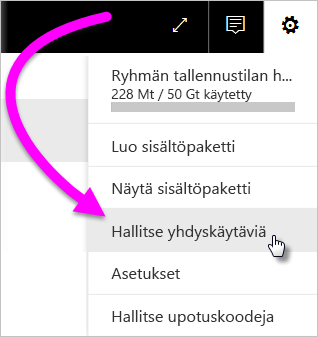

2. Valitse yhdyskäytävä ja valitse sitten **Lisää tietolähde**. Tai valitse **Yhdyskäytävät** > **Lisää tietolähde**.

    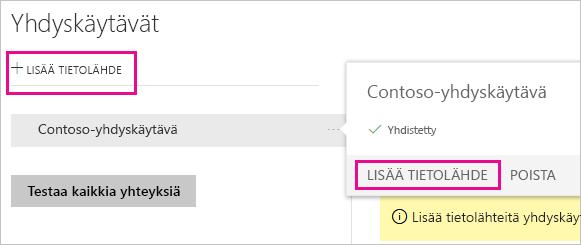

3. Valitse **tietolähteen tyyppi**.

    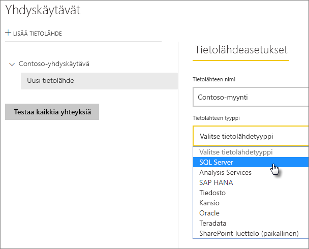

4. Anna tietolähteen tiedot. Tässä esimerkissä annetut tiedot ovat **Palvelin**, **Tietokanta** ja muuta. 

    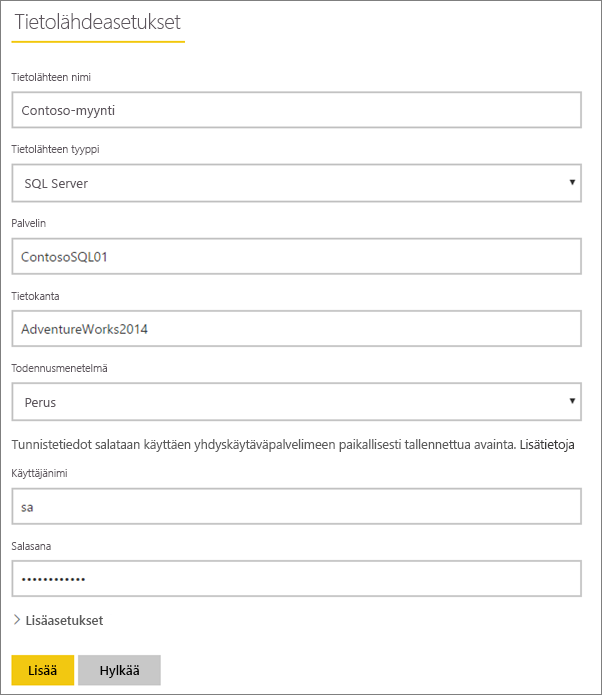

5. SQL Serverin tapauksessa valitaan **Todennusmenetelmäksi** **Windows** tai **Perus** (SQL-todennus). Jos valitset **Perus**, anna tietolähteen tunnistetiedot.

6. **Lisäasetukset**-kohdassa voit halutessasi määrittää tietolähteen [yksityisyystason](https://support.office.com/article/Privacy-levels-Power-Query-CC3EDE4D-359E-4B28-BC72-9BEE7900B540) (ei koske [DirectQuerya](desktop-directquery-about.md)).

    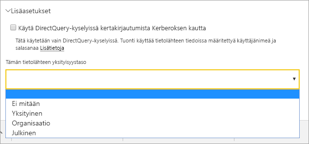

7. Valitse **Lisää**. *Yhteyden muodostaminen onnistui* -teksti tulee näkyviin, jos yhteys muodostettiin.

    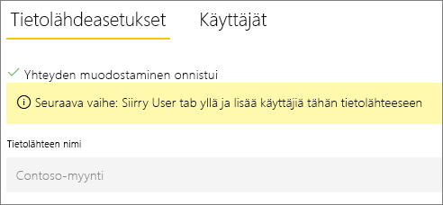

Nyt voit sisällyttää SQL Server -tietoja Power BI -raporttinäkymiin ja -raportteihin tämän tietolähteen avulla.

## Tietolähteen poistaminen

Voit poistaa tietolähteen, jos et käytä sitä enää. Tietolähteen poistaminen rikkoo kyseisestä tietolähteestä riippuvaiset raporttinäkymät tai raportit.

Jos haluat poistaa tietolähteen, valitse tietolähde ja valitse sitten **Poista**.

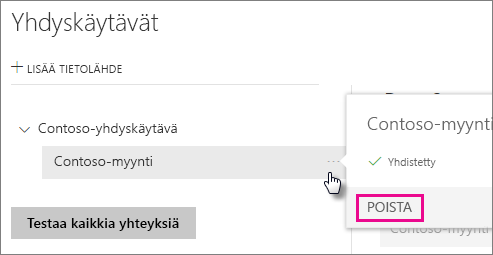

## Tietolähteen käyttö ajoitetussa päivityksessä tai DirectQueryssa

Kun tietolähde on luotu, se on käyttäjien saatavilla joko DirectQuery-yhteyksien tai ajoitetun päivityksen välityksellä.

> [!NOTE]
>Palvelimen ja tietokannan nimien pitää täsmätä paikallisen tietoyhdyskäytävän Power BI Desktopin ja tietolähteen kanssa.

Yhdyskäytävän tietojoukon ja tietolähteen välinen linkki perustuu palvelimen ja tietokannan nimiin. Näiden nimien on vastattava toisiaan. Jos esimerkiksi Power BI Desktopissa palvelimen nimelle annetaan IP-osoite, IP-osoitetta tulee käyttää myös tietolähteelle yhdyskäytävän määrityksessä. Jos käytät Power BI Desktopissa nimeä *PALVELIN\ESIINTYMÄ*, yhdyskäytävälle määritetyn tietolähteen sisällä on käytettävä samaa nimeä.

Jos sinut on lisätty yhdyskäytävän sisällä määritellyn tietolähteen **Käyttäjät**-välilehdelle ja jos palvelimen ja tietokannan nimet täsmäävät, näet yhdyskäytävän yhtenä, ajoitetun päivityksen kanssa käytettävänä vaihtoehtona.

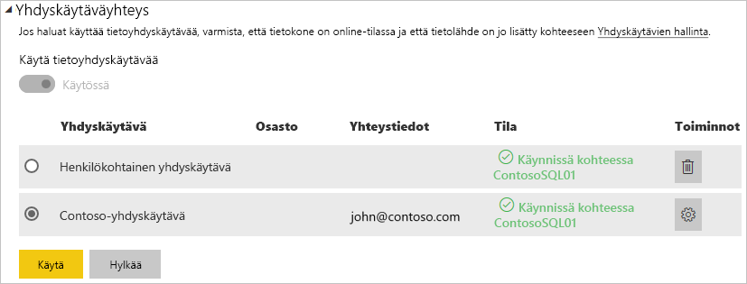

> [!WARNING]
> Jos tietojoukkosi sisältää useita tietolähteitä, jokaisen tietolähteen on oltava lisättynä yhdyskäytävään. Jos yksi tai useampi tietolähde ei ole lisättynä yhdyskäytävään, yhdyskäytävää ei näytetä ajoitetun päivityksen yhteydessä.

### Rajoitukset

OAuth-todentamista tuetaan paikallisessa tietoyhdyskäytävässä vain mukautetuilla liittimillä. Muita OAuth-todentamista vaativia tietolähteitä ei voi lisätä. Jos tietojoukon tietolähde edellyttää OAuth-todentamista ja tämä tietolähde ei ole mukautettu liitin, yhdyskäytävää ei voi käyttää ajoitetussa päivityksessä.

## Käyttäjien hallinta

Kun olet lisännyt tietolähteen yhdyskäytävään, anna käyttäjille ja sähköpostia käyttäville käyttöoikeusryhmille käyttöoikeudet kyseiseen tietolähteeseen (ei koko yhdyskäytävään). Tietolähteen käyttäjäluettelolla hallitaan vain sitä, ketkä voivat julkaista raportteja, jotka sisältävät tietoja kyseisestä tietolähteestä. Raporttien omistajat voivat luoda raporttinäkymiä, sisältöpaketteja ja sovelluksia ja jakaa niitä muiden käyttäjien kanssa.

Voit myös antaa käyttäjille ja käyttöoikeusryhmille järjestelmänvalvojan oikeudet yhdyskäytävään.

### Lisää käyttäjiä tietolähteeseen

1. Valitse  >  Power BI -palvelun oikeasta yläkulmasta ja valitse sitten **Hallitse yhdyskäytäviä**.

2. Valitse tietolähde, johon haluat lisätä käyttäjiä.

3. Valitse **Käyttäjät** ja kirjoita organisaatiosi käyttäjän nimi, jolle haluat myöntää käyttöoikeudet kyseiseen tietolähteeseen. Esimerkiksi seuraavassa kuvassa lisätään Maggie ja Adam.

    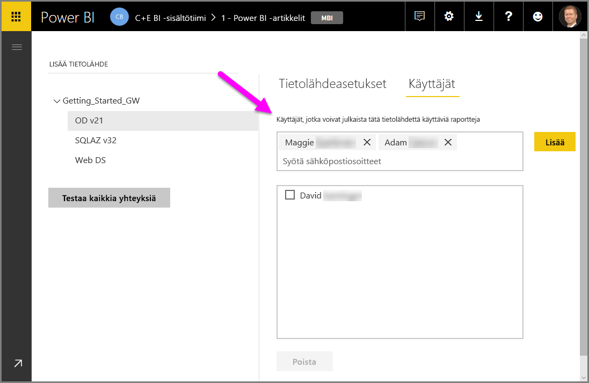

4. Valitse **Lisää**, minkä jälkeen lisätyn jäsenen nimi näkyy ruudussa.

    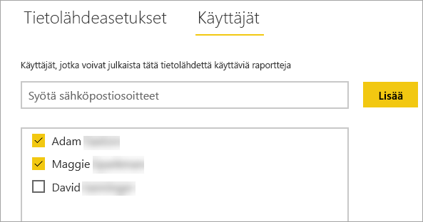

Muista, että sinun on lisättävä käyttäjiä jokaiseen tietolähteeseen, johon haluat myöntää käyttöoikeuden. Kullakin tietolähteellä on erillinen käyttäjien luettelo. Lisää käyttäjiä kuhunkin tietolähteeseen erikseen.

### Poista käyttäjiä tietolähteestä

Tietolähteen **Käyttäjät**-välilehdeltä voit poistaa käyttäjiä tai käyttöoikeusryhmiä, jotka voivat käyttää tätä tietolähdettä.

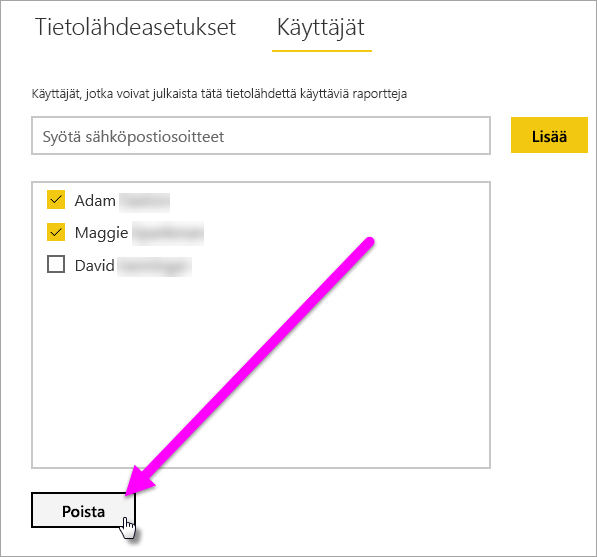

## Salattujen tunnistetietojen tallentaminen pilvipalveluun

Kun lisäät tietolähteen yhdyskäytävään, sinun on annettava tunnistetiedot kyseiselle tietolähteelle. Kaikki tietolähteeseen kohdennetut kyselyt suoritetaan näitä tunnistetietoja käyttämällä. Tunnistetiedot salataan turvallisesti. Tämä tehdään epäsymmetrisellä salauksella siten, että niiden salausta ei voi purkaa pilvipalvelussa ennen kuin ne on tallennettu pilvipalveluun. Tunnistetiedot lähetetään tietokoneelle, jossa yhdyskäytävä on käynnissä paikallisesti ja jossa tietojen salaus puretaan käytettäessä tietolähteitä.

## Luettelo käytettävissä olevista tietolähdetyypeistä

Paikallinen tietoyhdyskäytävä tukee seuraavia Power BI:n tietolähteitä. Paikallisten tietolähteiden lisäksi palomuurin, VPN-yhteyden tai näennäisverkon takana olevat lähteet saattavat tarvita myös tietoyhdyskäytävää.

| **Tietolähde** | **Reaaliaikainen yhteys / DirectQuery** | **Manuaalinen tai ajoitettu päivitys (käyttäjän määrittämä)** |
| --- | --- | --- |
| Amazon Redshift |Kyllä |Kyllä |
| Analysis Services |Kyllä |Kyllä |
| AtScale-kuutiot |Kyllä |Kyllä |
| Azure Active Directory |Ei |Kyllä |
| Azure-blob-objektitallennus |Ei |Kyllä |
| Azure DevOps Server |Ei |Kyllä |
| Azure-taulukkotallennus |Ei |Kyllä |
| BI-liitin |Kyllä |Kyllä |
| Denodo |Kyllä |Kyllä |
| Dremio |Kyllä |Kyllä |
| EmigoDataSourceConnector |Ei |Kyllä |
| Essbase |Kyllä |Kyllä |
| Exasol |Kyllä |Kyllä |
| Tiedosto |Ei |Kyllä |
| Kansio |Ei |Kyllä |
| Paxata |Ei |Kyllä |
| IBM DB2 |Kyllä |Kyllä |
| IBM Informix -tietokanta |Ei |Kyllä |
| IBM Netezza |Kyllä |Kyllä |
| Impala |Kyllä |Kyllä |
| Jethro ODBC |Kyllä |Kyllä |
| Kyligence Enterprise |Kyllä |Kyllä |
| MarkLogic ODBC |Kyllä |Kyllä |
| Microsoft Graph Security |Ei |Kyllä |
| MySQL |Ei |Kyllä |
| ODBC |Ei |Kyllä |
| OData |Ei |Kyllä |
| OLE DB |Ei |Kyllä |
| Oracle |Kyllä |Kyllä |
| PostgreSQL |Ei |Kyllä |
| QubolePresto |Kyllä |Kyllä |
| Quick Base -liitin |Ei |Kyllä |
| SAP Business Warehouse -viestipalvelin |Kyllä |Kyllä |
| SAP Business Warehouse -palvelin |Kyllä |Kyllä |
| SAP HANA |Kyllä |Kyllä |
| SQL Server |Kyllä |Kyllä |
| SharePoint |Ei |Kyllä |
| Snowflake |Kyllä |Kyllä |
| Spark |Kyllä |Kyllä |
| SurveyMonkey |Ei |Kyllä |
| Sybase |Ei |Kyllä |
| TeamDesk.Database |Ei |Kyllä |
| Teradata |Kyllä |Kyllä |
| Vertica |Kyllä |Kyllä |
| Verkko |Ei |Kyllä |
| Työvoiman dimensiot |Ei |Kyllä |

## Seuraavat vaiheet

* [Tietolähteen hallinta – Analysis Services](service-gateway-enterprise-manage-ssas.md)
* [Tietolähteen hallinta – SAP HANA](service-gateway-enterprise-manage-sap.md)
* [Tietolähteen hallinta – SQL Server](service-gateway-enterprise-manage-sql.md)
* [Tietolähteen hallinta – Oracle](service-gateway-onprem-manage-oracle.md)
* [Tietolähteen hallinta – tuonti ja ajoitettu päivitys](service-gateway-enterprise-manage-scheduled-refresh.md)
* [Tietoyhdyskäytävän käyttöönotto-ohjeet](service-gateway-deployment-guidance.md)

Onko sinulla kysyttävää? Kokeile [Power BI -yhteisöä](http://community.powerbi.com/).
