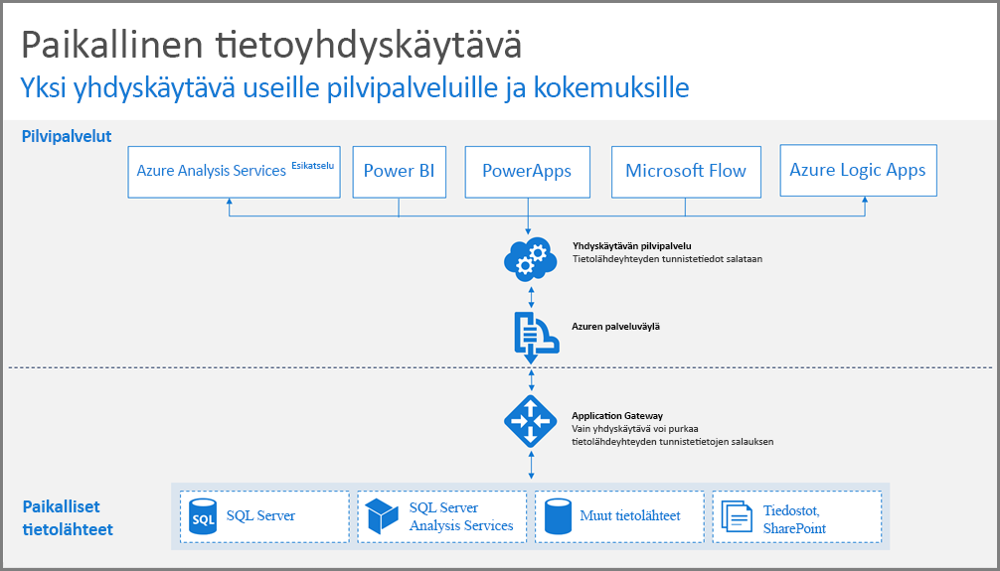
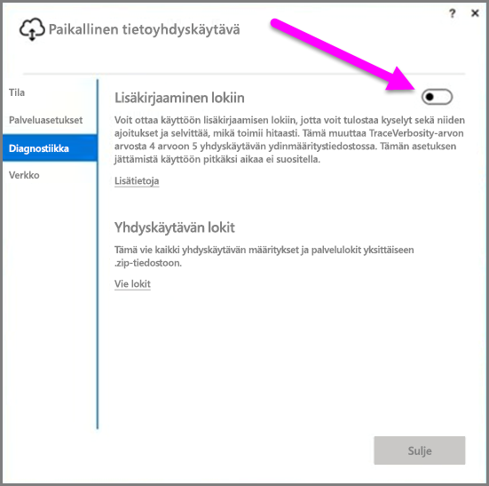
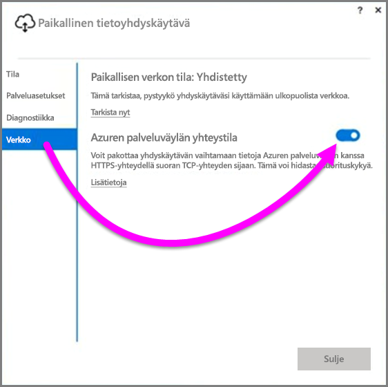
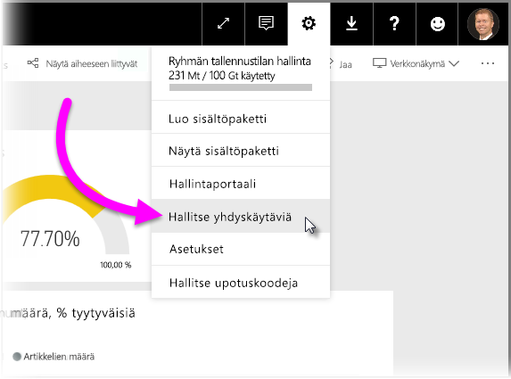

# Power BI:n tietoyhdyskäytävän käyttöönotto-ohjeet

Tämä artikkeli sisältää ohjeita ja huomioon otettavia seikkoja, kun tietoyhdyskäytävä otetaan käyttöön verkko-ympäristössä. **Yhdyskäytävä** on ohjelmisto, joka helpottaa pääsyä yksityisessä paikallisessa verkossa oleviin tietoihin, jotta niitä voidaan käyttää myöhemmin Power BI:n kaltaisessa pilvipalvelussa. Tässä artikkelissa käydään läpi, kuinka **paikallinen tietoyhdyskäytävä** otetaan käyttöön, ja annetaan ohjeita sen määritykseen.

Lisätietoja **paikallisesta tietoyhdyskäytävästä**, asennuslinkki mukaan lukien, saat [blogikirjoituksesta](https://powerbi.microsoft.com/blog/power-bi-gateways-march-update/).

## Paikallisen tietoyhdyskäytävän asennuksessa huomioitavat seikat
Ennen kuin menemme asennukseen ja käyttöönottoon yksityiskohtaisemmin, käymme läpi muutamia huomioon otettavia seikkoja, jotka on hyvä pitää mielessä. Seuraavissa osioissa on kuvattu tärkeitä huomioitavia seikkoja.

### Käyttäjien määrä
Yhdyskäytävää käyttävän raportin käyttäjien lukumäärä on tärkeä mittari pohdittaessa yhdyskäytävän asennuspaikkaa. Seuraavassa on muutamia huomioitavia kysymyksiä:

* Käyttävätkö käyttäjät näitä raportteja päivän eri aikoina?
* Mitä yhteystyyppejä he käyttävät (DirectQuery vai tuonti)?
* Käyttävätkö kaikki käyttäjät samaa raporttia?

Jos kaikki käyttäjät käyttävät tiettyä raporttia joka päivä samaan aikaan, kannattaa varmistaa, että asennat yhdyskäytävän tietokoneeseen, joka pystyy käsittelemään kaikki kyseiset käsittelypyynnöt (seuraavissa osioissa kerrotaan resurssilaskureista ja vähimmäisvaatimuksista, jotka auttavat sinua selvittämään tämän).

**Power BI:ssä** on rajoitus, joka sallii vain *yhden* yhdyskäytävän *raporttia* kohti, joten vaikka raportti perustuisi useampiin tietolähteisiin, kaikkien näiden tietolähteiden on käytettävä yhtä samaa yhdyskäytävää. Jos raporttinäkymä perustuu *useisiin* raportteihin, voit kuitenkin käyttää erillistä yhdyskäytävää kullekin raportille ja siten jakaa yhdyskäytävän kuormitusta näiden useiden raporttien kesken, jotka ovat osa tätä yhtä raporttinäkymää.

### Yhteystyyppi
**Power BI** tarjoaa kaksi yhteystyyppiä: **DirectQueryn** ja **tuonnin**. Kaikki tietolähteet eivät tue molempia yhteystyyppejä ja useat syyt voivat vaikuttaa siihen, kumpi valitaan, kuten suojausvaatimukset, suorituskyky, tietorajoitukset ja tietomallikoot. Lisätietoja yhteystyypistä ja tuetuista tietolähteistä on *On-premises data gateway* -artikkelin osiossa, joka sisältää[ luettelon käytettävissä olevista tietolähdetyypeistä](service-gateway-onprem.md).

Sen mukaan, mitä yhteyttä käytetään yhdyskäytävän käyttö voi olla eri. Sinun tulee esimerkiksi yrittää erottaa **DirectQuery**-tietolähteet **ajoitetun päivityksen** tietolähteistä aina kun mahdollista (olettaen, että ne ovat eri raporteissa ja voidaan erottaa). Tämä estää sen, että yhdyskäytävällä olisi tuhansia **DirectQuery** pyyntöjä jonossa samaan aikaan aamuksi ajoitetun päivityksen kanssa, suurikokoisen tietomallin, jota käytetään yrityksen pääasiallisessa raporttinäkymässä. Seuraavassa on kummankin osalta huomioitavia seikkoja:

* **Ajoitettu päivitys**: Riippuen kyselyn koosta ja päivittäin tehtävien päivitysten määrästä voit valita, pysytkö suositeltujen laitteistovaatimusten välillä vai päivitätkö suuremman suorituskyvyn koneeseen. Jos tiettyä kyselyä ei ole taitettu, yhdyskäytäväkoneessa tapahtuu muunnoksia ja siten yhdyskäytäväkone hyötyy suuremmasta käytettävissä olevasta RAM-muistista.
* **DirectQuery**: Kysely lähetään aina, kun joku käyttäjä avaa raportin tai tarkastelee tietoja. Joten jos arvelet yli 1 000 käyttäjän käyttävän tietoja samanaikaisesti, kannattaa varmistaa, että tietokoneessa on tehokkaat ja suorituskykyiset laitteisto-osat. Suoritinydinten määrän lisääminen parantaa **DirectQuery**-yhteyden siirtomäärää.

Tietokonetta, johon **paikallinen tietoyhdyskäytävä** asennetaan, koskevat seuraavat vaatimukset:

**Vähintään:**

* .NET 4.5 Framework
* Windows 7:n tai Windows Server 2008 R2:n (tai uudemman) 64-bittinen versio

**Suositus:**

* 8 ytimen suoritin
* 8 Gt muistia
* Windows 2012 R2:n (tai uudemman) 64-bittinen versio

### Sijainti
Yhdyskäytäväasennuksen sijainnilla voi olla merkittävä vaikutus kyselyn suorituskykyyn, joten varmista, että yhdyskäytäväsi, tietolähteiden sijainnit ja Power BI -vuokraaja ovat mahdollisimman lähellä toisiaan verkon viiveen minimoimiseksi. Määritä Power BI -vuokraajan sijaintisi Power BI -palvelussa valitsemalla **?** -kuvake oikeassa yläkulmassa ja valitsemalla sitten **Tietoja Power BI:stä**.

### Yhdyskäytävien valvonta
Saatavilla on muutamia työkaluja, joiden avulla voit valvoa asennettujen yhdyskäytävien käyttöä ja suorituskykyä.

#### Resurssilaskurit
Yhdyskäytävässä tapahtuvien toimintojen arviointiin ja mittaamiseen on saatavilla monia resurssilaskureita. Laskurit voivat auttaa selvittämään, onko sinulla paljon tietyn tyypin toimintoja, joiden vuoksi sinun tulisi ottaa käyttöön uusi yhdyskäytävä.

> [!NOTE]
> Nämä laskurit eivät sieppaa tietyn tehtävän kestoaikaa.
> 
> 

*Yhdyskäytävän laskuri* yhdessä tietokoneen laskurien kanssa antaa sinulle käsityksen siitä, kuinka suuria kuormituksia koneesi käsittelee, ja voivat ilmaista, onko palvelimen resurssikapasiteetti venymässä tai ylittymässä.

Näitä laskureita voidaan käyttää **Windowsin suorituskyvyn valvonnan** kautta, ja niitä voi käyttää millä tahansa raportointityökalulla, jota käytät tähän tarkoitukseen. Yksityiskohtaiset ohjeet siitä, miten voit käyttää yhdyskäytävän suorituskyvyn valvontaa Power BI:n kanssa, saat lukemalla seuraavan yhteisön luoman blogikirjoituksen.

* [Monitor On-premises data gateways](https://insightsquest.com/2016/08/08/monitor-on-premises-data-gateways/)

#### Lokit
Määritys- ja palvelulokit antavat toisenlaisen näkökulman yhdyskäytäväsi tapahtumiin. Tarkista yhdyskäytävän lokit aina, kun yhteys ei toimi odotetusti, sillä kaikkia virhesanomia ei näytetä Power BI-palvelussa.

Helppo tapa tarkastella kaikkia paikalliselle tietokoneelle tallennettuja lokitiedostoja on käyttää *paikallisen tietoyhdyskäytävän* **Vie lokit** -painiketta, kun avaat yhdyskäytävän uudelleen ensimmäisen asennuksen päätyttyä, ja valitsemalla **Diagnostiikka > Vie lokit**.

#### Lisäkirjaaminen
Yhdyskäytävä suorittaa oletusarvoisesti peruskirjaamisen. Jos tutkit yhdyskäytävän ongelmia ja tarvitset lisätietoja kyselyn yhteystiedoista, voit tilapäisesti ottaa käyttöön *yksityiskohtaisen kirjaamisen* ja saada näin lisää lokitietoja. Voit tehdä tämän valitsemalla asennetussa yhdyskäytävässä **Diagnostiikka > Lisäkirjaaminen**.

Tämän asetuksen ottaminen käyttöön todennäköisesti kasvattaa lokin kokoa merkittävästi sen mukaan, kuinka yhdyskäytävää käytetään. On suositeltavaa, että lokien tarkastelun jälkeen poistat **lisäkirjaamisen** käytöstä. Tätä asetusta ei kannata jättää käyttöön yhdyskäytävän normaalin käytön ajaksi.

#### Verkon määrittäminen
Yhdyskäytävä luo lähtevän yhteyden **Azuren palveluväylään**. Yhdyskäytävä viestii seuraavien lähtevien porttien kautta:

* TCP 443 (oletus)
* 5671
* 5672
* 9350–9354

Yhdyskäytävä *ei* vaadi saapuvia portteja. Kaikki tarvittavat portit näkyvät yllä olevassa luettelossa.

On suositeltavaa, että lisäät tietoalueesi IP-osoitteet sallittujen luetteloon palomuurin asetuksissa. Voit ladata IP-osoitteet, jotka löytyvät [Microsoft Azuren palvelinkeskusten IP-osoiteluettelosta](https://www.microsoft.com/download/details.aspx?id=41653). Luettelo päivitetään viikoittain. Yhdyskäytävä vaihtaa tietoja **Azuren palveluväylän** kanssa käyttämällä määritettyä IP-osoitetta ja täydellistä toimialuenimeä (FQDN). Jos pakotat yhdyskäytävän vaihtamaan tietoja HTTPS-yhteyden kautta, yhdyskäytävä käyttää ainoastaan FQDN:ää ja tietojen vaihtoa IP-osoitteita käyttämällä ei tapahdu lainkaan.

#### HTTPS-tiedonsiirron pakottaminen Azuren palveluväylän kanssa
Voit pakottaa yhdyskäytävän vaihtamaan tietoja **Azuren palveluväylän** kanssa käyttämällä HTTPS-yhteyttä suoran TCP-yhteyden sijaan. Tämä heikentää suorituskykyä hieman. Voit myös pakottaa yhdyskäytävän vaihtamaan tietoja **Azuren palveluväylän** kanssa käyttämällä HTTPS-yhteyttä yhdyskäytävän käyttöliittymän kautta (yhdyskäytävän maaliskuun 2017 julkaisusta alkaen).

Voit tehdä tämän valitsemalla yhdyskäytävässä **Verkko** ja ottamalla **Azuren palveluväylän yhteystilan** **käyttöön**.

### Lisäohjeita
Tässä osiossa annetaan yhdyskäytävien käyttöönottoa ja hallintaa koskevia lisäohjeita.

* Vältä yksittäisen vikaantumispisteen käyttämistä. Mikäli mahdollista, jaa paikalliset tietolähteet useisiin yhdyskäytäviin. Tällöin, jos jokin koneista ei joskus ole käytettävissä, pystyt silloinkin päivittämään tietosi etkä menetä kyseistä toimintoa kokonaan.
* Yhdyskäytävää ei voi asentaa toimialueen ohjaimeen, joten älä suunnittele tai yritä tehdä niin.
* Älä asenna yhdyskäytävää tietokoneeseen (kuten kannettavaan tietokoneeseen), joka voidaan kytkeä pois päältä tai asettaa lepotilaan tai jota ei ole yhdistetty Internetiin. Yhdyskäytävä ei toimi näissä olosuhteissa.
* Vältä yhdyskäytävän asentamisesta langattomaan verkkoon, koska suorituskyky saattaa kärsiä langattomassa verkossa.

#### Yhdyskäytävän palautus
Voit palauttaa olemassa olevan yhdyskäytävän tai siirtää sen uuteen tietokoneeseen käyttämällä **palautusavainta**. Palautusavain annetaan käyttäjälle, joka asentaa yhdyskäytävän, ja sitä *ei* voi muuttaa myöhemmin. Palautusavainta käytetään tietojen salaukseen ja yhdyskäytävän palautukseen.

Jotta voit palauttaa yhdyskäytävän, varmista, että olet yhdyskäytävän järjestelmänvalvoja, että tiedät yhdyskäytävän nimen, että sinulla on oikea palautusavain ja että sinulla on käytettävissä uusi, suorituskykyominaisuuksiltaan samankaltainen tietokone.

Kun olet kirjautunut sisään, valitse **Migrate an existing gateway** (Siirrä olemassa oleva yhdyskäytävä) -vaihtoehto. Seuraavaksi sinun on valittava yhdyskäytävä, jonka haluat palauttaa tai siirtää. Lopuksi anna palautusavain ja valitse määritys. Kun tämä vaihe on suoritettu, vanha yhdyskäytävä korvataan uudella ja uusi yhdyskäytävä perii sen nimen ja kaikki tietolähteet, jotka on määritetty aiemmin. Kaikki tietolähteet kulkevat nyt uuden tietokoneen kautta ilman, että sinun tarvitsee julkaista mitään uudelleen. Automaattista vikasietoisuutta ei tueta vielä, mutta se on ominaisuus, jota yhdyskäytävätiimi aktiivisesti tutkii.

#### Järjestelmänvalvojat
Voit etsiä yhdyskäytävän järjestelmänvalvojia **Power BI -palvelun** luettelosta. Kun olet kirjautunut sisään **Power BI** -palveluun, valitse **Settings** (Asetukset, hammaspyöräkuvake) **> Manage Gateways (Yhdyskäytävien hallinta) > Gateway UI (Yhdyskäytävän käyttöliittymä)**.  

Sieltä voit valita yhdyskäytävän ja tarkastella yhdyskäytävän järjestelmänvalvojien luetteloa. Luettelon järjestelmänvalvojat voivat käyttää, palauttaa ja poistaa yhdyskäytävän. He voivat myös lisätä yhdyskäytävään tietolähteitä tai poistaa niitä. Jotta voi varmistaa, että kaikilla organisaation järjestelmänvalvojilla on käyttöoikeus kaikkiin ryhmänsä yhdyskäytäviin, seuraava toimenpide on suositeltava:

* Luo **AAD**-käyttöoikeusryhmä ja lisää siihen muita käyttäjiä. Lisää sen jälkeen tämä käyttöoikeusryhmä vastaavan yhdyskäytävän järjestelmänvalvojien luetteloon. Näin varmistetaan, että useampi kuin yksi henkilö pääsee yhdyskäytävään vikatilanteissa tai silloin, kun yhdyskäytävä on palautettava tai siirrettävä. Tämä antaa myös muille järjestelmänvalvojille näkymän siihen, mitä yhdyskäytäviä heidän ryhmissään käytetään ja mitä tietolähteitä kussakin yhdyskäytävässä on.

## Seuraavat vaiheet
[Välityspalvelinasetusten määrittäminen](service-gateway-proxy.md)  
[Paikallisen tietoyhdyskäytävän vianmääritys](service-gateway-onprem-tshoot.md)  
[Paikallisten tietoyhdyskäytävien usein kysytyt kysymykset](service-gateway-onprem-faq.md)  

Onko sinulla muuta kysyttävää? [Kokeile Power BI -yhteisöä](http://community.powerbi.com/)

