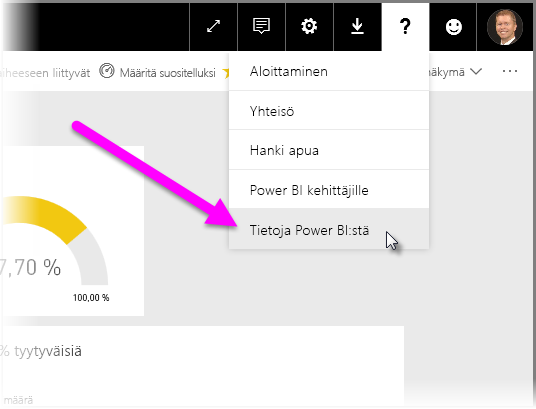

# Power BI:n tietoyhdyskäytävän käyttöönotto-ohjeet

[!INCLUDE [gateway-rewrite](includes/gateway-rewrite.md)]

Tämä artikkeli sisältää ohjeita ja huomioon otettavia seikkoja, kun Power BI:n tietoyhdyskäytävä otetaan käyttöön verkko-ympäristössä.

Lisätietoja paikallisen tietoyhdyskäytävän lataamisesta, asentamisesta, määrittämisestä ja hallinnasta on artikkelissa [Mikä paikallinen tietoyhdyskäytävä on?](/data-integration/gateway/service-gateway-onprem). Saat lisätietoja paikallisesta tietoyhdyskäytävästä ja Power BI:stä käymällä [Microsoft Power -blogissa](https://powerbi.microsoft.com/blog/) ja [Microsoft Power BI -yhteisön](https://community.powerbi.com/) sivustossa.

## Paikallisen tietoyhdyskäytävän asennuksessa huomioitavat seikat

Ennen kuin asennat paikallisen tietoyhdyskäytävän Power BI -pilvipalvelullesi, sinun kannattaa pitää mielessä muutamia seikkoja. Nämä seikat kuvataan seuraavissa osissa.

### Käyttäjien määrä

Yhdyskäytävää käyttävän raportin käyttäjien lukumäärä on tärkeä mittari pohdittaessa yhdyskäytävän asennuspaikkaa. Seuraavassa on muutamia huomioitavia kysymyksiä:

* Käyttävätkö käyttäjät näitä raportteja päivän eri aikoina?
* Mitä yhteystyyppejä he käyttävät (DirectQuery vai tuonti)?
* Käyttävätkö kaikki käyttäjät samaa raporttia?

Jos kaikki käyttäjät käyttävät annettua raporttia samaan aikaan joka päivä, varmista, että asennat yhdyskäytävän tietokoneeseen, joka pystyy käsittelemään kaikki nämä pyynnöt. Seuraavissa osioissa on resurssilaskureita ja vähimmäisvaatimuksia, joiden avulla voit määrittää, onko tietokoneessa riittävästi suorituskykyä.

Power BI:n rajoite sallii vain *yhden* yhdyskäytävän *raporttia* kohden. Vaikka raportti perustuisi useisiin tietolähteisiin, kaikkien tällaisten tietolähteiden on mentävä yhden yhdyskäytävän läpi. Jos koontinäyttö perustuu *useisiin* raportteihin, voit käyttää erillistä yhdyskäytävää kunkin raportin kohdalla. Tällä tavoin voit jakaa yhdyskäytävän kuormitusta useiden raporttien kesken, jotka vaikuttavat yhteen koontinäyttöön.

### Yhteystyyppi

Power BI tarjoaa kaksi yhteystyyppiä: DirectQueryn ja tuonnin. Kaikki tietolähteet eivät tue molempia yhteystyyppejä. Monet tekijät, kuten suojausvaatimukset, suorituskyky, tietorajoitukset ja tietomallin koot, voivat vaikuttaa valintaasi. Lisätietoja yhteystyypistä ja tuetuista tietolähteistä on [käytettävissä olevien tietolähdetyyppien luettelossa](service-gateway-data-sources.md#list-of-available-data-source-types).

Käytössä oleva yhteystyypin mukaan yhdyskäytävän käyttö voi olla erilaista. Yritä esimerkiksi erottaa DirectQuery -tietolähteet ajoitetuista päivitystietolähteistä aina, kun se on mahdollista. Oletuksena on, että ne ovat eri raporteissa ja että ne voidaan erottaa toisistaan. Lähteiden erottaminen estää sen, että yhdyskäytävällä olisi tuhansia DirectQuery-pyyntöjä jonossa samaan aikaan aamuksi ajoitetun suurikokoisen tietomallin päivityksen kanssa, jota käytetään yrityksen pääasiallisessa raporttinäkymässä. 

Seuraavassa on kummankin osalta huomioitavia seikkoja:

* **Ajoitettu päivitys**: Riippuen kyselyn koosta ja päivittäin tehtävien päivitysten määrästä voit valita, pysytkö suositelluissa laitteistovaatimuksissa vai päivitätkö suuremman suorituskyvyn koneeseen. Jos tiettyä kyselyä ei ole taitettu, yhdyskäytäväkoneessa tapahtuu muunnoksia. Siten yhdyskäytäväkone hyötyy suuremmasta käytettävissä olevasta RAM-muistista.

* **DirectQuery**: Kysely lähetään aina, kun joku käyttäjä avaa raportin tai tarkastelee tietoja. Jos odotat yli 1 000 käyttäjän käyttävän tietoja samanaikaisesti, varmista, että tietokoneessa on tehokkaat ja suorituskykyiset laitteisto-osat. Suoritinydinten määrän lisääminen parantaa DirectQuery-yhteyden siirtomäärää.

Lisätietoja tietokoneen asennusvaatimuksista on paikallisen tietoyhdyskäytävän [asennusvaatimuksissa](/data-integration/gateway/service-gateway-install#requirements).

### Sijainti

Yhdyskäytävän asennuksen sijainti voi vaikuttaa merkittävästi kyselyn suorituskykyyn. Yritä varmistaa, että yhdyskäytävä, tietolähteen sijainnit ja Power BI -vuokraaja ovat mahdollisimman lähellä toisiaan verkkoviiveen minimoimiseksi. Määritä Power BI -vuokraajan sijaintisi Power BI -palvelussa valitsemalla **?** -kuvake oikeassa yläkulmassa. Valitse sitten **Tietoja Power BI:stä**.

Jos aiot käyttää Power BI -yhdyskäytävää Azure Analysis Servicesin kanssa, varmista, että tietoalueet vastaavat toisiaan. Jos haluat lisätietoja tietoalueiden määrittämisestä useille palveluille, katso [tämä video](https://guyinacube.com/2018/01/power-bi-azure-analysis-services-gateway-data-region/).

## Seuraavat vaiheet

* [Välityspalvelinasetusten määrittäminen](/data-integration/gateway/service-gateway-proxy)  
* [Yhdyskäytävien vianmääritys – Power BI](service-gateway-onprem-tshoot.md)  
* [Paikallisten tietoyhdyskäytävien usein kysytyt kysymykset – Power BI](service-gateway-power-bi-faq.md)  

Onko sinulla kysyttävää? Kokeile [Power BI -yhteisöä](https://community.powerbi.com/).

