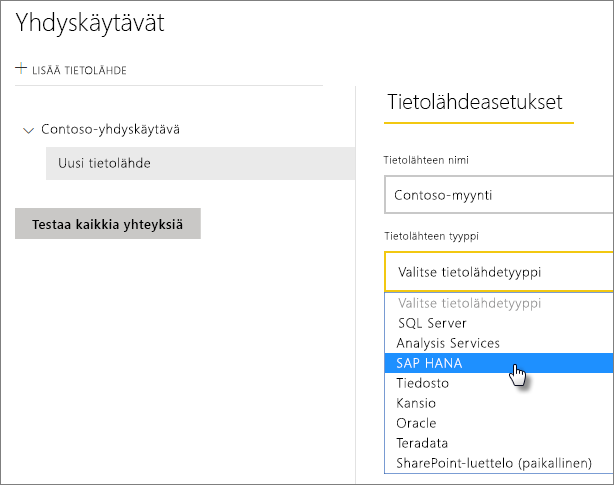
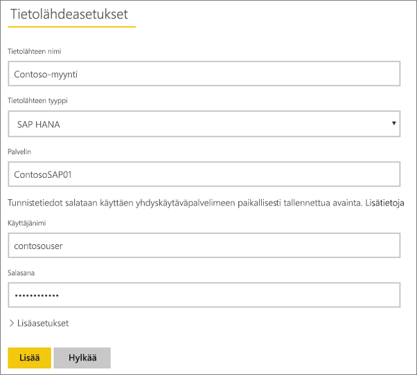
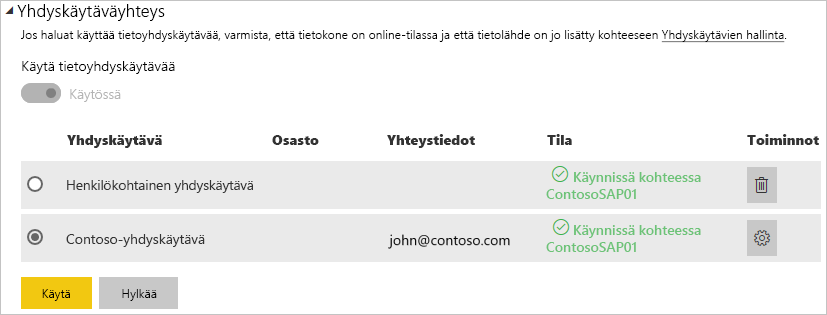

# Tietolähteen hallinta – SAP HANA

[!INCLUDE [gateway-rewrite](includes/gateway-rewrite.md)]

Kun [paikallinen tietoyhdyskäytävä on asennettu](/data-integration/gateway/service-gateway-install), sinun on [lisättävä tietolähteitä](service-gateway-data-sources.md#add-a-data-source), joita voidaan käyttää kyseisen yhdyskäytävän kanssa. Tässä artikkelissa perehdytään siihen, miten käsitellään yhdyskäytäviä ja SAP HANA -tietolähteitä, joita käytetään joko ajoitetussa päivityksessä tai DirectQueryssa.

## Tietolähteen lisääminen

Lisätietoja tietolähteen lisäämisestä on artikkelissa [Tietolähteen lisääminen](service-gateway-data-sources.md#add-a-data-source). Valitse SAP HANA **tietolähteen tyypiksi**.

Kun olet valinnut SAP HANA -tietolähdetyypin, täytä sen jälkeen tietolähteen **Palvelin**-, **Käyttäjänimi**- ja **Salasana**-tiedot.

> [!NOTE]
> Kaikki tietolähteeseen kohdennetut kyselyt suoritetaan näitä tunnistetietoja käyttämällä. Lisätietoja tunnistetietojen tallentamisesta on artikkelissa [Salattu tunnistetietojen tallentaminen pilvipalveluun](service-gateway-data-sources.md#store-encrypted-credentials-in-the-cloud).

Valitse **Lisää** sen jälkeen, kun olet saanut kaiken täytettyä. Voit nyt käyttää tätä tietolähdettä ajoitettuihin päivityksiin tai DirectQueryyn paikallista SAP HANA -palvelinta vastaan. *Yhteyden muodostaminen onnistui* -teksti tulee näkyviin, jos yhteys muodostettiin onnistuneesti.

### Lisäasetukset

Vaihtoehtoisesti voit määrittää tietolähteellesi yksityisyystason. Tällä hallinnoidaan sitä, miten tietoja voidaan yhdistää. Tätä käytetään vain ajoitetussa päivityksessä. Tämä ei koske DirectQuerya. Lisätietoja tietolähteen yksityisyystasoista on artikkelissa [Yksityisyystasot (Power Query)](https://support.office.com/article/Privacy-levels-Power-Query-CC3EDE4D-359E-4B28-BC72-9BEE7900B540).

## Tietolähteen käyttö

Kun tietolähde on luotu, se on käyttäjien saatavilla joko DirectQuery-yhteyksien tai ajoitetun päivityksen välityksellä.

> [!NOTE]
> Palvelimen ja tietokannan nimien pitää täsmätä paikallisen tietoyhdyskäytävän Power BI Desktopin ja tietolähteen kanssa.

Yhdyskäytävän tietojoukon ja tietolähteen välinen linkki perustuu palvelimen ja tietokannan nimiin. Näiden on täsmättävä. Jos esimerkiksi Power BI Desktopissa palvelimen nimelle annetaan IP-osoite, samaa IP-osoitetta tulee käyttää myös yhdyskäytävän kokoonpanon tietolähteessä. Jos käytät Power BI Desktopissa nimenä *PALVELIN\ESIINTYMÄ*, yhdyskäytävälle määritetyn tietolähteen sisällä on käytettävä samaa nimeä.

Tämä koskee sekä DirectQuerya että ajoitettuja päivityksiä.

### Tietolähteen käyttö DirectQueryssa

Palvelimen ja tietokannan nimen on täsmättävä Power BI Desktopissa ja yhdyskäytävälle määritetyssä tietolähteessä. Varmista myös, että käyttäjä on mainittu tietolähteen **Käyttäjät**-välilehdellä, jotta voit julkaista DirectQuery-tietojoukkoja. DirectQuery-valinta tapahtuu Power BI Desktopissa, kun tuot tietoja ensimmäisen kerran. Lisätietoja DirectQueryn käyttämisestä on artikkelissa [DirectQueryn käyttö Power BI Desktopissa](desktop-use-directquery.md).

Raporttisi alkaa toimia, kun olet julkaissut tietojoukot Power BI Desktopissa tai **Nouda tiedot** -ominaisuudella. Yhdyskäytävässä luodun tietolähteen luomisen jälkeen voi kestää useita minuutteja, ennen kuin yhteyttä voidaan käyttää.

### Tietolähteen käyttö ajoitetun päivityksen kanssa

Jos sinut on lisätty yhdyskäytävän sisällä määritellyn tietolähteen **Käyttäjät**-välilehdelle ja jos palvelimen ja tietokannan nimet täsmäävät, näet yhdyskäytävän yhtenä, ajoitetun päivityksen kanssa käytettävänä vaihtoehtona.

## Seuraavat vaiheet

* [Paikallisen tietoyhdyskäytävän vianmääritys](/data-integration/gateway/service-gateway-tshoot)
* [Yhdyskäytävien vianmääritys – Power BI](service-gateway-onprem-tshoot.md)  

Onko sinulla kysyttävää? [Kokeile Power BI -yhteisöä](http://community.powerbi.com/)

