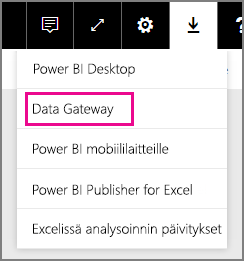
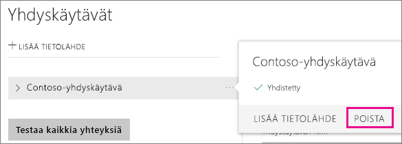
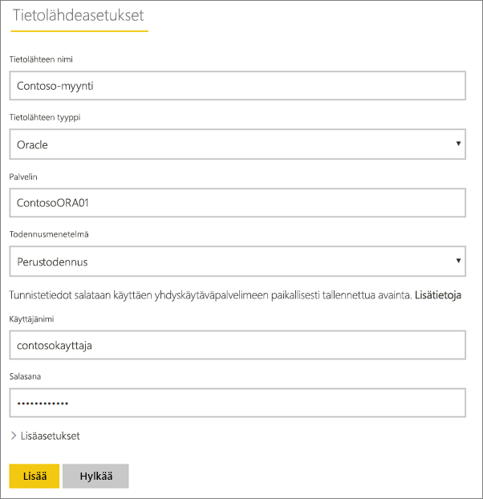
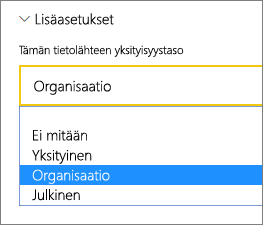
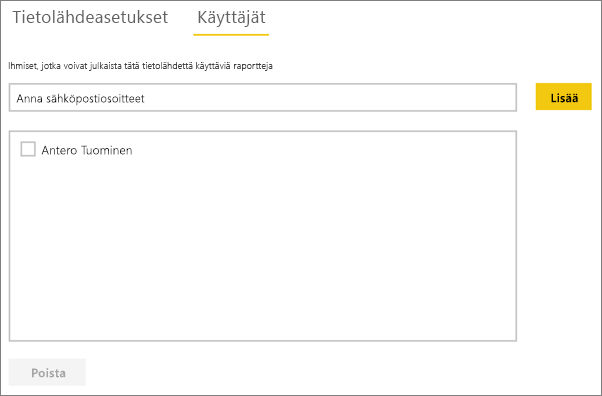
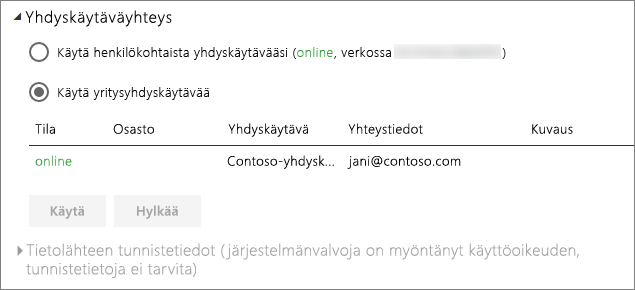

# Tietolähteen hallinta – tuonti ja ajoitettu päivitys
Kun paikallinen tietoyhdyskäytävä on asennettu, sinun on lisättävä tietolähteitä, joita voidaan käyttää kyseisen yhdyskäytävän kanssa. Tämä artikkeli kuvailee, miten ajoitetussa päivityksessä käytettäviä yhdyskäytäviä ja tietolähteitä käytetään DirectQueryn tai reaaliaikaisen yhteyden sijasta.

## Lataa ja asenna yhdyskäytävä
Voit ladata yhdyskäytävän Power BI -palvelusta. Valitse **Lataukset** > **Tietoyhdyskäytävä** tai siirry [yhdyskäytävän lataussivulle](https://go.microsoft.com/fwlink/?LinkId=698861).

## Lisää yhdyskäytävä
Lisää yhdyskäytävä valitsemalla [Lataa](https://go.microsoft.com/fwlink/?LinkId=698863) ja asenna yritysyhdyskäytävä ympäristössäsi sijaitsevalle palvelimelle. Kun yhdyskäytävä on asennettu, se näkyy yhdyskäytävälistassa **Hallinnoi yhdyskäytäviä** -kohdassa.

> [!NOTE]
> **Hallinnoi yhdyskäytäviä** -valikkoa ei näytetä, jos et ole yhdenkään yhdyskäytävän järjestelmävalvoja. Pääset järjestelmävalvojaksi jos sinut lisätään sellaiseksi tai jos itse asennat ja määrittelet yhdyskäytävän.
> 
> 

## Yhdyskäytävän poistaminen
Yhdyskäytävän poistaminen poistaa myös kaikki kyseisen yhdyskäytävän alaiset tietolähteet.  Tämä rikkoo myös kaikki koontinäytöt ja raportit, jotka ovat riippuvaisia kyseisistä tietolähteistä.

1. Valitse hammaspyöräkuvake  oikeasta yläkulmasta > **Yhdyskäytävien hallinta**.
2. Yhdyskäytävä > **Poista**
   
   

## Tietolähteen lisääminen
Voit lisätä tietolähteen joko valitsemalla yhdyskäytävän ja napauttamalla **Lisää tietolähde** -kohtaa tai yhdyskäytävä > **Lisää tietolähde** -valinnasta.

Voit seuraavaksi valita **Tietolähdetyypin** listasta. Kaikkia listattuja tietolähteitä voi käyttää yritysyhdyskäytävän ajoitetussa päivityksessä. Analysis Servicesia, SQL Serveria ja SAP HANA:a voidaan käyttää ajoitetussa päivityksessä tai DirectQueryn/reaaliaikaisen yhteyden kanssa.

Täytä sitten tietolähteen tiedot, mukaan lukien lähteen tiedot sekä tunnistetiedot, joita käytetään kun tietolähteeseen otetaan yhteys.

> [!NOTE]
> Kaikki tietolähteeseen kohdennetut kyselyt suoritetaan näitä tunnistetietoja käyttämällä. Saadaksesi lisätietoja siitä, miten [tunnisteita](service-gateway-onprem.md#credentials) tallennetaan, lue paikallisen yhdyskäytävän pääartikkeli.
> 
> 

Napauta **Lisää**-painiketta, kun kaikki kohdat on täytetty.  Voit nyt käyttää tietolähdettä paikallisten tietojen ajoitetussa päivityksessä. *Yhteyden muodostaminen onnistui* -teksti tulee näkyviin, jos yhteys muodostettiin onnistuneesti.

<!-- Shared Install steps Include -->
[!INCLUDE [gateway-onprem-datasources-include](./includes/gateway-onprem-datasources-include.md)]

### Lisäasetukset
Voit määrittää tietolähteellesi tietosuojatason. Tällä hallinnoidaan sitä, miten tietoja voidaan yhdistää. Tätä käytetään vain ajoitetussa päivityksessä. [Lue lisää](https://support.office.com/article/Privacy-levels-Power-Query-CC3EDE4D-359E-4B28-BC72-9BEE7900B540)

## Tietolähteen poistaminen
Tietolähteen poistaminen rikkoo kyseisestä tietolähteestä riippuvaiset koontinäytöt tai raportit.  

Poistaaksesi tietolähteen valitse Tietolähde > **Poista**.

## Järjestelmävalvojien hallinta
Yhdyskäytävän järjestelmänvalvojat -välilehdellä voit lisätä ja poistaa käyttäjiä, jotka voivat hallinnoida yhdyskäytävää. Tällä hetkellä käyttäjiä voi pelkästään lisätä. Suojausryhmiä ei ole mahdollista lisätä.

## Käyttäjien hallinta
Tietolähteen käyttäjät -välilehdellä voit lisätä ja poistaa käyttäjiä tai käyttöoikeusryhmiä, jotka voivat käyttää kyseistä tietolähdettä.

> [!NOTE]
> Käyttäjälista hallinnoi pelkästään sitä, kuka pystyy julkaisemaan raportteja. Raportin omistajat voivat luoda koontinäyttöjä tai sisältöpaketteja ja jakaa näitä muille käyttäjille.
> 
> 

## Tietolähteen käyttö ajoitetussa päivityksessä
Kun tietolähde on luotu, se on käyttäjien saatavilla joko DirectQuery -yhteyksien tai ajoitetun päivityksen välityksellä.

> [!NOTE]
> Palvelimen ja tietokannan nimien pitää täsmätä paikallisen tietoyhdyskäytävän Power BI Desktopin ja tietolähteen kanssa.
> 
> 

Yhdyskäytävän tietojoukon ja tietolähteen välinen linkki perustuu palvelimen ja tietokannan nimiin. Näiden on täsmättävä. Jos esimerkiksi Power BI Desktopissa palvelimen nimelle annetaan IP-osoite, samaa IP-osoitetta tulee käyttää myös yhdyskäytävän kokoonpanon tietolähteessä. Jos käytät Power BI Desktopissa *PALVELINTA\ ESIINTYMÄÄ* on yhdyskäytävälle määritetyn tietolähteen sisällä käytettävä sitä samaa.

Jos olet listattuna yhdyskäytävässä määritetyn tietolähteen **Käyttäjät** -välilehdellä ja palvelimen sekä tietokannan nimet täsmäävät, yhdyskäytävä näkyy ajoitetussa päivityksessä käytettävissä olevana vaihtoehtona.

> [!WARNING]
> Jos tietojoukkosi sisältää useita tietolähteitä, jokaisen tietolähteen on oltava lisättynä yhdyskäytävään. Jos yksi tai useampi tietolähde ei ole lisättynä yhdyskäytävään, ei yhdyskäytävää näytetä ajoitetun päivityksen yhteydessä.
> 
> 

## Rajoitukset
* OAuth-todentamista ei tueta paikallisen tietoyhdyskäytävän kanssa käytettäväksi. OAuth-todentamista vaativia tietolähteitä ei ole mahdollista lisätä. Jos tietojoukon tietolähde vaatii OAuth-todentamisen, ei yhdyskäytävää ole mahdollista käyttää ajoitetussa päivityksessä.

## Seuraavat vaiheet
[Paikallinen tietoyhdyskäytävä](service-gateway-onprem.md)  
[Paikallinen tietoyhdyskäytävä – tarkat tiedot](service-gateway-onprem-indepth.md)  
[Paikallisen tietoyhdyskäytävän vianmääritys](service-gateway-onprem-tshoot.md)  
Onko sinulla muuta kysyttävää? [Kokeile Power BI -yhteisöä](http://community.powerbi.com/)

