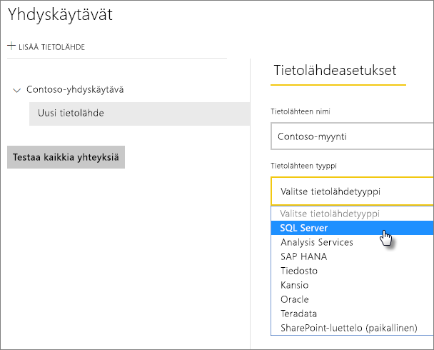
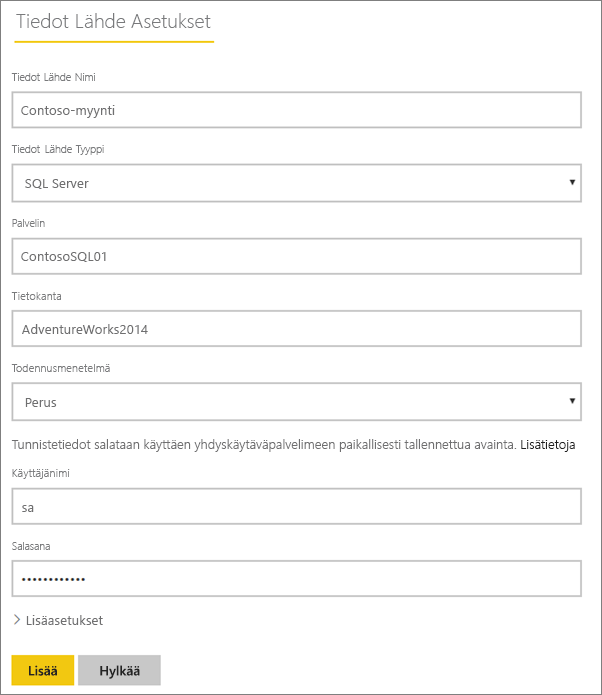
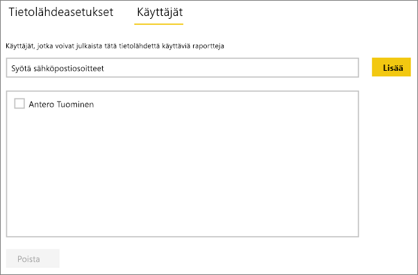
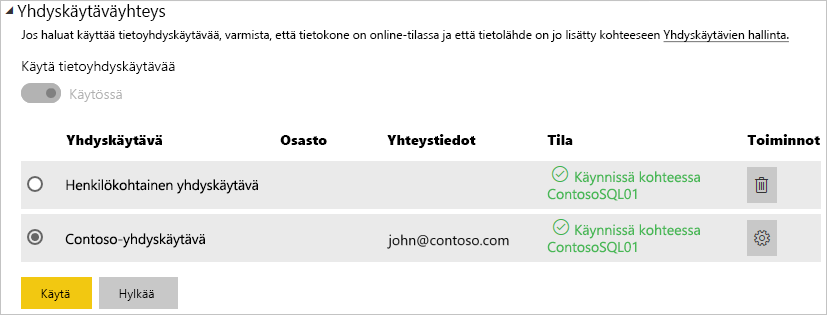

# Tietolähteen hallinta – SQL Server
Kun paikallinen tietoyhdyskäytävä on asennettu, sinun on lisättävä tietolähteitä, joita voidaan käyttää kyseisen yhdyskäytävän kanssa. Tässä artikkelissa tarkastellaan yhdyskäytävien ja tietolähteiden käsittelyä. Voit käyttää SQL Server-tietolähdettä joko ajoitettua päivitystä tai DirectQuerya varten.

## Yhdyskäytävän lataaminen ja asentaminen
Voit ladata yhdyskäytävän Power BI -palvelusta. Valitse **Lataukset** > **Tietoyhdyskäytävä** tai siirry [yhdyskäytävän lataussivulle](https://go.microsoft.com/fwlink/?LinkId=698861).

## Yhdyskäytävän lisääminen
Voit lisätä yhdyskäytävän yksinkertaisesti [lataamalla](https://go.microsoft.com/fwlink/?LinkId=698861) ja asentamalla yhdyskäytävän ympäristössäsi olevalle palvelimelle. Kun olet asentanut yhdyskäytävän, se näkyy yhdyskäytävien luettelossa **yhdyskäytävien hallinta** -kohdassa.

> [!NOTE]
> **Hallinnoi yhdyskäytäviä** -valikkoa ei näytetä, jos et ole yhdenkään yhdyskäytävän järjestelmävalvoja. Näin tapahtuu, kun sinut lisätään järjestelmänvalvojana yhdyskäytävään tai asennat ja määrität yhdyskäytävän itse.
> 
> 

## Yhdyskäytävän poistaminen
Yhdyskäytävän poistaminen poistaa myös kaikki kyseisen yhdyskäytävän alaiset tietolähteet.  Tämä rikkoo myös kaikki koontinäytöt ja raportit, jotka ovat riippuvaisia kyseisistä tietolähteistä.

1. Valitse hammaspyöräkuvake  oikeasta yläkulmasta > **Yhdyskäytävien hallinta**.
2. Yhdyskäytävä > **Poista**
   
   

## Tietolähteen lisääminen
Voit lisätä tietolähteen joko valitsemalla yhdyskäytävän ja napauttamalla **Lisää tietolähde** -kohtaa tai yhdyskäytävä > **Lisää tietolähde** -valinnasta.

Voit seuraavaksi valita **Tietolähdetyypin** listasta.

> [!NOTE]
> DirectQuery käytettäessä yhdyskäytävä tukee vain versiota **SQL Server 2012 SP1** ja sitä uudempia.
> 
> 

Täytä sitten tietolähteen tiedot, jotka sisältävät **Palvelimen** ja **Tietokannan**.  

Sinun on myös valittava **todennusmenetelmä**.  Tämä voi olla joko **Windows** tai **Basic**.  Haluat ehkä valita vaihtoehdon **Basic**, jos aiot käyttää SQL-todennusta Windows-todennuksen sijaan. Anna tunnistetiedot, joita käytetään tälle tietolähteelle.

> [!NOTE]
> Kaikki kyselyt tietolähteelle suoritetaan käyttämällä näitä tunnistetietoja, ellei Kerberos-kertakirjautumista (SSO) ole määritetty ja käytössä tietolähteelle. SSO:n avulla tietojoukkojen tuonnissa käytetään tallennettuja tunnistetietoja, mutta DirectQuery-tietojoukkoja käytetään nykyisen Power BI -käyttäjän kyselyihin SSO:n avulla. Lisätietoja saa artikkelista Paikallisen tietojen yhdyskäytävä siitä, miten [tunnistetiedot](service-gateway-onprem.md#credentials) tallennetaan, tai artikkelista, jossa kuvataan, miten [käyttää Kerberos for SSO:a (kertakirjautuminen) Power BI:stä paikalliseen tietolähteiden ympäristöön](service-gateway-kerberos-for-sso-pbi-to-on-premises-data.md). 
> 
> 

Napauta **Lisää**-painiketta, kun kaikki kohdat on täytetty.   Voit nyt käyttää tätä tietolähdettä ajoitettuihin päivityksiin tai DirectQueryyn paikallista SQL Serveriä vastaan. *Yhteyden muodostaminen onnistui* -teksti tulee näkyviin, jos yhteys muodostettiin onnistuneesti.

### Lisäasetukset
Voit määrittää tietolähteellesi tietosuojatason. Tällä hallinnoidaan sitä, miten tietoja voidaan yhdistää. Tätä käytetään vain ajoitetussa päivityksessä. Tämä ei koske DirectQuerya. [Lue lisää](https://support.office.com/article/Privacy-levels-Power-Query-CC3EDE4D-359E-4B28-BC72-9BEE7900B540)

## Tietolähteen poistaminen
Tietolähteen poistaminen rikkoo kyseisestä tietolähteestä riippuvaiset koontinäytöt tai raportit.  

Poistaaksesi tietolähteen valitse Tietolähde > **Poista**.

## Järjestelmävalvojien hallinta
Yhdyskäytävän järjestelmänvalvojat-välilehdeltä voit lisätä ja poistaa käyttäjiä (tai käyttöoikeusryhmiä), jotka voivat hallita yhdyskäytävää.

## Käyttäjien hallinta
Tietolähteen käyttäjät -välilehdellä voit lisätä ja poistaa käyttäjiä tai käyttöoikeusryhmiä, jotka voivat käyttää kyseistä tietolähdettä.

> [!NOTE]
> Käyttäjälista hallinnoi pelkästään sitä, kuka pystyy julkaisemaan raportteja. Raportin omistajat voit luoda raporttinäkymiä tai sisältöpaketteja ja jakaa niitä muiden käyttäjien kanssa.
> 
> 

## Tietolähteen käyttö
Kun tietolähde on luotu, se on käyttäjien saatavilla joko DirectQuery -yhteyksien tai ajoitetun päivityksen välityksellä.

> [!NOTE]
> Palvelimen ja tietokannan nimien pitää täsmätä paikallisen tietoyhdyskäytävän Power BI Desktopin ja tietolähteen kanssa.
> 
> 

Yhdyskäytävän tietojoukon ja tietolähteen välinen linkki perustuu palvelimen ja tietokannan nimiin. Näiden on täsmättävä. Jos esimerkiksi **Power BI Desktopissa** palvelimen nimelle annetaan IP-osoite, samaa IP-osoitetta tulee käyttää myös yhdyskäytävän kokoonpanon tietolähteessä. Jos käytät Power BI Desktopissa *PALVELINTA\ ESIINTYMÄÄ* on yhdyskäytävälle määritetyn tietolähteen sisällä käytettävä sitä samaa.

Tämä koskee sekä DirectQuerya että ajoitettuja päivityksiä.

### Tietolähteen käyttö DirectQueryssa
Palvelimen ja tietokannan nimen on täsmättävä Power **BI Desktopissa** ja yhdyskäytävälle määritetyssä tietolähteessä. Varmista myös, että käyttäjä on mainittu tietolähteen **Käyttäjät**-välilehdellä, jotta voit julkaista  DirectQuery-tietojoukkoja. DirectQuery-valinta tapahtuu Power BI Desktopissa, kun tuot tietoja ensimmäisen kerran. [Lue lisää](desktop-use-directquery.md)

Raporttisi alkaa toimia, kun olet julkaissut tietojoukot Power BI Desktopissa tai **Nouda tiedot** -ominaisuudella. Yhdyskäytävässä luodun tietolähteen luomisen jälkeen voi kestää useita minuutteja, ennen kuin yhteyttä voidaan käyttää.

### Tietolähteen käyttö ajoitetun päivityksen kanssa
Jos sinut on lisätty yhdyskäytävän sisällä määritellyn tietolähteen **Käyttäjät**-välilehdelle ja jos palvelimen ja tietokannan nimet täsmäävät, näet yhdyskäytävän yhtenä, ajoitetun päivityksen kanssa käytettävänä vaihtoehtona.

## Seuraavat vaiheet
* [Paikallinen tietoyhdyskäytävä](service-gateway-onprem.md)  
* [Paikallinen tietoyhdyskäytävä – tarkat tiedot](service-gateway-onprem-indepth.md)  
* [Paikallisen tietoyhdyskäytävän vianmääritys](service-gateway-onprem-tshoot.md)
* [Kerberoksen käyttäminen SSO:ta (kertakirjautumista) varten Power BI:stä paikallisiin tietolähteisiin](service-gateway-kerberos-for-sso-pbi-to-on-premises-data.md). 
* Onko sinulla muuta kysyttävää? [Kokeile Power BI -yhteisöä](http://community.powerbi.com/)

