# Tietolähteen hallinta - Analysis Services
Kun olet asentanut paikallisen tietoyhdyskäytävän, sinun on lisättävä tietolähteitä, joita voi käyttää kyseisen yhdyskäytävän kanssa. Tässä artikkelissa tarkastellaan yhdyskäytävien ja tietolähteiden käsittelyä. Voit käyttää Analysis Services -tietolähdettä joko ajoitettuihin päivityksiin tai reaaliaikaisiin yhteyksiin.

<iframe width="560" height="315" src="https://www.youtube.com/embed/ownIGbcRAAU" frameborder="0" allowfullscreen></iframe>

## Yhdyskäytävän lataaminen ja asentaminen
Voit ladata yhdyskäytävän Power BI -palvelusta. Valitse **Lataukset** > **Tietoyhdyskäytävä** tai siirry [yhdyskäytävän lataussivulle](https://go.microsoft.com/fwlink/?LinkId=698861).

## Reaaliaikaisten Analysis Services -yhteyksien rajoitukset
Voit käyttää reaaliaikaista yhteyttä taulukkomuotoisiin tai moniulotteisiin esiintymiin.

| **Palvelinversio** | **Pakollinen SKU** |
| --- | --- |
| 2012 SP1 CU4 tai uudempi versio |Business Intelligence- ja Enterprise SKU |
| 2014 |Business Intelligence- ja Enterprise SKU |
| 2016 |Standard SKU tai uudempi versio |

* Solutason muotoilu- ja käännösominaisuuksia ei tueta.
* Toiminnot ja Nimetyt joukot eivät näy Power BI:ssä, mutta voit silti muodostaa yhteyden monidimensiollisiin kuutioihin, jotka sisältävät myös toimintoja ja nimettyjä joukkoja, ja luoda visualisointeja ja raportteja.

## Yhdyskäytävän lisääminen
Voit lisätä yhdyskäytävän yksinkertaisesti [lataamalla](https://go.microsoft.com/fwlink/?LinkId=698861) ja asentamalla yhdyskäytävän ympäristössäsi olevalle palvelimelle. Kun olet asentanut yhdyskäytävän, se näkyy yhdyskäytävien luettelossa **yhdyskäytävien hallinta** -kohdassa.

> [!NOTE]
> **Hallinnoi yhdyskäytäviä** -valikkoa ei näytetä, jos et ole yhdenkään yhdyskäytävän järjestelmävalvoja. Pääset järjestelmävalvojaksi jos sinut lisätään sellaiseksi tai jos itse asennat ja määrittelet yhdyskäytävän.
> 
> 

## Yhdyskäytävän poistaminen
Yhdyskäytävän poistaminen poistaa myös kaikki kyseisen yhdyskäytävän alaiset tietolähteet.  Tämä rikkoo myös kaikki koontinäytöt ja raportit, jotka ovat riippuvaisia kyseisistä tietolähteistä.

1. Valitse hammaspyöräkuvake  oikeasta yläkulmasta > **Yhdyskäytävien hallinta**.
2. Yhdyskäytävä > **Poista**
   
   

## Tietolähteen lisääminen
Voit lisätä tietolähteen joko valitsemalla yhdyskäytävän ja napauttamalla **Lisää tietolähde** -kohtaa tai yhdyskäytävä > **Lisää tietolähde** -valinnasta.

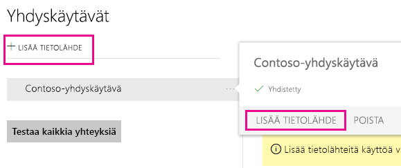

Voit sen jälkeen valita **Tietolähteen tyypin** luettelosta. Valitse Analysis Services, jos olet muodostamassa yhteyttä Multidimensioiseen tai Taulukkomuotoiseen palvelimeen.

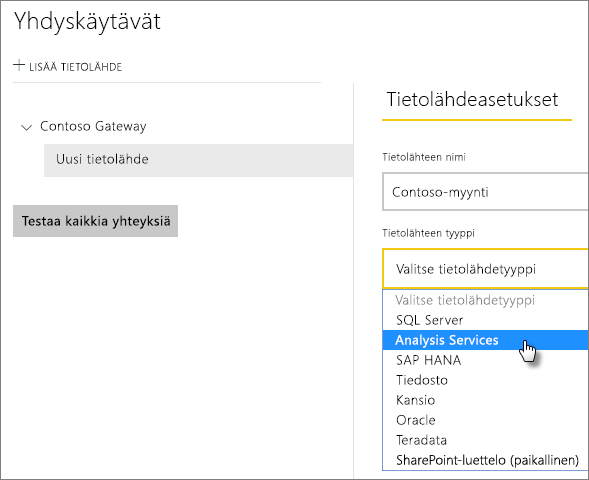

Täytä sitten tietolähteen tiedot, jotka sisältävät **Palvelimen** ja **Tietokannan**.  

Yhdyskäytävä käyttää kirjoittamaasi **Käyttäjänimeä** ja **salasanaa** muodostaessaan yhteyden Analysis Services -esiintymään.

> [!NOTE]
> Käyttämälläsi Windows-tilillä on oltava palvelimen järjestelmänvalvojan oikeudet esiintymään, johon olet muodostamassa yhteyttä. Jos tämän tilin salasanalle on määritetty vanhentumisaika, käyttäjät saattavat kohdata yhteysvirheen, jos salasanaa ei päivitetä tietolähteessä. Paikallinen tietoyhdyskäytävä -artikkelissa on lisätietoja siitä, miten [tunnistetiedot](service-gateway-onprem.md#credentials) tallennetaan.
> 
> 

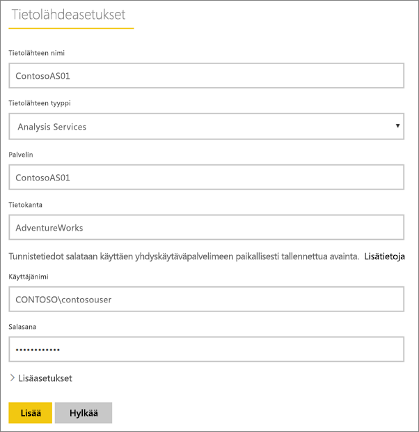

Voit napsauttaa **Lisää** sen jälkeen, kun kaikki kentät on täytetty.  Voit nyt käyttää tätä tietolähdettä ajoitettuihin päivityksiin tai reaaliaikaisiin yhteyksiin paikallisessa Analysis Services -esiintymässä.  Jos yhteyden muodostaminen onnistuu, näet *Yhteyden muodostaminen onnistui* -ilmoituksen.

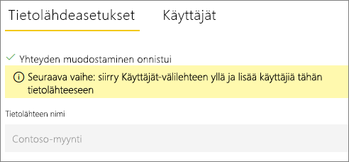

### Lisäasetukset
Voit määrittää tietolähteellesi tietosuojatason. Tällä hallinnoidaan sitä, miten tietoja voidaan yhdistää. Tätä käytetään vain ajoitettuihin päivityksiin. Se ei koske reaaliaikaisia yhteyksiä. [Lue lisää](https://support.office.com/article/Privacy-levels-Power-Query-CC3EDE4D-359E-4B28-BC72-9BEE7900B540)

## Käyttäjänimet ja Analysis Services
Aina, kun käyttäjä on vuorovaikutuksessa Analysis Servicesiin yhdistetyn raportin kanssa, käytössä oleva käyttäjänimi välitetään yhdyskäytävään ja paikalliseen Analysis Services -palvelimeen. Analysis Servicesiin välitetään käyttäjätietona Power BI:hin kirjautumisessa käytetty sähköpostiosoite. Yhteys välittää tämän [EffectiveUserName](https://msdn.microsoft.com/library/dn140245.aspx#bkmk_auth)-ominaisuutena. Tämän sähköpostiosoitteen on vastattava paikallisen Active Directory -toimialueeseen määritettyä täydellistä käyttäjätunnusta. Täydellinen käyttäjätunnus on Active Directory -tilin ominaisuus. Windows-tilin on oltava käytössä Analysis Services -roolissa. Kirjautuminen ei onnistu, jos Active Directorysta ei löydy vastaavuutta. [Lue lisää](https://msdn.microsoft.com/library/ms677605.aspx)

Voit myös liittää Power BI -kirjautumisnimen paikallisen hakemiston täydelliseen käyttäjätunnukseen. [Lue lisää](service-gateway-enterprise-manage-ssas.md#map-user-names)

<iframe width="560" height="315" src="https://www.youtube.com/embed/Qb5EEjkHoLg" frameborder="0" allowfullscreen></iframe>

### Mistä tiedän, mikä täydellinen käyttäjätunnukseni on?
Et välttämättä tiedä täydellistä käyttäjätunnustasi etkä ehkä ole toimialueen järjestelmänvalvoja. Voit selvittää tilisi täydellisen käyttäjätunnuksen työasemaltasi seuraavan komennon avulla.

    whoami /upn

Tulos näyttää samalta kuin sähköpostiosoite, mutta kyseessä on toimialuetilisi täydellinen käyttäjätunnus. Jos käytät Analysis Services -tietolähdettä reaaliaikaisiin yhteyksiin eikä se vastaa Power BI:hin kirjautuessa käyttämääsi sähköpostiosoitetta, tutustu [käyttäjänimien liittämiseen](#map-user-names).

## Käyttäjänimien liittäminen
<iframe width="560" height="315" src="https://www.youtube.com/embed/eATPS-c7YRU" frameborder="0" allowfullscreen></iframe>

Voit liittää Analysis Services -palveluissa käyttämiäsi käyttäjänimiä kahdella eri tavalla:

1. Manuaalinen käyttäjänimen uudelleenliittäminen 
2. Paikallisen Active Directory -ominaisuuden valinta täydellisten AAD-käyttäjänimien liittämiseksi Active Directory -käyttäjiin (AD-valinnan liittäminen)

Manuaalinen liittäminen on mahdollista toisella lähestymistavalla, mutta se vie paljon aikaa ja sen ylläpito on vaikeaa. Se on erityisen vaikeaa silloin, kun kuvioiden vastaavuus ei riitä, esim. kun AAD- ja paikallisen AD:n toimialuenimet eroavat toisistaan tai kun käyttäjätilien nimet ovat erilaiset AAD:n ja AD:n välillä. Tämän vuoksi manuaalista liittämistä toisella menetelmällä ei suositella.

Menetelmät on kuvattu järjestyksessä kahdessa seuraavassa osassa

### Manuaalinen käyttäjänimen uudelleenliittäminen
Voit määrittää mukautetut täydellisten käyttäjänimien (UPN) säännöt Analysis Services -tietolähteille. Tästä on apua, jos Power BI -palvelun kirjautumisnimet eivät vastaa paikallisen hakemistosi täydellisiä käyttäjätunnuksia. Jos kirjaudut esimerkiksi Power BI:hin tunnuksella john@contoso.com, mutta paikallisen hakemiston täydellinen käyttäjänimi on john@contoso.local, voit määrittää liittämissäännön, joka john@contoso.local välitetään Analysis Servicesille.

Voit siirtyä UPN-liittämisnäyttöön seuraavasti.

1. Valitse **hammaspyöräkuvake** ja valitse **Yhdyskäytävien hallinta**.
2. Laajenna yhdyskäytävä, joka sisältää Analysis Services -tietolähteen. Jos et ole luonut Analysis Services -tietolähdettä, voit tehdä sen tässä vaiheessa.
3. Valitse tietolähde ja valitse sitten **Käyttäjät**-välilehti.
4. Valitse **Käyttäjänimien liittäminen**.
   
    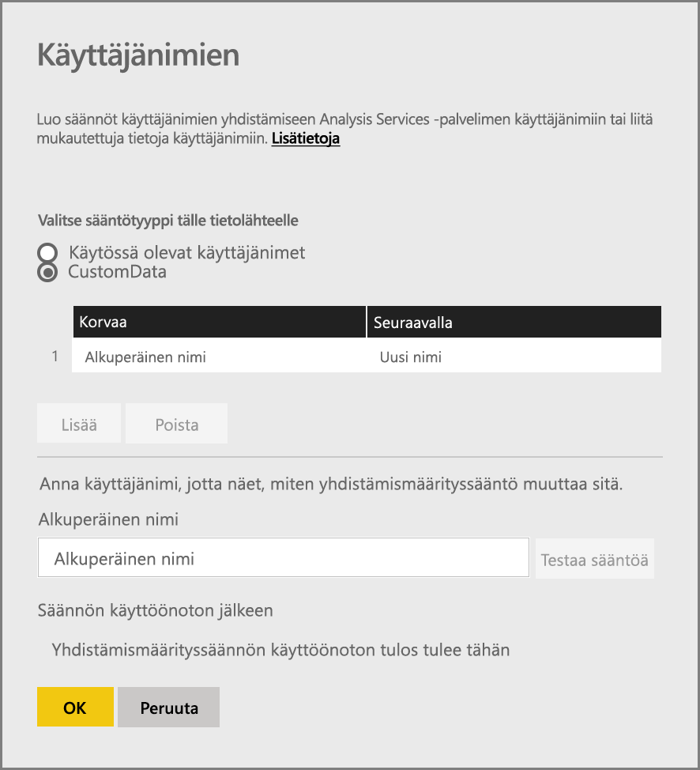

Näyttöön tulee vaihtoehtoja sääntöjen lisäämiseksi ja testaamiseksi tietylle käyttäjälle.

> [!NOTE]
> Saatat vahingossa muuttaa käyttäjää, jolle muutoksia ei ollut tarkoitus tehdä. Jos esimerkiksi **Korvaa (alkuperäinen arvo)** on *@contoso.com* ja **Korvaava (uusi nimi)** on *@contoso.local*, kaikki käyttäjät, joiden kirjautumisnimi sisältää *@contoso.com*, korvataan arvolla *@contoso.local*. Jos **Korvaa (alkuperäinen nimi)** on *dave@contoso.com* ja **Korvaava (uusi nimi)** on *dave@contoso.local*, käyttäjä, jonka kirjautumistunnus on v-dave@contoso.com, lähetetään nimellä v-dave*@contoso.local*.
> 
> 

### AD-valinnan liittäminen
Voit suorittaa paikallisen AD-ominaisuuksien valinnan liittääksesi täydelliset AAD-käyttäjätunnukset täydelliset Active Directory -käyttäjiin tämän osan ohjeiden avulla. Katsotaan aluksi, miten tämä toimii.

**Power BI -palvelussa** tapahtuu seuraavaa:

- Jokaisen Power BI AAD -käyttäjän paikalliselle SSAS-palvelimelle lähettämän kyselyn mukana toimitetaan UPN-merkkijono, kuten:      firstName.lastName@contoso.com

> [!NOTE]
> Power BI -tietolähteessä määriteltyjä manuaalisia UPN-käyttäjäliitoksia sovelletaan *ennen* käyttäjänimen merkkijonon lähettämistä paikalliseen tietoyhdyskäytävään.
> 
> 

Toimi mukautettuja käyttäjän yhdistämismäärityksiä sisältävän paikallisen tietoyhdyskäytävän kanssa seuraavasti:

1. Etsi Active Directory -hakemisto, josta haluat tehdä haun (automaattisen tai määritettävän)
2. Etsi AD-henkilön määrite (kuten *sähköposti*) saapuvan UPN-merkkijonon perusteella (”firstName.lastName@contoso.com”) **Power BI -palvelusta**.
3. Jos AD-haku epäonnistuu, se yrittää käyttää välitettyä täydellistä käyttäjätunnusta SSAS:n EffectiveUser-arvona.
4. Jos AD-haku onnistuu, se hakee kyseisen AD-henkilön *UserPrincipalName*-arvon. 
5. Se välittää *UserPrincipalName*-sähköpostiosoitteen *EffectiveUser-arvoksi*  SSAS:lle, esim. *Alias@corp.on-prem.contoso*

Yhdyskäytävän määrittäminen AD-haun suorittamiseen:

1. Uusimman yhdyskäytävän lataaminen ja asentaminen
2. Yhdyskäytävässä sinun on määritettävä **paikallinen tietoyhdyskäytäväpalvelu** suoritettavaksi toimialuetilin kanssa (paikallisen palvelutilin sijaan – muussa tapauksessa AD-haku ei toimi oikein suorituspalvelussa). Yhdyskäytäväpalvelu on käynnistettävä uudelleen, jotta muutos tulee voimaan.  Siirry laitteellasi yhdyskäytäväsovellukseen (hae ”paikallinen tietoyhdyskäytävä”). Voit tehdä tämän siirtymällä kohtaan **Palvelun asetukset > Palvelutilin vaihtaminen**. Varmista, että sinulla tämän yhdyskäytävän palautusavain, sillä sinun on palautettava se samalla tietokoneella, ellet halua luoda uutta yhdyskäytävää. 
3. Siirry järjestelmänvalvojana yhdyskäytävän asennuskansioon, *C:\Program Files\On-premises data gateway* varmistaaksesi, että sinulla on oikeudet muokata seuraavaa tiedostoa ja tallentaa muutokset:
   
       Microsoft.PowerBI.DataMovement.Pipeline.GatewayCore.dll.config 
4. Muokkaa seuraavaa kahta määritysarvoa omiin AD-käyttäjiisi sovellettavien *omien* Active Directory -määritysten mukaan. Alla olevat määritysarvot ovat vain esimerkkejä – sinun on määritettävä ne Active Directory -määritystesi mukaisesti. 
   
   
5. Käynnistä **paikallinen tietoyhdyskäytävä**palvelu uudelleen, jotta määritysten muutokset tulevat voimaan.

### Liittämisen sääntöjen käsitteleminen
Voit luoda yhdistämissäännön kirjoittamalla **Alkuperäisen nimen** ja **Uuden nimen** arvot ja valitsemalla sitten **Lisää**.

| Kenttä | Kuvaus |
| --- | --- |
| Korvaa (alkuperäinen nimi) |Sähköpostiosoite, jolla olet kirjautunut Power BI:hin. |
| Korvaava (uusi nimi) |Korvaava arvo. Korvaamisen tulos lähetetään *EffectiveUserName*-arvona Analysis Services -yhteyttä muodostettaessa. |

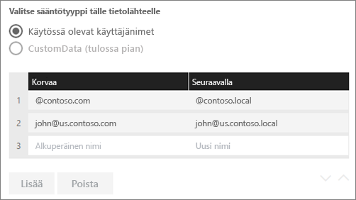

Kun valitset kohteen luettelosta, voit muuttaa sen järjestystä käyttämällä **kaksoisnuolikuvaketta** tai **Poistaa** sen kirjauksen.

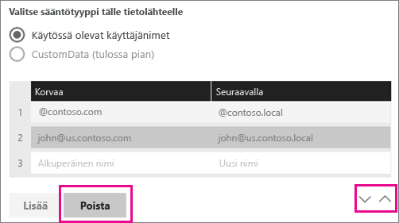

### .Yleismerkkien (*) käyttö
Voit käyttää yleismerkkejä **Korvaa (alkuperäinen nimi)** -merkkijonossa. Sitä voidaan käyttää vain itsenäisesti (ei minkään muun merkkijonon osan kanssa). Tämän avulla voit valita kaikki käyttäjät ja välittää tietolähteelle yhden arvon. Tästä on hyötyä, kun haluat kaikkien organisaatiosi käyttäjien käyttävän samaa käyttäjää paikallisessa ympäristössäsi.

### Liittämissäännön testaaminen
Voit vahvistaa, millä alkuperäinen nimi korvataan, antamalla arvon **Alkuperäinen nimi** -kenttään ja valitsemalla **Testaa sääntöä**.

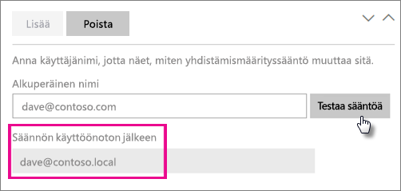

> [!NOTE]
> Palvelulla kestää joitain minuutteja aloittaa tallennettujen sääntöjen käyttö. Selaimella sääntö on heti voimassa.
> 
> 

### Liittämissääntöjä koskevat rajoitukset
* Liittämissäännöt koskevat tiettyä määritettävää tietolähdettä. Se ei ole yleinen asetus. Jos sinulla on useita Analysis Services -tietolähteitä, sinun on liitettävä kunkin tietolähteen käyttäjät erikseen.

## Tietolähteen poistaminen
Tietolähteen poistaminen vaikuttaa raporttinäkymiin ja raportteihin, jotka perustuvat kyseiseen tietolähteeseen.  

Voit poistaa tietolähteen kohdasta Tietolähde > **Poista**.

## Järjestelmävalvojien hallinta
Yhdyskäytävän järjestelmänvalvojat-välilehdeltä voit lisätä ja poistaa käyttäjiä (tai käyttöoikeusryhmiä), jotka voivat hallita yhdyskäytävää.

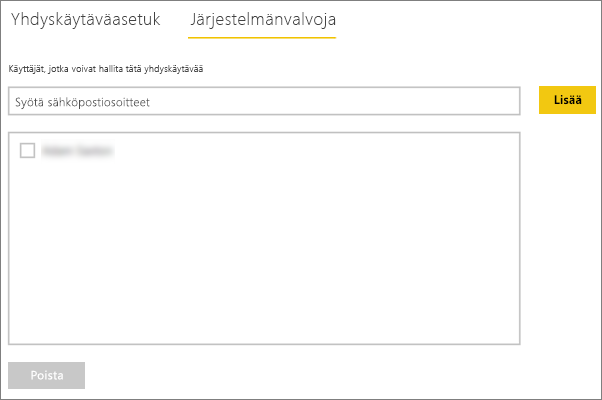

## Käyttäjien hallinta
Tietolähteen Käyttäjät-välilehdeltä voit lisätä ja poistaa käyttäjiä tai käyttöoikeusryhmiä, jotka voivat käyttää tätä tietolähdettä.

> [!NOTE]
> Käyttäjien luettelo määrää vain sen, ketkä voivat julkaista raportteja. Raportin omistajat voit luoda raporttinäkymiä tai sisältöpaketteja ja jakaa niitä muiden käyttäjien kanssa.
> 
> 

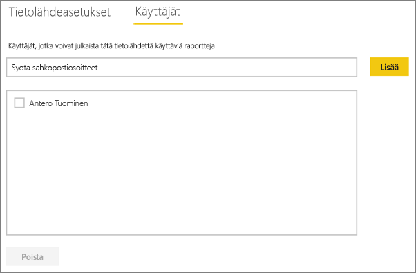

## Tietolähteen käyttö
Kun olet luonut tietolähteen, sitä voi käyttää joko reaaliaikaisissa yhteyksissä tai ajoitetun päivityksen kautta.

> [!NOTE]
> Palvelimen ja tietokannan nimen on täsmättävä Power BI Desktopissa ja paikallisessa tietolähdeyhdyskäytävässä.
> 
> 

Yhdyskäytävän tietojoukon ja tietolähteen välinen linkki perustuu palvelimen ja tietokannan nimiin. Näiden on täsmättävä. Jos esimerkiksi Power BI Desktopissa palvelimen nimelle annetaan IP-osoite, samaa IP-osoitetta tulee käyttää myös yhdyskäytävän kokoonpanon tietolähteessä. Jos käytät nimenä *PALVELIN\ESIINTYMÄ*, sinun on Power BI Desktopissa käytettävä samaa nimeä yhdyskäytävään määritetyssä tietolähteessä.

Tämä koskee sekä reaaliaikaisia yhteyksiä että ajoitettuja päivityksiä.

### Tietolähteen käyttö reaaliaikaisissa yhteyksissä
Palvelimen ja tietokannan nimen on täsmättävä Power BI Desktopissa ja yhdyskäytävälle määritetyssä tietolähteessä. Varmista myös, että käyttäjä on mainittu tietolähteen **Käyttäjät**-välilehdellä, jotta voit julkaista tietojoukkoja reaaliaikaisella yhteydellä. Reaaliaikaisten yhteyksien valinta tapahtuu Power BI Desktopissa, kun tuot tietoja ensimmäisen kerran.

Raporttisi alkaa toimia, kun olet julkaissut tietojoukot Power BI Desktopissa tai **Nouda tiedot** -ominaisuudella. Yhdyskäytävässä luodun tietolähteen luomisen jälkeen voi kestää useita minuutteja, ennen kuin yhteyttä voidaan käyttää.

### Tietolähteen käyttö ajoitetun päivityksen kanssa
Jos sinut on lisätty yhdyskäytävän sisällä määritellyn tietolähteen **Käyttäjät**-välilehdelle ja jos palvelimen ja tietokannan nimet täsmäävät, näet yhdyskäytävän yhtenä, ajoitetun päivityksen kanssa käytettävänä vaihtoehtona.

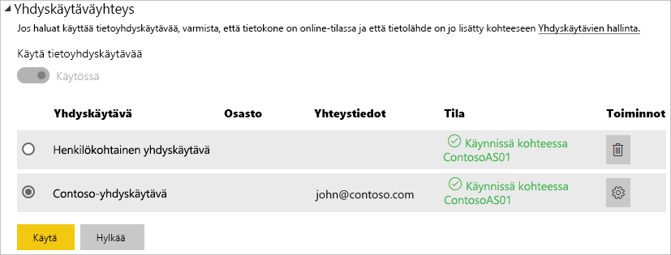

## Seuraavat vaiheet
[Paikallinen tietoyhdyskäytävä](service-gateway-onprem.md)  
[Paikallinen tietoyhdyskäytävä – tarkat tiedot](service-gateway-onprem-indepth.md)  
[Paikallisen tietoyhdyskäytävän vianmääritys](service-gateway-onprem-tshoot.md)  
Onko sinulla muuta kysyttävää? [Kokeile Power BI -yhteisöä](http://community.powerbi.com/)

