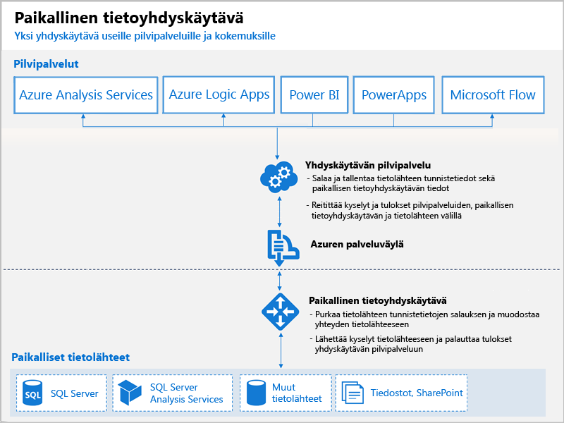

# Mitä ovat Power BI -yhdyskäytävät?

Power BI -yhdyskäytävä on ohjelmisto, jonka asennat paikalliseen verkkoon; se helpottaa tietojen käyttöä kyseisessä verkossa. Se muistuttaa portinvartijaa, joka kuuntelee yhteyspyyntöjä ja myöntää ne vain, kun käyttäjien pyynnöt täyttävät tietyt ehdot. Näin organisaatiot voivat säilyttää tietokannat ja muut tietolähteet paikallisissa verkoissa ja käyttää niitä turvallisesti Power BI -raportteja ja -raporttinäkymiä varten.

Yhdyskäytävää voidaan käyttää yksittäisen tietolähteen tai useiden tietolähteiden kanssa. Seuraavassa kaaviossa on perusnäkymä, jossa yhdyskäytävä käsittelee pyyntöjä pilvestä kolmea paikallista tietokonetta varten. Tutustumme tähän laajemmin myöhemmin tässä artikkelissa.

## Yhdyskäytävien tyypit

Power BI tarjoaa kaksi eri yhdyskäytävää eri käyttötarkoituksiin:

* **Paikallinen tietoyhdyskäytävä (henkilökohtainen tila)** – yksi käyttäjä voi muodostaa yhteyden tietolähteisiin, eikä tietoyhdyskäytävää voi jakaa muiden kanssa. Voidaan käyttää vain Power BI:n kanssa. Tämä yhdyskäytävä sopii hyvin tilanteisiin, joissa sinä olet ainoa raporttien luoja eikä sinun tarvitse jakaa tietolähteitä muiden kanssa.

* **Paikallinen tietoyhdyskäytävä** – useat käyttäjät voivat muodostaa yhteyden useisiin paikallisiin tietolähteisiin. Voidaan käyttää Power BI:n, PowerAppsin, Flow’n, Azure Analysis Servicesin ja Azure Logic -sovellusten kanssa, kaikki yhdellä yhdyskäytävän asennuksella. Tämä yhdyskäytävä sopii hyvin monimutkaisempiin tilanteisiin, joissa useat käyttäjät käyttävät useita tietolähteitä. 

## Yhdyskäytävän käyttäminen

Yhdyskäytävän käyttämisessä on neljä päävaihetta:

1. **Asenna yhdyskäytävä** paikalliseen tietokoneeseen käyttämällä asianmukaista tilaa
2. **Lisää käyttäjiä yhdyskäytävään**, jotta he voivat käyttää paikallisia tietolähteitä
3. **Muodosta yhteys tietolähteisiin**, jotta niitä voidaan käyttää raporteissa ja raporttinäkymissä
4. **Päivitä paikalliset tiedot**, jotta Power BI -raportit ovat ajan tasalla

Voit asentaa erillisen yhdyskäytävän tai lisätä yhdyskäytävän *klusteriin*, joka on suositeltavaa suuren käytettävyyden kannalta.

## Yhdyskäytävien toimintatapa

Asentamasi yhdyskäytävä suoritetaan Windows palveluna **paikallisena tietoyhdyskäytävänä**. Tämä paikallinen palvelu on rekisteröity yhdyskäytävän pilvipalveluun Azuren palveluväylän kautta. Seuraavassa kaaviossa on esitetty tietovuo paikallisten tietojen ja kyseistä yhdyskäytävää käyttävien pilvipalvelujen välillä.

Kyselyt ja tietovuo:

1. Pilvipalvelu luo kyselyn paikallisen tietolähteen salatuilla tunnistetiedoilla. Kysely lähetetään jonoon yhdyskäytävän käsiteltäväksi.
2. Yhdyskäytävän pilvipalvelu analysoi kyselyn ja siirtää pyynnön Azuren palveluväylään.
3. Paikallinen tietoyhdyskäytävä tekee kyselyn Azuren palveluväylään odottavia pyyntöjä varten.
4. Yhdyskäytävä saa kyselyn, purkaa salauksen tunnistetiedot ja muodostaa yhteyden tietolähteisiin kyseisillä tunnistetiedoilla.
5. Yhdyskäytävä lähettää kyselyn tietolähteeseen suoritusta varten.
6. Tulokset lähetetään tietolähteestä takaisin yhdyskäytävään ja sitten pilvipalveluun ja palvelimeesi.

## Seuraavat vaiheet
[Paikallisen tietoyhdyskäytävän asentaminen](service-gateway-install.md)

Onko sinulla kysyttävää? [Kokeile Power BI -yhteisöä](http://community.powerbi.com/)

