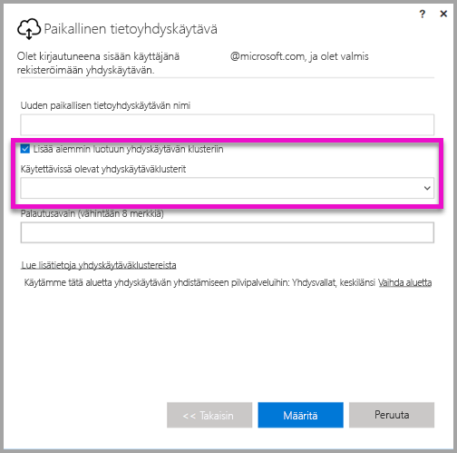
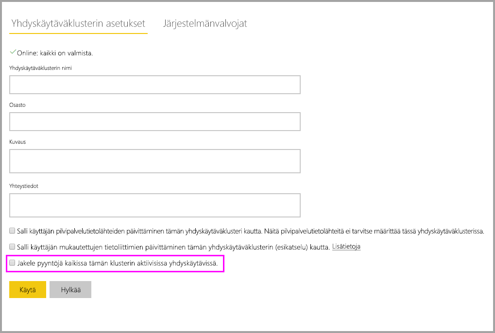

# <a name="high-availability-clusters-for-on-premises-data-gateway"></a>Suuren käytettävyyden klusterit paikallisessa tietoyhdyskäytävässä

Voit luoda **suuren käytettävyyden klustereita** **paikallisen tietoyhdyskäytävän** asennuksista, jotta organisaatiosi voi käyttää paikallisia tietoresursseja, joita käytetään Power BI -raporteissa ja koontinäytöissä. Tällaisten klustereiden avulla yhdyskäytävän järjestelmänvalvojat voivat ryhmittää yhdyskäytäviä, joilla voidaan välttää yksittäisiä vikapisteitä paikallisia tietoresursseja käytettäessä. Power BI -palvelu käyttää aina klusterin ensisijaista yhdyskäytävää, paitsi jos se ei ole käytettävissä. Siinä tapauksessa palvelu siirtyy käyttämään klusterin seuraavaa yhdyskäytävää ja niin edelleen.

Tässä artikkelissa kuvataan vaiheita, joiden avulla voit luoda suuren käytettävyyden klusterin paikallisista tietoyhdyskäytävistä ja jakaa parhaita käytäntöjä niiden määrittämisen aikana. Suuren käytettävyyden yhdyskäytäväklusterit edellyttävät marraskuun 2017 päivityksen paikalliseen tietoyhdyskäytävään tai uudemman version.

## <a name="setting-up-high-availability-clusters-of-gateways"></a>Suuren käytettävyyden yhdyskäytävien klustereiden määrittäminen

**Paikallisen tietoyhdyskäytävän** asennusprosessin aikana voit määrittää, lisätäänkö yhdyskäytävä aiemmin luotuun yhdyskäytäväklusteriin. 



Jos haluat lisätä yhdyskäytävän aiemmin luotuun klusteriin, sinun on annettava *Palautusavain* ensisijaiselle yhdyskäytäväesiintymälle siihen klusteriin, johon haluat uuden yhdyskäytävän liittyvän. Klusterin ensisijaisen yhdyskäytävän on käytettävä yhdyskäytävän päivitystä marraskuulta 2017 tai uudempaa versiota. 

## <a name="managing-a-gateway-cluster"></a>Yhdyskäytävän klusterin hallinta

Kun yhdyskäytävän klusteri koostuu kahdesta tai useammasta yhdyskäytävästä, kaikki yhdyskäytävän hallintatoiminnot, kuten tietolähteen lisääminen tai järjestelmänvalvojan oikeuksien myöntäminen yhdyskäytävään, koskevat kaikkia yhdyskäytäviä, jotka ovat osa klusteria.

Kun järjestelmänvalvojat käyttävät **Hallitse yhdyskäytäviä** -valikkokohdetta, joka sijaitsee **Power BI -palvelun** hammaspyöräkuvakkeen alapuolella, he näkevät rekisteröityjen klustereiden tai yksittäisten yhdyskäytävien luettelon, mutta he eivät näe yksittäisiä yhdyskäytäväesiintymiä, jotka ovat klusterin jäseniä.

Kaikki uudet **Ajoitettu päivitys** -pyynnöt ja DirectQuery-toiminnot reititetään automaattisesti tietyn yhdyskäytäväklusterin ensisijaiseen esiintymään. Jos ensisijainen yhdyskäytäväesiintymä ei ole verkossa, pyyntö reititetään klusterin toiseen yhdyskäytäväesiintymään.

## <a name="distribute-requests-traffic-across-all-gateways-in-a-cluster"></a>Pyyntöliikenteen jakaminen klusterin kaikissa yhdyskäytävissä

Voit sallia sen, että liikenne jaetaan klusterin kaikissa yhdyskäytävissä. Kun napsautat **Yhdyskäytävien hallinta** -sivulla **Power BI -palvelussa** yhdyskäytäväklusteria vasemman siirtymisruudun luettelossa, voit ottaa käyttöön tässä klusterissa vaihtoehdon ”Jaa pyyntöjä tämän klusterin kaikissa aktiivissa yhdyskäytävissä”.



## <a name="powershell-support-for-gateway-clusters"></a>PowerShell-tuki yhdyskäytäväklustereille

PowerShell-komentosarjat ovat käytettävissä paikallisen tietoyhdyskäytävän asennuskansiossa. Oletusarvon mukaan kansio on *C:\Program Files\ paikallinen tietoyhdyskäytävä*. Sinun on käytettävä PowerShellin versiota 5 tai uudempaa versiota, jotta nämä komentosarjat toimivat oikein. PowerShell-komentosarjojen avulla käyttäjät voivat tehdä seuraavia toimintoja:

-   Noutaa käyttäjän käytettävissä olevien yhdyskäytäväklustereiden luettelon
-   Noutaa klusteriin rekisteröityjen yhdyskäytäväesiintymien luettelon sekä noutaa niiden online- tai offline-tilan tiedot
-   Muokata yhdyskäytäväesiintymän ota käyttöön / poista käytöstä -tilaa klusterissa sekä muita yhdyskäytävän ominaisuuksia
-   Poistaa yhdyskäytävän

Jotta taulukossa olevia PowerShell-komentoja voidaan suorittaa, sinun on ensin suoritettava seuraavat toimet:

1. Avaa PowerShell-komentoikkuna järjestelmänvalvojana
2. Suorita sitten seuraava, yhden kerran suoritettava PowerShell-komento (tässä oletetaan, että nykyisellä laitteella ei ole koskaan suoritettu PowerShell-komentoja):

    ```
    Set-ExecutionPolicy -ExecutionPolicy Unrestricted -Force
    ```

3. Siirry seuraavaksi PowerShell-ikkunassa olevaan, paikallisen tietoyhdyskäytävän asennuskansioon ja tuo tarvittava moduuli seuraavan komennon avulla:

    ```
    Import-Module .\OnPremisesDataGatewayHAMgmt.psm1
    ```

Kun nämä vaiheet on suoritettu, voit käyttää yhdyskäytäväklustereiden hallintaan seuraavan taulukon komentoja.

| **Komento** | **Kuvaus** | **Parametrit** |
| --- | --- | --- |
| *Login-OnPremisesDataGateway* |Tämän komennon avulla käyttäjä voi kirjautua sisään ja hallinnoida paikallisia tietoyhdyskäytäväklustereitaan.  Ensin on suoritettava tämä komento ja kirjauduttava sisään *ennen* kuin suuren käytettävyyden muut komennot voivat toimia oikein. Huomautus: Kirjautumiskutsun osana hankittu AAD-todennustunnus on kelvollinen vain yhden tunnin ajan, jonka jälkeen se vanhenee. Voit hankkia uuden tunnuksen suorittamalla Kirjautumiskomennon uudelleen.| AAD-käyttäjänimi ja salasana (toimitetaan osana komennon suoritusta, ei osana ensimmäistä kutsua)|
| *Get-OnPremisesDataGatewayClusters* | Hakee kirjautuneen käyttäjän yhdyskäytäväklustereiden luettelon. | Vaihtoehtoisesti voit välittää muotoiluparametrit tähän komentoon luettavuuden parantamiseksi, kuten *Format-Table -AutoSize -Wrap* |
| *Get-OnPremisesDataClusterGateways* | Hakee yhdyskäytävien luettelon määritetystä klusterista sekä lisätietoja kustakin yhdyskäytävästä (online/offline-tila, tietokoneen nimi jne.) | *-ClusterObjectID xyz* (jossa *xyz* on korvattu todellisen klusterin objektitunnusarvolla, joka voidaan hakea käyttämällä *Get-OnPremisesDataGatewayClusters*-komentoa)|
| *Set-OnPremisesDataGateway* | Voit määrittää ominaisuusarvot tietylle yhdyskäytävälle klusterissa, mukaan lukien tietyn yhdyskäytäväesiintymän Ota käyttöön / Poista käytöstä -ominaisuuden  | *-ClusterObjectID xyz* (*xyz* tulee korvata todellisen klusterin objektitunnusarvolla, joka voidaan hakea käyttämällä *Get-OnPremisesDataGatewayClusters*-komentoa) *-GatewayObjectID abc* (*abc* tulee korvata todellisen yhdyskäytävän objektitunnusarvolla, joka voidaan hakea käyttämällä *Get-OnPremisesDataClusterGateways*-komentoa, tietyn klusterin objektitunnuksen mukaan) |
| *Get-OnPremisesDataGatewayStatus* | Voit noutaa tietyn yhdyskäytäväesiintymän tilan klusterissa  | *-ClusterObjectID xyz* (*xyz* tulee korvata todellisen klusterin objektitunnusarvolla, joka voidaan hakea käyttämällä *Get-OnPremisesDataGatewayClusters*-komentoa) *-GatewayObjectID abc* (*abc* tulee korvata todellisen yhdyskäytävän objektitunnusarvolla, joka voidaan hakea käyttämällä *Get-OnPremisesDataClusterGateways*-komentoa, tietyn klusterin objektitunnuksen mukaan) |
| *Remove-OnPremisesDataGateway*  | Voit poistaa yhdyskäytäväesiintymän klusterista – huomaa, että ensisijaista yhdyskäytävää klusterissa ei voida poistaa ennen kuin kaikki muut klusterin yhdyskäytävät on poistettu.| *-ClusterObjectID xyz* (*xyz* tulee korvata todellisen klusterin objektitunnusarvolla, joka voidaan hakea käyttämällä *Get-OnPremisesDataGatewayClusters*-komentoa) *-GatewayObjectID abc* (*abc* tulee korvata todellisen yhdyskäytävän objektitunnusarvolla, joka voidaan hakea käyttämällä *Get-OnPremisesDataClusterGateways*-komentoa, tietyn klusterin objektitunnuksen mukaan) |

## <a name="next-steps"></a>Seuraavat vaiheet

-   [Tietolähteen hallinta – Analysis Services](service-gateway-enterprise-manage-ssas.md)  
-   [Tietolähteen hallinta – SAP HANA](service-gateway-enterprise-manage-sap.md)  
-   [Tietolähteen hallinta – SQL Server](service-gateway-enterprise-manage-sql.md)  
-   [Tietolähteen hallinta – Oracle](service-gateway-onprem-manage-oracle.md)  
-   [Tietolähteen hallinta – tuonti ja ajoitettu päivitys](service-gateway-enterprise-manage-scheduled-refresh.md)  
-   [Paikallinen tietoyhdyskäytävä tarkemmin ](service-gateway-onprem-indepth.md)  
-   [Paikallinen tietoyhdyskäytävä (henkilökohtainen tila)](service-gateway-personal-mode.md)
-   [Paikallisen tietoyhdyskäytävän välityspalvelinasetusten määrittäminen](service-gateway-proxy.md)  
-   [Käytä Kerberosta SSO:ta varten (kertakirjautuminen) Power BI:stä paikallisiin tietolähteisiin](service-gateway-sso-kerberos.md)  

Onko sinulla muuta kysyttävää? [Kokeile Power BI -yhteisöä](http://community.powerbi.com/)
