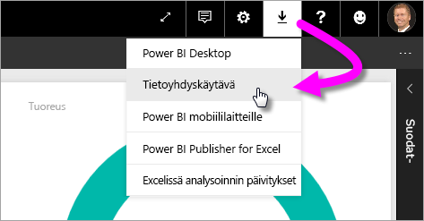
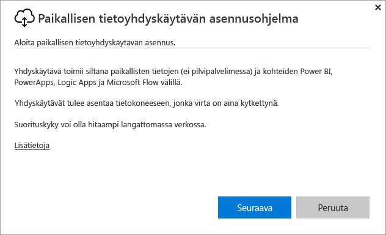
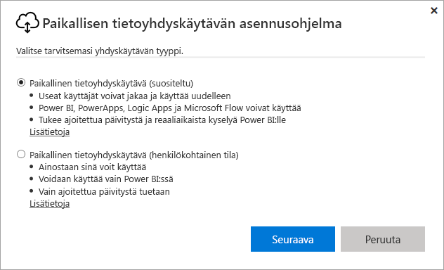
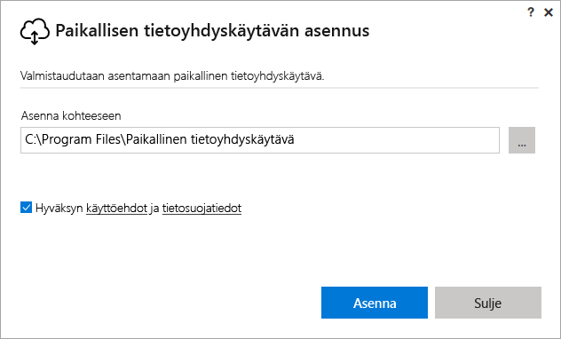
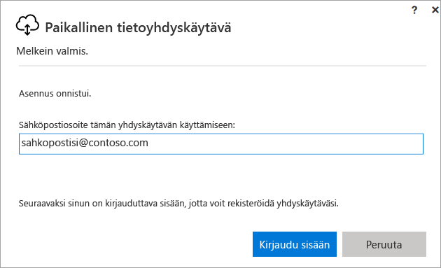
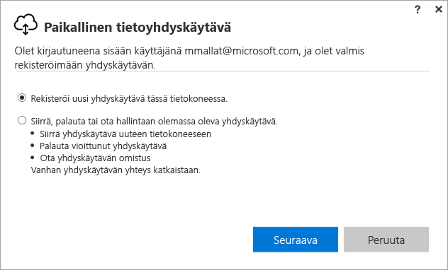
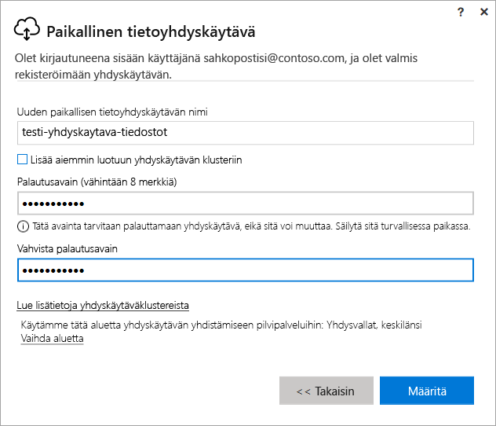
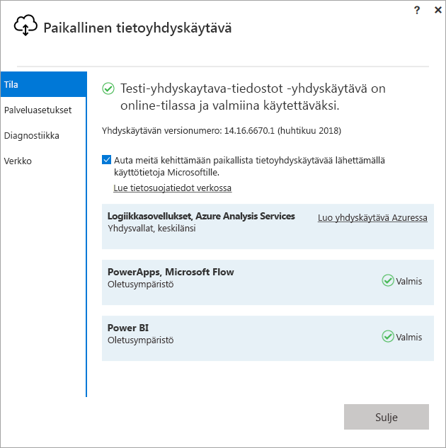
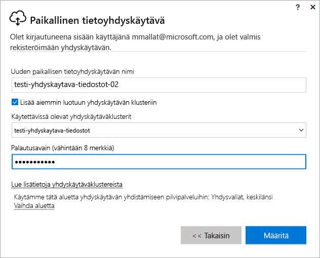

# Power BI -yhdyskäytävän asentaminen

Power BI -yhdyskäytävä on ohjelmisto, jonka asennat paikalliseen verkkoon; se helpottaa tietojen käyttöä kyseisessä verkossa. Kuten [yhteenvedossa](service-gateway-getting-started.md) on kuvattu, voit asentaa yhdyskäytävän henkilökohtaisessa tilassa tai normaalissa tilassa (suositus). Normaalissa tilassa voit asentaa erillisen yhdyskäytävän tai lisätä yhdyskäytävän *klusteriin*, joka on suositeltavaa suuren käytettävyyden kannalta. Tässä artikkelissa esittelemme miten normaali yhdyskäytävä asennetaan ja sitten miten klusteriin lisätään uusi yhdyskäytävä.

Jos et ole rekisteröitynyt Power BI:hin, [rekisteröidy ilmaiseen kokeiluversioon](https://app.powerbi.com/signupredirect?pbi_source=web) ennen aloittamista.

## Yhdyskäytävän lataaminen ja asentaminen

Yhdyskäytävä toimii siinä tietokoneessa, johon sen asennat, joten varmista, että asennat sen sellaiselle tietokoneelle, joka on aina käytössä. Paremman suorituskyvyn ja luotettavuuden takaamiseksi suosittelemme, että tietokone on liitetty lankaverkkoon langattoman sijaan.

1. Valitse Power BI -palvelun oikeassa yläkulmassa **latauskuvake** > **Tietoyhdyskäytävä**.

    

2. Valitse lataussivulla **LATAA YHDYSKÄYTÄVÄ** -painike.

3. Valitse **Seuraava**.     

    

4. Valitse **Paikallinen tietoyhdyskäytävä (suositus)** > **Seuraava**.

    

5. Säilytä asennuksen oletuspolku ja hyväksy ehdot > **Asenna**.

    

6. Syötä tili, jolla kirjaudut Power BI:hin > **Kirjaudu sisään**.

    

    Yhdyskäytävä liitetään Power BI -tiliisi ja hallinnoit yhdyskäytäviä Power BI -palvelun sisältä. Olet nyt kirjautuneena tilillesi.

7. Valitse **Rekisteröi uusi yhdyskäytävä tässä tietokoneessa** > **Seuraava**.

    

8. Syötä yhdyskäytävän nimi (jonka tulee olla vuokraajalle ainutlaatuinen) ja palautusavain. Tarvitset tätä avainta, jos joskus haluat palauttaa tai siirtää yhdyskäytäväsi. Valitse **Määritä**.

    

    Huomaa vaihtoehto **Lisää aiemmin luotuun yhdyskäytävän klusteriin**. Käytämme tätä vaihtoehtoa artikkelin seuraavassa osiossa.

9. Tarkasta viimeisen ikkunan tiedot. Huomaa, että yhdyskäytävä on käytettävissä Power BI:lle ja PowerAppsille sekä Flow:lle, koska käytän samaa tiliä kaikissa kolmessa. Valitse **Sulje**.

    

Olet nyt asentanut onnistuneesti yhdyskäytävän ja voit lisätä toisen luodaksesi klusterin.

## Lisää toinen yhdyskäytävä luodaksesi klusterin

Klusteri mahdollistaa yhdyskäytävien järjestelmänvalvojille yksittäinen vikaantumispisteen syntymisen paikallisten tietojen käytössä. Jos ensisijainen yhdyskäytävä ei ole käytettävissä, tietopyynnöt reititetään lisäämääsi toiseen yhdyskäytävään ja niin edelleen. Voit asentaa tietokoneelle vain yhden tavallisen yhdyskäytävän, joten klusterin toinen yhdyskäytävä täytyy asentaa toiseen tietokoneeseen. Tämä on järkevää, koska haluat klusterissa olevan redundanssia.

Suuren käytettävyyden yhdyskäytäväklusterit edellyttävät marraskuun 2017 päivityksen paikalliseen tietoyhdyskäytävään tai uudemman version.

1. Lataa yhdyskäytävä toiselle tietokoneelle ja asenna se.

2. Rekisteröi yhdyskäytävä, kun olet kirjautunut Power BI -tilillesi. Valitse **Lisää aiemmin luotuun yhdyskäytävän klusteriin**. Valitse kohdassa **Käytettävissä olevat yhdyskäytäväklusterit** ensimmäinen asentamasi yhdyskäytävä (*ensisijainen yhdyskäytävä*) ja syötä sen palautusavain. Valitse **Määritä**.

    

## Seuraavat vaiheet

[Power BI -yhdyskäytävän hallinta](service-gateway-manage.md)

Onko sinulla kysyttävää? [Kokeile Power BI -yhteisöä](http://community.powerbi.com/)