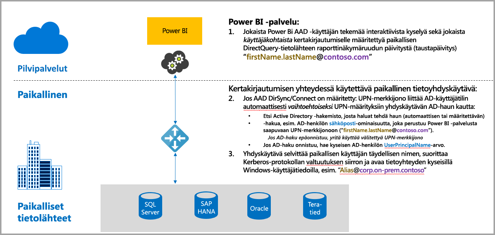
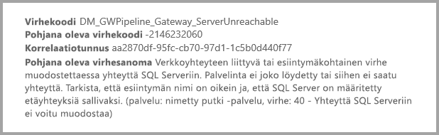
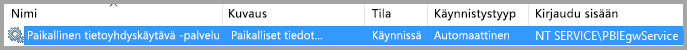
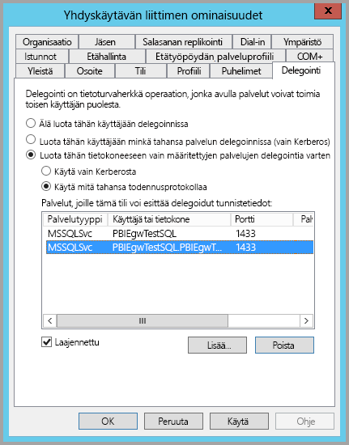
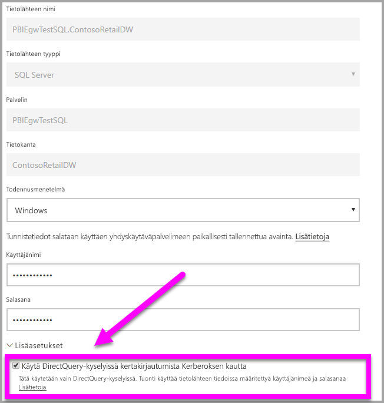
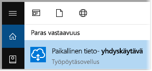
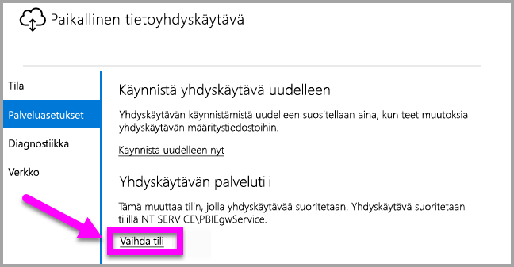

# Kerberoksen käyttäminen SSO:ta (kertakirjautumista) varten Power BI:stä paikallisiin tietolähteisiin

Voit saada saumattoman kertakirjautumisen, jolloin Power BI -raportit ja -koontinäytöt päivitetään paikallisista tiedoista, määrittämällä Kerberoksen paikalliseen tietoyhdyskäytävään. Paikallinen tietoyhdyskäytävä helpottaa kertakirjautumista (SSO) DirectQueryllä, jota se käyttää yhteyden muodostamiseen paikallisiin tietolähteisiin.

Seuraavia [rajoitettuun Kerberos-delegointiin](https://technet.microsoft.com/library/jj553400.aspx) perustuvia tietolähteitä tuetaan tällä hetkellä:

* SQL Server
* SAP HANA
* Teradata
* Spark

Kun käyttäjä on vuorovaikutuksessa DirectQuery-raportin kanssa Power BI -palvelussa, jokainen ristisuodatus-, ositus-, lajittelu- ja raportin muokkaustoiminto voi aiheuttaa kyselyjä, jotka suoritetaan reaaliajassa pohjana olevalle paikalliselle tietolähteelle.  Kun tietolähteelle määritetään kertakirjautuminen, kyselyt suoritetaan Power BI:n kanssa vuorovaikutuksessa (verkkosisällön tai Power BI -mobiilisovellusten kautta) olevan käyttäjän käyttäjätiedoilla. Näin kukin käyttäjä näkee tarkasti tiedot, joihin hänellä on oikeudet pohjana olevassa tietolähteessä. Kun kertakirjautuminen on määritetty, eri käyttäjien välimuistissa ei ole jaettuja tietoja.

## Kyselyn suorittaminen SSO:n avulla – vaiheet

SSO:n avulla suoritettavassa kyselyssä on kolme vaihetta, kuten seuraava kaavio osoittaa.

> [!NOTE]
> Oraclen SSO ei ole vielä käytössä, mutta sitä kehitetään ja se on tulossa pian.

Seuraavassa on lisätietoja näistä vaiheista:

1. **Power BI -palvelu** lisää jokaiseen kyselyyn *täydellisen käyttäjätunnuksen*, kun määritettyyn yhdyskäytävään lähetetään kyselypyyntö.
2. Yhdyskäytävän on yhdistettävä Azure Active Directoryn täydellinen käyttäjätunnus paikallisen Active Directoryn käyttäjätietoihin.

   a.  Jos AAD DirSync (eli *AAD Connect*) on määritetty, yhdistäminen toimii automaattisesti yhdyskäytävässä.

   b.  Muussa tapauksessa yhdyskäytävä voi etsiä Azure AD:n täydellisen käyttäjätunnuksen ja yhdistää sen paikalliseen käyttäjään tekemällä haun paikalliselta Active Directory -toimialueelta.
3. Yhdyskäytävän palveluprosessi tekeytyy yhdistetyksi paikalliseksi käyttäjäksi, avaa yhteyden pohjana olevaan tietokantaan ja lähettää kyselyn. Yhdyskäytävää ei tarvitse asentaa samaan tietokoneeseen kuin tietokanta.

   - Käyttäjäksi tekeytyminen ja yhteyden muodostaminen tietokantaan onnistuu vain, jos yhdyskäytävän palvelutili on toimialuetili (tai palvelun SID) ja jos tietokannan rajoitettu Kerberos-delegointi määritettiin hyväksymään Kerberos-liput yhdyskäytävän palvelutililtä.  

   > [!NOTE]
   > Jos määritetään AAD DirSync / Connect ja käyttäjätilit synkronoidaan, yhdyskäytäväpalvelun ei tarvitse tehdä hakuja paikallisesta AD:sta suorituksen aikana ja voit käyttää yhdyskäytäväpalvelussa paikallisen palvelun SID-tunnusta (toimialuetilin edellyttämisen sijaan). Tässä artikkelissa kuvatut rajoitetun Kerberos-delegoinnin määritysvaiheet ovat samat kuin kyseinen määritys (niitä sovelletaan yhdyskäytävän tietokoneobjektiin Active Directoryssa toimialuetilin sijaan).

> [!NOTE]
> SSO:n ottaminen käyttöön SAP HANAssa:
>
> - Varmista, että SAP HANA -palvelin käyttää vaadittua vähimmäisversiota, joka riippuu SAP HANA -palvelimesi käyttöympäristötasosta:
>     - [HANA 2 SP 01 Rev 012.03](https://launchpad.support.sap.com/#/notes/2557386)
>     - [HANA 2 SPS 02 Rev 22](https://launchpad.support.sap.com/#/notes/2547324)
>     - [HANA 1 SP 12 Rev 122.13](https://launchpad.support.sap.com/#/notes/2528439)
>
> - Asenna yhdyskäytävätietokoneeseen SAP:n uusin HANA ODBC -ohjain.  Vähimmäisversio on HANA ODBC 2.00.020.00 elokuulta 2017.
>
> Lisätietoja kertakirjautumisen määrittämisestä SAP HANAssa Kerberoksen avulla on aiheessa [Single Sign-on Using Kerberos (Kertakirjautuminen Kerberoksen avulla)](https://help.sap.com/viewer/b3ee5778bc2e4a089d3299b82ec762a7/2.0.03/en-US/1885fad82df943c2a1974f5da0eed66d.html) SAP HANA -suojausoppaassa. Sivun linkit tarjoavat myös lisätietoja. Katso erityisesti SAP Note 1837331 – HOWTO HANA DBSSO Kerberos/Active Directory]. 

## Puutteellisesta Kerberos-määrityksestä johtuvat virheet

Jos pohjana olevaa tietokantapalvelinta ja yhdyskäytävää ei ole määritetty oikein **rajoitetun Kerberos-delegoinnin** osalta, näyttöön saattaa tulla seuraava virhesanoma:

Virhesanomaan liittyvät tekniset tiedot saattavat näyttää seuraavilta:

Tuloksena on, että puutteellisen Kerberos-määrityksen vuoksi yhdyskäytävä ei voinut tekeytyä alkuperäiseksi käyttäjäksi oikein ja tietokantayhteyden muodostamisyritys epäonnistui.

## Rajoitetun Kerberos-delegoinnin valmisteleminen

Useita kohteita on määritettävä, jotta rajoitettu Kerberos-delegointi toimii oikein, muun muassa *palvelun päänimet* (SPN) ja palvelutilien delegointiasetukset.

### Edellytys 1: Asenna ja määritä paikallinen tietoyhdyskäytävä

Tämä paikallisen tietoyhdyskäytävän versio tukee suoraa päivitystä sekä aiemmin luotujen yhdyskäytävien asetuksien haltuunottoa.

### Edellytys 2: Suorita yhdyskäytävän Windows-palvelu toimialuetilinä

Normaalissa asennuksessa yhdyskäytävä toimii tietokoneen paikallisena palvelutilinä (tarkemmin *NT Service\PBIEgwService*) seuraavan kuvan mukaisesti:

Jotta **rajoitettu Kerberos-delegointi** voidaan ottaa käyttöön, yhdyskäytävän on toimittava toimialuetilinä, ellei AAD ole jo synkronoitu paikallisen Active Directoryn kanssa (käyttämällä AAD DirSynciä/Connectia). Jotta tämä tilin muutos toimisi oikein, sinulla on kaksi vaihtoehtoa:

* Jos aloitit paikallisen tietoyhdyskäytävän edellisellä versiolla, noudata tarkasti kaikkia seuraavassa artikkelissa kuvattua viittä vaihetta järjestyksessä (mukaan lukien yhdyskäytävän määritystoiminnon suorittaminen vaiheessa 3):
  
  * [Yhdyskäytävän palvelutilin muuttaminen toimialueen käyttäjäksi](https://powerbi.microsoft.com/documentation/powerbi-gateway-proxy/#changing-the-gateway-service-account-to-a-domain-user)
  * Jos olet jo asentanut paikallisen tietoyhdyskäytävän esiversion, palvelutilit voidaan vaihtaa suoraan yhdyskäytävän määritystoiminnosta uudella käyttöliittymäpohjaisella menetelmällä. Katso tämän artikkelin lopussa oleva osio **Yhdyskäytävän vaihtaminen toimialuetiliin**.

> [!NOTE]
> Jos määritetään AAD DirSync / Connect ja käyttäjätilit synkronoidaan, yhdyskäytäväpalvelun ei tarvitse tehdä hakuja paikallisesta AD:sta suorituksen aikana ja voit käyttää yhdyskäytäväpalvelussa paikallisen palvelun SID-tunnusta (toimialuetilin edellyttämisen sijaan). Tässä artikkelissa kuvatut rajoitetun Kerberos-delegoinnin määritysvaiheet ovat samat kuin kyseinen määritys (niitä sovelletaan palvelun SID-tunnuksen perusteella toimialuetilin sijaan).

### Edellytys 3: Toimialueen järjestelmänvalvojan oikeuksien hankkiminen päänimien (SetSPN) ja rajoitetun Kerberos-delegoinnin asetusten määrittämiseksi

Vaikka toimialueen järjestelmänvalvojan on teknisesti mahdollista antaa jollekulle muulle väliaikaiset tai pysyvät oikeudet määrittää palvelun päänimet ja Kerberos-delegointi ilman toimialueen järjestelmänvalvojan oikeuksia, tätä tapaa ei suositella. Seuraavassa osassa kerrotaan tarkemmin **edellytykseen 3** tarvittavat määritysvaiheet.

## Rajoitetun Kerberos-delegoinnin määrittäminen yhdyskäytävälle ja tietolähteelle

Jotta järjestelmä voidaan määrittää oikein, seuraavat kaksi kohdetta on määritettävä tai vahvistettava:

1. Määritä tarvittaessa palvelun päänimi yhdyskäytäväpalvelun toimialuetilille.
2. Määritä yhdyskäytäväpalvelun toimialuetilin delegointiasetukset.

Huomaa, että sinun on oltava toimialueen järjestelmänvalvoja, jotta voit suorittaa nämä kaksi määritysvaihetta.

Nämä vaiheet kuvataan seuraavissa osissa.

### SPN:n määrittäminen yhdyskäytävän palvelutilille

Selvitä ensin, onko yhdyskäytävän palvelutilinä käytetylle toimialuetilille luotu jo SPN, noudattamalla näitä ohjeita:

1. Käynnistä **Active Directory Users and Computers** toimialueen järjestelmänvalvojana
2. Napsauta toimialuetta hiiren kakkospainikkeella, valitse **Etsi** ja kirjoita yhdyskäytävän palvelutilin nimi
3. Napsauta hakutuloksissa yhdyskäytävän palvelutiliä hiiren kakkospainikkeella ja valitse **Ominaisuudet**.

   * Jos **Delegointi**-välilehti näkyy **Ominaisuudet**-valintaikkunassa, SPN on jo luotu ja voit siirtyä seuraavaan alakohtaan, joka koskee delegointiasetusten määrittämistä.

Jos **Ominaisuudet**-valintaikkunassa ei ole **Delegointi**-välilehteä, voit luoda SPN:n kyseiselle tilille manuaalisesti, jolloin **Delegointi**-välilehti lisätään (välilehti on helpoin tapa määrittää delegointiasetukset). SPN voidaan luoda käyttämällä [setspn-työkalua](https://technet.microsoft.com/library/cc731241.aspx), joka sisältyy Windowsiin (SPN:n luominen edellyttää toimialueen järjestelmänvalvojan oikeuksia).

Kuvitellaan esimerkiksi, että yhdyskäytävän palvelutili on ”PBIEgwTest\GatewaySvc”, ja yhdyskäytäväpalvelua suorittavan tietokoneen nimi on **Kone1**. Jotta esimerkin tietokoneen yhdyskäytävän palvelutilille voidaan määrittää SPN, on suoritettava seuraava komento:

Kun tämä vaihe on suoritettu, voidaan siirtyä delegointiasetusten määrittämiseen.

### Yhdyskäytävän palvelutilin delegointiasetusten määrittäminen

Toinen vaadittava määritys on yhdyskäytävän palvelutilin delegointiasetusten määrittäminen. Voit suorittaa nämä vaiheet useilla eri työkaluilla. Tässä artikkelissa käytetään **Active Directory Users and Computers** -työkalua, joka on Microsoft Management Console (MMC) -laajennus. Sen avulla voit hallita ja julkaista tietoja hakemistossa, ja se on käytettävissä toimialueen ohjauskoneissa oletusarvoisesti. Voit myös ottaa sen käyttöön **Windowsin toimintojen** määrityksen kautta toisissa tietokoneissa.

**Rajoitettu Kerberos-delegointi** on määritettävä protokollan siirtämisellä. Rajoitetussa delegoinnissa on määritettävä tarkasti, mihin palveluihin haluat delegoida – esimerkiksi vain SQL Server tai SAP HANA -palvelin hyväksyy delegointikutsuja yhdyskäytävän palvelutililtä.

Tässä osassa oletetaan, että olet jo määrittänyt palvelun päänimet pohjana oleville tietolähteille (kuten SQL Server, SAP HANA, Teradata, Spark jne.). Lisätietoja kyseisten tietolähteiden palvelimen palvelun päänimien määrittämisestä on vastaavan tietokantapalvelimen teknisessä dokumentaatiossa. Voit myös lukea blogikirjoituksen, jossa kerrotaan, [*mitä palvelun päänimeä sovelluksesi edellyttää*](https://blogs.msdn.microsoft.com/psssql/2010/06/23/my-kerberos-checklist/)

Seuraavissa vaiheissa oletuksena on paikallinen ympäristö, jossa on kaksi konetta: yhdyskäytäväkone ja tietokantapalvelin (SQL Server -tietokanta), ja esimerkissä käytetään seuraavia asetuksia ja nimiä:

* Yhdyskäytäväkoneen nimi: **PBIEgwTestGW**
* Yhdyskäytävän palvelutili: **PBIEgwTest\GatewaySvc** (tilin näyttönimi: Gateway Connector)
* SQL Server-tietolähteen koneen nimi: **PBIEgwTestSQL**
* SQL Server-tietolähteen palvelutili: **PBIEgwTest\SQLService**

Kyseisillä esimerkkinimillä ja -asetuksilla määritykset ovat seuraavat:

1. Käynnistä **Active Directory Users and Computers** toimialueen järjestelmänvalvojan oikeuksilla.
2. Napsauta yhdyskäytävän palvelutiliä (**PBIEgwTest\GatewaySvc**) hiiren kakkospainikkeella ja valitse **Ominaisuudet**.
3. Valitse **Delegointi**-välilehti.
4. Valitse **Luota tähän tietokoneeseen vain määritettyihin palveluihin delegointia varten.**
5. Valitse **Käytä mitä tahansa todennusprotokollaa.**
6. Valitse **Palvelut, joille tämä tili voi esittää delegoidut tunnistetiedot:** -kohdassa **Lisää**.
7. Valitse uudessa valintaikkunassa **Käyttäjät tai tietokoneet**.
8. Anna SQL Server -tietokantapalvelun palvelutili (**PBIEgwTest\SQLService**) ja valitse **OK**.
9. Valitse SPN, jonka loit tietokantapalvelimelle. Tässä esimerkissä SPN:n alussa on **MSSQLSvc**. Jos olet lisännyt tietokantapalvelulle sekä FQDN- että NetBIOS-SPN:n, valitse molemmat. Saatat nähdä vain toisen.
10. Valitse **OK**. SPN:n pitäisi näkyä nyt luettelossa.
11. Voit myös valita **Laajennettu**, jolloin sekä FQDN- että NetBIOS-SPN näkyvät
12. Valintaikkuna näyttää samalta kuin alla, jos valitsit **Laajennettu**.

    
13. Valitse **OK**.

    Lopuksi koneessa, joka suorittaa yhdyskäytäväpalvelua (esimerkissä **PBIEgwTestGW**), yhdyskäytävän palvelutilille on myönnettävä paikallinen käytäntö Asiakkaaksi tekeytyminen todentamisen jälkeen. Voit suorittaa tai tarkistaa tämän paikallisessa ryhmäkäytäntöeditorissa (**gpedit**).
14. Suorita yhdyskäytäväkoneessa *gpedit.msc*
15. Siirry kohtaan **Paikallisen tietokoneen käytäntö > Tietokoneasetukset > Windowsin asetukset > Suojausasetukset > Paikalliset käytännöt > Järjestelmäoikeuksien osoitus** seuraavan kuvan mukaisesti.

    
16. Valitse **Järjestelmäoikeuksien osoitus** -kohdan käytäntöluettelosta **Asiakkaaksi tekeytyminen todentamisen jälkeen**.

    

    Napsauta hiiren kakkospainikkeella ja avaa **Asiakkaaksi tekeytyminen todentamisen jälkeen** -kohdan **Ominaisuudet** ja tarkista tililuettelo. Sen on sisällettävä yhdyskäytävän palvelutili (**PBIEgwTest\GatewaySvc**).
17. Valitse **Järjestelmäoikeuksien osoitus** -kohdan käytäntöluettelosta **Käyttöjärjestelmän osana toimiminen (SeTcbPrivilege)**. Varmista, että yhdyskäytävän palvelutili sisältyy myös tililuetteloon.
18. Käynnistä **Paikallinen tietoyhdyskäytävä** -palveluprosessi uudelleen.

## Power BI -raportin suorittaminen

Kun kaikki aiemmin tässä artikkelissa kuvatut määritysvaiheet on suoritettu, voit käyttää Power BI:n **yhdyskäytävän hallintasivua** tietolähteen määrittämiseen. Ota sen **Lisäasetukset**-kohdassa SSO käyttöön ja julkaise kyseiseen tietolähteeseen liittyvät raportit ja tietojoukot.

Tämä määritys toimii useimmissa tapauksissa. Kerberoksessa voi kuitenkin olla eri määrityksiä ympäristösi mukaan. Jos raportti ei kuitenkaan lataudu, ota yhteyttä toimialueen järjestelmänvalvojaan asian selvittämiseksi.

## Yhdyskäytävän vaihtaminen toimialuetiliin

Aiemmin tässä artikkelissa käsiteltiin yhdyskäytävän vaihtamista paikallisesta palvelutilistä toimialuetilinä suoritettavaksi **Paikallinen tietoyhdyskäytävä** -käyttöliittymän avulla. Seuraavassa on ohjeet tämän tekemiseksi.

1. Käynnistä **Paikallinen tietoyhdyskäytävä** -määritystyökalu.

   
2. Valitse **Kirjaudu sisään** -painike pääsivulla ja kirjaudu sisään Power BI -tililläsi.
3. Kun kirjautuminen on valmis, valitse **Palveluasetukset**-välilehti.
4. Käynnistä ohjattu määritys valitsemalla **Vaihda tili** seuraavan kuvan mukaisesti.

   

## Seuraavat vaiheet

Lisätietoja **paikallisesta tietoyhdyskäytävästä** ja **DirectQuerystä** on seuraavissa resursseissa:

* [Paikallinen tietoyhdyskäytävä](service-gateway-onprem.md)
* [DirectQuery Power BI:ssä](desktop-directquery-about.md)
* [DirectQueryn tukemat tietolähteet](desktop-directquery-data-sources.md)
* [DirectQuery ja SAP BW](desktop-directquery-sap-bw.md)
* [DirectQuery ja SAP HANA](desktop-directquery-sap-hana.md)