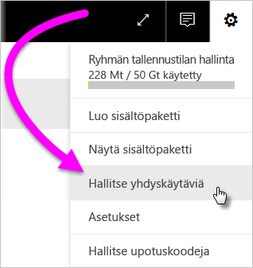
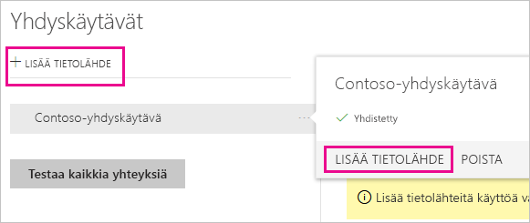
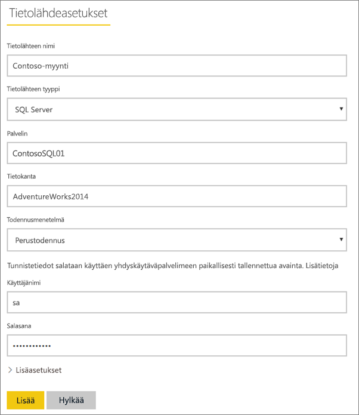
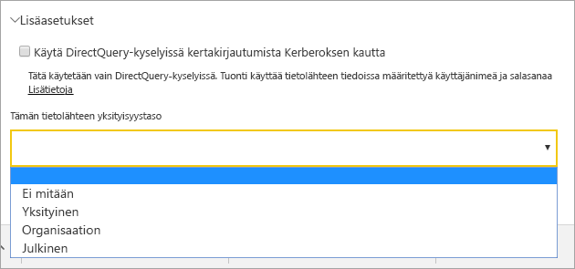
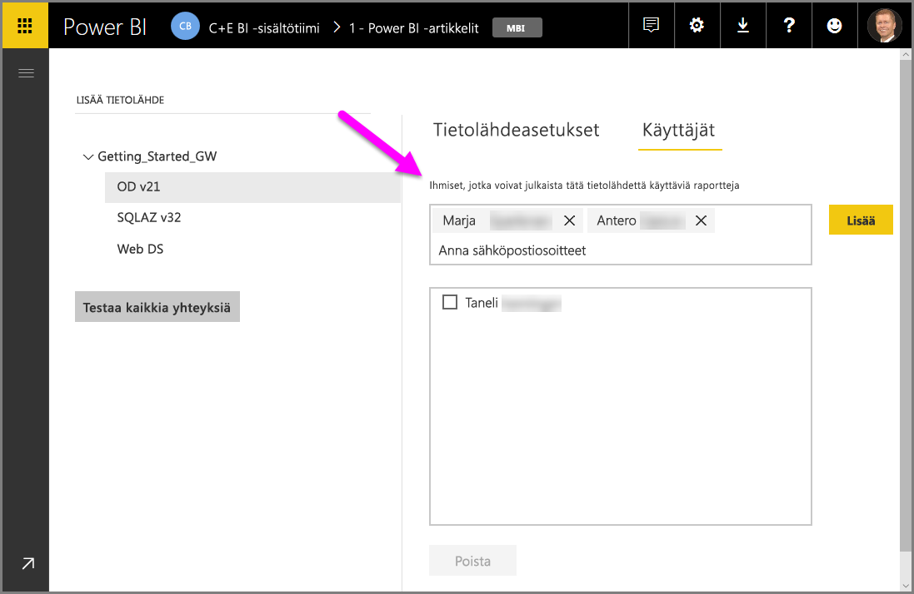
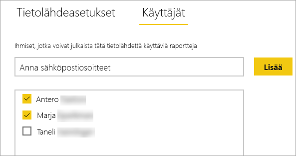
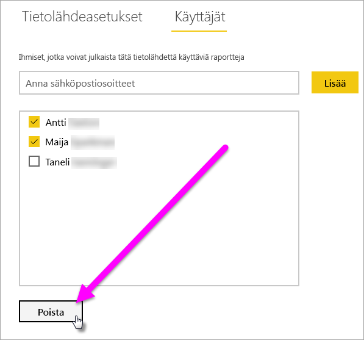
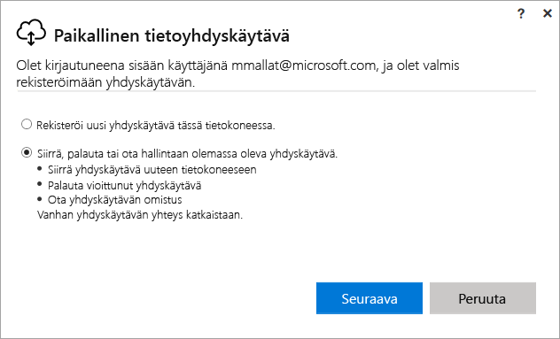
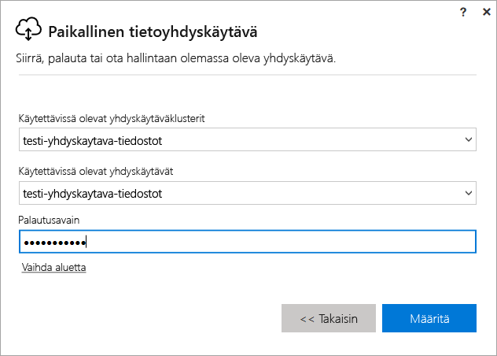

# Power BI:n paikallisen yhdyskäytävän hallinta

Kun olet [asentanut Power BI -tietoyhdyskäytävän](service-gateway-install.md), voit hallita sitä tarpeidesi mukaan. Tässä aiheessa kerrotaan, miten voit lisätä ja poistaa tietolähteitä ja käyttäjiä; käynnistää yhdyskäytävän uudelleen; siirtää, palauttaa, ottaa haltuun ja poistaa yhdyskäytävän. 

Voit hallita yhdyskäytävää Power BI -palvelun **Yhdyskäytävien hallinta** -alueen, paikallisen tietokoneen yhdyskäytäväsovelluksen ja PowerShell-komentosarjojen avulla. Tässä artikkelissa keskitytään Power BI -palveluun. 

Jos olet juuri asentanut yhdyskäytävän, suosittelemme seuraavaksi [lisäämään tietolähteen](#add-a-data-source) ja sitten [lisäämään käyttäjiä](#add-users-to-a-data-source), jotta he voivat käyttää tietolähdettä.

## Tietolähteiden hallinta

Power BI tukee monia paikallisia tietolähteitä, joista jokaisella on omat vaatimuksensa. Yhdyskäytävää voidaan käyttää yksittäisen tai useiden tietolähteiden kanssa. Tässä esimerkissä näytetään, miten voit lisätä SQL Serverin tietolähteeksi. Vaiheita voidaan soveltaa muihinkin tietolähteisiin.

### Tietolähteen lisääminen

1. Valitse  >  Power BI -palvelun oikeasta yläkulmasta ja valitse sitten **Hallitse yhdyskäytäviä**.

    

2. Valitse yhdyskäytävä > **tietolähde** tai siirry kohtaan Yhdyskäytävät > **Lisää tietolähde**.

    

3. Valitse **tietolähteen tyyppi**.

    

4. Anna tietolähteen tiedot. Tässä esimerkissä annetut tiedot ovat **Palvelin**, **Tietokanta** ja muuta.  

    

5. SQL Serverin tapauksessa valitaan **Todennusmenetelmäksi** **Windows** tai **Perus** (SQL-todennus).  Jos valitset **Perus**, anna tietolähteen tunnistetiedot.

6. **Lisäasetukset**-kohdassa voit halutessasi määrittää tietolähteen [yksityisyystason](https://support.office.com/article/Privacy-levels-Power-Query-CC3EDE4D-359E-4B28-BC72-9BEE7900B540) (ei koske [DirectQuerya](desktop-directquery-about.md)).

    

7. Valitse **Lisää**. *Yhteyden muodostaminen onnistui* -teksti tulee näkyviin, jos yhteys muodostettiin.

    

Nyt voit sisällyttää SQL Server -tietoja Power BI -raporttinäkymiin ja -raportteihin tämän tietolähteen avulla.

### Tietolähteen poistaminen

Voit poistaa tietolähteen, jos et käytä sitä enää. Huomaa, että tietolähteen poistaminen rikkoo kyseisestä tietolähteestä riippuvaiset raporttinäkymät tai raportit.

Jos haluat poistaa tietolähteen, valitse tietolähde ja sitten **Poista**.

## Käyttäjien ja järjestelmänvalvojien hallinta

Kun olet lisännyt tietolähteen yhdyskäytävään, anna käyttäjille ja käyttöoikeusryhmille käyttöoikeudet kyseiseen tietolähteeseen (ei koko yhdyskäytävään). Tietolähteen käyttäjäluettelolla hallitaan vain sitä, ketkä voivat julkaista raportteja, jotka sisältävät tietoja kyseisestä tietolähteestä. Raporttien omistajat voivat luoda raporttinäkymiä, sisältöpaketteja ja sovelluksia ja jakaa niitä muiden käyttäjien kanssa.

Voit myös antaa käyttäjille ja käyttöoikeusryhmille järjestelmänvalvojan oikeudet yhdyskäytävään.

### Lisää käyttäjiä tietolähteeseen

1. Valitse  >  Power BI -palvelun oikeasta yläkulmasta ja valitse sitten **Hallitse yhdyskäytäviä**.

2. Valitse tietolähde, johon haluat lisätä käyttäjiä.

3. Valitse **Käyttäjät** ja kirjoita organisaatiosi käyttäjän nimi, jolle haluat myöntää käyttöoikeudet kyseiseen tietolähteeseen. Seuraavassa kuvassa näkyy, että olen lisännyt Maggien ja Adamin.

    

4. Valitse **Lisää**, minkä jälkeen lisätty jäsen näkyy ruudussa.

    

Siinä kaikki. Muista, että sinun on lisättävä käyttäjiä jokaiseen tietolähteeseen, johon haluat myöntää käyttöoikeuden. Jokaisessa tietolähteessä on erillinen luettelo käyttäjistä, ja sinun on lisättävä käyttäjiä kuhunkin tietolähteeseen erikseen.

### Poista käyttäjiä tietolähteestä

Tietolähteen **Käyttäjät**-välilehdeltä voit poistaa käyttäjiä tai käyttöoikeusryhmiä, jotka voivat käyttää tätä tietolähdettä.

### Lisää ja poista järjestelmänvalvojia

Yhdyskäytävän **Järjestelmänvalvojat**-välilehdeltä voit lisätä ja poistaa käyttäjiä (tai käyttöoikeusryhmiä), jotka voivat hallita yhdyskäytävää.

## Yhdyskäytävän klusterin hallinta

Kun luot kahdesta tai useammasta yhdyskäytävästä koostuvan klusterin, kaikki yhdyskäytävän hallintatoiminnot, kuten tietolähteen lisääminen tai järjestelmänvalvojan oikeuksien myöntäminen yhdyskäytävään, koskevat kaikkia klusterin yhdyskäytäviä. 

Kun järjestelmänvalvojat käyttävät **Hallitse yhdyskäytäviä** -valikkokohdetta, joka sijaitsee **Power BI -palvelun** hammaspyöräkuvakkeen alapuolella, he näkevät rekisteröityjen klustereiden tai yksittäisten yhdyskäytävien luettelon, mutta he eivät näe yksittäisiä yhdyskäytäväesiintymiä, jotka ovat klusterin jäseniä.

Kaikki uudet **Ajoitettu päivitys** -pyynnöt ja DirectQuery-toiminnot reititetään automaattisesti tietyn yhdyskäytäväklusterin ensisijaiseen esiintymään. Jos ensisijainen yhdyskäytäväesiintymä ei ole verkossa, pyyntö reititetään klusterin toiseen yhdyskäytäväesiintymään.

## Jaa yhdyskäytävä

Et voi varsinaisesti *jakaa* yhdyskäytävää, mutta voit lisätä järjestelmänvalvojia yhdyskäytävään ja käyttäjiä yhdyskäytävän tietolähteisiin. 

Kun asennat yhdyskäytävän, olet oletusarvoisesti kyseisen yhdyskäytävän järjestelmänvalvoja. Kuten aiemmin näytettiin, voit lisätä muita käyttäjiä järjestelmänvalvojiksi. Nämä järjestelmänvalvojat voivat lisätä tietolähteitä, määrittää ja poistaa yhdyskäytävän.

Voit myös määrittää käyttäjiä tietolähteisiin, jota luot kuhunkin yhdyskäytävään. Käyttäjät voivat tämän jälkeen käyttää kyseisiä tietolähteitä Power BI -raporttien päivittämiseen. He eivät voi kuitenkaan muuttaa tietolähteitä tai yhdyskäytävän asetuksia.

## Yhdyskäytävän siirtäminen, palauttaminen tai ottaminen hallintaan

Suorita yhdyskäytävän asennusohjelma tietokoneella, jolla haluat siirtää tai palauttaa yhdyskäytävän tai ottaa sen haltuusi.

1. Lataa yhdyskäytävä ja asenna se.

2. Rekisteröi yhdyskäytävä, kun olet kirjautunut Power BI -tilillesi. Valitse **Siirrä, palauta tai ota olemassa oleva yhdyskäytävä hallintaan** > **Seuraava**.

    

3. Valitse käytettävissä olevista klustereista ja yhdyskäytävistä ja anna valitun yhdyskäytävän palautusavain. Valitse **Määritä**.

    

## Yhdyskäytävän käynnistäminen uudelleen

Yhdyskäytävä toimii Windows-palveluna. Kuten muutkin Windows-palvelut, voit käynnistää ja pysäyttää sen usealla tavalla. Tässä kerrotaan, miten voit tehdä sen komentokehotteesta.

1. Käynnistä komentokehote järjestelmänvalvojan oikeuksilla tietokoneessa, jossa yhdyskäytävä on käynnissä.

2. Pysäytä palvelu kirjoittamalla `net stop PBIEgwService`.

3. Käynnistä palvelu uudelleen kirjoittamalla `net start PBIEgwService`.

## Yhdyskäytävän poistaminen

Voit poistaa yhdyskäytävän, jos et käytä sitä enää. Huomaa, että yhdyskäytävän poistaminen poistaa myös kaikki sen tietolähteet. Tämä vuorostaan rikkoo kaikki raporttinäkymät ja raportit, jotka ovat riippuvaisia kyseisistä tietolähteistä.

1. Valitse  >  Power BI -palvelun oikeasta yläkulmasta ja valitse sitten **Hallitse yhdyskäytäviä**.

2. Valitse yhdyskäytävä > **Poista**
   
   

## Seuraavat vaiheet

[Tietoyhdyskäytävän käyttöönotto-ohjeet](service-gateway-deployment-guidance.md)

Onko sinulla kysyttävää? [Kokeile Power BI -yhteisöä](http://community.powerbi.com/)
