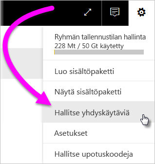
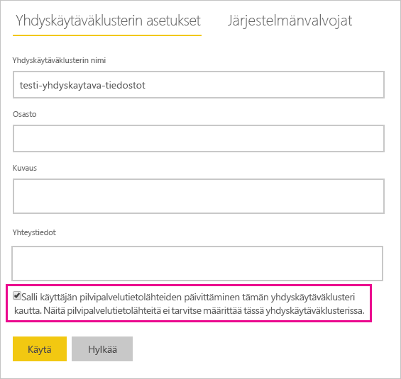
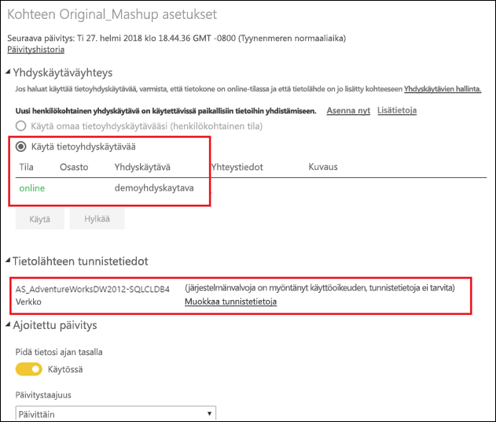

# Paikallisten ja pilvipalvelutietolähteiden yhdistäminen ja liittäminen

[!INCLUDE [gateway-rewrite](includes/gateway-rewrite.md)]

Voit käyttää paikallista tietoyhdyskäytävää yhdistääksesi tai liittääksesi paikalliset ja pilvipalvelutietolähteet samaan kyselyyn. Tästä ratkaisusta on hyötyä, kun haluat yhdistää tietoja useista lähteistä käyttämättä erillisiä kyselyjä.

>[!NOTE]
>Tämä artikkeli koskee vain tietojoukkoja, joihin on yhdistetty sekä pilvitietolähteitä että paikallisia tietolähteitä yksittäiseen kyselyyn. Tietojoukoissa, joissa on erillisiä kyselyitä (toinen muodostaa yhteyden paikalliseen tietolähteeseen ja toinen pilvitietolähteeseen), yhdyskäytävä ei suorita pilvitietolähteen kyselyä.

## Edellytykset

- [Yhdyskäytävä on asennettu](/data-integration/gateway/service-gateway-install) paikalliseen tietokoneeseen.
- Power BI Desktop-tiedosto, joka sisältää kyselyjä, jotka yhdistävät paikallisia ja pilvipalvelutietolähteitä.

>[!NOTE]
>Minkä tahansa pilvitietolähteen käyttäminen edellyttää sen varmistamista, että yhdyskäytävä voi käyttää kyseisiä tietolähteitä.

1. Valitse  >  Power BI -palvelun oikeasta yläkulmasta ja valitse sitten **Hallitse yhdyskäytäviä**.

    

2. Valitse yhdyskäytävä, jonka haluat määrittää.

3. Kohdassa **Yhdyskäytäväklusterin asetukset**, valitse **Salli käyttäjän pilvipalvelutietolähteiden päivittäminen tämän yhdyskäytäväklusteri kautta** > **Käytä**.

    

4. Tässä yhdyskäytäväklusterissa voit lisätä kyselyissä käytettäviä [paikallisia tietolähteitä](service-gateway-enterprise-manage-scheduled-refresh.md#add-a-data-source). Sinun ei tarvitse lisätä tähän pilvipalvelutietolähteitä.

5. Lataa Power BI -palveluun Power -tiedosto, joka sisältää kyselyt, jotka yhdistävät paikallisia ja pilvipalvelutietolähteitä.

6. Uuden tietojoukon **Tietojoukon asetukset** -sivulla:

   - Valitse kyseiseen tietolähteeseen liittyvän yhdyskäytävän paikallinen lähde.
   - Muokkaa tarvittaessa tietolähteen tunnistetietoja kohdassa **Tietolähteen tunnistetiedot**.

    Varmista yksityisyystasojen asianmukainen määritys sekä pilvitietolähteissä että paikallisissa tietolähteissä, jotta liitoksia käsitellään turvallisesti.

     

7. Kun pilvipalvelun tunnistetiedot on määritetty, voit päivittää tietojoukon käyttämällä **Päivitä nyt** -vaihtoehtoa. Voit myös ajoittaa sen päivittämään säännöllisin väliajoin.

## Seuraavat vaiheet

Saat lisätietoja yhdyskäytävien tietojen päivittämisestä artikkelista [Tietolähteen käyttäminen ajoitetussa päivityksessä](service-gateway-enterprise-manage-scheduled-refresh.md#use-the-data-source-for-scheduled-refresh).
