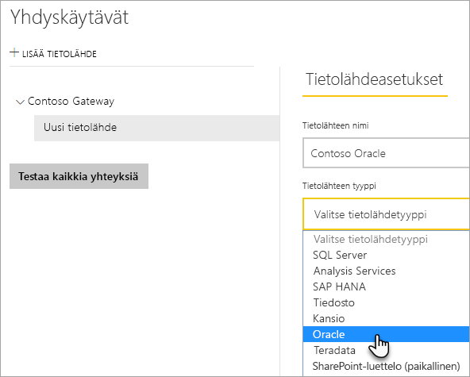
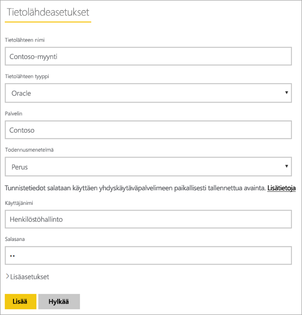
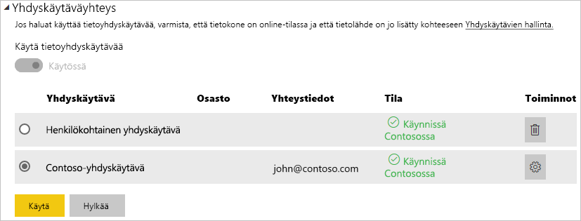

# <a name="manage-your-data-source---oracle"></a>Tietolähteen hallinta – Oracle

[!INCLUDE [gateway-rewrite](includes/gateway-rewrite.md)]

Kun [paikallinen tietoyhdyskäytävä on asennettu](/data-integration/gateway/service-gateway-install), sinun on [lisättävä tietolähteitä](service-gateway-data-sources.md#add-a-data-source), joita voidaan käyttää kyseisen yhdyskäytävän kanssa. Tässä artikkelissa perehdytään siihen, miten käsitellään yhdyskäytäviä ja Oracle-tietolähteitä joko ajoitetussa päivityksessä tai DirectQueryssa.

## <a name="install-the-oracle-client"></a>Oracle-asiakasohjelman asentaminen

Jotta voit yhdistää yhdyskäytävän Oracle-palvelimeen, Oracle Data Provider for .NET (ODP.NET) on asennettava ja määritettävä. ODP.NET on osa Oracle Data Access Components (ODAC) -komponentteja.

32-bittiset Power BI Desktop -versiot: Lataa 32-bittinen Oracle-asiakasohjelma seuraavasta linkistä ja asenna se tietokoneeseen:

* [32-bit Oracle Data Access Components (ODAC) with Oracle Developer Tools for Visual Studio (12.1.0.2.4)](https://www.oracle.com/technetwork/topics/dotnet/utilsoft-086879.html)

64-bittiset Power BI Desktop -versiot tai paikallinen tietoyhdyskäytävä: lataa 64-bittinen Oracle-asiakasohjelma seuraavasta linkistä ja asenna se tietokoneeseen:

* [64-bit ODAC 12.2c Release 1 (12.2.0.1.0) for Windows x64](https://www.oracle.com/technetwork/database/windows/downloads/index-090165.html)

Kun se on asennettu, sinun on määritettävä tnsnames.ora-tiedosto ja tarvittavat tiedot tietokantaan. Power BI Desktop ja yhdyskäytävä siirtyvät pois net_service_name -määrityksestä tnsnames.ora-tiedostossa. Jos net_service_name ei ole määritetty, et voi muodostaa yhteyttä. Tnsnames.ora-oletuspolku on `[Oracle Home Directory]\Network\Admin\tnsnames.ora`. Jos haluat lisätietoja siitä, miten voit määrittää tnsnames.ora-tiedostoja, katso [Oracle: Paikalliset nimeämistiedostot (tnsnames.ora)](https://docs.oracle.com/cd/B28359_01/network.111/b28317/tnsnames.htm).

### <a name="example-tnsnamesora-file-entry"></a>Esimerkki tnsnames.ora -tiedoston merkinnästä

Merkinnän perusmuoto tnsname.ora -tiedostoissa on seuraava:

```
net_service_name=
 (DESCRIPTION=
   (ADDRESS=(protocol_address_information))
   (CONNECT_DATA=
     (SERVICE_NAME=service_name)))
```

Tässä on esimerkki palvelin- ja porttitietojen täyttämisestä:

```
CONTOSO =
  (DESCRIPTION =
    (ADDRESS = (PROTOCOL = TCP)(HOST = oracleserver.contoso.com)(PORT = 1521))
    (CONNECT_DATA =
      (SERVER = DEDICATED)
      (SERVICE_NAME = CONTOSO)
    )
  )
```

## <a name="add-a-data-source"></a>Tietolähteen lisääminen

Lisätietoja tietolähteen lisäämisestä on artikkelissa [Tietolähteen lisääminen](service-gateway-data-sources.md#add-a-data-source). Valitse **Oracle** **tietolähteen tyyppi** -kohdasta.



Kun olet valinnut Oracle-tietolähdetyypin, täytä sen jälkeen tietolähteen tiedot, jotka sisältävät **Palvelimen** ja **Tietokannan**. 

Voit valita **Todennusmenetelmä**-kohdassa joko **Windows** tai **Perus**. Valitse vaihtoehto **Perus**, jos aiot käyttää tiliä, joka on luotu Oraclella Windows-todennuksen sijaan. Anna tunnistetiedot, joita käytetään tälle tietolähteelle.

> [!NOTE]
> Kaikki tietolähteeseen kohdennetut kyselyt suoritetaan näitä tunnistetietoja käyttämällä. Lisätietoja tunnistetietojen tallentamisesta on artikkelissa [Salattu tunnistetietojen tallentaminen pilvipalveluun](service-gateway-data-sources.md#store-encrypted-credentials-in-the-cloud).



Kun kaikki kohdat on täytetty, valitse **Lisää.** Voit nyt käyttää tätä tietolähdettä ajoitettuihin päivityksiin tai DirectQueryyn paikallista Oracle-palvelinta vastaan. *Yhteyden muodostaminen onnistui* -teksti tulee näkyviin, jos yhteys muodostettiin onnistuneesti.


### <a name="advanced-settings"></a>Lisäasetukset

Vaihtoehtoisesti voit määrittää tietolähteellesi yksityisyystason. Tällä asetuksella hallinnoidaan sitä, miten tietoja voidaan yhdistää. Sitä käytetään vain ajoitetussa päivityksessä. Tietosuojatason asetus ei koske DirectQuerya. Lisätietoja tietolähteen yksityisyystasoista on artikkelissa [Yksityisyystasot (Power Query)](https://support.office.com/article/Privacy-levels-Power-Query-CC3EDE4D-359E-4B28-BC72-9BEE7900B540).


## <a name="use-the-data-source"></a>Tietolähteen käyttäminen

Kun tietolähde on luotu, se on käyttäjien saatavilla joko DirectQuery-yhteyksien tai ajoitetun päivityksen välityksellä.

> [!WARNING]
> Palvelimen ja tietokannan nimien pitää täsmätä paikallisen tietoyhdyskäytävän Power BI Desktopin ja tietolähteen kanssa.

Yhdyskäytävän tietojoukon ja tietolähteen välinen linkki perustuu palvelimen ja tietokannan nimiin. Näiden nimien on vastattava toisiaan. Jos esimerkiksi Power BI Desktopissa palvelimen nimelle annetaan IP-osoite, samaa IP-osoitetta tulee käyttää myös yhdyskäytävän kokoonpanon tietolähteessä. Tämän nimen pitää myös vastata aliasta tnsnames.ora-tiedostossa. Saat lisätietoja tnsnames.ora-tiedostoista kohdasta [Oracle-asiakasohjelman asentaminen](#install-the-oracle-client).

Tämä vaatimus koskee sekä DirectQuerya että ajoitettuja päivityksiä.

### <a name="use-the-data-source-with-directquery-connections"></a>Käytä tietolähdettä DirectQueryssa

Palvelimen ja tietokannan nimien on täsmättävä Power BI Desktopissa ja yhdyskäytävälle määritetyssä tietolähteessä. Varmista myös, että käyttäjä on mainittu tietolähteen **Käyttäjät**-välilehdellä, jotta voit julkaista DirectQuery-tietojoukkoja. DirectQuery-valinta tapahtuu Power BI Desktopissa, kun tuot tietoja ensimmäisen kerran. Lisätietoja DirectQueryn käyttämisestä on artikkelissa [DirectQueryn käyttö Power BI Desktopissa](desktop-use-directquery.md).

Raporttisi alkaa toimia, kun olet julkaissut tietojoukot Power BI Desktopissa tai **Nouda tiedot** -ominaisuudella. Yhdyskäytävässä luodun tietolähteen luomisen jälkeen voi kestää useita minuutteja, ennen kuin yhteyttä voidaan käyttää.

### <a name="use-the-data-source-with-scheduled-refresh"></a>Tietolähteen käyttö ajoitetun päivityksen kanssa

Jos sinut on lisätty yhdyskäytävän sisällä määritellyn tietolähteen **Käyttäjät**-välilehdelle ja jos palvelimen ja tietokannan nimet täsmäävät, näet yhdyskäytävän yhtenä, ajoitetun päivityksen kanssa käytettävänä vaihtoehtona.



## <a name="troubleshooting"></a>Vianmääritys

Voit kohdata useita Oracle-virheitä, kun nimeämissyntaksi on joko virheellinen tai sitä ei ole määritetty oikein:

* ORA-12154: TNS: määritettyä yhteystunnistetta ei voitu selvittää.
* ORA-12514: TNS: kuuntelutoiminto ei tällä hetkellä tunnista pyydettyä palvelun kuvaajaa.
* ORA-12541: TNS: ei kuuntelutoimintoa.
* ORA-12170: TNS: yhteyden aikakatkaisu.
* ORA-12504: TNS: kuuntelutoiminnolle ei ole annettu SERVICE_NAME-CONNECT_DATA.

Näitä virheitä voi ilmetä, jos joko Oracle-asiakasohjelmaa ei ole asennettu tai sitä ei ole määritetty oikein. Jos se on asennettu, varmista, että tnsnames.ora-tiedosto on määritetty oikein ja että käytössäsi on oikea net_service_name. Varmista myös, että net_service_name on sama tietokoneessa, jossa on Power BI Desktop ja tietokoneessa, joka käyttää yhdyskäytävää. Saat lisätietoja ohjeartikkelista [Oracle-asiakasohjelman asentaminen](#install-the-oracle-client).

> [!NOTE]
> Voit kohdata myös yhteensopivuusongelmia Oracle-palvelinversion ja Oracle-asiakasohjelman version välillä. Yleensä näiden versioiden tulee vastata toisiaan.

Lisätietoja yhdyskäytävän vianmäärityksestä on kohdassa [Paikallisen tietoyhdyskäytävän vianmääritys](/data-integration/gateway/service-gateway-tshoot).

## <a name="next-steps"></a>Seuraavat vaiheet

* [Yhdyskäytävien vianmääritys – Power BI](service-gateway-onprem-tshoot.md)
* [Power BI Premium](service-premium.md)

Onko sinulla kysyttävää? Voit esittää kysymyksiä [Power BI -yhteisössä](https://community.powerbi.com/).

