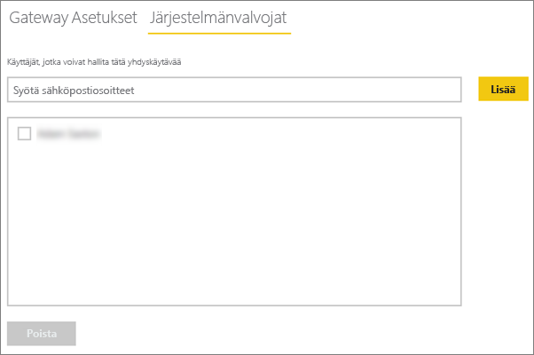
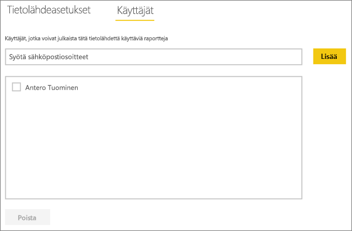

# <a name="manage-your-data-source---oracle"></a>Tietolähteen hallinta – Oracle
Kun paikallinen tietoyhdyskäytävä on asennettu, sinun on lisättävä tietolähteitä, joita voidaan käyttää kyseisen yhdyskäytävän kanssa. Tässä artikkelissa tarkastellaan yhdyskäytävien ja tietolähteiden käsittelyä. Voit käyttää Oracle-tietolähdettä joko ajoitettua päivitystä tai DirectQuerya varten.

## <a name="download-and-install-the-gateway"></a>Yhdyskäytävän lataaminen ja asentaminen
Voit ladata yhdyskäytävän Power BI -palvelusta. Valitse **Lataukset** > **Tietoyhdyskäytävä** tai siirry [yhdyskäytävän lataussivulle](https://go.microsoft.com/fwlink/?LinkId=698861).


> [!WARNING]
> Jotta voit yhdyskäytävän avulla muodostaa yhteyden Oracle-palvelimeen järjestyksessä Oracle Data Provider for .NET (ODP.NET) on asennettava ja määritettävä. Tämä on osa Oracle Data Access Components (ODAC) -komponentteja. Katso lisätietoja siitä, miten voit ladata Oracle-palvelun, alla olevasta kohdasta [Oracle-asiakasohjelman asennus](#installing-the-oracle-client).
> 
> 

## <a name="installing-the-oracle-client"></a>Oracle-asiakasohjelman asentaminen
**32-bittiset** Power BI Desktop -versiot: Lataa **32-bittinen** Oracle-asiakasohjelma seuraavasta linkistä ja asenna se tietokoneeseen:

* [32-bit Oracle Data Access Components (ODAC) with Oracle Developer Tools for Visual Studio (12.1.0.2.4)](http://www.oracle.com/technetwork/topics/dotnet/utilsoft-086879.html)

**64-bittiset** Power BI Desktop -versiot tai paikallinen tietoyhdyskäytävä: lataa **64-bittinen** Oracle-asiakasohjelma seuraavasta linkistä ja asenna se tietokoneeseen:

* [64-bit ODAC 12.2c Release 1 (12.2.0.1.0) for Windows x64](http://www.oracle.com/technetwork/database/windows/downloads/index-090165.html)

Kun se on asennettu, sinun on määritettävä tnsnames.ora-tiedosto ja tarvittavat tiedot tietokantaan. Power BI Desktop ja yhdyskäytävä siirtyvät pois net_service_name -määrityksestä tnsnames.ora-tiedostossa. Jos sitä ei ole määritetty, et voi muodostaa yhteyttä. Tnsnames.ora-oletuspolku on seuraava: `[Oracle Home Directory]\Network\Admin\tnsnames.ora`. Lisätietoja siitä, miten voit määrittää tnsnames.ora -tiedostoja, antaa [Oracle: paikalliset nimeämistiedostot (tnsnames.ora)](https://docs.oracle.com/cd/B28359_01/network.111/b28317/tnsnames.htm).

### <a name="example-tnsnamesora-file-entry"></a>Esimerkki tnsnames.ora -tiedoston merkinnästä
Merkinnän perusmuoto tnsname.ora -tiedostoissa on seuraava.

```
net_service_name=
 (DESCRIPTION=
   (ADDRESS=(protocol_address_information))
   (CONNECT_DATA=
     (SERVICE_NAME=service_name)))
```

Tässä on esimerkki palvelin- ja porttitietojen täyttämisestä.

```
CONTOSO =
  (DESCRIPTION =
    (ADDRESS = (PROTOCOL = TCP)(HOST = oracleserver.contoso.com)(PORT = 1521))
    (CONNECT_DATA =
      (SERVER = DEDICATED)
      (SERVICE_NAME = CONTOSO)
    )
  )
```

## <a name="add-a-gateway"></a>Yhdyskäytävän lisääminen
Voit lisätä yhdyskäytävän yksinkertaisesti [lataamalla](https://go.microsoft.com/fwlink/?LinkId=698861) ja asentamalla yhdyskäytävän ympäristössäsi olevalle palvelimelle. Kun olet asentanut yhdyskäytävän, se näkyy yhdyskäytävien luettelossa **yhdyskäytävien hallinta** -kohdassa.

> [!NOTE]
> **Hallinnoi yhdyskäytäviä** -valikkoa ei näytetä, jos et ole yhdenkään yhdyskäytävän järjestelmävalvoja. Pääset järjestelmävalvojaksi jos sinut lisätään sellaiseksi tai jos itse asennat ja määrittelet yhdyskäytävän.
> 
> 

## <a name="remove-a-gateway"></a>Yhdyskäytävän poistaminen
Yhdyskäytävän poistaminen poistaa myös kaikki kyseisen yhdyskäytävän alaiset tietolähteet.  Tämä rikkoo myös kaikki koontinäytöt ja raportit, jotka ovat riippuvaisia kyseisistä tietolähteistä.

1. Valitse hammaspyöräkuvake  oikeasta yläkulmasta > **Yhdyskäytävien hallinta**.
2. Yhdyskäytävä > **Poista**
   
   

## <a name="add-a-data-source"></a>Tietolähteen lisääminen
Voit lisätä tietolähteen joko valitsemalla yhdyskäytävän ja napauttamalla **Lisää tietolähde** -kohtaa tai yhdyskäytävä > **Lisää tietolähde** -valinnasta.


Voit seuraavaksi valita **Tietolähdetyypin** listasta.


Täytä sitten tietolähteen tiedot, jotka sisältävät **Palvelimen** ja **Tietokannan**.  

Sinun on myös valittava **todennusmenetelmä**.  Tämä voi olla joko **Windows** tai **Basic**.  Haluat ehkä valita vaihtoehdon **Basic**, jos aiot käyttää tiliä, joka on luotu Oraclella Windows-todennuksen sijaan. Anna tunnistetiedot, joita käytetään tälle tietolähteelle.

> [!NOTE]
> Kaikki tietolähteeseen kohdennetut kyselyt suoritetaan näitä tunnistetietoja käyttämällä. Saadaksesi lisätietoja siitä, miten [tunnisteita](service-gateway-onprem.md#credentials) tallennetaan, lue paikallisen yhdyskäytävän pääartikkeli.
> 
> 


Napauta **Lisää**-painiketta, kun kaikki kohdat on täytetty.   Voit nyt käyttää tätä tietolähdettä ajoitettuihin päivityksiin tai DirectQueryyn paikallista Oracle-palvelinta vastaan. *Yhteyden muodostaminen onnistui* -teksti tulee näkyviin, jos yhteys muodostettiin onnistuneesti.


### <a name="advanced-settings"></a>Lisäasetukset
Voit määrittää tietolähteellesi tietosuojatason. Tällä hallinnoidaan sitä, miten tietoja voidaan yhdistää. Tätä käytetään vain ajoitetussa päivityksessä. Tämä ei koske DirectQuerya. [Lue lisää](https://support.office.com/article/Privacy-levels-Power-Query-CC3EDE4D-359E-4B28-BC72-9BEE7900B540)


## <a name="remove-a-data-source"></a>Tietolähteen poistaminen
Tietolähteen poistaminen rikkoo kyseisestä tietolähteestä riippuvaiset koontinäytöt tai raportit.  

Poistaaksesi tietolähteen valitse Tietolähde > **Poista**.


## <a name="manage-administrators"></a>Järjestelmävalvojien hallinta
Yhdyskäytävän järjestelmänvalvojat-välilehdeltä voit lisätä ja poistaa käyttäjiä (tai käyttöoikeusryhmiä), jotka voivat hallita yhdyskäytävää.



## <a name="manage-users"></a>Käyttäjien hallinta
Tietolähteen käyttäjät -välilehdellä voit lisätä ja poistaa käyttäjiä tai käyttöoikeusryhmiä, jotka voivat käyttää kyseistä tietolähdettä.

> [!NOTE]
> Käyttäjälista hallinnoi pelkästään sitä, kuka pystyy julkaisemaan raportteja. Raportin omistajat voit luoda raporttinäkymiä tai sisältöpaketteja ja jakaa niitä muiden käyttäjien kanssa. Käyttäjien, jotka käyttävät raporttia tai koontinäyttöä, ei tarvitse olla käyttäjäluettelossa.
> 
> 



## <a name="using-the-data-source"></a>Tietolähteen käyttö
Kun tietolähde on luotu, se on käyttäjien saatavilla joko DirectQuery -yhteyksien tai ajoitetun päivityksen välityksellä.

> [!WARNING]
> Palvelimen ja tietokannan nimien pitää täsmätä paikallisen tietoyhdyskäytävän Power BI Desktopin ja tietolähteen kanssa.
> 
> 

Yhdyskäytävän tietojoukon ja tietolähteen välinen linkki perustuu palvelimen ja tietokannan nimiin. Näiden on täsmättävä. Jos esimerkiksi Power BI Desktopissa palvelimen nimelle annetaan IP-osoite, samaa IP-osoitetta tulee käyttää myös yhdyskäytävän kokoonpanon tietolähteessä. Tämän nimen pitää myös vastata aliasta tnsnames.ora-tiedostossa. Saat lisätietoja tnsnames.ora-tiedostoista kohdasta [Oracle-asiakasohjelman asentaminen](#installing-the-oracle-client).

Tämä koskee sekä DirectQuerya että ajoitettuja päivityksiä.

### <a name="using-the-data-source-with-directquery-connections"></a>Tietolähteen käyttö DirectQueryssa
Palvelimen ja tietokannan nimen on täsmättävä Power BI Desktopissa ja yhdyskäytävälle määritetyssä tietolähteessä. Varmista myös, että käyttäjä on mainittu tietolähteen **Käyttäjät**-välilehdellä, jotta voit julkaista  DirectQuery-tietojoukkoja. DirectQuery-valinta tapahtuu Power BI Desktopissa, kun tuot tietoja ensimmäisen kerran. [Lue lisää](desktop-use-directquery.md)

Raporttisi alkaa toimia, kun olet julkaissut tietojoukot Power BI Desktopissa tai **Nouda tiedot** -ominaisuudella. Yhdyskäytävässä luodun tietolähteen luomisen jälkeen voi kestää useita minuutteja, ennen kuin yhteyttä voidaan käyttää.

### <a name="using-the-data-source-with-scheduled-refresh"></a>Tietolähteen käyttö ajoitetun päivityksen kanssa
Jos sinut on lisätty yhdyskäytävän sisällä määritellyn tietolähteen **Käyttäjät**-välilehdelle ja jos palvelimen ja tietokannan nimet täsmäävät, näet yhdyskäytävän yhtenä ajoitetun päivityksen kanssa käytettävänä vaihtoehtona.


## <a name="troubleshooting"></a>Vianmääritys
Voit saada lukuisia virheitä Oraclesta, jos nimeämissyntaksi on joko virheellinen tai sitä ei ole määritetty oikein.

* ORA-12154: TNS: määritettyä yhteystunnistetta ei voitu selvittää  
* ORA-12514: TNS: kuuntelutoiminto ei tällä hetkellä tunnista pyydettyä palvelun kuvaajaa  
* ORA-12541: TNS: ei kuuntelutoimintoa  
* ORA-12170: TNS: yhteyden aikakatkaisu  
* SIITÄ-12504: TNS kuuntelutoiminnolle ei ole annettu SERVICE_NAME-CONNECT_DATA  

Näitä virheitä voi ilmetä, jos joko Oracle-asiakasohjelmaa ei ole asennettu tai sitä ei ole määritetty oikein. Jos se on asennettu, haluat varmistaa, että tnsnames.ora-tiedosto on määritetty oikein ja että käytössäsi on oikea net_service_name. Pitää myös varmistaa, että net_service_name on sama tietokoneessa, jossa on Power BI Desktop ja tietokoneessa, joka käyttää yhdyskäytävää. Saat lisätietoja ohjeartikkelista [Oracle-asiakasohjelman asentaminen](#installing-the-oracle-client).

> [!NOTE]
> Voit kohdata myös yhteensopivuusongelmia Oracle-palvelinversion ja Oracle-asiakasohjelman version välillä. Yleensä näiden tulee vastata toisiaan.
> 
> 

Katso lisätietoja vianmäärityksestä liittyen yhdyskäytävään kohdasta [Paikallisen tietoyhdyskäytävän vianmääritys](service-gateway-onprem-tshoot.md).

## <a name="next-steps"></a>Seuraavat vaiheet
[Paikallinen tietoyhdyskäytävä](service-gateway-onprem.md)  
[Paikallinen tietoyhdyskäytävä – tarkat tiedot](service-gateway-onprem-indepth.md)  
[Paikallisen tietoyhdyskäytävän vianmääritys](service-gateway-onprem-tshoot.md)  
[Power BI Premium](service-premium.md)

Onko sinulla muuta kysyttävää? [Voit esittää kysymyksiä Power BI -yhteisössä](http://community.powerbi.com/)

