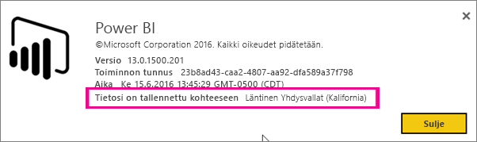
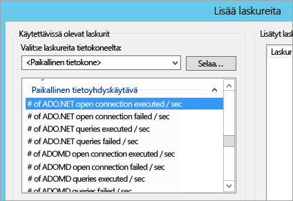
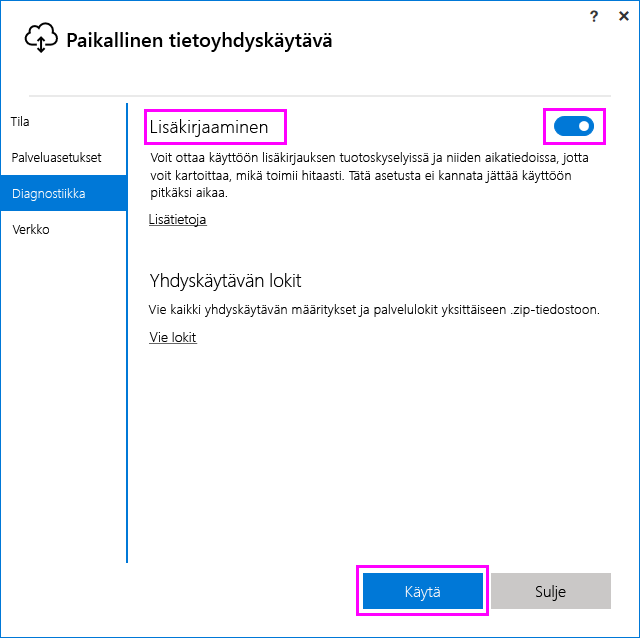
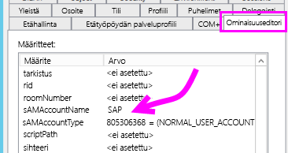
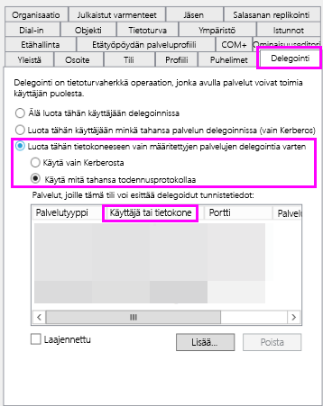
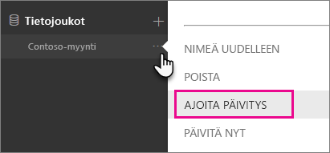
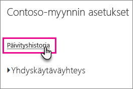
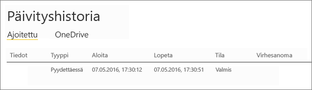

# <a name="troubleshooting-the-on-premises-data-gateway"></a>Paikallisen tietoyhdyskäytävän vianmääritys
Tässä artikkelissa käsitellään yleisiä ongelmia, joita saattaa ilmetä käyttäessäsi **paikallista tietoyhdyskäytävää**.

<!-- Shared Community & support links Include -->
[!INCLUDE [gateway-onprem-tshoot-support-links-include](./includes/gateway-onprem-tshoot-support-links-include.md)]

<!-- Shared Troubleshooting Install Include -->
[!INCLUDE [gateway-onprem-tshoot-install-include](./includes/gateway-onprem-tshoot-install-include.md)]

## <a name="configuration"></a>Määrittäminen
### <a name="how-to-restart-the-gateway"></a>Yhdyskäytävän uudelleenkäynnistys
Yhdyskäytävä suoritetaan Windows-palveluna, joten voit käynnistää ja sammuttaa sen usein tavoin. Voit esimerkiksi avata komentokehotteen laajennetuin oikeuksin koneessa, jossa yhdyskäytävää suoritetaan, ja suorittaa jommankumman seuraavista komennoista:

* Voit lopettaa palvelun suorittamalla seuraavan komennon:
  
    '''   net stop PBIEgwService   '''
* Voit käynnistää palvelun suorittamalla seuraavan komennon:
  
    '''   net start PBIEgwService   '''

### <a name="error-failed-to-create-gateway-please-try-again"></a>Virhe: Yhdyskäytävän luominen epäonnistui. Yritä uudelleen.
Kaikki tiedot ovat saatavilla, mutta Power BI -palvelun kutsu palautti virheen. Näet virheen ja toiminnon tunnuksen. Tämä saattaa johtua useista eri syistä. Voit kerätä ja tarkistaa lokit (kuten alla mainitaan), joista saat lisätietoja.

Tämä saattaa johtua myös välityspalvelimen määritysongelmista. Käyttöliittymä ei mahdollista välityspalvelinmääritystä. Lue lisätietoja [välityspalvelinmääritysten muokkaamisesta](service-gateway-proxy.md).

### <a name="error-failed-to-update-gateway-details--please-try-again"></a>Virhe: Yhdyskäytävän tietojen päivittäminen ei onnistu.  Yritä uudelleen.
Power BI -palvelusta vastaanotettiin tietoja yhdyskäytävään. Tiedot välitettiin paikalliseen Windows-palveluun, mutta niiden palautus ei onnistu. Myös symmetrisen avaimen luominen saattoi epäonnistua. Sisempi poikkeus näytetään kohdassa **Näytä tiedot**. Voit kerätä ja tarkistaa lokit (kuten alla mainitaan), joista saat lisätietoja.

### <a name="error-power-bi-service-reported-local-gateway-as-unreachable-please-restart-the-gateway-and-try-again"></a>Virhe: Power BI -palvelu ilmoittaa, että paikalliseen yhdyskäytävään ei saada yhteyttä. Käynnistä yhdyskäytävä uudelleen ja yritä uudelleen.
Power BI -palvelua kutsutaan uudelleen määrityksen lopussa yhdyskäytävän vahvistamiseksi. Power BI ei ilmoita yhdyskäytävän olevan *käytettävissä*. Windows-palvelun uudelleenkäynnistäminen saattaa mahdollistaa tiedonsiirron onnistumisen. Voit kerätä ja tarkistaa lokit (kuten alla mainitaan), joista saat lisätietoja.

### <a name="script-error-during-sign-into-power-bi"></a>Komentosarjavirhe Power BI:hin kirjauduttaessa
Saatat saada komentosarjavirheen, kun kirjaudut Power BI:hin paikallisen tietoyhdyskäytävän määrittämisen yhteydessä. Seuraavan suojauspäivityksen asentamisen pitäisi korjata ongelma. Voit asentaa sen Windows Updatesta.

[MS16-051: Internet Explorerin suojauspäivitys: 10.5.2016 (KB 3154070)](https://support.microsoft.com/kb/3154070)

### <a name="gateway-configuration-failed-with-a-null-reference-exception"></a>Yhdyskäytävän määritys epäonnistui null-viitepoikkeuksella
Saatat saada seuraavankaltaisen virheen.

        Failed to update gateway details.  Please try again.
        Error updating gateway configuration.

Se sisältää pinon jäljityksen, joka saattaa sisältää seuraavat.

        Microsoft.PowerBI.DataMovement.Pipeline.Diagnostics.CouldNotUpdateGatewayConfigurationException: Error updating gateway configuration. ----> System.ArgumentNullException: Value cannot be null.
        Parameter name: serviceSection

Jos olet päivittämässä vanhemmasta yhdyskäytävästä, säilytämme määritystiedoston. Siitä saattaa puuttua osio. Kun yhdyskäytävä yrittää lukea sitä, saat yllä mainitun null-viitepoikkeuksen.

Voit korjata tämän seuraavien ohjeiden avulla.

1. Poista yhdyskäytävän asennus.
2. Poista seuraava kansio.
   
        c:\Program Files\On-premises data gateway
3. Asenna yhdyskäytävä uudelleen.
4. Voit myös palauttaa olemassa olevan yhdyskäytävän ottamalla käyttöön palautusavaimen.

### <a name="support-for-tls-1112"></a>TLS 1.1:n ja TLS 1.2:n tuki
Elokuun 2017 päivityksestä lähtien paikallinen yhdyskäytävä on oletusarvoisesti yhteydessä **Power BI -palveluun** Transport Layer Security (TLS) 1.1:llä tai 1.2:lla. Vanhemmat paikallisen tietoyhdyskäytävän versiot käyttävät oletusarvoisesti TLS 1.0:aa. TLS 1.0:n tuki päättyi 1.11.2017, joten sinun täytyy päivittää paikallisen tietoyhdyskäytävän asennukset elokuun 2017 versioon tai tätä uudempaan versioon, jotta yhdyskäytäväsi toimivat jatkossakin.

Paikallinen tietoyhdyskäytävä tukee TLS 1.0:aa 1.11.2017 saakka ja tämän jälkeenkin varamekanismina. Voit varmistaa, että yhdyskäytäväliikenne käyttää TLS 1.1:tä tai 1.2:ta (ja estää TSL 1.0:n käytön yhdyskäytävässäsi) lisäämällä seuraavat rekisteriavaimet koneeseen, joka suorittaa yhdyskäytäväpalvelua, tai muokkaamalla niitä siinä:

        [HKEY_LOCAL_MACHINE\SOFTWARE\Microsoft\.NETFramework\v4.0.30319]"SchUseStrongCrypto"=dword:00000001
        [HKEY_LOCAL_MACHINE\SOFTWARE\Wow6432Node\Microsoft\.NETFramework\v4.0.30319]"SchUseStrongCrypto"=dword:00000001

> [!NOTE]
> Näiden rekisteriavaimien lisääminen tai muokkaaminen ottaa muutoksen käyttöön kaikissa .NET-sovelluksissa. Jos haluat lisätietoja rekisterimuutoksista, jotka vaikuttavat muiden sovellusten TLS:ään, lue ohjeartikkeli [Transport Layer Securityn (TLS) rekisteriasetukset](https://docs.microsoft.com/windows-server/security/tls/tls-registry-settings).
> 
> 

## <a name="data-sources"></a>Tietolähteet
### <a name="error-unable-to-connect-details-invalid-connection-credentials"></a>Virhe: yhteyttä ei voida muodostaa. Tiedot: virheelliset yhteyden tunnistetiedot.
**Näytä tiedot** -kohdassa pitäisi näkyä virheilmoitus tietolähteestä. Jos kyseessä on SQL Server, sen pitäisi olla seuraavankaltainen.

    Login failed for user 'username'.

Varmista, että käyttäjänimi ja salasana ovat oikein. Varmista myös, että näillä tunnistetiedoilla saadaan yhteys tietolähteeseen. Varmista, että käytetty tili täsmää **todennusmenetelmän** kanssa.

### <a name="error-unable-to-connect-details-cannot-connect-to-the-database"></a>Virhe: yhteyttä ei voida muodostaa. Tiedot: tietokantaa ei saada yhteyttä.
Palvelimeen saadaan yhteys, mutta annettuun tietokantaan ei. Tarkista tietokannan nimi ja se, että käyttäjätunnistetiedoilla on oikeat oikeudet tietokantaan.

**Näytä tiedot** -kohdassa pitäisi näkyä virheilmoitus tietolähteestä. Jos kyseessä on SQL Server, sen pitäisi olla seuraavankaltainen.

    Cannot open database "AdventureWorks" requested by the login. The login failed. Login failed for user 'username'.

### <a name="error-unable-to-connect-details-unknown-error-in-data-gateway"></a>Virhe: yhteyttä ei voida muodostaa. Tiedot: tuntematon virhe tietoyhdyskäytävässä.
Tämä virhe voi johtua eri syistä. Muista varmistaa, että voit muodostaa yhteyden tietolähteeseen sillä koneella, joka isännöi yhdyskäytävää. Tämä saattaa johtua siitä, että palvelin ei ole käytettävissä.

Näet **Näytä tiedot** -kohdassa virhekoodin **DM_GWPipeline_UnknownError**.

Saat lisätietoja myös kohdasta Tapahtumalokit > **Sovellusten ja palveluiden lokit** > **Paikallinen tietoyhdyskäytäväpalvelu**.

### <a name="error-we-encountered-an-error-while-trying-to-connect-to-server-details-we-reached-the-data-gateway-but-the-gateway-cant-access-the-on-premises-data-source"></a>Virhe: Kohteeseen <server> yhdistäessä ilmeni virhe. Tiedot: tietoyhdyskäytävään saatiin yhteys, mutta yhdyskäytävä ei voi käyttää paikallista tietolähdettä.
Määritettyyn tietolähteeseen ei saada yhteyttä. Muista tarkistaa tälle tietolähteelle annetut tiedot.

Näet **Näytä tiedot**-kohdassa virhekoodin **DM_GWPipeline_Gateway_DataSourceAccessError**.

Jos taustalla oleva virheilmoitus on samankaltainen kuin seuraava, tämä tarkoittaa sitä, että tietolähteelle käyttämäsi tili ei ole palvelimen järjestelmänvalvoja kyseiselle Analysis Services -esiintymälle. [Lisätiedot](https://docs.microsoft.com/sql/analysis-services/instances/grant-server-admin-rights-to-an-analysis-services-instance)

    The 'CONTOSO\account' value of the 'EffectiveUserName' XML for Analysis property is not valid.

Jos taustalla oleva virheilmoitus on samankaltainen kuin seuraava, tämä saattaa tarkoittaa sitä, että Analysis Servicesin palvelutililtä saattaa puuttua hakemistomäärite [token-groups-global-and-universal](https://msdn.microsoft.com/library/windows/desktop/ms680300.aspx) (TGGAU).

    The user name or password is incorrect.

Toimialueilla, jotka ovat yhteensopivia Windows 2000:ta vanhempien käyttöjärjestelmien kanssa, on TGGAU-määrite käytössä. Useimmat uudet luodut toimialueet eivät kuitenkaan oletusarvoisesti käytä tätä määritettä. Voit lukea lisätietoja asiasta [täältä](https://support.microsoft.com/kb/331951).

Voit vahvistaa tämän toimimalla seuraavasti.

1. Muodosta yhteys Analysis Services -koneeseen SQL Server Management Studiossa. Liitä Advanced Connection Properties -kohdassa kyseessä olevan käyttäjän EffectiveUserName ja tarkista, toistuuko ongelma.
2. Dsacls Active Directory -työkalulla voit tarkistaa, onko määrite lueteltu. Työkalu löytyy yleensä toimialueen ohjauskoneesta. Sinun täytyy tietää tilin toimialueen DN-nimi ja välittää se työkalulle.
   
        dsacls "CN=John Doe,CN=UserAccounts,DC=contoso,DC=com"
   
    Tavoitteena on nähdä jotain samankaltaista tuloksissa.
   
            Allow BUILTIN\Windows Authorization Access Group
                                          SPECIAL ACCESS for tokenGroupsGlobalAndUniversal
                                          READ PROPERTY

Tämän ongelman korjaamiseksi sinun täytyy ottaa TGGAU käyttöön tilillä, jota käytetään Analysis Servicesin Windows-palvelussa.

**Toinen mahdollisuus väärälle käyttäjänimelle sekä salasanalle**

Tämä virhe saattaa johtua myös siitä, jos Analysis Services -palvelin on eri toimialueella kuin käyttäjät ja kaksisuuntaista luottamusta ei ole määritetty.

Sinun täytyy varmistaa toimialueiden luottamussuhde yhdessä toimialueiden järjestelmänvalvojien kanssa.

**Tietoyhdyskäytävän tietolähteitä ei näe Power BI -palvelun Analysis Servicesin Nouda tiedot -näkymässä**

Varmista, että tilisi on lueteltu tietolähteen **Käyttäjät**-välilehdellä yhdyskäytävän määrityksissä. Jos sinulla ei ole käyttöoikeuksia yhdyskäytävään, pyydä yhdyskäytävän järjestelmänvalvojaa antamaan ne. Vain **Käyttäjät**-luettelossa luetelluilla tileillä nähdään tietolähteet, jotka on lueteltu Analysis Services -luettelossa.

## <a name="datasets"></a>Tietojoukot
### <a name="error-there-is-not-enough-space-for-this-row"></a>Virhe: tälle riville ei ole tarpeeksi tilaa.
Tämä virhe ilmenee, jos yksittäisen rivin koko on yli 4 Mt. Sinun täytyy määrittää, mikä tietolähteen rivi on kyseessä, ja yrittää suodattaa se pois tai pienentää tämän rivin kokoa.

### <a name="error-the-server-name-provided-doesnt-match-the-server-name-on-the-sql-server-ssl-certificate"></a>Virhe: annettu palvelimen nimi ei vastaa SQL Serverin SSL-varmenteessa olevaa nimeä.
Näin voi käydä, jos varmenteessa oleva nimi on palvelimen täydellinen toimialuenimi (FQDN), mutta annoit vain palvelimen NetBIOS-nimen. Tämän johdosta varmenne ei täsmää. Voit korjata tämän ongelman vaihtamalla palvelimen nimen yhdyskäytävän tietolähteessä ja PBIX-tiedostossa palvelimen täydelliseksi toimialuenimeksi (FQDN).

### <a name="i-dont-see-the-on-premises-data-gateway-persent-when-configuring-scheduled-refresh"></a>En näe paikallista tietoyhdyskäytävää, kun määritän ajoitettua päivitystä.
Tämä saattaa johtua muutamasta eri syystä.

1. Palvelimen ja tietokannan nimi eivät täsmää Power BI Desktopin ja yhdyskäytävälle määritetyn tietolähteen kanssa. Näiden arvojen täytyy olla samat. Niissä ei huomioida kirjainkokoa.
2. Tiliäsi ei luetella tietolähteen **Käyttäjät**-välilehdellä yhdyskäytävämäärityksessä. Sinun täytyy pyytää yhdyskäytävän järjestelmänvalvojaa lisäämään tilisi luetteloon.
3. Power BI Desktop -tiedostossasi on useita tietolähteitä eikä kaikkia näitä ole määritetty yhdyskäytävälle. Sinun täytyy määrittää kaikki tietolähteet yhdyskäytävälle, jotta yhdyskäytävä näkyy ajoitetussa päivityksessä.

### <a name="error-the-received-uncompressed-data-on-the-gateway-client-has-exceeded-limit"></a>Virhe: yhdyskäytäväasiakkaan vastaanottamat pakatut tiedot ylittävät rajoituksen.
Tarkka rajoitus on 10 Gt pakkaamatonta tietoa per taulukko. Jos törmäät tähän ongelmaan, käytettävissä on hyviä optimointitapoja ongelman välttämiseksi. Voit pienentää kokoa etenkin vähentämällä pitkälti toistuvien pitkien merkkijonoarvojen käyttöä käyttämällä niiden sijaan normalisoitua avainta. Voit myös poistaa sarakkeen, jos se ei ole käytössä.

## <a name="reports"></a>Raportit
### <a name="report-could-not-access-the-data-source-because-you-do-not-have-access-to-our-data-source-via-an-on-premises-data-gateway"></a>Raportti ei voi käyttää tietolähdettä, koska sinulla ei ole käyttöoikeutta tietolähteeseemme paikallisen tietoyhdyskäytävän kautta.
Tämä johtuu yleensä jostain alla mainituista syistä.

1. Tietolähdetiedot eivät täsmää taustalla olevan tietojoukon kanssa. Palvelimen ja tietokannan nimen täytyy täsmätä paikalliselle tietoyhdyskäytävälle määritetyn tietolähteen ja Power BI Desktopissa annettujen kanssa. Jos käytät IP-osoitetta Power BI Desktopissa, myös paikallisen tietoyhdyskäytävän tietolähteen täytyy käyttää IP-osoitetta.
2. Millekään organisaatiosi yhdyskäytävälle ei ole tietolähdettä käytettävissä. Voit määrittää tietolähteen uudessa tai olemassa olevassa paikallisessa tietoyhdyskäytävässä.

### <a name="error-data-source-access-error-please-contact-the-gateway-administrator"></a>Virhe: tietolähteen käyttövirhe. Ota yhteyttä yhdyskäytävän järjestelmänvalvojaan.
Jos raportti käyttää reaaliaikaista Analysis Services -yhteyttä, saatat törmätä ongelmaan, jossa EffectiveUserNamelle välitetty arvo on joko epäkelpo tai sillä ei ole oikeuksia Analysis Services -koneessa. Yleensä todennusongelma johtuu siitä, että EffectiveUserNamelle välitetty arvo ei täsmää paikallisen täydellisen käyttäjätunnuksen (UPN) kanssa.

Voit tarkistaa tämän seuraavasti.

1. Etsi käytössä oleva käyttäjänimi [yhdyskäytävälokeista](#logs).
2. Kun sinulla on välitettävä arvo, tarkista, että se on oikea. Jos se on käyttäjäsi arvo, voit tarkistaa seuraavalla komentokehotteen komennolla, mikä täydellisen käyttäjätunnuksen tulisi olla. Täydellinen käyttäjätunnus näyttää sähköpostiosoitteelta.
   
        whoami /upn

Voit myös tarkistaa, mitä Power BI hakee Azure Active Directorysta.

1. Siirry osoitteeseen [https://graphexplorer.cloudapp.net](https://graphexplorer.cloudapp.net).
2. Valitse oikeasta yläkulmasta **Sign in**.
3. Suorita seuraava kysely. Saat melko suuren JSON-vastauksen.
   
        https://graph.windows.net/me?api-version=1.5
4. Etsi **userPrincipalName**.

Jos Azure Active Directoryn täydellinen käyttäjänimi ei täsmää paikallisen Active Directoryn täydellisen käyttäjänimen kanssa, voit korvata sen kelvollisella arvolla [käyttäjänimien yhdistämistoiminnolla](service-gateway-enterprise-manage-ssas.md#map-user-names). Voit myös pyytää täydellisen käyttäjänimen vaihtamista tilauksesi järjestelmänvalvojalta tai paikallisen Active Directoryn järjestelmänvalvojalta.

<!-- Shared Troubleshooting Firewall/Proxy Include -->
[!INCLUDE [gateway-onprem-tshoot-firewall-include](./includes/gateway-onprem-tshoot-firewall-include.md)]

Tarkista oman tilauksesi palvelinkeskusalue seuraavasti:

1. Valitse **?** Power BI -palvelun oikeasta yläkulmasta.
2. Valitse **Tietoja Power BI:stä**.
3. Näet palvelinkeskuksesi alueen kohdasta **Your data is stored in**.
   
    

Jos et edelleenkään pääse mihinkään, voit kokeilla verkkojäljitystä [fiddlerin](#fiddler) tai netsh:n kaltaisella työkalulla. Ne ovat kuitenkin kehittyneitä keräystyökaluja, joten saatat tarvita apua kerättyjen tietojen analysointiin. Voit pyytää apua [tuesta](https://support.microsoft.com).

## <a name="performance"></a>Suorituskyky
<iframe width="560" height="315" src="https://www.youtube.com/embed/IJ_DJ30VNk4?showinfo=0" frameborder="0" allowfullscreen></iframe>

### <a name="performance-counters"></a>Resurssilaskurit
Tarjolla on lukuisia resurssilaskureita, joilla voit seurata yhdyskäytävän toimintaa. Niiden avulla voit kartoittaa sitä, onko aktiviteettikuormitus suuri, jolloin sinun täytyy ehkä luoda uusi yhdyskäytävä. Nämä laskurit eivät kerro sitä, kuinka kauan jokin kestää.

Voit käyttää näitä laskureita Windowsin suorituskyvyn valvonta -työkalulla.



Laskurit on jaettu ryhmiin.

| Laskurin tyyppi | Kuvaus |
| --- | --- |
| ADO.NET |Tätä käytetään missä tahansa DirectQuery-yhteydessä. |
| ADOMD |Tätä käyttävät Analysis Services 2014 ja tätä vanhemmat versiot. |
| OLEDB |Tätä käyttävät tietyt tietolähteet. Niitä ovat esimerkiksi SAP HANA sekä Analysis Service 2016 ja tätä uudemmat versiot. |
| Mashup |Tämä käsittää minkä tahansa tuodun tietolähteen. Jos olet määrittämässä ajoitettua päivitystä tai manuaalista päivitystä, se käsitellään mashup-toiminnolla. |

Tässä on luettelo käytettävissä olevista resurssilaskureista.

| Laskuri | Kuvaus |
| --- | --- |
| # of ADO.NET open connection executed / sec |Tämä on sekunnissa suoritettujen avoimien ADO.NET-yhteyksien toimintojen (onnistuneet ja epäonnistuneet) määrä. |
| # of ADO.NET open connection failed / sec |Tämä on sekunnissa suoritettujen avoimien ADO.NET-yhteyksien epäonnistuneiden toimintojen määrä. |
| # of ADO.NET queries executed / sec |Tämä on sekunnissa suoritettujen ADO.NET-kyselyiden määrä (onnistuneet ja epäonnistuneet). |
| # of ADO.NET queries failed / sec |Tämä on sekunnissa suoritettujen epäonnistuneiden ADO.NET-kyselyiden määrä. |
| # of ADOMD open connection executed / sec |Tämä on sekunnissa suoritettujen avoimien ADOMD-yhteyksien toimintojen määrä (onnistuneet ja epäonnistuneet). |
| # of ADOMD open connection failed / sec |Tämä on sekunnissa suoritettujen avoimien ADOMD-yhteyksien epäonnistuneiden toimintojen määrä. |
| # of ADOMD queries executed / sec |Tämä on sekunnissa suoritettujen ADOMD-kyselyiden määrä (onnistuneet ja epäonnistuneet). |
| # of ADOMD queries failed / sec |Tämä on sekunnissa suoritettujen epäonnistuneiden ADOMD-kyselyiden määrä. |
| # of all open connection executed / sec |Tämä on sekunnissa suoritettujen avoimien yhteyksien toimintojen määrä (onnistuneet ja epäonnistuneet). |
| # of all open connection failed / sec |Tämä on sekunnissa suoritettujen avoimien yhteyksien epäonnistuneiden toimintojen määrä. |
| # of all queries executed / sec |Tämä on sekunnissa suoritettujen kyselyiden määrä (onnistuneet ja epäonnistuneet). |
| # of items in the ADO.NET connection pool |Tämä on ADO.NET-yhteysvarannon kohteiden määrä. |
| # of items in the OLEDB connection pool |Tämä on OLEDB-yhteysvarannon kohteiden määrä. |
| # of items in the Service Bus pool |Tämä on palveluväyläyhteysvarannon kohteiden määrä. |
| # of Mashup open connection executed / sec |Tämä on sekunnissa suoritettujen avoimien Mashup-yhteyksien toimintojen määrä (onnistuneet ja epäonnistuneet). |
| # of Mashup open connection failed / sec |Tämä on sekunnissa suoritettujen avoimien Mashup-yhteyksien epäonnistuneiden toimintojen määrä. |
| # of Mashup queries executed / sec |Tämä on sekunnissa suoritettujen Mashup-kyselyiden määrä (onnistuneet ja epäonnistuneet). |
| # of Mashup queries failed / sec |Tämä on sekunnissa suoritettujen epäonnistuneiden Mashup-kyselyiden määrä. |
| # of multiple result set OLEDB queries failed / sec |Tämä on sekunnissa suoritettujen useiden tulosjoukkojen epäonnistuneiden OLEDB-kyselyiden määrä. |
| # of OLEDB multiple resultset queries executed / sec |Tämä on sekunnissa suoritettujen useiden tulosjoukkojen OLEDB-kyselyiden määrä (onnistuneet ja epäonnistuneet). |
| # of OLEDB open connection executed / sec |Tämä on sekunnissa suoritettujen avoimien OLED-yhteyksien toimintojen määrä (onnistuneet ja epäonnistuneet). |
| # of OLEDB open connection failed / sec |Tämä on sekunnissa suoritettujen avoimien OLED-yhteyksien epäonnistuneiden toimintojen määrä. |
| # of OLEDB queries executed / sec |Tämä on sekunnissa suoritettujen useiden tulosjoukkojen OLEDB-kyselyiden määrä (onnistuneet ja epäonnistuneet). |
| # of OLEDB queries failed / sec |Tämä on sekunnissa suoritettujen useiden tulosjoukkojen epäonnistuneiden OLEDB-kyselyiden määrä. |
| # of OLEDB single resultset queries executed / sec |Tämä on sekunnissa suoritettujen yhden tulosjoukon OLEDB-kyselyiden määrä (onnistuneet ja epäonnistuneet). |
| # of queries failed / sec |Tämä sekunnissa suoritettujen epäonnistuneiden kyselyiden määrä. |
| # of single result set OLEDB queries failed / sec |Tämä on sekunnissa suoritettujen yhden tulosjoukon epäonnistuneiden OLEDB-kyselyiden määrä. |

## <a name="reviewing-slow-performing-queries"></a>Hitaasti suoritettavien kyselyiden tarkistaminen
Saatat huomata, että yhdyskäytävä vastaa liian hitaasti. Tätä saattaa esiintyä DirectQuery-kyselyissä tai päivittäessäsi tuotua tietojoukkoa. Voit ottaa käyttöön lisäkirjauksen tuotoskyselyissä ja niiden aikatiedoissa, jotta voit kartoittaa, mikä toimii hitaasti. Kun löydät kauan kestävän kyselyn, sinun täytyy ehkä muokata tietolähdettäsi kyselyn suorituskyvyn parantamiseksi. Sinun täytyy ehkä muokata esimerkiksi SQL Server -kyselyn indeksejä.

Sinun täytyy muokata kahta määritystiedostoa määrittääksesi kyselyn keston.

### <a name="microsoftpowerbidatamovementpipelinegatewaycoredllconfig"></a>Microsoft.PowerBI.DataMovement.Pipeline.GatewayCore.dll.config
Vaihda tiedoston *Microsoft.PowerBI.DataMovement.Pipeline.GatewayCore.dll.config* `EmitQueryTraces`-asetuksen arvo `False` arvoksi `True`. Tämä tiedosto löytyy oletusarvoisesti sijainnista *C:\Program Files\On-premises data gateway*. Kun `EmitQueryTraces` on käytössä, yhdyskäytävästä tietolähteeseen lähetetyt kyselyt kirjataan lokiin.

> [!IMPORTANT]
> Kun otat EmitQueryTraces-asetuksen käyttöön, lokitiedoston koko voi kasvaa merkittävästi, mutta tämä riippuu yhdyskäytävän käytöstä. Kun olet tarkistanut lokit, sinun kannattaa vaihtaa EmitQueryTraces-asetuksen arvoksi False. Tätä asetusta ei kannata jättää käyttöön pitkäksi aikaa.
> 
> 

```
<setting name="EmitQueryTraces" serializeAs="String">
    <value>True</value>
</setting>
```

**Esimerkkikyselymerkintä**

```
DM.EnterpriseGateway Information: 0 : 2016-09-15T16:09:27.2664967Z DM.EnterpriseGateway    4af2c279-1f91-4c33-ae5e-b3c863946c41    d1c77e9e-3858-4b21-3e62-1b6eaf28b176    MGEQ    c32f15e3-699c-4360-9e61-2cc03e8c8f4c    FF59BC20 [DM.GatewayCore] Executing query (timeout=224) "<pi>
SELECT
TOP (1000001) [t0].[ProductCategoryName],[t0].[FiscalYear],SUM([t0].[Amount])
 AS [a0]
FROM
(
(select [$Table].[ProductCategoryName] as [ProductCategoryName],
    [$Table].[ProductSubcategory] as [ProductSubcategory],
    [$Table].[Product] as [Product],
    [$Table].[CustomerKey] as [CustomerKey],
    [$Table].[Region] as [Region],
    [$Table].[Age] as [Age],
    [$Table].[IncomeGroup] as [IncomeGroup],
    [$Table].[CalendarYear] as [CalendarYear],
    [$Table].[FiscalYear] as [FiscalYear],
    [$Table].[Month] as [Month],
    [$Table].[OrderNumber] as [OrderNumber],
    [$Table].[LineNumber] as [LineNumber],
    [$Table].[Quantity] as [Quantity],
    [$Table].[Amount] as [Amount]
from [dbo].[V_CustomerOrders] as [$Table])
)
 AS [t0]
GROUP BY [t0].[ProductCategoryName],[t0].[FiscalYear] </pi>"
```

### <a name="microsoftpowerbidatamovementpipelinediagnosticsdllconfig"></a>Microsoft.PowerBI.DataMovement.Pipeline.Diagnostics.dll.config
Vaihda tiedoston *Microsoft.PowerBI.DataMovement.Pipeline.Diagnostics.dll.config* `TracingVerbosity`-asetuksen arvo `4` arvoksi `5`. Tämä tiedosto löytyy oletusarvoisesti sijainnista *C:\Program Files\On-premises data gateway*. Kun muokkaat tätä asetusta, yhdyskäytävälokiin kirjataan yksityiskohtaiset merkinnät. Tämä sisältää merkinnät, joista näkyy kesto. Voit ottaa yksityiskohtaiset merkinnät käyttöön myös ottamalla Lisäkirjaaminen lokiin -painikkeen käyttöön paikallisessa yhdyskäytäväsovelluksessa.

   

> [!IMPORTANT]
> Kun vaihdat TracingVerbosity-asetuksen arvoksi `5`, lokitiedoston koko voi kasvaa merkittävästi (yhdyskäytävän käytöstä riippuen). Kun olet tarkistanut lokit, vaihda TraceVerbosity-asetuksen arvoksi `4`. Tätä asetusta ei kannata jättää käyttöön pitkäksi aikaa.
> 
> 

```
<setting name="TracingVerbosity" serializeAs="String">
    <value>5</value>
</setting>
```

<a name="activities"></a>

### <a name="activity-types"></a>Tehtävätyypit
| Tehtävätyyppi | Kuvaus |
| --- | --- |
| MGEQ |Nämä ovat suoritettuja ADO.NET-kyselyitä. Tämä käsittää DirectQuery-tietolähteet. |
| MGEO |Nämä ovat OLEDB-kyselyitä. Tämä käsittää SAP HANA- ja Analysis Services 2016 -kyselyt. |
| MGEM |Nämä ovat Mashup-toiminnosta suoritettuja kyselyitä. Tätä käytetään tuoduissa tietojoukoissa, joissa käytetään ajoitettua päivitystä tai päivitystä pyynnöstä. |

### <a name="determine-the-duration-of-a-query"></a>Kyselyn keston tarkistaminen
Voit tarkistaa tietolähteen kyselyn keston seuraavasti.

1. Avaa yhdyskäytäväloki.
2. Etsi kysely [Activity Typen](#activities) avulla. Esimerkki tästä on vaikkapa MGEQ.
3. Kirjaa muistiin toinen GUID, sillä se on pyynnön tunnus.
4. Jatka MGEQ:n tarkistamista, kunnes löydät FireActivityCompletedSuccessfullyEvent-merkinnän, josta näet keston. Tarkista, että merkinnällä on sama pyyntötunnus. Kesto ilmoitetaan millisekunteina.
   
        DM.EnterpriseGateway Verbose: 0 : 2016-09-26T23:08:56.7940067Z DM.EnterpriseGateway    baf40f21-2eb4-4af1-9c59-0950ef11ec4a    5f99f566-106d-c8ac-c864-c0808c41a606    MGEQ    21f96cc4-7496-bfdd-748c-b4915cb4b70c    B8DFCF12 [DM.Pipeline.Common.TracingTelemetryService] Event: FireActivityCompletedSuccessfullyEvent (duration=5004)
   
   > [!NOTE]
   > FireActivityCompletedSuccessfullyEvent on yksityiskohtainen merkintä. Sitä ei kirjata ellei TraceVerbosity-asetus ole tasolla 5.
   > 
   > 

## <a name="kerberos"></a>Kerberos

Jos taustalla olevaa tietokantapalvelinta ja paikallista tietoyhdyskäytävää ei ole määritetty oikein [Kerberoksen rajoitetulle delegoinnille](service-gateway-kerberos-for-sso-pbi-to-on-premises-data.md), ota [yksityiskohtainen kirjaaminen](#microsoftpowerbidatamovementpipelinediagnosticsdllconfig) käyttöön yhdyskäytävässä ja tarkista sen lokitiedostosta virheet ja jäljitystiedot. Näin voit aloittaa vianmäärityksen.

### <a name="impersonationlevel"></a>ImpersonationLevel

ImpersonationLevel-asetus liittyy palvelun päänimen asetuksiin tai paikalliseen käytäntöasetukseen.

```
[DataMovement.PipeLine.GatewayDataAccess] About to impersonate user DOMAIN\User (IsAuthenticated: True, ImpersonationLevel: Identification)
```

**Ratkaisu**

Voit korjata ongelman seuraavasti:
1. Määritä paikallisen yhdyskäytävän palvelun päänimi.
2. Määritä rajoitettu delegointi määrittäminen Active Directoryssa (AD).

### <a name="failedtoimpersonateuserexception-failed-to-create-windows-identity-for-user-userid"></a>FailedToImpersonateUserException: Windows-käyttäjätietojen luominen käyttäjän käyttäjätunnukselle epäonnistui.

FailedToImpersonateUserException ilmenee, jos et voi tekeytyä toiseksi käyttäjäksi. Se voi ilmetä myös silloin, jos tili, joksi yrität tekeytyä, on toisesta toimialueesta kuin yhdyskäytäväpalvelu (tämä on rajoitus).

**Ratkaisu**
* Määritä, että määritykset ovat oikein yllä olevan ImpersonationLevel-kohdan ohjeiden mukaisesti.
* Varmista, että käyttäjätunnus, joksi yritetään tekeytyä, on kelvollinen AD-tili.

### <a name="general-error-1033-error-while-parsing-protocol"></a>Yleinen virhe; 1033-virhe protokollaa jäsennettäessä.

Saat 1033-virheen, kun ulkoinen SAP HANA:ssa määritetty tunnus ei täsmää kirjautumistunnuksen kanssa, jos käyttäjäksi tekeydytään täydellisellä käyttäjätunnuksella (alias@domain.com). Näet virhelokien alusta, että alkuperäinen täydellinen käyttäjätunnus alias@domain.com on korvattu täydellisellä käyttäjätunnuksella alias@domain.com, kuten alta näet.

```
[DM.GatewayCore] SingleSignOn Required. Original UPN 'alias@domain.com' replaced with new UPN 'alias@domain.com'.
```

**Ratkaisu**
* SAP HANA edellyttää, että tekeydytty käyttäjä käyttää sAMAccountName-määritettä AD:ssä (käyttäjäalias). Jos tämä ei ole oikein, saat 1033-virheen.

    

* Sinun pitäisi nähdä lokeissa sAMAccountName (alias), ei täydellistä käyttäjätunnusta. Se on alias, jonka perässä on toimialue (alias@doimain.com)

    

```
      <setting name="ADUserNameReplacementProperty" serializeAs="String">
        <value>sAMAccount</value>
      </setting>
      <setting name="ADServerPath" serializeAs="String">
        <value />
      </setting>
      <setting name="CustomASDataSource" serializeAs="String">
        <value />
      </setting>
      <setting name="ADUserNameLookupProperty" serializeAs="String">
        <value>AADEmail</value>
```

### <a name="sap-aglibodbchdb-dllhdbodbc-communication-link-failure-10709-connection-failed-rte-1-kerberos-error-major-miscellaneous-failure-851968-minor-no-credentials-are-available-in-the-security-package"></a>[SAP AG][LIBODBCHDB DLL][HDBODBC] Communication link failure;-10709 Connection failed (RTE:[-1] Kerberos error. Major: "Miscellaneous failure [851968]", minor: "No credentials are available in the security package

Saat virheen -10709 yhteyden epäonnistumisesta, jos delegointia ei ole määritetty oikein AD:ssä.

**Ratkaisu**
* Varmista, että SAP Hana -palvelin on mukana AD:n delegointivälilehdellä yhdyskäytäväpalvelutilille.

   

<!-- Shared Troubleshooting tools Include -->
[!INCLUDE [gateway-onprem-tshoot-tools-include](./includes/gateway-onprem-tshoot-tools-include.md)]

### <a name="refresh-history"></a>Päivityshistoria
Kun käytät yhdyskäytävän ajoitettua päivitystä, **päivityshistoriasta** näet ilmenneet virheet sekä hyödyllisiä tietoja, jos sinun täytyy luoda tukipyyntö. Voit tarkistaa sekä ajoitetut päivitykset että pyynnöstä suoritetut päivitykset. Pääset **päivityshistoriaan seuraavasti**.

1. Valitse Power BI:n siirtymisruudun **Tietojoukot**-kohdasta tietojoukko ja sitten &gt; Avaa valikko&gt; **Ajoita päivitys**.
   
    
2. Valitse **Asetukset kohteelle...** &gt; **Ajoita päivitys** > **Päivityshistoria**.
   
    
   
    

Saat lisätietoja päivityksen vianmäärityksestä ohjeartikkelista [Päivitystilanteiden vianmääritys](refresh-troubleshooting-refresh-scenarios.md).

## <a name="next-steps"></a>Seuraavat vaiheet
[Power BI -yhdyskäytävien välityspalvelinasetusten määrittäminen](service-gateway-proxy.md)  
[Paikallinen tietoyhdyskäytävä](service-gateway-onprem.md)  
[Paikallinen tietoyhdyskäytävä – tarkat tiedot](service-gateway-onprem-indepth.md)  
[Tietolähteen hallinta – Analysis Services](service-gateway-enterprise-manage-ssas.md)  
[Tietolähteen hallinta – SAP HANA](service-gateway-enterprise-manage-sap.md)  
[Tietolähteen hallinta – SQL Server](service-gateway-enterprise-manage-sql.md)  
[Tietolähteen hallinta – tuonti ja ajoitettu päivitys](service-gateway-enterprise-manage-scheduled-refresh.md)  
Onko sinulla muuta kysyttävää? [Kokeile Power BI -yhteisöä](http://community.powerbi.com/)
