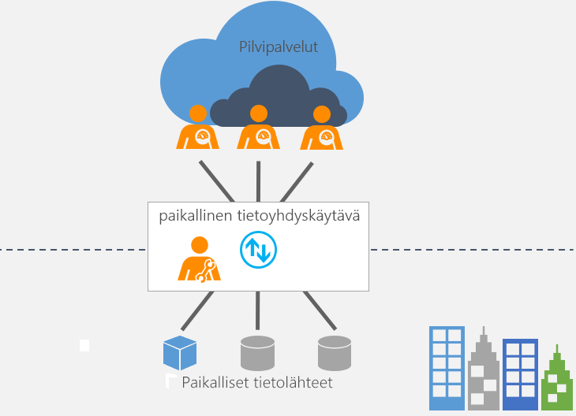

# Mikä paikallinen tietoyhdyskäytävä on?

[!INCLUDE [gateway-rewrite](includes/gateway-rewrite.md)]

Paikallinen tietoyhdyskäytävä toimii siltana tarjoten nopean ja turvallisen tiedonsiirron paikallisten tietojen (eli tietojen, jotka eivät sijaitse pilvipalvelussa) ja useiden Microsoftin pilvipalveluiden välillä. Näitä pilvipalveluita ovat esimerkiksi Power BI, PowerApps, Power Automate, Azure Analysis Services ja Azure Logic Apps. Yhdyskäytävän avulla organisaatiot voivat säilyttää tietokannat ja muut tietolähteet paikallisissa verkoissa ja käyttää niitä turvallisesti pilvipalveluissa.

## Yhdyskäytävän toiminta

Lisätietoja yhdyskäytävän toiminnasta on artikkelissa [Paikallisen tietoyhdyskäytävän arkkitehtuuri](/data-integration/gateway/service-gateway-onprem-indepth).

## Yhdyskäytävien tyypit

Yhdyskäytäviä on kahta tyyppiä, joita käytetään eri skenaarioissa:

* **Paikallisen tietoyhdyskäytävän** avulla useat käyttäjät voivat muodostaa yhteyden useisiin paikallisiin tietolähteisiin. Voit käyttää paikallista tietoyhdyskäytävää kaikissa tuetuissa palveluissa yhdellä yhdyskäytävän asennuksella. Tämä yhdyskäytävä sopii hyvin monimutkaisiin tilanteisiin, joissa useat käyttäjät käyttävät useita tietolähteitä.

* **Paikallisen tietoyhdyskäytävän (henkilökohtainen tila)** avulla yksi käyttäjä voi muodostaa yhteyden tietolähteisiin, eikä tietoyhdyskäytävää voi jakaa muiden kanssa. Paikallista tietoyhdyskäytävää (henkilökohtainen tila) voidaan käyttää vain Power BI:n kanssa. Tämä yhdyskäytävä sopii hyvin tilanteisiin, joissa sinä olet ainoa raporttien luoja eikä sinun tarvitse jakaa tietolähteitä muiden kanssa.

## Yhdyskäytävän käyttäminen

Yhdyskäytävän käyttämisessä on neljä päävaihetta.

1. [Lataa ja asenna yhdyskäytävä](/data-integration/gateway/service-gateway-install) paikalliseen tietokoneeseen.
1. [Määritä](/data-integration/gateway/service-gateway-app) yhdyskäytävä palomuurin ja muiden verkkotarpeiden mukaan.
1. [Lisää yhdyskäytävän järjestelmänvalvojat](/data-integration/gateway/service-gateway-manage), jotka voivat myös hallita muita verkkovaatimuksia.
1. [Käytä yhdyskäytävää](service-gateway-sql-tutorial.md) paikallisen tietolähteen päivittämiseen.
1. [Suorita](service-gateway-onprem-tshoot.md) yhdyskäytävän vianmääritys virheiden varalta.

## Seuraavat vaiheet

* [Paikallisen tietoyhdyskäytävän asentaminen](/data-integration/gateway/service-gateway-install)

Onko sinulla kysyttävää? [Kokeile Power BI -yhteisöä](https://community.powerbi.com/)
