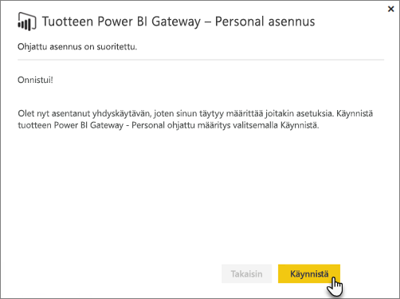
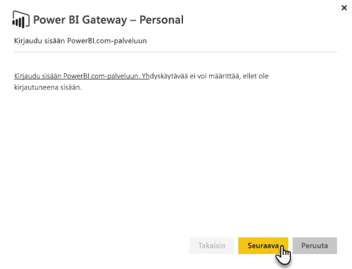
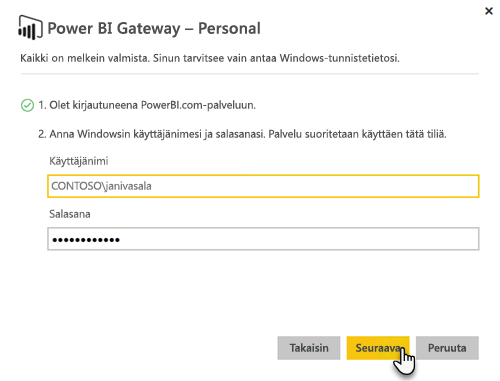

# Paikallinen tietoyhdyskäytävä

Paikallinen tietoyhdyskäytävä toimii siltana tarjoten nopean ja turvallisen tiedonsiirron paikallisten tietojen (eli tietojen, jotka eivät sijaitse pilvipalvelussa) ja Power BI-, Microsoft Flow-, Logic Apps- ja PowerApps-palveluiden välillä.

Voit käyttää yhtä yhdyskäytävää eri palveluiden kanssa samaan aikaan. Jos käytössäsi on Power BI sekä PowerApps, yhtä yhdyskäytävää voi käyttää molempiin. Se on riippuvainen tilistä, jolle olet kirjautunut sisään.

> [!NOTE]
> Paikallinen tietoyhdyskäytävä toteuttaa tietojen pakkaamisen ja siirron aikaisen salauksen kaikissa tiloissa.

<!-- Shared Requirements Include -->
[!INCLUDE [gateway-onprem-requirements-include](./includes/gateway-onprem-requirements-include.md)]

### Reaaliaikaisten Analysis Services -yhteyksien rajoitukset

Voit käyttää reaaliaikaista yhteyttä taulukkomuotoisiin tai moniulotteisiin esiintymiin.

| **Palvelinversio** | **Pakollinen SKU** |
| --- | --- |
| 2012 SP1 CU4 tai uudempi versio |Business Intelligence- ja Enterprise SKU |
| 2014 |Business Intelligence- ja Enterprise SKU |
| 2016 |Standard SKU tai uudempi versio |

* Solutason muotoilu- ja käännösominaisuuksia ei tueta.
* Toiminnot ja Nimetyt joukot eivät näy Power BI:ssä, mutta voit silti muodostaa yhteyden monidimensiollisiin kuutioihin, jotka sisältävät myös toimintoja ja nimettyjä joukkoja ja luoda visualisointeja ja raportteja.

<!-- Shared Install steps Include -->
[!INCLUDE [gateway-onprem-datasources-include](./includes/gateway-onprem-datasources-include.md)]

## Paikallisen tietoyhdyskäytävänlataaminen ja asentaminen

Jos haluat ladata yhdyskäytävän, valitse **Tietoyhdyskäytävä**-vaihtoehdon Lataukset-valikossa. Lataa [paikallinen tietoyhdyskäytävä](http://go.microsoft.com/fwlink/?LinkID=820925). 

Huomaa, että paikallisen tietoyhdyskäytävän päivittäminen suoritetaan asentamalla tietoyhdyskäytävä uudelleen, tässä osiossa kuvatulla tavalla. Päivitettäessä yhdyskäytävää (uudelleenasentamalla), aiemmin määritetyt yhdyskäytäväasetukset säilytetään.

<!-- Shared Install steps Include -->
[!INCLUDE [gateway-onprem-install-include](./includes/gateway-onprem-install-include.md)]

## Asenna yhdyskäytävä henkilökohtaisessa tilassa

> [!NOTE]
> Henkilökohtainen tietoyhdyskäytävä toimii vain Power BI:n kanssa.

Kun henkilökohtainen yhdyskäytävä on asennettu, sinun on käynnistettävä **Power BI:n henkilökohtaisen yhdyskäytävän ohjattu määritys**.

Sitten on kirjauduttava Power BI:hin rekisteröimään yhdyskäytävä pilvipalvelussa.

Tarvitset myös Windows-käyttäjänimen ja salasanan, joilla Windows-palvelu suoritetaan. Voit määrittää myös oman Windows-tilin. Yhdyskäytäväpalvelu suoritetaan käyttäen tätä tiliä.

Kun asennus on valmis, siirry Power BI:n sisällä oleviin tietojoukkoihin ja varmista, että tunnistetiedot syötetään paikalliselle tietolähteelle.

## Salattu tunnistetietojen tallentaminen pilvipalveluun

Kun lisäät tietolähteen yhdyskäytävään, sinun on annettava tunnistetiedot kyseiselle tietolähteelle. Kaikki tietolähteeseen kohdennetut kyselyt suoritetaan näitä tunnistetietoja käyttämällä. Tunnistetiedot salataan turvallisesti käyttäen epäsymmetristä salausta niin, että niitä ei voi salata pilvipalvelussa, ennen kuin ne on tallennettu pilvipalveluun. Tunnistetiedot lähetetään tietokoneelle, jossa yhdyskäytävä on käynnissä paikallisesti, jossa tietojen salaus puretaan käytettäessä tietolähteitä.

<!-- Account and Port information -->
[!INCLUDE [gateway-onprem-accounts-ports-more](./includes/gateway-onprem-accounts-ports-more.md)]

<!-- How the gateway works -->
[!INCLUDE [gateway-onprem-how-it-works-include](./includes/gateway-onprem-how-it-works-include.md)]

## Rajoitukset ja huomioitavat seikat

* [Azure Information Protection](https://docs.microsoft.com/en-us/microsoft-365/enterprise/protect-files-with-aip
) -toimintoa ei tueta tällä hetkellä
* [Access Online](https://products.office.com/en-us/access) ei tueta tällä hetkellä

## Vuokraajatason hallinta

Tällä hetkellä ei ole yhtä paikkaa, jossa vuokraajan järjestelmänvalvojat voivat hallita kaikkia yhdyskäytäviä, jotka on asennettu ja määritetty muiden käyttäjien toimesta.  Jos olet vuokraajan järjestelmänvalvojaa, suosittelemme, että pyydät organisaatiosi käyttäjiä lisäämään sinut järjestelmänvalvojaksi jokaiseen organisaatioosi asennettuun yhdyskäytävään. Näin voit hallita organisaatiosi kaikkia yhdyskäytäviä yhdyskäytävän asetukset -sivun kautta tai [PowerShell-komentojen](https://docs.microsoft.com/power-bi/service-gateway-high-availability-clusters#powershell-support-for-gateway-clusters) avulla. 

## Lähtevien Azure-yhteyksien käyttöön ottaminen

Paikallinen tietoyhdyskäytävä on riippuvainen Azure palveluväylän yhteydestä pilvipalveluun ja muodostaa vastaavasti lähteviä yhteyksiä siihen liittyvään Azure-alueeseen. Oletusarvoisesti tämä on Power BI -vuokraajan sijainti. Katso missä [Power BI -vuokraajasi sijaitsee](https://powerbi.microsoft.com/en-us/documentation/powerbi-admin-where-is-my-tenant-located/)
Jos palomuuri estää lähtevät yhteydet, sinun on määritettävä palomuuri sallimaan paikallisesta tietoyhdyskäytävästä lähtevät yhteydet siihen liittyvään Azure-alueeseen. Saat tarkempia tietoja kunkin Azure palvelinkeskuksen IP-osoitteiden alueista [Microsoft Azuren palvelinkeskusten IP-osoiteluettelosta](https://www.microsoft.com/en-us/download/details.aspx?id=41653).
> [!NOTE]
> IP-osoitteiden alueet saattavat muuttua ajan kuluessa, joten varmista, että lataat säännöllisesti uusimmat tiedot. 

## Vianmääritys

Jos sinulla on ongelmia, kun asennat tai määrität yhdyskäytävää, varmista, että luet kohdan [Paikallisen tietoyhdyskäytävän vianmääritys](service-gateway-onprem-tshoot.md). Jos epäilet, että sinulla on ongelma palomuurin kanssa, katso [palomuuria tai välityspalvelinta](service-gateway-onprem-tshoot.md#firewall-or-proxy) koskeva osa vianmääritysartikkelista.

Jos sinulla on välityspalvelimeen liittyviä ongelmia yhdyskäytävän kanssa, katso [Power BI-yhdyskäytävien välityspalvelinasetusten määrittäminen](service-gateway-proxy.md).

## Seuraavat vaiheet

[Tietolähteen hallinta – Analysis Services](service-gateway-enterprise-manage-ssas.md)  
[Tietolähteen hallinta – SAP HANA](service-gateway-enterprise-manage-sap.md)  
[Tietolähteen hallinta – SQL Server](service-gateway-enterprise-manage-sql.md)  
[Tietolähteen hallinta – Oracle](service-gateway-onprem-manage-oracle.md)  
[Tietolähteen hallinta – tuonti ja ajoitettu päivitys](service-gateway-enterprise-manage-scheduled-refresh.md)  
[Paikallinen tietoyhdyskäytävä tarkemmin](service-gateway-onprem-indepth.md)  
[Paikallinen tietoyhdyskäytävä (henkilökohtainen tila) – henkilökohtaisen yhdyskäytävän uusi versio](service-gateway-personal-mode.md)
[Välityspalvelinasetusten määrittäminen paikallisten tietojen yhdyskäytäville](service-gateway-proxy.md)  

Onko sinulla muuta kysyttävää? [Kokeile Power BI -yhteisöä](http://community.powerbi.com/)