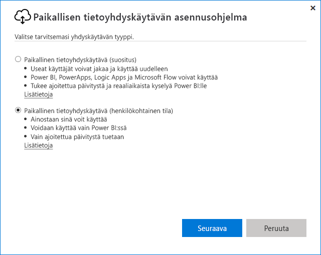
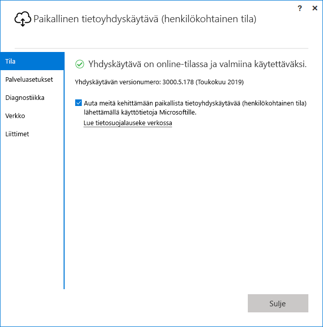

# <a name="use-personal-gateways-in-power-bi"></a>Henkilökohtaisten yhdyskäytävien käyttö Power BI:ssä

[!INCLUDE [gateway-rewrite](includes/gateway-rewrite.md)]

Paikallinen tietoyhdyskäytävä (henkilökohtainen tila) on paikallisen tietoyhdyskäytävän versio, joka toimii vain Power BI:n kanssa. Henkilökohtaisen yhdyskäytävän avulla voit asentaa yhdyskäytävän omaan tietokoneeseen ja päästä käyttämään paikallisia tietoja.

> [!NOTE]
> Kullekin Power BI -käyttäjälle voidaan suorittaa vain yhtä henkilökohtaisen tilan yhdyskäytävää. Jos asennat toisen henkilökohtaisen tilan yhdyskäytävän samalle käyttäjälle, jopa toiseen tietokoneeseen, uusin asennus korvaa aiemmin luodun edellisen asennuksen.

## <a name="on-premises-data-gateway-vs-on-premises-data-gateway-personal-mode"></a>Paikallinen tietoyhdyskäytävä vs. paikallinen tietoyhdyskäytävä (henkilökohtainen tila)

Seuraavassa taulukossa on kuvattu paikallisen tietoyhdyskäytävän ja paikallisen tietoyhdyskäytävän (henkilökohtainen tila) väliset erot.

|   |Paikallinen tietoyhdyskäytävä | Paikallinen tietoyhdyskäytävä (henkilökohtainen tila) |
| ---- | ---- | ---- |
|Tuetut pilvipalvelut |Power BI, PowerApps, Azure Logic Apps, Microsoft Flow, Azure Analysis Services, tietovuot |Power BI |
|Suoritukset |Yhdyskäytävän käyttöoikeuden omaavien käyttäjien määrittämänä |Sinuna Windows-todennusta varten ja sinun määrittämänäsi muita todentamistyyppejä varten |
|Voidaan asentaa vain tietokoneen järjestelmänvalvojana |Kyllä |Ei |
|Keskitetty yhdyskäytävän ja tietolähteen hallinta |Kyllä |Ei |
|Tuo tiedot ja ajoita päivitys |Kyllä |Kyllä |
|DirectQuery-tuki |Kyllä |Ei |
|LiveConnect-tuki Analysis Servicesia varten |Kyllä |Ei |

## <a name="install-the-on-premises-data-gateway-personal-mode"></a>Paikallisen tietoyhdyskäytävän (henkilökohtainen tila) asentaminen

Paikallisen tietoyhdyskäytävän (henkilökohtainen tila) asentaminen:

1. [Lataa paikallinen tietoyhdyskäytävä](https://go.microsoft.com/fwlink/?LinkId=820925&clcid=0x409).

2. Valitse asennusohjelmasta paikallinen tietoyhdyskäytävä (henkilökohtainen tila) ja valitse sitten **Seuraava**.

   

Yhdyskäytävätiedostot on asennettu kohteeseen _"%localappdata%\Microsoft\Paikallinen tietoyhdyskäytävä (henkilökohtainen tila)_ . Kun asennus on valmis ja olet kirjautunut sisään, näet seuraavan näytön.



## <a name="use-fast-combine-with-the-personal-gateway"></a>Nopean yhdistämisen ja henkilökohtaisen yhdyskäytävän käyttäminen

Henkilökohtaisen yhdyskäytävän nopea yhdistäminen auttaa ohittamaan määritetyt yksityisyystasot kyselyitä suoritettaessa. Nopean yhdistämisen ottaminen käyttöön paikallisen tietoyhdyskäytävän (henkilökohtainen tila) kanssa:

1. Avaa seuraava tiedosto Resurssienhallinnan avulla:

   `%localappdata%\Microsoft\On-premises data gateway (personal mode)\Microsoft.PowerBI.DataMovement.Pipeline.GatewayCore.dll.config`

2. Lisää seuraava teksti tiedoston alareunaan:

    ```xml
    <setting name="EnableFastCombine" serializeAs="String">
       <value>true</value>
    </setting>
    ```

3. Kun olet valmis, asetus tulee voimaan noin minuutin kuluttua. Vahvista nopean yhdistämisen toiminta suorittamalla päivitys Power BI -palvelussa.

## <a name="frequently-asked-questions-faq"></a>Usein kysytyt kysymykset

**Kysymys:** Voinko käyttää paikallista tietoyhdyskäytävää (henkilökohtainen tila) rinnakkain paikallisen tietoyhdyskäytävän (aiemmin yritysyhdyskäytävä) kanssa?
  
**Vastaus**: Kyllä, molemmat yhdyskäytävät voidaan suorittaa samanaikaisesti.

**Kysymys:** Voinko suorittaa paikallisen tietoyhdyskäytävän (henkilökohtainen tila) palveluna?
  
**Vastaus**: Ei. Paikallinen tietoyhdyskäytävä (henkilökohtainen tila) voidaan suorittaa vain sovelluksena. Jos haluat suorittaa yhdyskäytävän palveluna tai järjestelmänvalvojatilassa, sinun on käytettävä [paikallista tietoyhdyskäytävää](/data-integration/gateway/service-gateway-onprem) (aiemmin yritysyhdyskäytävä).

**Kysymys:** Miten usein paikallinen tietoyhdyskäytävä (henkilökohtainen tila) päivitetään?
  
**Vastaus**: Henkilökohtainen yhdyskäytävä on tarkoitus päivittää kuukausittain.

**Kysymys:** Miksi minua pyydetään päivittämään tunnistetiedot?
  
**Vastaus**: Tunnistetietojen päivittämistä voidaan pyytää useissa eri tilanteissa. Useimmiten tunnistetiedot pyydetään päivittämään silloin, kun paikallinen tietoyhdyskäytävä (henkilökohtainen tila) on asennettu uudelleen eri koneeseen kuin jossa Power BI - Personal -yhdyskäytävä on. Tietojen päivittämistä voidaan pyytää myös silloin, kun tietolähteessä on virhe ja Power BI on epäonnistunut yhteyden testaamisessa tai kun on tapahtunut aikakatkaisu tai järjestelmävirhe. Jos haluat päivittää tunnistetietosi Power BI -palvelussa, valitse hammasrataskuvake ja valitse **Asetukset** > **Tietojoukot**. Etsi kyseessä oleva tietojoukko ja valitse **Tietolähteen tunnistetiedot**.

**Kysymys:** Miten kauan aiempi henkilökohtainen yhdyskäytävä on offline-tilassa päivityksen aikana?
  
**Vastaus**: Henkilökohtaisen yhdyskäytävän päivittäminen uuteen versioon kestää vain muutaman minuutin.

**Kysymys:** Käytä R- ja Python-komentosarjoja. Tuetaanko niitä?
  
**Vastaus**: R- ja Python-komentosarjoja tuetaan henkilökohtaisessa tilassa.

## <a name="next-steps"></a>Seuraavat vaiheet

* [Paikallisen tietoyhdyskäytävän välityspalvelinasetusten määrittäminen](/data-integration/gateway/service-gateway-proxy)  

Onko sinulla kysyttävää? Kokeile [Power BI -yhteisöä](http://community.powerbi.com/).
