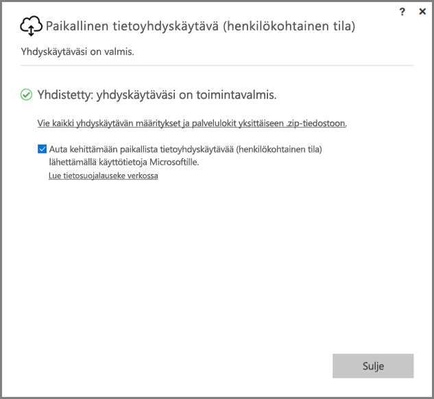
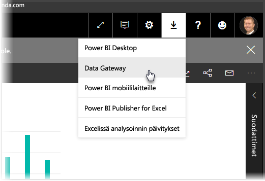
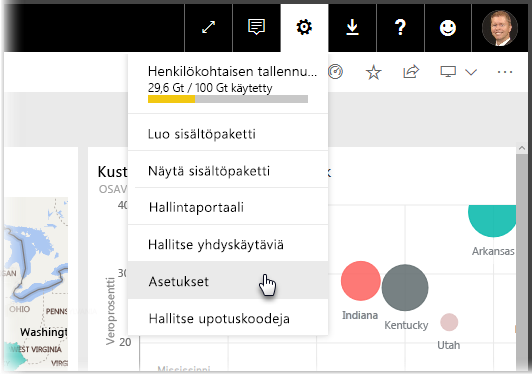
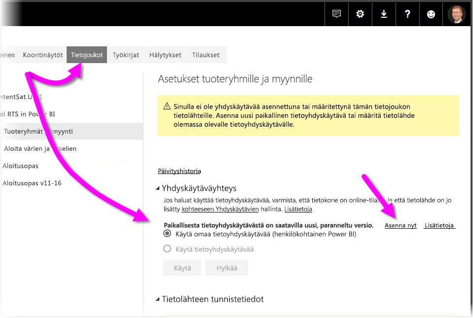
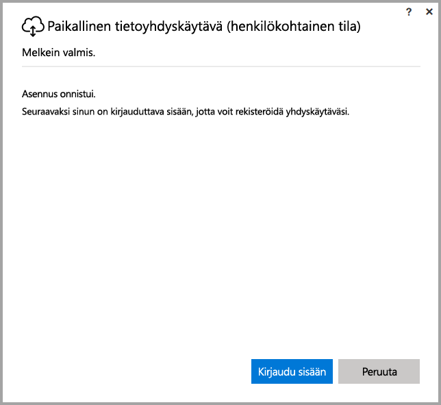
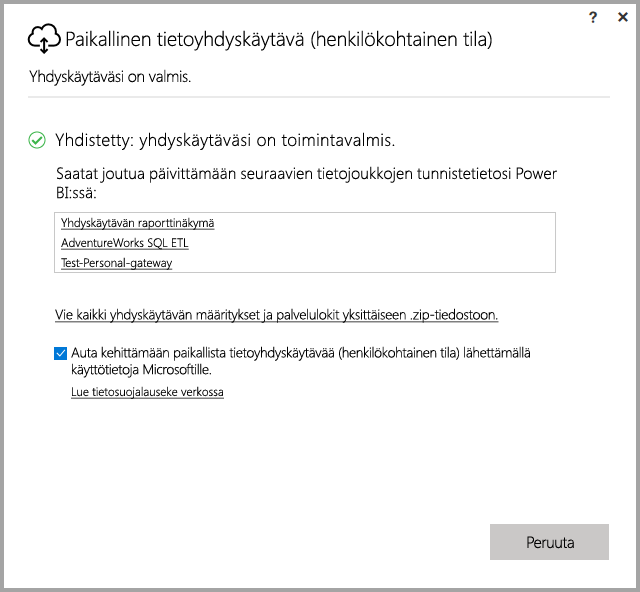

# <a name="on-premises-data-gateway-personal-mode"></a>Paikallinen tietoyhdyskäytävä (henkilökohtainen tila)
Yhdyskäytävän avulla voit käyttää paikallisia tietolähteitä ja luoda Power BI -raportteja ja -koontinäyttöjä. **Yhdyskäytävä** on ohjelmisto, joka helpottaa pääsyä yksityiseen ja paikalliseen verkkoon tallennettuihin tietoihin. Kyseisiä tietoja voi sitten käyttää online-palveluissa, kuten **Power BI -palvelussa**. **Paikallinen tietoyhdyskäytävä (henkilökohtainen tila)** on Power BI -yhdyskäytävään äskettäin julkaistu päivitys, jonka avulla käyttäjät voivat asentaa yhdyskäytävän omiin tietokoneisiinsa ja käyttää paikallisia tietoja.



> [!NOTE]
> **Paikallinen tietoyhdyskäytävä (henkilökohtainen tila)** korvaa aiemmin tuetun henkilökohtaisen **Power BI Gateway - Personal** -yhdyskäytävän. Aiempi henkilökohtainen yhdyskäytävä toimii vain 31.7.2017 asti. Alla olevissa osioissa on lisätietoja uuteen versioon päivittämisestä.
> 
> 

## <a name="features-of-the-on-premises-data-gateway-personal-mode"></a>Paikallisen tietoyhdyskäytävän (henkilökohtainen tila) ominaisuudet
**Paikallinen tietoyhdyskäytävä (henkilökohtainen tila)** sisältää useita parannuksia ja ominaisuuksia. Aiemman henkilökohtaisen yhdyskäytävän **Power BI Gateway - Personal** -version käyttöön liittyi joitakin rajoituksia. Kuten monissa muissa Power BI -tuotteissa, otimme myös tässä huomioon käyttäjien tarpeet, pyynnöt ja sen, miten he käyttävät tuotetta. Tämän tuloksena **paikallinen tietoyhdyskäytävä (henkilökohtainen tila)** on suunniteltu alusta alkaen uudelleen, ja se sisältää seuraavat ominaisuudet ja parannukset:

* **Parannettu luotettavuus**: Henkilökohtaisen yhdyskäytävän uusi versio on aiempaa versiota luotettavampi ohjelmiston koodiin ja rakenteeseen tehtyjen parannusten ansiosta.
* **Parannettu laajennettavuus**: Osana ohjelmiston rakenteellisia parannuksia henkilökohtaiseen yhdyskäytävään voidaan lisätä helposti lisäominaisuuksia sitä mukaa kuin niitä tulee saataville.
* **Henkilökohtaisen yhdyskäytävän poistaminen Power BI -palvelusta**: Uudessa versiossa voit nyt poistaa henkilökohtaisen yhdyskäytävän **Power BI -palvelusta**.
* **Määritys- ja huoltolokit**: Uudessa versiossa voit helposti viedä määritys- ja huoltolokit .zip-tiedostoon yhdellä napsautuksella.

## <a name="installing-on-premises-data-gateway-personal-mode"></a>Paikallisen tietoyhdyskäytävän (henkilökohtainen tila) asentaminen
Jos tietokoneessa ei ole asennettuna yhdyskäytävän aiempaa versiota, voit asentaa  **paikallisen tietoyhdyskäytävän (henkilökohtainen tila)** valitsemalla **Power BI -palvelusta** rataskuvakkeen ja sitten **Tietoyhdyskäytävä**.



Voit myös ladata yhdyskäytävän [täältä](https://go.microsoft.com/fwlink/?LinkId=820925&clcid=0x409). Noudata asennusohjeita. Koska voit asentaa yhdyskäytävän kumman tahansa version (joko perusyhdyskäytävän, joka voidaan jakaa muiden kanssa, tai henkilökohtaisen tilan), muista valita **Paikallinen tietoyhdyskäytävä (henkilökohtainen tila)**, kun sinulta kysytään, kumman yhdyskäytävän version haluat asentaa.

### <a name="updating-from-the-previous-personal-gateway"></a>Aiemman henkilökohtaisen yhdyskäytävän päivittäminen
Jos tietokoneessa on jo asennettuna **Power BI Gateway - Personal** -yhdyskäytävä, sinua pyydetään asentamaan uusi ja parannettu versio henkilökohtaisesta yhdyskäytävästä, kun tarkastelet **Power BI -palvelun** **Asetuksissa** **Tietojoukot**-kohtaa.



Kun valitset tietojoukon ja sitten **Yhdyskäytäväyhteys**, saat ilmoituksen, että saatavilla on uusi ja parannettu versio henkilökohtaisesta yhdyskäytävästä. Kun näet ilmoituksen, valitse **Asenna nyt**.



> [!NOTE]
> Jos käytät aiempaa **Power BI Gateway - Personal** -versiota järjestelmänvalvojana, aloita myös uuden yhdyskäytävän asennus järjestelmänvalvojana, jotta tietojoukon tunnistetiedot voidaan päivittää automaattisesti. Muutoin sinun on päivitettävä tietojoukon tunnistetiedot manuaalisesti.
> 
> 

Ohjattu toiminto opastaa sinua päivityksen aikana, ja kun päivitys on valmis, näkyviin tulee ilmoitus asennuksen onnistumisesta. Älä sulje mitään vielä, sillä viimeinen vaihe on suorittamatta.



Tässä on viimeinen vaihe. Kun uusi henkilökohtainen yhdyskäytävä on asennettu (ja viimeinen asennusnäyttö on edelleen näkyvissä), kirjaudu sisään **Power BI -palveluun** ja odota siihen asti, että näet yhdyskäytävän online-tilassa seuraavan kuvan osoittamalla tavalla.



Jos päivitit henkilökohtaisen yhdyskäytävän samassa koneessa, jossa aiempi yhdyskäytävä oli asennettuna, tunnistetiedot päivitetään automaattisesti ja kaikki päivitystoiminnot suoritetaan uuden yhdyskäytävän kautta. Jos aiempi yhdyskäytävä oli eri koneessa, sinua pyydetään päivittämään tiettyjen tietojoukkojen tunnistetiedot. Edellisen kuvan ikkunassa on luettelo tietojoukoista, joiden tunnistetiedot on ehkä päivitettävä. Jokainen luettelossa oleva tietojoukko on suora linkki, jota napsauttamalla voit päivittää tunnistetiedot helposti.

Siinä kaikki – melkein. Kun uusi yhdyskäytävä on asennettu, voit poistaa koneesta aiemman version asennuksen. Voit tehdä tämän suorittamalla koneessa haun hakusanalla **Power BI Gateway - Personal** ja poistamalla sitten sen asennuksen.

### <a name="determining-which-version-of-the-personal-gateway-you-have-installed"></a>Asennettuna olevan henkilökohtaisen yhdyskäytävän version selvittäminen
Voit selvittää asennettuna olevan henkilökohtaisen yhdyskäytävän version seuraavasti:

* Henkilökohtaisen yhdyskäytävän aiempi versio on **Power BI Gateway - Personal**, ja siinä on Power BI -kuvake asennuksen valintaikkunassa.
* Henkilökohtaisen yhdyskäytävän uutta versiota kutsutaan **paikalliseksi tietoyhdyskäytäväksi (henkilökohtainen tila)**, ja siinä on yhdyskäytäväkuvake (pilvi, jonka alareunassa on ylä- ja alanuoli).

Voit siirtyä **Lisää tai poista sovellus** -työkaluun ja katsoa, onko **Power BI Gateway - Personal** luettelossa. Jos se on luettelossa, koneessa on asennettuna henkilökohtaisen yhdyskäytävän aiempi versio.

## <a name="using-fast-combine-with-the-personal-gateway"></a>Nopean yhdistämisen ja henkilökohtaisen yhdyskäytävän käyttäminen
Jos olet käyttänyt **nopeaa yhdistämistä** aiemmassa yhdyskäytävässä, sinun on seuraavien ohjeiden mukaisesti otettava **nopea yhdistäminen** uudelleen käyttöön, jotta se toimii  **paikallisessa tietoyhdyskäytävässä (henkilökohtainen tila)**:

1. Avaa seuraava tiedosto Resurssienhallinnan avulla:
   
   ```
   %localappdata%\Microsoft\On-premises data gateway (personal mode)\Microsoft.PowerBI.DataMovement.Pipeline.GatewayCore.dll.config
   ```
2. Lisää seuraava teksti tiedoston alareunaan:
   
       ```
       <setting name="EnableFastCombine" serializeAs="String">```
       <value>true</value>
       </setting>
       ```
3. Kun olet valmis, asetus tulee voimaan noin minuutin kuluttua. Vahvista **nopean yhdistämisen** toiminta suorittamalla päivitys **Power BI -palvelussa**.

## <a name="limitations-and-considerations"></a>Rajoitukset ja huomioon otettavat seikat
**Paikallisen tietoyhdyskäytävän (henkilökohtainen tila)** käytössä on otettava huomioon seuraavassa luettelossa kuvatut seikat:

* Jos käytät **Windows Helloa** tai PIN-koodia Windowsiin kirjautumiseen, voi tapahtua seuraava virhe: 
  * *Valitsemasi käyttäjätili ei vastaa sovelluksen vaatimuksia. Kirjaudu sisään käyttäen eri tiliä.*
  * Voit korjata virheen valitsemalla *Käytä toista tiliä* ja kirjautumalla uudelleen sisään. 

**Paikallinen tietoyhdyskäytävä (henkilökohtainen tila)** ei tue tällä hetkellä seuraavia tietolähteitä:

* ADO.NET 
* CurrentWorkbook
* FTP
* HDFS
* SAP BusinessObjects         
* Spark

Spark-tuki on suunnitteilla kalenterivuoden 2017 toisella puoliskolla.

## <a name="frequently-asked-questions-faq"></a>Usein kysytyt kysymykset
* Voinko käyttää **paikallista tietoyhdyskäytävää (henkilökohtainen tila)** rinnakkain **paikallisen tietoyhdyskäytävän** (aiemmin yritysyhdyskäytävä) kanssa?
  
  * **Vastaus**: Kyllä, voit käyttää molempia versioita samanaikaisesti.
* Voinko suorittaa **paikallisen tietoyhdyskäytävän (henkilökohtainen tila)** palveluna?
  
  * **Vastaus**: Et. **Paikallinen tietoyhdyskäytävä (henkilökohtainen tila)** voidaan suorittaa vain sovelluksena. Jos haluat suorittaa yhdyskäytävän palveluna tai järjestelmänvalvojatilassa, sinun on käytettävä [**paikallista yhdyskäytävää**](service-gateway-onprem.md) (aiemmin yritysyhdyskäytävä ).
* Miten usein **paikallinen tietoyhdyskäytävä (henkilökohtainen tila)** päivitetään?
  
  * **Vastaus**: Henkilökohtainen yhdyskäytävä on tarkoitus päivittää kuukausittain.
* Miksi minua pyydetään päivittämään tunnistetiedot?
  
  * **Vastaus**: Tunnistetietojen päivittämistä voidaan pyytää useissa eri tilanteissa. Useimmiten tunnistetiedot pyydetään päivittämään silloin, kun **paikallinen tietoyhdyskäytävä (henkilökohtainen tila)** on asennettu uudelleen eri koneeseen kuin jossa **Power BI - Personal** -yhdyskäytävä on. Tietojen päivittämistä voidaan pyytää myös silloin, kun tietolähteessä on virhe ja Power BI on epäonnistunut yhteyden testaamisessa tai kun on tapahtunut aikakatkaisu tai järjestelmävirhe. Voit päivittää tunnistetiedot siirtymällä **Power BI -palvelussa** **rataskuvakkeeseen**, valitsemalla **Asetukset** ja sitten **Tietojoukot**, etsimällä kyseessä olevan tietojoukon ja napsauttamalla *Päivitä tunnistetiedot*.
* Miten kauan aiempi henkilökohtainen yhdyskäytävä on offline-tilassa päivityksen aikana?
  
  * **Vastaus**: Henkilökohtaisen yhdyskäytävän päivittäminen uuteen versioon kestää vain muutaman minuutin. 
* Mitä tapahtuu, jos en päivitä uuteen henkilökohtaiseen yhdyskäytävään 31.7.2017 mennessä?
  
  * **Vastaus**: Jos päivität raportteja nykyisessä yhdyskäytävässä, päivittäminen lopetetaan. Voit asettaa uuden päivitysaikataulun vain asentamalla ja määrittämällä uuden yhdyskäytävän.
* Käytän R-komentosarjaa. Tuetaanko sitä?
  
  * **Vastaus**: R-komentosarjoja tuetaan henkilökohtaisessa tilassa.
* Miksi en näe yhdyskäytävän päivitysilmoitusta **Power BI -palvelussa**?
  
  * **Vastaus**: Sinulla on todennäköisesti vähintään yksi sellaisen tietolähteen sisältävä tietojoukko, jota ei tueta tällä hetkellä.

## <a name="next-steps"></a>Seuraavat vaiheet
[Power BI -yhdyskäytävien välityspalvelinasetusten määrittäminen](service-gateway-proxy.md)  
Onko sinulla kysyttävää? [Kokeile Power BI -yhteisöä](http://community.powerbi.com/)

