# <a name="tutorial-connect-to-on-premises-data-in-sql-server"></a>Opetusohjelma: Yhteyden muodostaminen paikallisiin tietoihin SQL Serverissä

Paikallinen tietoyhdyskäytävä on ohjelmisto, jonka asennat paikalliseen verkkoon; se helpottaa tietojen käyttöä kyseisessä verkossa. Tässä opetusohjelmassa luot Power BI Desktopissa raportin SQL Serveristä tuoduista tiedoista. Sen jälkeen julkaiset raportin Power BI -palvelussa ja määrität yhdyskäytävän, jotta palvelu voi käyttää paikallisia tietoja. Käyttö tarkoittaa, että palvelu voi päivittää tiedot pitääkseen raportin ajan tasalla.

Tässä opetusohjelmassa opit seuraavat asiat:
> [!div class="checklist"]
> * raportin luominen SQL Server -tiedoista
> * raportin julkaiseminen Power BI -palveluun
> * SQL Serverin lisääminen yhdyskäytävän tietolähteeksi
> * raportin tietojen päivittäminen.

Jos et ole rekisteröitynyt Power BI:hin, [rekisteröidy ilmaiseen kokeiluversioon](https://app.powerbi.com/signupredirect?pbi_source=web) ennen aloittamista.


## <a name="prerequisites"></a>Edellytykset

* [Asenna Power BI Desktop](https://powerbi.microsoft.com/desktop/)
* [Asenna SQL Server](https://docs.microsoft.com/sql/database-engine/install-windows/install-sql-server) paikalliselle tietokoneelle 
* [Asenna paikallinen tietoyhdyskäytävä](service-gateway-install.md) samalle paikalliselle tietokoneelle (tuotantoympäristössä yleensä eri tietokoneelle)


## <a name="set-up-sample-data"></a>Mallitietojen ottaminen käyttöön

Aloita lisäämällä mallitiedot SQL Serveriin, jotta voit käyttää kyseisiä tietoja opetusohjelmassa myöhemmin.

1. Muodosta SQL Server Management Studiossa (SSMS) yhteys SQL Server -esiintymään ja luo testitietokanta.

    ```sql
    CREATE DATABASE TestGatewayDocs
    ```

2. Lisää taulukko ja tiedot luomaasi tietokantaan.

    ```sql
    USE TestGatewayDocs

    CREATE TABLE Product (
        SalesDate DATE,
        Category  VARCHAR(100),
        Product VARCHAR(100),
        Sales MONEY,
        Quantity INT
    )

    INSERT INTO Product VALUES('2018-05-05','Accessories','Carrying Case',9924.60,68)
    INSERT INTO Product VALUES('2018-05-06','Accessories','Tripod',1350.00,18)
    INSERT INTO Product VALUES('2018-05-11','Accessories','Lens Adapter',1147.50,17)
    INSERT INTO Product VALUES('2018-05-05','Accessories','Mini Battery Charger',1056.00,44)
    INSERT INTO Product VALUES('2018-05-06','Accessories','Telephoto Conversion Lens',1380.00,18)
    INSERT INTO Product VALUES('2018-05-06','Accessories','USB Cable',780.00,26)
    INSERT INTO Product VALUES('2018-05-08','Accessories','Budget Movie-Maker',3798.00,9)
    INSERT INTO Product VALUES('2018-05-09','Digital video recorder','Business Videographer',10400.00,13)
    INSERT INTO Product VALUES('2018-05-10','Digital video recorder','Social Videographer',3000.00,60)
    INSERT INTO Product VALUES('2018-05-11','Digital','Advanced Digital',7234.50,39)
    INSERT INTO Product VALUES('2018-05-07','Digital','Compact Digital',10836.00,84)
    INSERT INTO Product VALUES('2018-05-08','Digital','Consumer Digital',2550.00,17)
    INSERT INTO Product VALUES('2018-05-05','Digital','Slim Digital',8357.80,44)
    INSERT INTO Product VALUES('2018-05-09','Digital SLR','SLR Camera 35mm',18530.00,34)
    INSERT INTO Product VALUES('2018-05-07','Digital SLR','SLR Camera',26576.00,88)
    ```

3. Vahvista taulukon tiedot valitsemalla ne.

    ```sql
    SELECT * FROM Product
    ```

    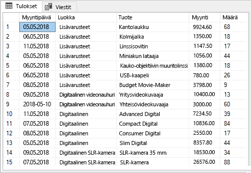


## <a name="build-and-publish-a-report"></a>Raportin koostaminen ja julkaiseminen

Nyt kun käytössäsi on mallitietoja, muodosta yhteys SQL Serveriin Power BI Desktopissa ja koosta raportti kyseisistä tiedoista. Julkaise raportti sitten Power BI -palveluun.

1. Napsauta Power BI Desktopin **Aloitus**-välilehdellä **Hae tiedot** > **SQL Server**.

2. Anna palvelimen nimi **Palvelin**-kohtaan kirjoita **Tietokanta**-kohtaan ”TestGatewayDocs”. Valitse **OK**. 

    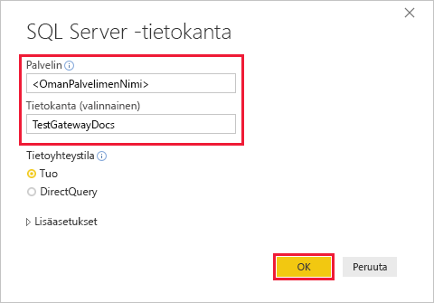

3. Vahvista tunnistetietosi ja valitse sitten **Yhdistä**.

4. Valitse **Siirtymistoiminto**-kohdassa **Tuote**-taulukko ja sitten **Lataa**.

    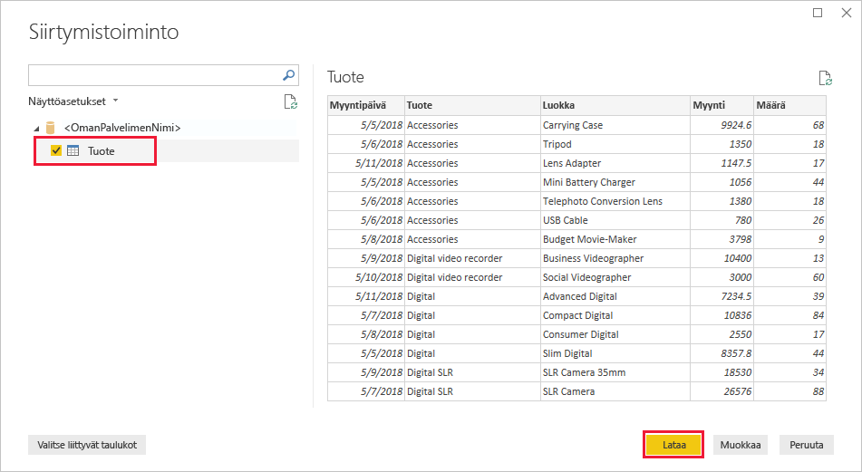

5. Valitse **Pinottu pylväskaavio** Power BI Desktopin **Raportti**-näkymän **Visualisoinnit**-ruudusta.

    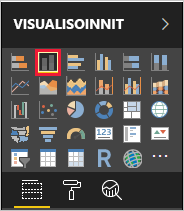    

6. Kun pylväskaavio on valittu raporttipohjassa, valitse **Kentät**-ruudun **Luokka**- ja **Myynti**-kentät.  

    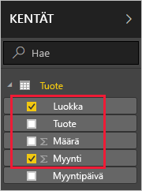

    Kaavion pitäisi nyt näyttää seuraavalta.

    

    Huomaa, että **SLR Cameran** on nykyinen myyntijohtaja. Tämä muuttuu, kun päivität tiedot ja raportin myöhemmin tässä opetusohjelmassa.

7. Tallenna raportti nimellä ”TestGatewayDocs.pbix”.

8. Valitse **Aloitus**-välilehdellä **Julkaise** > **Oma työtila** > **Valitse**. Kirjaudu sisään Power BI -palveluun, jos sinua pyydetään tekemään niin. 

    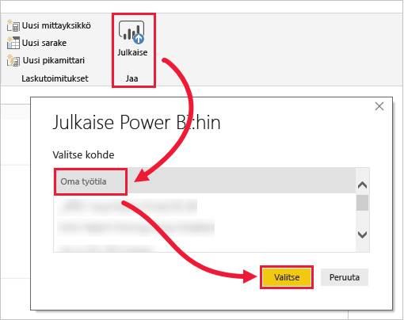

9. Valitse **Onnistui**-näytöllä **Avaa 'TestGatewayDocs.pbix' Power BI:ssä**.


## <a name="add-sql-server-as-a-gateway-data-source"></a>SQL Serverin lisääminen yhdyskäytävän tietolähteeksi

Power BI Desktopissa muodostat yhteyden suoraan SQL Serveriin, mutta Power BI -palvelu edellyttää siltana toimivaa yhdyskäytävää. Nyt voit lisätä SQL Server -esiintymän edellisessä artikkelissa luomasi yhdyskäytävän tietolähteeksi (lueteltu [Edellytykset](#prerequisites)-kohdassa). 

1. Valitse  >  Power BI -palvelun oikeasta yläkulmasta ja valitse sitten **Hallitse yhdyskäytäviä**.

    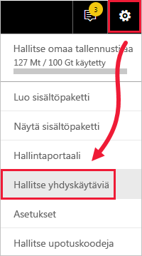

2. Valitse **Lisää tietolähde** ja anna **Tietolähteen nimi** -kenttään ”test-sql-source”.

    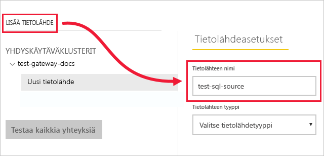

3. Valitse **SQL Serverin** **Tietolähteen tyyppi** ja kirjoita sitten muut arvot näytetyllä tavalla.

    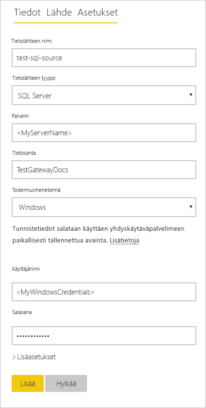


   |          Asetus           |                                               Arvo                                                |
   |---------------------------|----------------------------------------------------------------------------------------------------|
   |   **Tietolähteen nimi**    |                                          test-sql-source                                           |
   |   **Tietolähteen tyyppi**    |                                             SQL Server                                             |
   |        **Palvelin**         | SQL Server -esiintymän nimi (tämän on oltava sama kuin Power BI Desktopissa määritetty nimi) |
   |       **Tietokanta**        |                                          TestGatewayDocs                                           |
   | **Todennusmenetelmä** |                                              Windows                                               |
   |       **Käyttäjänimi**        |             Tili, kuten michael@contoso.com, jota käytät muodostaessasi yhteyden SQL Serveriin             |
   |       **Salasana**        |                   Salasana, jota käytät muodostaessasi yhteyden SQL Serveriin                    |


4. Valitse **Lisää**. *Yhteyden muodostaminen onnistui* -teksti tulee näkyviin, kun yhteys muodostettiin.

    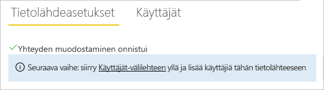

    Nyt voit sisällyttää SQL Server -tietoja Power BI -raporttinäkymiin ja -raportteihin tämän tietolähteen avulla.


## <a name="configure-and-use-data-refresh"></a>Tietojen päivittämisen määritys ja käyttö

Raportti on julkaistu Power BI -palveluun ja tietolähde määritetty SQL Serveriin. Kun nämä ovat kunnossa, voit tehdä muutoksen Tuote-taulukkoon. Kyseinen muutos vaikuttaa julkaistuun raporttiin yhdyskäytävän kautta. Voit myös määrittää ajoitetut päivitykset tulevien muutosten käsittelyä varten.

1. Päivitä Tuote-taulukko SSMS:ssä.

    ```sql
    UPDATE Product
    SET Sales = 32508, Quantity = 252
    WHERE Product='Compact Digital'     

    ```

2. Valitse Power BI -palvelun vasemmasta siirtymisruudusta **Oma työtila**.

3. Valitse **Tietojoukot**-kohdan **TestGatewayDocs**-tietojoukosta **lisää** (**...** ) > **Päivitä nyt**.

    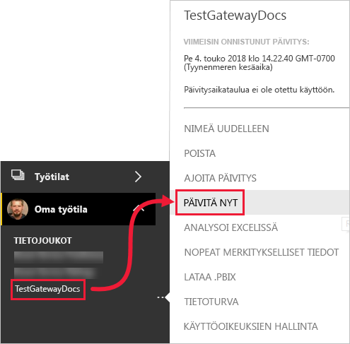

4. Valitse **Oma työtila** > **Raportit** > **TestGatewayDocs**. Näet, miten **Compact Digital** on nyt myyntijohtaja päivityksen vaikutuksesta. 

    

5. Valitse **Oma työtila** > **Raportit** > **TestGatewayDocs**. Valitse **lisää** (**. . .**) > **Ajoita päivitys**.

6. Valitse **Ajoita päivitys**, aseta päivityksen arvoksi **Käytössä** ja valitse sitten **Käytä**. Tietojoukko päivitetään oletuksena päivittäin.

    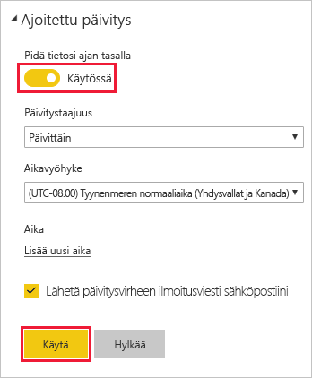

## <a name="clean-up-resources"></a>Resurssien tyhjentäminen
Jos et halua enää käyttää mallitietoja, suorita `DROP DATABASE TestGatewayDocs` SSMS:ssä. Jos et halua käyttää SQL Server -tietolähdettä, [poista kyseinen tietolähde](service-gateway-manage.md#remove-a-data-source). 


## <a name="next-steps"></a>Seuraavat vaiheet
Tässä opetusohjelmassa opit seuraavat asiat:
> [!div class="checklist"]
> * raportin luominen SQL Server -tiedoista
> * raportin julkaiseminen Power BI -palveluun
> * SQL Serverin lisääminen yhdyskäytävän tietolähteeksi
> * raportin tietojen päivittäminen.

Siirry seuraavaan artikkeliin oppimaan lisää
> [!div class="nextstepaction"]
> [Power BI -yhdyskäytävän hallinta](service-gateway-manage.md)

