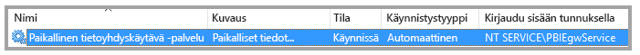
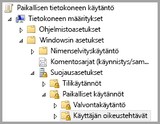
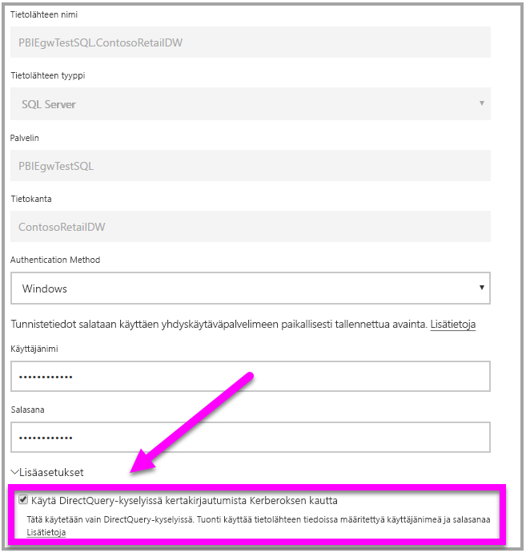

# <a name="use-resource-based-kerberos-for-single-sign-on-sso-from-power-bi-to-on-premises-data-sources"></a>Resurssipohjaisen Kerberoksen käyttäminen kertakirjautumiseen (SSO) Power BI:stä paikallisiin tietolähteisiin

Käytä [resurssipohjaista rajoitettua Kerberos-delegointia](/windows-server/security/kerberos/kerberos-constrained-delegation-overview) kertakirjautumisyhteyden käyttöönottamiseksi Windows Server 2012:lle ja uudemmille versioille, jotta edusta- ja taustapalvelut voivat olla eri toimialueilla. Jotta tämä toimisi, taustapalvelun toimialueen on luotettava edustapalvelun toimialueeseen.

## <a name="preparing-for-resource-based-kerberos-constrained-delegation"></a>Resurssipohjaisen rajoitetun Kerberos-delegoinnin valmisteleminen

Useita kohteita on määritettävä, jotta rajoitettu Kerberos-delegointi toimisi oikein, muun muassa _palvelun päänimet_ (SPN) ja palvelutilien delegointiasetukset.

### <a name="prerequisite-1-operating-system-requirements"></a>Edellytys 1: Käyttöjärjestelmävaatimukset

Resurssipohjainen rajoitettu delegointi voidaan määrittää vain toimialueen ohjauskoneeseen, jossa käytetään Windows Server 2012 R2:ta tai Windows Server 2012:ta tai uudempaa versiota.

### <a name="prerequisite-2-install-and-configure-the-on-premises-data-gateway"></a>Edellytys 2: Asenna ja määritä paikallinen tietoyhdyskäytävä

Tämä paikallisen tietoyhdyskäytävän versio tukee suoraa päivitystä ja aiemmin luotujen yhdyskäytävien _asetusten haltuunottoa_.

### <a name="prerequisite-3-run-the-gateway-windows-service-as-a-domain-account"></a>Edellytys 3: Suorita yhdyskäytävän Windows-palvelu toimialuetilinä

Normaalissa asennuksessa yhdyskäytävä toimii tietokoneen paikallisena palvelutilinä (tarkemmin _NT Service\PBIEgwService_) seuraavan kuvan mukaisesti:



Jotta **rajoitettu Kerberos-delegointi voidaan ottaa käyttöön, yhdyskäytävän on toimittava toimialuetilinä, ellei Azure AD:tä ole jo synkronoitu paikallisen Active Directoryn kanssa (käyttämällä Azure AD DirSynciä/Connectia). Jos haluat vaihtaa tilin toimialuetiliin, tutustu kohtaan [Yhdyskäytävän vaihtaminen toimialuetiliin](service-gateway-sso-kerberos.md).

Jos Azure AD-DirSync / Connect on määritetty ja käyttäjätilit synkronoidaan, yhdyskäytäväpalvelun ei tarvitse tehdä paikallisia hakuja AD:stä suorituksen aikana. Voit käyttää yhdyskäytäväpalveluun paikallisen palvelun SID-tunnusta (toimialuetilin vaatimisen sijasta). Tässä artikkelissa kuvatut rajoitetun Kerberos-delegoinnin määritysvaiheet ovat samat kuin kyseinen määritys (niitä sovelletaan yhdyskäytävän tietokoneobjektiin Active Directoryssa toimialuetilin sijaan).

### <a name="prerequisite-4-have-domain-admin-rights-to-configure-spns-setspn-and-kerberos-constrained-delegation-settings"></a>Edellytys 4: Toimialueen järjestelmänvalvojan oikeuksien hankkiminen päänimien (SetSPN) ja rajoitetun Kerberos-delegoinnin asetusten määrittämiseksi

Vaikka toimialueen järjestelmänvalvojan on teknisesti mahdollista antaa jollekulle muulle väliaikaiset tai pysyvät oikeudet määrittää palvelun päänimet ja Kerberos-delegointi ilman toimialueen järjestelmänvalvojan oikeuksia, tätä tapaa ei suositella. Seuraavassa osassa kerrotaan tarkemmin **edellytykseen 3** tarvittavat määritysvaiheet.

## <a name="configuring-kerberos-constrained-delegation-for-the-gateway-and-data-source"></a>Rajoitetun Kerberos-delegoinnin määrittäminen yhdyskäytävälle ja tietolähteelle

Jotta järjestelmä voidaan määrittää oikein, seuraavat kaksi kohdetta on määritettävä tai vahvistettava:

1. Määritä tarvittaessa palvelun päänimi yhdyskäytäväpalvelun toimialuetilille.

1. Määritä yhdyskäytäväpalvelun toimialuetilin delegointiasetukset.

Huomaa, että sinun on oltava toimialueen järjestelmänvalvoja, jotta voit suorittaa nämä kaksi määritysvaihetta.

Nämä vaiheet kuvataan seuraavissa osissa.

### <a name="configure-an-spn-for-the-gateway-service-account"></a>SPN:n määrittäminen yhdyskäytävän palvelutilille

Selvitä ensin, onko yhdyskäytävän palvelutilinä käytetylle toimialuetilille luotu jo SPN, noudattamalla näitä ohjeita:

1. Käynnistä **Active Directory -käyttäjät ja -tietokoneet** toimialueen järjestelmänvalvojana.

1. Napsauta toimialuetta hiiren kakkospainikkeella, valitse **Etsi** ja kirjoita yhdyskäytävän palvelutilin nimi

1. Napsauta hakutuloksissa yhdyskäytävän palvelutiliä hiiren kakkospainikkeella ja valitse **Ominaisuudet**.

1. Jos **Delegointi**-välilehti näkyy **Ominaisuudet**-valintaikkunassa, SPN on jo luotu ja voit siirtyä seuraavaan alakohtaan, joka koskee delegointiasetusten määrittämistä.

    Jos **Ominaisuudet**-valintaikkunassa ei ole **Delegointi**-välilehteä, voit luoda SPN:n kyseiselle tilille manuaalisesti, jolloin **Delegointi**-välilehti lisätään (välilehti on helpoin tapa määrittää delegointiasetukset). SPN voidaan luoda käyttämällä [setspn-työkalua](https://technet.microsoft.com/library/cc731241.aspx), joka sisältyy Windowsiin (SPN:n luominen edellyttää toimialueen järjestelmänvalvojan oikeuksia).

    Kuvitellaan esimerkiksi, että yhdyskäytävän palvelutili on ”PBIEgwTest\GatewaySvc”, ja yhdyskäytäväpalvelua suorittavan tietokoneen nimi on **Kone1**. Jotta esimerkin tietokoneen yhdyskäytävän palvelutilille voidaan määrittää SPN, on suoritettava seuraava komento:

      

    Kun tämä vaihe on suoritettu, voidaan siirtyä delegointiasetusten määrittämiseen.

### <a name="configure-delegation-settings"></a>Delegointiasetusten määrittäminen

Seuraavissa vaiheissa oletuksena on paikallinen ympäristö, jossa on kaksi konetta eri toimialueilla: yhdyskäytäväkone ja tietokantapalvelin, joka käyttää SQL Serveriä. Tässä esimerkissä käytetään seuraavia asetuksia ja nimiä:

- Yhdyskäytäväkoneen nimi: **PBIEgwTestGW**
- Yhdyskäytävän palvelutili: **PBIEgwTestFrontEnd\GatewaySvc** (tilin näyttönimi: yhdyskäytäväyhteys)
- SQL Serverin tietolähteen koneen nimi: **PBIEgwTestSQL**
- SQL Serverin tietolähteen palvelutili: **PBIEgwTestBackEnd\SQLService**

Käytä näitä esimerkkinimiä ja asetuksia varten seuraavia määritysvaiheita:

1. Kun käytät Microsoft Management Consolen (MMC) laajennusta, **Active Directory -käyttäjät ja -tietokoneet**, toimialueen ohjauskoneessa **PBIEgwTestFront-end**-toimialueelle, varmista, että yhdyskäytävän palvelutiliin ei sovelleta delegointiasetuksia.

    

1. Kun käytät **Active Directory -käyttäjät ja -tietokoneet** -laajennusta toimialueen ohjauskoneessa **PBIEgwTestBack-end**-toimialueelle, varmista, että taustapalvelutiliin ei sovelleta delegointiasetuksia. Varmista myös, ettei tämän tilin ”msDS-AllowedToActOnBehalfOfOtherIdentity”-määritettä ole määritetty. Löydät tämän määritteen ”Määrite-editorista” seuraavassa kuvassa esitetyllä tavalla:

    

1. Luo ryhmä **Active Directory -käyttäjät ja -tietokoneet** -laajennuksessa toimialueen ohjauskoneessa **PBIEgwTestBack-end**-toimialueelle. Lisää yhdyskäytävän palvelutili tälle ryhmälle seuraavassa kuvassa esitetyllä tavalla. Kuvassa näkyy uusi ryhmä nimeltä _ResourceDelGroup_, ja tähän ryhmään lisätty yhdyskäytävän palvelutili **GatewaySvc**.

    

1. Avaa komentokehote ja suorita seuraavat komennot toimialueen ohjauskoneessa **PBIEgwTestBack-end**-toimialueelle taustapalvelutilin msDS-AllowedToActOnBehalfOfOtherIdentity-määritteen päivittämiseksi:

    ```powershell
    $c=get-adgroupResourceDelGroup
    set-aduser **SQLService** -principalsAllowedToDelegateToAccount$c
    ```

1. Voit tarkistaa, että päivitys näkyy taustapalvelutilin ominaisuuksien ”Määrite-editori”-välilehdessä **Active Directory -käyttäjät ja -tietokoneet** -laajennuksessa.

Lopuksi koneessa, joka suorittaa yhdyskäytäväpalvelua (esimerkissämme **PBIEgwTestGW**), yhdyskäytävän palvelutilille on myönnettävä paikallinen käytäntö ”Asiakkaaksi tekeytyminen todentamisen jälkeen”. Voit suorittaa tai tarkistaa tämän paikallisessa ryhmäkäytäntöeditorissa (**gpedit**).

1. Suorita yhdyskäytäväkoneessa _gpedit.msc_.

1. Siirry kohtaan **Paikallisen tietokoneen käytäntö > Tietokoneasetukset > Windowsin asetukset > Suojausasetukset > Paikalliset käytännöt > Järjestelmäoikeuksien osoitus** seuraavan kuvan mukaisesti.

    

1. Valitse **Järjestelmäoikeuksien osoitus** -kohdan käytäntöluettelosta **Asiakkaaksi tekeytyminen todentamisen jälkeen**.

    

1. Napsauta hiiren oikealla painikkeella ja avaa **Asiakkaaksi tekeytyminen todentamisen jälkeen** -kohdan **Ominaisuudet** ja tarkista tililuettelo. Sen on sisällettävä yhdyskäytävän palvelutili ( **PBIEgwTestFront-end**  **\GatewaySvc** ).

1. Valitse **Järjestelmäoikeuksien osoitus** -kohdan käytäntöluettelosta **Käyttöjärjestelmän osana toimiminen (SeTcbPrivilege)**. Varmista, että yhdyskäytävän palvelutili sisältyy myös tililuetteloon.

1. Käynnistä **Paikallinen tietoyhdyskäytävä** -palveluprosessi uudelleen.

## <a name="running-a-power-bi-report"></a>Power BI -raportin suorittaminen

Kun kaikki aiemmin tässä artikkelissa kuvatut määritysvaiheet on suoritettu, voit käyttää Power BI:n **yhdyskäytävän hallintasivua** tietolähteen määrittämiseen. Ota sen **Lisäasetukset**-kohdassa kertakirjautuminen käyttöön ja julkaise kyseiseen tietolähteeseen liittyvät raportit ja tietojoukot.



Tämä määritys toimii useimmissa tapauksissa. Kerberoksessa voi kuitenkin olla eri määrityksiä ympäristösi mukaan. Jos raportti ei kuitenkaan lataudu, ota yhteyttä toimialueen järjestelmänvalvojaan asian selvittämiseksi.

## <a name="next-steps"></a>Seuraavat vaiheet

Lisätietoja **paikallisesta tietoyhdyskäytävästä** ja **DirectQuerystä** on seuraavissa resursseissa:

- [Paikallinen tietoyhdyskäytävä](service-gateway-onprem.md)
- [DirectQuery Power BI:ssä](desktop-directquery-about.md)
- [DirectQueryn tukemat tietolähteet](desktop-directquery-data-sources.md)
- [DirectQuery ja SAP BW](desktop-directquery-sap-bw.md)
- [DirectQuery ja SAP HANA](desktop-directquery-sap-hana.md)