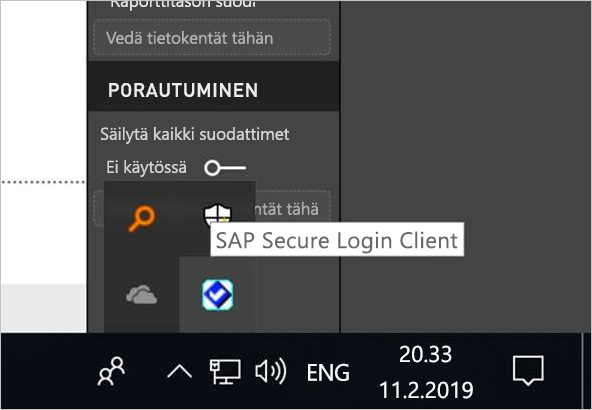
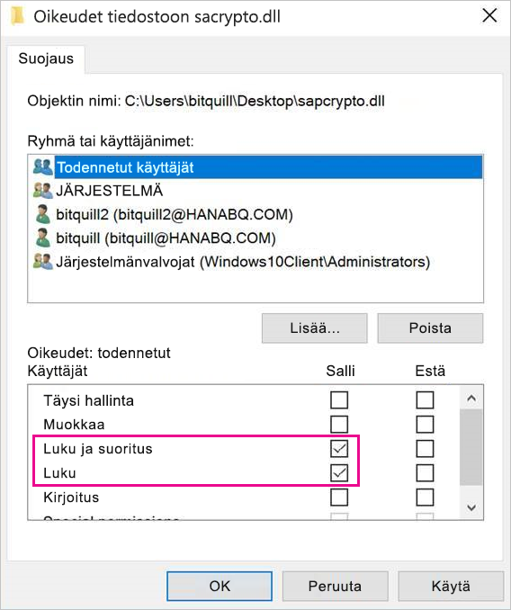
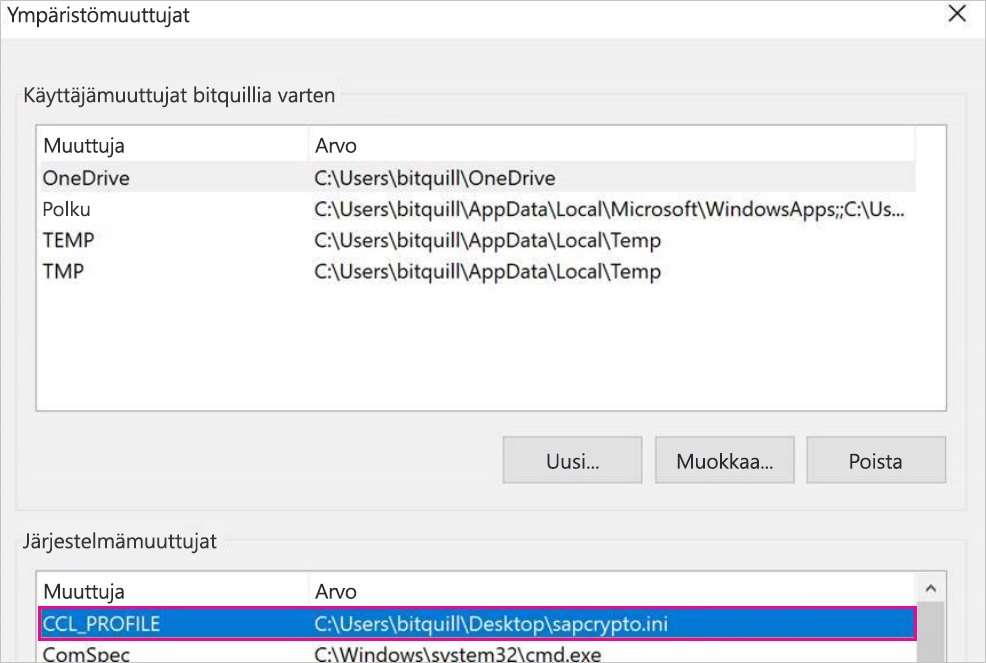
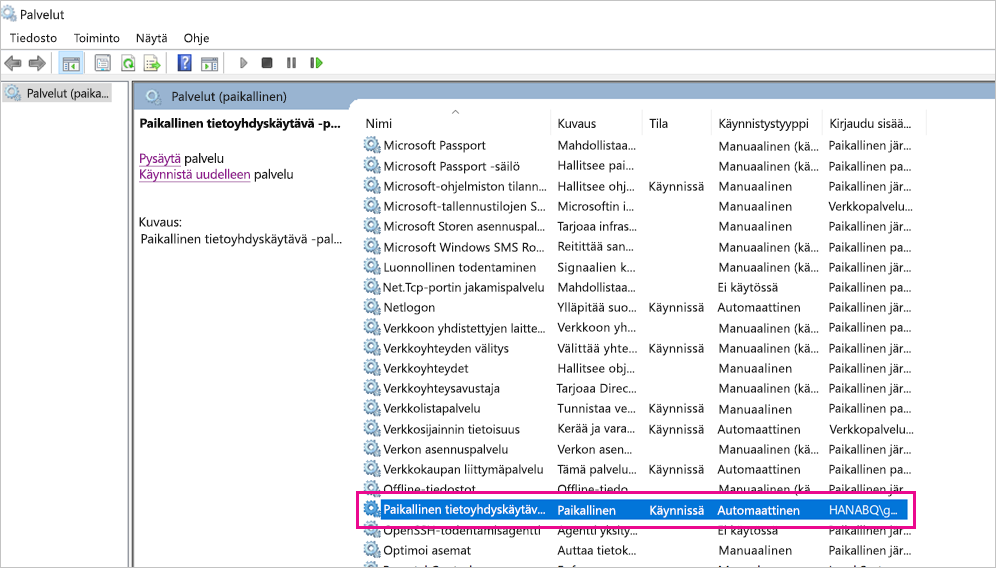

# <a name="use-kerberos-single-sign-on-for-sso-to-sap-bw-using-commoncryptolib-sapcryptodll"></a>Käytä Kerberos-SSO-kertakirjautumista SAP BW:hen CommonCryptoLibin (sapcrypto. dll) avulla

Tässä artikkelissa kerrotaan, miten voit määrittää SAP BW -tietolähteesi ottamaan käyttöön kertakirjautumisen Power BI -palvelusta CommonCryptoLibin (sapcrypto.dll) avulla.

> [!NOTE]
> Ennen kuin yrität päivittää SAP BW -pohjaisen raportin, joka käyttää Kerberos-kertakirjautumista, tee sekä tässä artikkelissa kuvatut vaiheet että artikkelissa [Kerberos-kertakirjautumisen määrittäminen](service-gateway-sso-kerberos.md) kuvatut vaiheet. Käyttämällä CommonCryptoLibiä SNC-kirjastonasi mahdollistaa kertakirjautumisyhteydet sekä SAP BW -sovelluspalvelimiin että SAP BW -viestipalvelimiin.

## <a name="configure-sap-bw-to-enable-sso-using-commoncryptolib"></a>SAP BW:n määrittäminen kertakirjautumista varten CommonCryptoLibiä käyttämällä

> [!NOTE]
> Paikallinen tietoyhdyskäytävä on 64-bittinen ohjelmisto, ja se edellyttää siksi 64-bittistä versiota CommonCryptoLibistä (sapcrypto.dll) BW SSO:n suorittamiseen. Jos aiot testata kertakirjautumisyhteyttä SAP BW -palvelimeen SAP GUIssa ennen kertakirjautumisyhteyden muodostamista yhdyskäytävän kautta (suositus), tarvitset myös CommonCryptoLibin 32-bittisen version, koska SAP GUI on 32-bittinen ohjelmisto.

1. Varmista, että BW-palvelimesi on määritetty oikein Kerberos-kertakirjautumista varten CommonCryptoLibin avulla. Jos näin on, pääset BW-palvelimeen kertakirjautumista käyttämällä (joko suoraan tai SAP BW -viestipalvelimen kautta) SAP GUIn kaltaisella SAP-työkalulla, joka on määritetty käyttämään CommonCryptoLibiä. 

   Lisätietoja asennusvaiheista on kohdassa [SAP-kertakirjautuminen: Todentaminen Kerberosin/SPNEGOn kanssa](https://blogs.sap.com/2017/07/27/sap-single-sign-on-authenticate-with-kerberosspnego/). BW-palvelimesi tulee käyttää CommonCryptoLibiä sen SNC-kirjastona, ja sillä pitää olla SNC-nimi, joka alkaa merkkijonolla *CN=* , esimerkiksi *CN=BW1*. Lisätietoja SNC-nimen vaatimuksista (erityisesti snc/identity/as parameter) on kohdassa [Kerberos-määrityksen SNC-parametrit](https://help.sap.com/viewer/df185fd53bb645b1bd99284ee4e4a750/3.0/360534094511490d91b9589d20abb49a.html).

1. Jos et ole vielä tehnyt niin, asenna [SAP .NET Connectorin](https://support.sap.com/en/product/connectors/msnet.html) x64-versio tietokoneeseen, johon yhdyskäytävä on asennettu. 
   
   Voit tarkistaa, onko osa asennettu, yrittämällä muodostaa yhteyden BW-palvelimeen Power BI Desktopissa yhdyskäytävän tietokoneesta. Jos et voi muodostaa yhteyttä 2.0-toteutuksen avulla, .NET Connectoria ei ole asennettu tai sitä ei ole asennettu GAC:hen.

1. Varmista, että SAP Secure Login Client (SLC) ei ole käynnissä tietokoneessa, johon yhdyskäytävä on asennettu. 

   SLC tallentaa Kerberos-liput välimuistiin tavalla, joka voi häiritä yhdyskäytävän kykyä käyttää Kerberos-kertakirjautumista. 

1. Jos SLC on asennettu, poista sen asennus tai varmista, että suljet SAP Secure Login Clientin. Napsauta hiiren kakkospainikkeella ilmaisinalueella olevaa kuvaketta ja valitse **Kirjaudu ulos** ja **Sulje**, ennen kuin yrität kertakirjautumisyhteyttä yhdyskäytävän avulla. 

   SLC:n käyttöä ei tueta Windows Server -koneissa. Katso lisätietoja artikkelista [SAP-huomautus 2780475](https://launchpad.support.sap.com/#/notes/2780475) (s-käyttäjä vaaditaan).

   

1. Jos poistat SLC-asennuksen tai valitset **Kirjaudu ulos** ja **Lopeta**, avaa cmd-ikkuna ja kirjoita `klist purge` poistaaksesi välimuistissa olevat Kerberos-liput, ennen kuin yrität kertakirjautumisyhteyden muodostamista yhdyskäytävän kautta.

1. Lataa 64-bittinen CommonCryptoLib (sapcrypto.dll) -versio *8.5.25 tai uudempi* SAP Launchpadista ja kopioi se yhdyskäytäväkoneesi kansioon. Luo samassa hakemistossa, johon kopioit sapcrypto.dll-tiedoston, tiedosto nimeltä sapcrypto.ini käyttäen seuraavaa sisältöä:

    ```
    ccl/snc/enable_kerberos_in_client_role = 1
    ```

    .ini-tiedosto sisältää CommonCryptoLibin edellyttämät määritystiedot, jotka mahdollistavat kertakirjautumisen yhdyskäytäväskenaariossa.

    > [!NOTE]
    > Nämä tiedostot on tallennettava samaan sijaintiin. Toisin sanoen kohteen _/path/to/sapcrypto/_ tulee sisältää sekä sapcrypto.ini että sapcrypto.dll.

    Sekä yhdyskäytäväpalvelun käyttäjä että Active Directory (AD) -käyttäjä, joksi palvelun käyttäjä tekeytyy, tarvitsee luku- ja suoritusoikeudet molempiin tiedostoihin. Suosittelemme käyttöoikeuksien myöntämistä sekä .ini- että .dll-tiedostoille Todennetut käyttäjät -ryhmälle. Testausta varten voit myös erikseen myöntää nämä oikeudet sekä yhdyskäytäväpalvelun käyttäjälle että Active Directory -käyttäjälle, joita käytät testissä. Seuraavassa näyttökuvassa olemme myöntäneet Todennetut käyttäjät -ryhmälle **luku- &amp; suoritus**oikeudet sapcrypto.dll-kohteelle:

    

1. Jos sinulla ei vielä ole SSO-liitännän läpi ohjattavaa yhdyskäytävään liitettyä SAP BW -tietolähdettä, lisää sellainen **Yhdyskäytävien hallinta** -sivulla Power BI -palvelussa. Jos tällainen tietolähde on jo, muokkaa sitä: 
    - Valitse **SAP Business Warehouse** **tietolähteen tyypiksi**, jos haluat luoda kertakirjautumisyhteyden BW-sovelluspalvelimeen. 
    - Valitse **Sap Business Warehouse -viestipalvelin**, jos haluat luoda kertakirjautumisyhteyden BW-viestipalvelimeen.

1. **SNC-kirjaston** kohdalla valitse joko **SNC\_LIB-** tai **SNC\_LIB\_64**-ympäristömuuttuja tai **Mukautettu**. 

   - Jos valitset vaihtoehdon **SNC\_LIB**, aseta **SNC\_LIB\_64**-ympäristömuuttujan arvo yhdyskäytäväkoneessa sapcrypto.dll-kohteen 64-bittisen version absoluuttiseen polkuun. Esimerkiksi *C:\Users\Test\Desktop\sapcrypto.dll*.

   - Jos valitset **Mukautettu**, liitä *sapcrypto.dll*-kohteen absoluuttinen polku Mukautetun SNC-kirjaston polku -kenttään, joka näkyy **Yhdyskäytävien hallinta -sivulla**. 

1. Jos kyseessä on **SNC-kumppanin nimi**, anna BW-palvelimen SNC-nimi. Varmista **Lisäasetukset** -kohdassa, että **Käytä DirectQuery-kyselyissä kertakirjautumista Kerberoksen kautta** -kohta on valittuna. Täytä muut kentät samalla tavalla kuin Windows-todentamisen yhteyttä muodostettaessa PBI Desktopista.

1. Luo **CCL\_PROFILE**-järjestelmän ympäristömuuttuja ja määritä sen arvoksi tiedoston sapcrypto.ini tiedostopolku.

    

    Sapcrypto.dll- ja. -ini-tiedostojen on sijaittava samassa sijainnissa. Yllä olevassa esimerkissä sekä sapcrypto.ini että sapcrypto.dll sijaitsevat työpöydällä.

1. Käynnistä yhdyskäytäväpalvelu uudelleen.

    

1. [Power BI -raportin suorittaminen](service-gateway-sso-kerberos.md#run-a-power-bi-report)

## <a name="troubleshooting"></a>Vianmääritys

Jos et pysty päivittämään raporttia Power BI -palvelussa, voit käyttää ongelman diagnosoinnissa yhdyskäytävän jäljitystä, CPIC-jäljitystä ja CommonCryptoLib-jäljitystä. Koska CPIC-jäljitys ja CommonCryptoLib ovat SAP-tuotteita, Microsoft ei tarjoa niille tukea.

### <a name="gateway-logs"></a>Yhdyskäytävän lokit

1. Yritä toistaa ongelma.

2. Avaa [yhdyskäytäväsovellus](https://docs.microsoft.com/data-integration/gateway/service-gateway-app)ja valitse **Vie lokit** **Diagnostiikka**-välilehdeltä.

      

### <a name="cpic-tracing"></a>CPIC-jäljitys

1. Jos haluat ottaa CPIC-jäljityksen käyttöön, määritä kaksi ympäristömuuttujaa: **CPIC\_TRACE** ja **CPIC\_TRACE\_DIR**. 

   Ensimmäinen muuttuja määrittää jäljitystason, ja toinen muuttuja määrittää jäljitystiedoston hakemiston. Hakemiston on oltava sijainti, johon Todennetut käyttäjät -ryhmän jäsenet voivat kirjoittaa. 
 
2. Määritä **CPIC\_TRACE** arvoon *3* ja **CPIC\_TRACE\_DIR** mihin tahansa hakemistoon, jonne haluat kirjoittaa jäljitystiedostot. Esimerkki:

   

3. Yritä toistaa ongelma ja varmista, että **CPIC\_TRACE\_DIR** sisältää jäljitystiedostoja.
 
    CPIC-jäljitys voi diagnosoida ylemmän tason ongelmia, kuten sapcrypto.dll-kirjaston latausvirheen. Tässä on esimerkkikatkelma CPIC-jäljitystiedostosta, jossa on ilmennyt .dll-latausvirhe:

    ```
    [Thr 7228] *** ERROR => DlLoadLib()==DLENOACCESS - LoadLibrary("C:\Users\test\Desktop\sapcrypto.dll")
    Error 5 = "Access is denied." [dlnt.c       255]
    ```

    Jos kohtaat tällaisen virheen, vaikka olet määrittänyt [edellisessä kohdassa](#configure-sap-bw-to-enable-sso-using-commoncryptolib) kuvatulla tavalla sapcrypto.dll- ja sapcrypto.ini-tiedostoille luku- ja suoritusoikeudet, kokeile määrittää samat luku- ja suoritusoikeudet myös tiedostot sisältävälle kansiolle.

    Jos et edelleenkään pysty lataamaan .dll-tiedostoa, kokeile ottaa [tiedoston valvonta käyttöön](/windows/security/threat-protection/auditing/apply-a-basic-audit-policy-on-a-file-or-folder). Valvontalokien tarkastelu Windowsin Tapahtumienvalvonnassa voi auttaa selvittämään, miksi tiedoston lataaminen epäonnistuu. Etsi virhekirjaus, jonka on tuottanut kyseessä olevaksi Active Directory ‑käyttäjäksi tekeytynyt tili. Esimerkiksi käyttäjäksi `MYDOMAIN\mytestuser` tekeytyneen tilin virhe voisi näyttää valvontalokissa seuraavankaltaiselta:

    ```
    A handle to an object was requested.

    Subject:
        Security ID:        MYDOMAIN\mytestuser
        Account Name:       mytestuser
        Account Domain:     MYDOMAIN
        Logon ID:       0xCF23A8

    Object:
        Object Server:      Security
        Object Type:        File
        Object Name:        <path information>\sapcrypto.dll
        Handle ID:      0x0
        Resource Attributes:    -

    Process Information:
        Process ID:     0x2b4c
        Process Name:       C:\Program Files\On-premises data gateway\Microsoft.Mashup.Container.NetFX45.exe

    Access Request Information:
        Transaction ID:     {00000000-0000-0000-0000-000000000000}
        Accesses:       ReadAttributes
                
    Access Reasons:     ReadAttributes: Not granted
                
    Access Mask:        0x80
    Privileges Used for Access Check:   -
    Restricted SID Count:   0
    ```

### <a name="commoncryptolib-tracing"></a>CommonCryptoLib-jäljitys 

1. Ota CommonCryptoLib-jäljitys käyttöön lisäämällä nämä rivit aiemmin luomaasi sapcrypto.ini-tiedostoon:

    ```
    ccl/trace/level=5
    ccl/trace/directory=<drive>:\logs\sectrace
    ```

2. Muuta asetuksen `ccl/trace/directory` arvoksi sijainti, johon Todennetut käyttäjät -ryhmän jäsenet voivat kirjoittaa. 

3. Vaihtoehtoisesti voit luoda uuden .ini-tiedoston, jos haluat muuttaa tätä toimintaa. Luo samassa hakemistossa, jossa sapcrypto.ini ja sapcrypto.dll sijaitsevat, tiedosto nimeltä sectrace.ini käyttäen seuraavaa sisältöä. Korvaa `DIRECTORY`-asetus tietokoneessasi olevalla sijainnilla, jonne Todennetut käyttäjät -ryhmän jäsenet voivat kirjoittaa:

    ```
    LEVEL = 5
    DIRECTORY = <drive>:\logs\sectrace
    ```

4. Yritä toistaa ongelma ja varmista, että **HAKEMISTO**-kohtaan määritetty sijainti sisältää jäljitystiedostoja. 

5. Kun olet valmis, poista CPIC- ja CCL-jäljitys käytöstä.

    Lisätietoja CommonCryptoLib-jäljityksestä on kohdassa [SAP-huomautus 2491573](https://launchpad.support.sap.com/#/notes/2491573) (SAP:n s-käyttäjä vaaditaan).

## <a name="next-steps"></a>Seuraavat vaiheet

Lisätietoja paikallisesta tietoyhdyskäytävästä ja DirectQuerysta on seuraavissa resursseissa:

* [Mikä paikallinen tietoyhdyskäytävä on?](/data-integration/gateway/service-gateway-onprem)
* [DirectQuery Power BI:ssä](desktop-directquery-about.md)
* [DirectQueryn tukemat tietolähteet](desktop-directquery-data-sources.md)
* [DirectQuery ja SAP BW](desktop-directquery-sap-bw.md)
* [DirectQuery ja SAP HANA](desktop-directquery-sap-hana.md)
