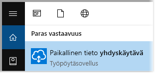
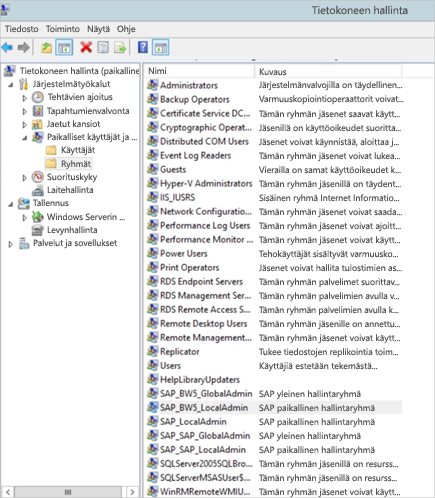
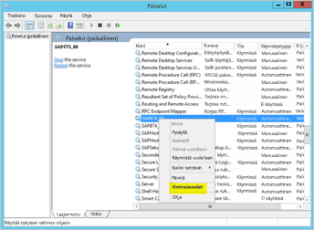
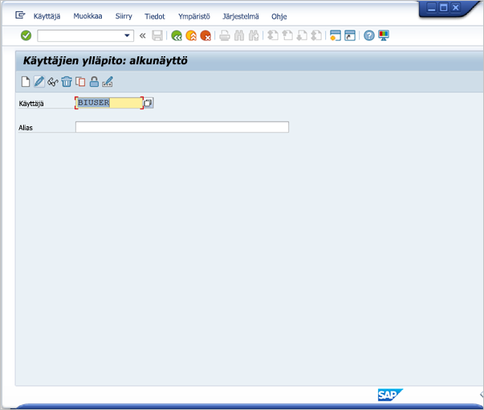
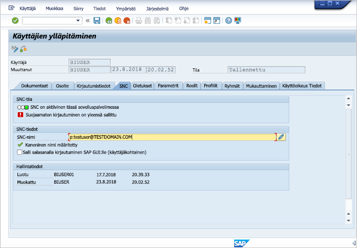
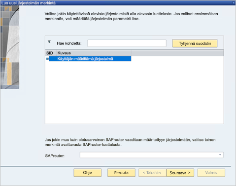
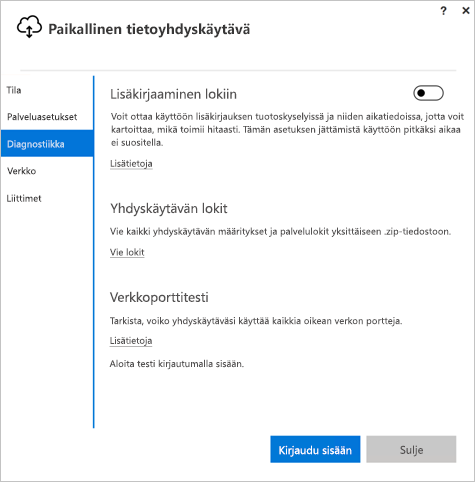
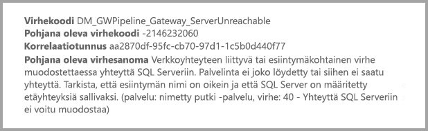

# <a name="use-kerberos-for-single-sign-on-sso-from-power-bi-to-on-premises-data-sources"></a>Kerberoksen käyttäminen kertakirjautumista (SSO) varten Power BI:stä paikallisiin tietolähteisiin

Käytä [rajoitettua Kerberos-delegointia](/windows-server/security/kerberos/kerberos-constrained-delegation-overview) ottaaksesi saumattoman kertakirjautumisen (SSO) käyttöön. Kun otat kertakirjautumisen käyttöön, Power BI -raportit ja -koontinäytöt voivat helposti päivittää tiedot, jotka ovat peräisin paikallisista lähteistä.

## <a name="supported-data-sources"></a>Tuetut tietolähteet

Tällä hetkellä tuemme seuraavia tietolähteitä:

* SQL Server
* SAP HANA
* SAP BW
* Teradata
* Spark
* Impala

Tuemme myös SAP HANA:a yhdessä [Security Assertion Markup Languagen (SAML)](service-gateway-sso-saml.md) kanssa.

### <a name="sap-hana"></a>SAP HANA

Ota kertakirjautuminen käyttöön SAP HANA:ssa toimimalla seuraavasti:

* Varmista, että SAP HANA -palvelin käyttää vaadittua vähimmäisversiota, joka riippuu SAP HANA -palvelimesi ympäristön tasosta:
  * [HANA 2 SP 01 Rev 012.03](https://launchpad.support.sap.com/#/notes/2557386)
  * [HANA 2 SPS 02 Rev 22](https://launchpad.support.sap.com/#/notes/2547324)
  * [HANA 1 SP 12 Rev 122.13](https://launchpad.support.sap.com/#/notes/2528439)
* Asenna yhdyskäytävätietokoneeseen SAP:n uusin HANA ODBC -ohjain.  Vähimmäisversio on HANA ODBC 2.00.020.00 elokuulta 2017.

Katso lisätietoja SSO-kirjautumisen määrittämisestä Kerberoksen avulla SAP HANA:lle SAP HANA -suojausoppaan [Kertakirjautuminen Kerberoksen avulla](https://help.sap.com/viewer/b3ee5778bc2e4a089d3299b82ec762a7/2.0.03/1885fad82df943c2a1974f5da0eed66d.html) -kohdasta. Tutustu myös sivulla oleviin linkkeihin, erityisesti SAP Note 1837331 – HOWTO HANA DBSSO Kerberos/Active Directory.

## <a name="prepare-for-kerberos-constrained-delegation"></a>Rajoitetun Kerberos-delegoinnin valmisteleminen

Sinun on määritettävä useita kohteita, jotta rajoitettu Kerberos-delegointi toimisi oikein, muun muassa *palvelun päänimet* (SPN) ja palvelutilien delegointiasetukset.

### <a name="prerequisite-1-install-and-configure-the-microsoft-on-premises-data-gateway"></a>Edellytys 1: Asenna ja määritä paikallinen Microsoft-tietoyhdyskäytävä

Tämä paikallisen tietoyhdyskäytävän versio tukee suoraa päivitystä sekä aiemmin luotujen yhdyskäytävien asetuksien haltuunottoa.

### <a name="prerequisite-2-run-the-gateway-windows-service-as-a-domain-account"></a>Edellytys 2: Suorita yhdyskäytävän Windows-palvelu toimialuetilinä

Normaalissa asennuksessa yhdyskäytävä toimii tietokoneen paikallisena palvelutilinä (tarkemmin *NT Service\PBIEgwService*).


Jotta rajoitettu Kerberos-delegointi voidaan ottaa käyttöön, yhdyskäytävän on toimittava toimialuetilinä, ellei Azure Active Directorya (Azure AD) ole jo synkronoitu paikallisen Active Directory -esiintymän kanssa (käyttämällä Azure AD DirSynciä/Connectia). Jos haluat vaihtaa toimialuetiliin, tutustu kohtaan [Yhdyskäytävän vaihtaminen toimialuetiliin](#switch-the-gateway-to-a-domain-account) myöhemmin tässä artikkelissa.

> [!NOTE]
> Jos Azure AD Connect on määritetty ja käyttäjätilit synkronoidaan, yhdyskäytäväpalvelun ei tarvitse tehdä paikallisia hakuja Azure AD:stä suorituksen aikana. Voit käyttää yhdyskäytäväpalveluun paikallisen palvelun SID-tunnusta (toimialuetilin vaatimisen sijasta). Tässä artikkelissa kuvatut rajoitetun Kerberos-delegoinnin määritysvaiheet ovat samat kuin kyseinen määritys. Niitä sovelletaan Azure AD:ssä yhdyskäytävän tietokoneobjektiin toimialuetilin sijaan.

### <a name="prerequisite-3-have-domain-admin-rights-to-configure-spns-setspn-and-kerberos-constrained-delegation-settings"></a>Edellytys 3: Toimialueen järjestelmänvalvojan oikeuksien hankkiminen päänimien (SetSPN) ja rajoitetun Kerberos-delegoinnin asetusten määrittämiseksi

Emme suosittele, että järjestelmänvalvoja antaa jollekulle muulle väliaikaiset tai pysyvät oikeudet määrittää palvelun päänimet ja Kerberos-delegointi ilman toimialueen järjestelmänvalvojan oikeuksia. Suositellut määritysvaiheet käsitellään seuraavassa osiossa.

## <a name="configure-kerberos-constrained-delegation-for-the-gateway-and-data-source"></a>Rajoitetun Kerberos-delegoinnin määrittäminen yhdyskäytävälle ja tietolähteelle

Määritä toimialueen järjestelmänvalvojana palvelun päänimi yhdyskäytävän palvelutilille ja määritä sitten yhdyskäytäväpalvelun toimialuetilin delegointiasetukset.

### <a name="configure-an-spn-for-the-gateway-service-account"></a>SPN:n määrittäminen yhdyskäytävän palvelutilille

Selvitä ensin, onko yhdyskäytävän palvelutilinä käytetylle toimialuetilille luotu jo palvelun päänimi:

1. Avaa **Active Directory Users and Computers** -työkalu toimialueen järjestelmänvalvojana.

2. Napsauta toimialuetta hiiren kakkospainikkeella, valitse **Etsi** ja kirjoita yhdyskäytävän palvelutilin nimi.

3. Napsauta hakutuloksissa yhdyskäytävän palvelutiliä hiiren kakkospainikkeella ja valitse **Ominaisuudet**.

4. Jos **Delegointi**-välilehti on näkyvissä **Ominaisuudet**-valintaikkunassa, palvelun päänimi on jo luotu. Voit siirtyä delegointiasetusten määrittämiseen.

    Jos **Delegointi**-välilehteä ei näy **Ominaisuudet**-valintaikkunassa, voit luoda palvelun päänimen kyseiselle tilille manuaalisesti. **Delegointi**-välilehti luodaan samalla. Käytä [setspn-työkalua](https://technet.microsoft.com/library/cc731241.aspx), joka sisältyy Windowsiin (palvelun päänimen luominen edellyttää toimialueen järjestelmänvalvojan oikeuksia).

    Kuvitellaan esimerkiksi, että yhdyskäytävän palvelutili on ”PBIEgwTest\GatewaySvc”, ja yhdyskäytäväpalvelua suorittavan tietokoneen nimi on **Kone1**. Jotta esimerkin tietokoneen yhdyskäytävän palvelutilille voidaan määrittää palvelun päänimi, suorita seuraava komento:

    

    Kun tämä vaihe on suoritettu, voidaan siirtyä delegointiasetusten määrittämiseen.

### <a name="configure-delegation-settings-on-the-gateway-service-account"></a>Yhdyskäytävän palvelutilin delegointiasetusten määrittäminen

Toinen vaadittava määritys on yhdyskäytävän palvelutilin delegointiasetusten määrittäminen. Voit suorittaa nämä vaiheet useilla eri työkaluilla. Tässä esimerkissä käytetään Active Directory Users and Computers -työkalua, joka on Microsoft Management Console (MMC) -laajennus. Sen avulla voit hallita ja julkaista tietoja hakemistossa. Se on käytettävissä toimialueen ohjauskoneissa oletusarvoisesti. Voit myös ottaa sen käyttöön Windowsin toimintojen määrityksen kautta toisissa tietokoneissa.

Rajoitettu Kerberos-delegointi on määritettävä protokollan siirtämisellä. Rajoitetussa delegoinnissa on määritettävä tarkasti, mihin palveluihin haluat delegoida. Esimerkiksi vain SQL Server tai SAP HANA -palvelin hyväksyy delegointikutsuja yhdyskäytävän palvelutililtä.

Tässä osassa oletetaan, että olet jo määrittänyt SPN:t pohjana oleville tietolähteille (kuten SQL Server, SAP HANA, Teradata tai Spark). Lisätietoja kyseisten tietolähteiden palvelimen palvelun päänimien määrittämisestä löytyy vastaavan tietokantapalvelimen teknisessä dokumentaatiossa. Tutustu myös [What SPN does your app require?](https://blogs.msdn.microsoft.com/psssql/2010/06/23/my-kerberos-checklist/) -blogikirjoitukseen.

Seuraavissa vaiheissa oletuksena on paikallinen ympäristö, jossa on kaksi konetta: yhdyskäytäväkone ja tietokantapalvelin, joka käyttää SQL Serveriä. Esimerkissä käytetään seuraavia asetuksia ja nimiä:

* Yhdyskäytäväkoneen nimi: **PBIEgwTestGW**
* Yhdyskäytävän palvelutili: **PBIEgwTest\GatewaySvc** (tilin näyttönimi: yhdyskäytäväyhteys)
* SQL Serverin tietolähteen koneen nimi: **PBIEgwTestSQL**
* SQL Serverin tietolähteen palvelutili: **PBIEgwTest\SQLService**

Voit määrittää delegoinnin asetukset seuraavasti:

1. Käynnistä **Active Directory Users and Computers** toimialueen järjestelmänvalvojan oikeuksilla.

2. Napsauta yhdyskäytävän palvelutiliä (**PBIEgwTest\GatewaySvc**) hiiren kakkospainikkeella ja valitse **Ominaisuudet**.

3. Valitse **Delegointi**-välilehti.

4. Valitse **Luota tähän tietokoneeseen vain määritettyihin palveluihin delegointia varten** >  ja valitse sitten **Käytä mitä tahansa todennusprotokollaa**.

6. Valitse **Palvelut, joille tämä tili voi esittää delegoidut tunnistetiedot** -kohdassa **Lisää**.

7. Valitse uudessa valintaikkunassa **Käyttäjät tai tietokoneet**.

8. Anna SQL Server -tietolähteen palvelutili (**PBIEgwTest\SQLService**) ja valitse **OK**.

9. Valitse SPN, jonka loit tietokantapalvelimelle. Tässä esimerkissä SPN:n alussa on **MSSQLSvc**. Jos olet lisännyt tietokantapalvelulle sekä FQDN- että NetBIOS-SPN:n, valitse molemmat. Saatat nähdä näistä vain toisen.

10. Valitse **OK**. Palvelun päänimen pitäisi näkyä nyt luettelossa.

    Voit myös valita **Laajennettu**, jolloin näytetään sekä FQDN- että NetBIOS-SPN. Valintaikkuna näyttää samalta kuin alla, jos valitsit **Laajennettu**. Valitse **OK**.

    

Lopuksi koneessa, joka suorittaa yhdyskäytäväpalvelua (esimerkissämme **PBIEgwTestGW**), yhdyskäytävän palvelutilille on myönnettävä paikallinen käytäntö **Asiakkaaksi tekeytyminen todentamisen jälkeen**. Voit suorittaa ja tarkistaa tämän paikallisessa ryhmäkäytäntöeditorissa (**gpedit**).

1. Suorita yhdyskäytäväkoneessa *gpedit.msc*.

1. Siirry kohtaan **Paikallisen tietokoneen käytäntö** > **Tietokoneen määritys** > **Windows-asetukset** > **Suojausasetukset** > **Paikalliset käytännöt** > **Järjestelmäoikeuksien osoitus**.

    

1. Valitse **Järjestelmäoikeuksien osoitus** -kohdan käytäntöluettelosta **Asiakkaaksi tekeytyminen todentamisen jälkeen**.

    

    Napsauta **Ominaisuudet**-kohtaa hiiren kakkospainikkeella ja avaa se. Tarkista tililuettelo. Sen on sisällettävä yhdyskäytävän palvelutili (**PBIEgwTest\GatewaySvc**).

1. Valitse **Järjestelmäoikeuksien osoitus** -kohdan käytäntöluettelosta **Käyttöjärjestelmän osana toimiminen (SeTcbPrivilege)** . Varmista, että yhdyskäytävän palvelutili sisältyy myös tililuetteloon.

1. Käynnistä **Paikallinen tietoyhdyskäytävä** -palveluprosessi uudelleen.

Jos käytät SAP HANA:a, suosittelemme seuraamaan seuraavia vaiheita, jotka voivat parantaa suorituskykyä jonkin verran.

1. Etsi ja avaa seuraava määritystiedosto yhdyskäytävän asennushakemistosta: *Microsoft.PowerBI.DataMovement.Pipeline.GatewayCore.dll.config*.

1. Etsi *FullDomainResolutionEnabled*-ominaisuus ja muuta sen arvoksi *True*.

    ```xml
    <setting name=" FullDomainResolutionEnabled " serializeAs="String">
          <value>True</value>
    </setting>
    ```

## <a name="run-a-power-bi-report"></a>Power BI -raportin suorittaminen

Kun kaikki määritysvaiheet on suoritettu, voit käyttää Power BI:n **yhdyskäytävän hallintasivua** tietolähteen määrittämiseen. Ota **Lisäasetukset**-kohdassa kertakirjautuminen käyttöön ja julkaise kyseiseen tietolähteeseen liittyvät raportit ja tietojoukot.


Tämä määritys toimii useimmissa tapauksissa. Kerberoksessa voi kuitenkin olla eri määrityksiä ympäristösi mukaan. Jos raportti ei kuitenkaan lataudu, ota yhteyttä toimialueen järjestelmänvalvojaan asian selvittämiseksi.

## <a name="switch-the-gateway-to-a-domain-account"></a>Yhdyskäytävän vaihtaminen toimialuetiliin

Voit tarvittaessa vaihtaa paikallisen palvelutilin toimialuetilinä suoritettavaksi **Paikallinen tietoyhdyskäytävä** -käyttöliittymän avulla. Ohjeet:

1. Käynnistä **Paikallinen tietoyhdyskäytävä** -määritystyökalu.

   

2. Valitse **Kirjaudu sisään** -painike pääsivulla ja kirjaudu sisään Power BI -tililläsi.

3. Kun kirjautuminen on valmis, valitse **Palveluasetukset**-välilehti.

4. Käynnistä ohjattu määritys valitsemalla **Vaihda tili**.

   

## <a name="configure-sap-bw-for-sso"></a>SAP BW:n määrittäminen kertakirjautumista varten

Nyt kun ymmärrät, miten Kerberos toimii yhdyskäytävän kanssa, voit määrittää kertakirjautumisen SAP Business Warehousea (SAP BW) varten. Seuraavissa vaiheissa oletetaan, että olet jo [valmistellut rajoitetun Kerberos-delegoinnin](#prepare-for-kerberos-constrained-delegation) tässä artikkelissa aiemmin kuvatulla tavalla.

Tämä opas pyrkii olemaan mahdollisimman kattava. Jos olet jo suorittanut joitakin näistä vaiheista, voit ohittaa ne. Olet saattanut esimerkiksi jo luoda palvelukäyttäjän SAP BW -palvelimelle ja yhdistänyt siihen SPN:n, tai ehkä olet jo asentanut `gsskrb5`-kirjaston.

### <a name="set-up-gsskrb5-on-client-machines-and-the-sap-bw-server"></a>gsskrb5:n määrittäminen asiakaskoneisiin ja SAP BW -palvelimelle

> [!NOTE]
> `gsskrb5` ei enää aktiivisesti tue SAP:tä. Katso lisätietoja artikkelista [SAP-huomautus 352295](https://launchpad.support.sap.com/#/notes/352295). Huomaa myös, ettei `gsskrb5` salli SSO-yhteyksiä tietoyhdyskäytävästä SAP BW -viestipalvelimiin. Vain yhteydet SAP BW -sovelluspalvelimiin sallitaan. `gsskrb5` on oltava käytössä sekä asiakaskoneessa että palvelimella SSO-yhteyden muodostamiseksi yhdyskäytävän kautta. Yleistä Crypto-kirjastoa (sapcrypto) tuetaan nyt SAP BW:llä.

1. Lataa `gsskrb5` - `gx64krb5` [SAP Note 2115486](https://launchpad.support.sap.com/) -huomautuksesta (SAP s-käyttäjä vaaditaan). Varmista, että sinulla on vähintään versio 1.0.11.x tiedostoista gsskrb5.dll ja gx64krb5.dll.

1. Sijoita kirjasto sellaiseen paikkaan yhdyskäytäväkoneessa, jossa se on yhdyskäytävän esiintymän käytettävissä (ja myös SAP GUI:n, jos haluat testata kertakirjautumisyhteyttä SAP-kirjautumisen avulla).

1. Aseta toinen kopio sellaiseen paikkaan SAP BW -palvelinkoneessa, joka on SAP BW -palvelimen käytettävissä.

1. Määritä `SNC\_LIB`- ja `SNC\_LIB\_64`-ympäristömuuttujat asiakas- ja palvelinkoneissa osoittamaan niihin paikkoihin, joissa gsskrb5.dll ja gx64krb5.dll sijaitsevat (tässä mainitussa järjestyksessä).

### <a name="create-a-sap-bw-service-user-and-enable-snc-communication"></a>Luo SAP BW -palvelun käyttäjä ja ota SNC-yhteys käyttöön

Tekemäsi yhdyskäytävän määrityksen lisäksi sinun tulee suorittaa muutama SAP BW -kohtainen vaihe. Ohjeiden osiossa [Yhdyskäytävän palvelutilin delegointiasetusten määrittäminen](#configure-delegation-settings-on-the-gateway-service-account) oletetaan, että olet jo määrittänyt SPN:t pohjana oleville tietolähteille. Viimeistele tämä SAP BW -määritys toimimalla seuraavasti:

1. Luo palvelukäyttäjä (aluksi vain tavallinen Active Directory -käyttäjä) Active Directory -toimialueen ohjauspalvelimella Active Directory -ympäristössäsi olevaa SAP BW -sovelluspalvelinta varten. Liitä sitten SPN siihen.

    SAP suosittelee SPN:n aloittamista `SAP/`:n avulla, mutta voit käyttää myös muita etuliitteitä, kuten `HTTP/`. Voit itse päättää, miten merkkijono jatkuu `SAP/`:n jälkeen – voit esimerkiksi käyttää SAP BW -palvelimen palvelukäyttäjän käyttäjänimeä. Jos luot palvelun käyttäjäksi esimerkiksi `BWServiceUser@\<DOMAIN\>`:n, voit käyttää palvelun päänimeä `SAP/BWServiceUser`. Yksi tapa määrittää SPN-yhdistämismääritys on käyttää setspn-komentoa. Voit esimerkiksi määrittää juuri luomasi palvelukäyttäjän SPN:n suorittamalla seuraavan komennon cmd-ikkunassa toimialueen ohjauskoneessa: `setspn -s SAP/ BWServiceUser DOMAIN\ BWServiceUser`. Katso lisätietoja SAP:n BW-dokumentaatiosta.

1. SAP BW -sovelluspalvelimen käyttöoikeuksien antaminen palvelukäyttäjälle:

    1. Lisää palvelun käyttäjä SAP BW -palvelimella paikalliseen järjestelmänvalvojaryhmään. Avaa Tietokoneen hallinta -ohjelma ja kaksoisnapsauta palvelimen paikallista järjestelmänvalvojaryhmää.

        

    1. Kaksoisnapsauta paikallista järjestelmänvalvojaryhmää ja lisää sitten palvelun käyttäjä ryhmään valitsemalla **Lisää**. Valitse **Tarkista nimet** varmistaaksesi, että olet kirjoittanut nimen oikein. Valitse **OK**.

1. Määritä SAP BW -palvelimen palvelukäyttäjä siksi käyttäjäksi, joka käynnistää SAP BW -palvelinpalvelun SAP BW -palvelinkoneessa.

    1. Avaa **Suorita** ja kirjoita ”Services.msc”. Etsi palvelu, joka vastaa SAP BW -sovelluspalvelimen esiintymää. Napsauta sitä hiiren kakkospainikkeella ja valitse **Ominaisuudet**.

        

    1. Vaihda **Kirjaudu**-välilehteen ja muuta käyttäjä SAP BW -palvelukäyttäjäksi. Kirjoita käyttäjän salasana ja valitse **OK**.

1. Kirjaudu sisään palvelimeesi SAP-kirjautumisen kautta ja määritä seuraavat profiiliparametrit RZ10-tapahtuman avulla:

    1. Määritä snc/identity/as-profiiliparametrin arvoksi p:\<luomasi SAP BW -palvelukäyttäjä\>, esimerkiksi p:BWServiceUser@MYDOMAIN.COM. Huomaa merkkijono ”p:” ennen palvelukäyttäjän täydellistä käyttäjätunnusta. Merkkijono ei ole p:CN= kuten käytettäessä yleistä salauskirjastoa SNC-kirjastona.

    1. Määritä snc/gssapi\_lib-profiiliparametrin arvoksi \<gsskrb5.dll- tai gx64krb5.dll-tiedoston polku palvelinkoneessa (käyttämäsi kirjasto määräytyy käyttöjärjestelmän bittimäärän mukaan)\>. Muista asettaa kirjasto sellaiseen paikkaan, jota SAP BW -sovelluspalvelin voi käyttää.

    1. Muuta myös seuraavia profiilin lisäparametrien arvoja niin, että ne vastaavat tarpeitasi. Huomaa, että viimeisellä viidellä asetuksella voit antaa asiakkaittesi muodostaa yhteyden SAP BW -palvelimeen SAP-kirjautumisen avulla ilman, että heille on määritetty SNC:tä.

        | **Asetus** | **Arvo** |
        | --- | --- |
        | snc/data\_protection/max | 3 |
        | snc/data\_protection/min | 1 |
        | snc/data\_protection/use | 9 |
        | snc/accept\_insecure\_cpic | 1 |
        | snc/accept\_insecure\_gui | 1 |
        | snc/accept\_insecure\_r3int\_rfc | 1 |
        | snc/accept\_insecure\_rfc | 1 |
        | snc/permit\_insecure\_start | 1 |

    1. Määritä snc/enable-omaisuuden arvoksi 1.

1. Kun olet määrittänyt nämä profiiliparametrit, avaa palvelinkoneen SAP-hallintakonsoli ja käynnistä SAP BW -esiintymä uudelleen. Jos palvelin ei käynnisty, tarkista, että olet määrittänyt profiilin parametrit oikein. Lisätietoja profiiliparametriasetuksista löytyy [SAP-dokumentaatiosta](https://help.sap.com/saphelp_nw70ehp1/helpdata/en/e6/56f466e99a11d1a5b00000e835363f/frameset.htm). Voit myös tarvittaessa tutustua vianmääritystietoihin, jotka esitellään myöhemmin tässä osiossa.

### <a name="map-a-sap-bw-user-to-an-active-directory-user"></a>SAP BW -käyttäjän yhdistäminen Active Directory -käyttäjään

Liitä Active Directory -käyttäjä SAP BW -sovelluspalvelimen käyttäjään ja testaa kertakirjautumisyhteyttä SAP-kirjautumisessa.

1. Kirjaudu sisään SAP BW -palvelimeen käyttämällä SAP-kirjautumista. Suorita tapahtuma SU01.

1. Syötä **Käyttäjä**-kohtaan SAP BW -käyttäjä, jolle haluat ottaa kertakirjautumisyhteydet käyttöön (edellisessä näyttökuvassa osoitamme käyttöoikeudet käyttäjälle BIUSER). Valitse **Muokkaa**-kuvake, joka löytyy SAP-kirjautumisikkunan vasemmasta yläkulmasta (kynän kuva).

    

1. Valitse **SNC**-välilehti. Kirjoita SNC-nimisyöteruutuun p:\<Active Directory -käyttäjä\>@\<toimialueesi\>. Huomaa pakollinen p:, jonka on tultava ennen Active Directory -käyttäjän täydellistä käyttäjätunnusta. Määrittämäsi Active Directory -käyttäjän on kuuluttava henkilölle tai organisaatiolle, jolle haluat myöntää kertakirjautumiskäyttöoikeuden SAP BW -sovelluspalvelimeen. Jos haluat esimerkiksi myöntää kertakirjautumiskäyttöoikeuden käyttäjälle [testuser@TESTDOMAIN.COM](mailto:testuser@TESTDOMAIN.COM), syötä p:testuser@TESTDOMAIN.COM.

    

1. Valitse **Tallenna**-kuvake (levyke) näytön vasemmasta yläkulmasta.

### <a name="test-sign-in-by-using-sso"></a>Sisäänkirjautumisen testaaminen kertakirjautumisen avulla

Varmista, että voit kirjautua sisään palvelimelle. Käytä SAP-kirjautumista SSO:n avulla Active Directory -käyttäjänä, jolle olet juuri antanut SSO-käyttöoikeudet.

1. Käytä sen Active Directory -käyttäjän tunnuksia, jolle otit kertakirjautumisen juuri käyttöön, ja kirjaudu tietokoneelle, jolla SAP-kirjautuminen on käytössä. Käynnistä SAP-kirjautuminen ja muodosta uusi yhteys.

1. Valitse **Luo uusi järjestelmän merkintä** -ikkunassa **Käyttäjän määrittämä järjestelmä** > **Seuraava**.

    

1. Täytä tarvittavat tiedot seuraavalla sivulla, mukaan lukien sovelluspalvelin, esiintymän numero ja järjestelmätunnus. Valitse lopuksi **Valmis**.

1. Napsauta uutta yhteyttä hiiren kakkospainikkeella ja valitse **Ominaisuudet**. Valitse **Verkko**-välilehti. Kirjoita **SNC-nimi**-tekstiruutuun p:\<SAP BW -palvelukäyttäjän täydellinen käyttäjätunnus\>, kuten p:BWServiceUser@MYDOMAIN.COM. Valitse **OK**.

    

1. Kaksoisnapsauta juuri luomaasi yhteyttä muodostaaksesi kertakirjautumisyhteyden SAP BW -palvelimeen. Jos tämä yhteys toimii, siirry seuraavaan vaiheeseen. Muussa tapauksessa tarkista tässä ohjeessa olevat aiemmat vaiheet. Varmista, että suoritit ne oikein, tai tarkista alla oleva vianmääritysosio. Huomaa, että jos et voi muodostaa yhteyttä SAP BW -palvelimeen kertakirjautumisen avulla tässä kontekstissa, et voi muodostaa yhteyttä SAP BW -palvelimeen kertakirjautumisen avulla yhdyskäytäväkontekstissakaan.

### <a name="troubleshoot-installation-and-connections"></a>Asennuksen ja yhteyksien vianmääritys

Jos kohtaat ongelmia, toimi seuraavasti määrittääksesi viat gsskrb5-asennuksessa ja SAP-kirjautumisen kertakirjautumisyhteyksissä.

- Palvelimen lokien tarkastelemisesta (...work\dev\_w0 palvelinkoneessa) voi olla hyötyä, kun yrität määrittää gsskrb5-asennuksen yhteydessä ilmeneviä virheitä. Tästä on hyötyä erityisesti, jos SAP BW -palvelin ei käynnisty profiiliparametrien muuttamisen jälkeen.

- Jos et pysty käynnistämään SAP BW -palvelua kirjautumisvirheen vuoksi, on mahdollista, että syötit väärän salasanan, kun määritit SAP BW:n aloituskäyttäjää. Vahvista salasana kirjautumalla sisään Active Directory -ympäristössäsi olevaan tietokoneeseen SAP BW -palvelukäyttäjänä.

- Jos saat SQL-tunnistetietoihin liittyviä virheilmoituksia, jotka estävät palvelinta käynnistymästä, varmista, että olet myöntänyt palvelukäyttäjälle käyttöoikeuden SAP BW -tietokantaan.

- Saatat saada seuraavan sanoman: ”(GSS-API) määritetty kohde on tuntematon tai siihen ei saada yhteyttä”. Tämä tarkoittaa yleensä sitä, että määritetty SNC-nimi on virheellinen. Muista, että asiakassovelluksessa tulee käyttää palvelukäyttäjän täydellisen käyttäjätunnuksen lisäksi vain merkkijonoa ”p:” merkkijonon ”p:CN=” tai vastaavien sijaan.

- Saatat saada seuraavan sanoman: ”(GSS-API) Annettiin virheellinen nimi”. Varmista, että palvelimen SNC-identiteetin profiiliparametrin arvo on ”p:”.

- Voit saada seuraavan sanoman: ”(SNC-virhe) määritettyä moduulia ei löytynyt”. Tämä johtuu yleensä siitä, että `gsskrb5.dll/gx64krb5.dll` sijaitsee paikassa, joka edellyttää korkeita (järjestelmänvalvojan) käyttöoikeuksia.

### <a name="add-registry-entries-to-the-gateway-machine"></a>Rekisterimerkintöjen lisääminen yhdyskäytäväkoneeseen

Lisää tarvittavat rekisterimerkinnät sen tietokoneen rekisteriin, johon yhdyskäytävä on asennettu. Suorita seuraavat komennot:

1. REG ADD HKLM\SOFTWARE\Wow6432Node\SAP\gsskrb5 /v ForceIniCredOK /t REG\_DWORD /d 1 /f

1. REG ADD HKLM\SOFTWARE\SAP\gsskrb5 /v ForceIniCredOK /t REG\_DWORD /d 1 /f

### <a name="set-configuration-parameters-on-the-gateway-machine"></a>Määritysparametrien määrittäminen yhdyskäytäväkoneessa

Määritysparametrit voidaan asettaa kahdella tavalla sen mukaan, onko Azure AD Connect määritetty siten, että käyttäjät voivat kirjautua sisään Power BI -palveluun Azure AD -käyttäjänä.

Jos Azure AD Connect on määritetty, toimi seuraavasti.

1. Avaa ensisijainen yhdyskäytävän määritystiedosto `Microsoft.PowerBI.DataMovement.Pipeline.GatewayCore.dll`. Tämä tiedosto löytyy oletusarvoisesti sijainnista C:\Program Files\On-premises data gateway.

1. Varmista, että **FullDomainResolutionEnabled**-ominaisuuden asetus on **True** ja että **SapHanaSsoRemoveDomainEnabled**-ominaisuuden asetus on **False**.

1. Tallenna määritystiedosto.

1. Voit käynnistää yhdyskäytäväpalvelun uudelleen Tehtävienhallinnan **Palvelut**-välilehden kautta napsauttamalla hiiren kakkospainikkeella **Käynnistä uudelleen**.

    

Jos Azure AD Connectia ei ole määritetty, noudata seuraavia toimia jokaiselle Power BI -palvelukäyttäjälle, jonka haluat yhdistää Azure AD -käyttäjään. Nämä vaiheet linkittävät Power BI -palvelukäyttäjän manuaalisesti Active Directory -käyttäjään ja antavat tälle käyttöoikeuden kirjautua sisään SAP BW:hen.

1. Avaa ensisijainen yhdyskäytävän määritystiedosto `Microsoft.PowerBI.DataMovement.Pipeline.GatewayCore.dll`. Tämä tiedosto löytyy oletusarvoisesti sijainnista C:\Program Files\On-premises data gateway.

1. Määritä **ADUserNameLookupProperty**-ominaisuudeksi `msDS-cloudExtensionAttribute1` ja **ADUserNameReplacementProperty**-ominaisuudeksi `SAMAccountName`. Tallenna määritystiedosto.

1. Voit käynnistää yhdyskäytäväpalvelun uudelleen Tehtävienhallinnan **Palvelut**-välilehden kautta napsauttamalla hiiren kakkospainikkeella **Käynnistä uudelleen**.

    

1. Määritä Active Directory -käyttäjän `msDS-cloudExtensionAttribute1` -ominaisuus. Kyseessä on SAP BW -käyttäjään yhdistämäsi käyttäjä. Aseta ominaisuudeksi sellainen Power BI -palvelukäyttäjä, jolle haluat ottaa käyttöön Kerberos-SSO:n. Voit määrittää `msDS-cloudExtensionAttribute1`-ominaisuuden esimerkiksi MMC-konsolin Active Directory Users and Computers -laajennuksen avulla. Voit käyttää myös muita menetelmiä.

    1. Kirjaudu sisään toimialueen ohjauskoneeseen järjestelmänvalvojakäyttäjänä.

    1. Avaa **Käyttäjät**-kansio laajennuksen ikkunassa ja kaksoisnapsauta SAP BW -käyttäjään yhdistettyä Active Directory -käyttäjää.

    1. Valitse **Ominaisuuseditori**-välilehti.

        Jos et näe tätä välilehteä, etsi ohjeet sen käyttöönottoon tai käytä toista tapaa ominaisuuden määrittämiseen. Valitse yksi määritteistä ja paina sitten M-näppäintä siirtyäksesi Active Directory -ominaisuuksiin, jotka alkavat m-kirjaimella. Etsi `msDS-cloudExtensionAttribute1`-ominaisuus ja kaksoisnapsauta sitä. Määritä sen arvoksi käyttäjänimi, jolla kirjaudut sisään Power BI -palveluun, muodossa YourUser@YourDomain.

    1. Valitse **OK**.

        

    1. Valitse **Käytä**. Varmista, että olet määrittänyt oikean arvon **Arvo**-sarakkeeseen.

### <a name="add-a-new-sap-bw-application-server-data-source-to-the-power-bi-service"></a>Uuden SAP BW -sovelluspalvelimen tietolähteen lisääminen Power BI -palveluun

Lisää SAP BW-tietolähde yhdyskäytävääsi seuraamalla aiemmin tässä artikkelissa annettuja ohjeita [raportin suorittamisesta](#run-a-power-bi-report).

1. Kirjoita tietolähteen määritysikkunassa sovelluspalvelimen **Isäntänimi**, **Järjestelmänumero** ja **asiakastunnus** samalla tavalla kuin silloin, kun kirjaudut sisään SAP BW -palvelimeesi Power BI Desktopin kautta. Valitse **todennusmenetelmäksi** **Windows**.

1. Syötä **SNC-kumppanin nimi** -kenttään p: \<SPN, jonka yhdistit SAP BW -palvelukäyttäjään\>. Esimerkiksi jos SPN on SAP/BWServiceUser@MYDOMAIN.COM, syötä p:SAP/BWServiceUser@MYDOMAIN.COM **SNC-kumppanin nimi** -kenttään.

1. Valitse SNC-kirjastoksi **SNC\_LIB** tai **SNC\_LIB\_64**.

1. **Käyttäjänimen** ja **salasanan** tulee olla sellaisen Active Directory -käyttäjän käyttäjänimi ja salasana, jolla on oikeudet kirjautua SAP BW -palvelimelle SSO-kirjautumisen avulla. Tunnistetietojen pitää siis kuulua Active Directory -käyttäjälle, joka on yhdistetty SAP BW -käyttäjään SU01-tapahtuman avulla. Näitä tunnistetietoja käytetään vain, jos **Käytä DirectQuery-kyselyissä kertakirjautumista Kerberoksen kautta** -valintaruutu ei ole valittuna.

1. Valitse **Käytä kertakirjautumista Kerberosin kautta DirectQuery-kyselyille** -ruutu ja valitse **Käytä**. Jos testiyhteys ei toimi, tarkista, että suoritit aiemmat asennus- ja määritysvaiheet oikein.

    Yhdyskäytävä käyttää aina kirjoitettuja tunnistetietoja muodostamaan testiyhteyden palvelimeen ja suorittamaan tuontipohjaisten raporttien ajoitettuja päivityksiä. Yhdyskäytävä yrittää muodostaa kertakirjautumisyhteyden vain, jos valittuna on **Käytä kertakirjautumista Kerberosin kautta DirectQuery-kyselyille** ja käyttäjä käyttää suoraa kyselypohjaista raporttia tai tietojoukkoa.

### <a name="test-your-setup"></a>Asennuksen testaaminen

Testaa asennuksesi julkaisemalla DirectQuery-raportti Power BI Desktopista Power BI -palveluun. Varmista, että olet kirjautunut sisään Power BI -palveluun joko Azure AD -käyttäjänä tai käyttäjänä, jonka olet yhdistänyt Azure AD -käyttäjän `msDS-cloudExtensionAttribute1`-ominaisuuteen. Jos asennus on suoritettu onnistuneesti, sinun pitäisi pystyä luomaan raportti, joka perustuu Power BI -palvelussa julkaistuun tietojoukkoon. Sinun pitäisi voida myös vastaanottaa tietoja raportin visualisointien kautta.

### <a name="troubleshoot-gateway-connectivity-issues"></a>Yhdyskäytävän yhteysongelmien vianmääritys

1. Tarkista yhdyskäytävän lokit. Avaa yhdyskäytävän kokoonpanosovellus ja valitse **Diagnostiikka** > **Vie lokit**. Viimeisimmät virheet ovat lokitiedostojen alareunassa.

    

1. Ota SAP BW -jäljitys käyttöön ja tarkista luodut lokitiedostot. Käytettävissä on useita erilaisia SAP BW -jäljitysvaihtoehtoja. Lisätietoja löytyy SAP-dokumentaatiosta.

## <a name="errors-from-an-insufficient-kerberos-configuration"></a>Puutteellisesta Kerberos-määrityksestä johtuvat virheet

Jos pohjana olevaa tietokantapalvelinta ja yhdyskäytävää ei ole määritetty oikein rajoitetun Kerberos-delegoinnin osalta, näyttöön saattaa tulla seuraava tietojen latausvirheestä ilmoittava virhesanoma:


Virhesanomaan (DM_GWPipeline_Gateway_ServerUnreachable) liittyvät tekniset tiedot saattavat näyttää seuraavilta:



Tuloksena on, että yhdyskäytävä ei voi tekeytyä alkuperäiseksi käyttäjäksi oikein ja tietokantayhteyden muodostamisyritys epäonnistui.

## <a name="next-steps"></a>Seuraavat vaiheet

Lisätietoja **paikallisesta tietoyhdyskäytävästä** ja **DirectQuerystä** on seuraavissa resursseissa:

* [Paikallinen tietoyhdyskäytävä](service-gateway-onprem.md)
* [DirectQuery Power BI:ssä](desktop-directquery-about.md)
* [DirectQueryn tukemat tietolähteet](desktop-directquery-data-sources.md)
* [DirectQuery ja SAP BW](desktop-directquery-sap-bw.md)
* [DirectQuery ja SAP HANA](desktop-directquery-sap-hana.md)
