# <a name="configure-kerberos-based-sso-from-power-bi-service-to-on-premises-data-sources"></a>Kerberos-pohjaisen kertakirjautumisen määrittäminen Power BI -palvelusta paikallisiin tietolähteisiin

Kun otat kertakirjautumisen käyttöön, Power BI -raportit ja -koontinäytöt voivat helposti päivittää tiedot, jotka ovat peräisin paikallisista lähteistä. Samalla niissä noudatetaan kyseisissä lähteissä määritettyjä käyttäjätason käyttöoikeuksia. Käytä [rajoitettua Kerberos-delegointia](/windows-server/security/kerberos/kerberos-constrained-delegation-overview) ottaaksesi saumattoman kertakirjautumisen käyttöön. 

## <a name="prerequisites"></a>Edellytykset

Useita kohteita on määritettävä, jotta rajoitettu Kerberos-delegointi toimisi oikein, muun muassa _palvelun päänimet (SPN)_ ja palvelutilien delegointiasetukset.

### <a name="install-and-configure-the-microsoft-on-premises-data-gateway"></a>Asenna ja määritä paikallinen Microsoft-tietoyhdyskäytävä

Tämä paikallinen tietoyhdyskäytävä tukee suoraa päivitystä ja aiemmin luotujen yhdyskäytävien _asetusten haltuunottoa_.

### <a name="run-the-gateway-windows-service-as-a-domain-account"></a>Suorita yhdyskäytävän Windows-palvelu toimialuetilinä

Normaalissa asennuksessa yhdyskäytävä toimii tietokoneen paikallisena palvelutilinä, **NT Service\PBIEgwService**.

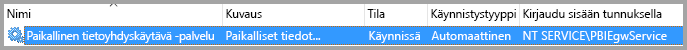

Jotta rajoitettu Kerberos-delegointi voidaan ottaa käyttöön, yhdyskäytävän on toimittava toimialuetilinä, ellei Azure Active Directorya (Azure AD) ole jo synkronoitu paikallisen Active Directory -esiintymän kanssa (käyttämällä Azure AD DirSynciä/Connectia). Jos haluat vaihtaa toimialuetiliin, katso [Yhdyskäytävän palvelutilin muuttaminen](/data-integration/gateway/service-gateway-service-account).

> [!NOTE]
> Jos Azure AD Connect on määritetty ja käyttäjätilit synkronoidaan, yhdyskäytäväpalvelun ei tarvitse tehdä paikallisia hakuja Azure AD:stä suorituksen aikana. Sen sijaan voit vain käyttää paikallista palvelun suojaustunnusta yhdyskäytäväpalvelussa suorittaaksesi kaikki vaaditut määritykset Azure AD:ssä. Tässä artikkelissa kuvatut rajoitetun Kerberos-delegoinnin määritysvaiheet ovat samat kuin Azure AD -kontekstissa vaaditut määritysvaiheet. Niitä sovelletaan Azure AD:ssä yhdyskäytävän tietokoneobjektiin (paikallisen palvelun suojaustunnuksen mukaan) toimialuetilin sijaan.

## <a name="obtain-domain-admin-rights-to-configure-spns-setspn-and-kerberos-constrained-delegation-settings"></a>Toimialueen järjestelmänvalvojan oikeuksien hankkiminen päänimien (SetSPN) ja rajoitetun Kerberos-delegoinnin asetusten määrittämiseksi

Jos palvelun päänimet ja Kerberos-delegoinnin asetukset halutaan määrittää, toimialueen järjestelmänvalvojan tulisi välttää oikeuksien myöntämistä jollekulle, jolla ei ole toimialueen järjestelmänvalvojan oikeuksia. Suositellut määritysvaiheet käsitellään seuraavassa osiossa.

## <a name="configure-kerberos-constrained-delegation-for-the-gateway-and-data-source"></a>Rajoitetun Kerberos-delegoinnin määrittäminen yhdyskäytävälle ja tietolähteelle

Määritä tarvittaessa toimialueen järjestelmänvalvojana palvelun päänimi yhdyskäytävän palvelutilille ja määritä sitten yhdyskäytäväpalvelun toimialuetilin delegointiasetukset.

### <a name="configure-an-spn-for-the-gateway-service-account"></a>SPN:n määrittäminen yhdyskäytävän palvelutilille

Selvitä ensin, onko yhdyskäytävän palvelutilinä käytetylle toimialuetilille luotu jo palvelun päänimi:

1. Käynnistä toimialueen järjestelmänvalvojana MMC-konsolin **Active Directory -käyttäjät ja -tietokoneet** -laajennuksen avulla.

2. Napsauta vasemmassa ruudussa toimialueen nimeä hiiren kakkospainikkeella, valitse **Etsi** ja kirjoita sitten yhdyskäytävän palvelutilin nimi.

3. Napsauta hakutuloksissa yhdyskäytävän palvelutiliä hiiren kakkospainikkeella ja valitse **Ominaisuudet**.

4. Jos **Delegointi**-välilehti näkyy **Ominaisuudet**-valintaikkunassa, palvelun päänimi on jo luotu ja voit siirtyä kohtaan [Valitse käytettävän rajoitetun Kerberos-delegoinnin tyyppi](#decide-on-the-type-of-kerberos-constrained-delegation-to-use).

5. Jos **Delegointi**-välilehteä ei näy **Ominaisuudet**-valintaikkunassa, voit luoda palvelun päänimen kyseiselle tilille manuaalisesti ottaaksesi sen käyttöön. Käytä [setspn-työkalua](https://technet.microsoft.com/library/cc731241.aspx), joka sisältyy Windowsiin (palvelun päänimen luominen edellyttää toimialueen järjestelmänvalvojan oikeuksia).

   Oletetaan esimerkiksi, että yhdyskäytävän palvelutili on **Contoso\GatewaySvc** ja yhdyskäytäväpalvelua suorittavan tietokoneen nimi on **OmaYhdyskäytäväkone**. Jotta yhdyskäytävän palvelutilille voidaan määrittää palvelun päänimi, suorita seuraava komento:

   ```setspn -a gateway/MyGatewayMachine Contoso\GatewaySvc```

   Voit määrittää palvelun päänimen myös MMC-konsolin **Active Directory-käyttäjät ja -tietokoneet** -laajennuksen avulla.
   
### <a name="add-gateway-service-account-to-windows-authorization-and-access-group-if-required"></a>Lisää tarvittaessa yhdyskäytäväpalvelun tili Windows-valtuutustietoihin ja käyttöoikeusryhmään

Joissakin tilanteissa yhdyskäytäväpalvelun tili on lisättävä Windows-valtuutustietoihin ja käyttöoikeusryhmään. Tällaisia tilanteita ovat Active Directory ‑ympäristön suojauksen rajoitus tai yhdyskäytäväpalvelun tilin sekä käyttäjätilien, joiksi yhdyskäytävä tekeytyy, sijaitseminen eri toimialueilla tai toimialuepuuryhmissä toisiinsa nähden. Voit myös lisätä yhdyskäytäväpalvelun tilin Windows-valtuutustietoihin ja käyttöoikeusryhmään tilanteissa, joissa toimialueessa tai toimialuepuuryhmässä ei ole rajoitusta, mutta se ei ole pakollista.

Lisätietoja on kohdassa [Windows-valtuutustiedot ja käyttöoikeusryhmä](/windows/security/identity-protection/access-control/active-directory-security-groups#bkmk-winauthaccess).

Tee määritysvaihe loppuun seuraavien ohjeiden mukaisesti jokaisen toimialueen osalta, joka sisältää Active Directory ‑käyttäjiä, joiksi haluat yhdyskäytäväpalvelun tilin voivan tekeytyä:
1. Kirjaudu sisään tietokoneelle, jonka toimialue on oikea, ja käynnistä Active Directory ‑käyttäjät ja ‑tietokoneet ‑MMC-laajennus.
2. Etsi oikea ryhmä **Windows-valtuutustiedoista ja käyttöoikeusryhmästä**, jotka löytyvät yleensä **Builtin**-säilöstä.
3. Kaksoisnapsauta ryhmää ja napsauta **Jäsenet**-välilehteä.
4. Valitse **Lisää** ja vaihda toimialueen sijainniksi toimialue, jolla yhdyskäytäväpalvelun tili sijaitsee.
5. Kirjoita yhdyskäytäväpalvelun tilin nimi ja tarkista, että yhdyskäytäväpalvelun tili on käytettävissä, valitsemalla **Tarkista nimet**.
6. Valitse **OK**.
7. Valitse **Käytä**.
8. Käynnistä yhdyskäytäväpalvelu uudelleen.

### <a name="decide-on-the-type-of-kerberos-constrained-delegation-to-use"></a>Käytettävän rajoitetun Kerberos-delegoinnin tyypin päättäminen

Voit määrittää delegointiasetukset joko vakiomuotoiselle rajoitetulle Kerberos-delegoinnille tai resurssipohjaiselle rajoitetulle Kerberos-delegoinnille. Käytä resurssipohjaista delegointia (edellyttää Windows Server 2012:n tai uudemman version), jos tietolähteesi kuuluu eri toimialueeseen kuin yhdyskäytäväsi. Lisätietoja näiden kahden delegointitavan eroista on [rajoitetun Kerberos-delegoinnin yleiskatsaussivulla](/windows-server/security/kerberos/kerberos-constrained-delegation-overview).

 Siirry johonkin seuraavista osioista sen mukaan, mitä lähestymistapaa haluat käyttää. Älä suorita molempia osioita:
 - [Määritä yhdyskäytävän palvelutili vakiomuotoiselle rajoitetulle Kerberos-delegoinnille](#configure-the-gateway-service-account-for-standard-kerberos-constrained-delegation)
- [Määritä yhdyskäytävän palvelutili resurssipohjaiselle rajoitetulle Kerberos-delegoinnille](#configure-the-gateway-service-account-for-resource-based-kerberos-constrained-delegation). 

## <a name="configure-the-gateway-service-account-for-standard-kerberos-constrained-delegation"></a>Määritä yhdyskäytävän palvelutili vakiomuotoiselle rajoitetulle Kerberos-delegoinnille

> [!NOTE]
> Suorita tämän osion vaiheet, jos haluat ottaa käyttöön [vakiomuotoisen rajoitetun Kerberos-delegoinnin](/windows-server/security/kerberos/kerberos-constrained-delegation-overview). Muussa tapauksessa jos haluat ottaa käyttöön resurssipohjaisen rajoitetun Kerberos-delegoinnin, suorita osion [Määritä yhdyskäytävän palvelutili resurssipohjaiselle rajoitetulle Kerberos-delegoinnille](#configure-the-gateway-service-account-for-resource-based-kerberos-constrained-delegation) vaiheet.

Määritämme nyt yhdyskäytävän palvelutilin delegointiasetukset. Voit suorittaa nämä vaiheet useilla eri työkaluilla. Tässä esimerkissä käytetään **Active Directory -käyttäjät ja -tietokoneet** -MMC-laajennusta, jonka avulla voit hallita ja julkaista tietoja hakemistossa. Se on käytettävissä oletusarvoisesti toimialueen ohjauskoneissa; toisissa tietokoneissa voit ottaa sen käyttöön Windowsin toimintojen määrityksen kautta.

Rajoitettu Kerberos-delegointi on määritettävä protokollan siirtämisellä. Rajoitetussa delegoinnissa on määritettävä tarkasti, mille palveluille sallit yhdyskäytävän delegoitujen tunnistetietojen esittelyn. Esimerkiksi vain SQL Server tai SAP HANA -palvelin hyväksyy delegointikutsuja yhdyskäytävän palvelutililtä.

Tässä osassa oletetaan, että olet jo määrittänyt palvelun päänimet pohjana oleville tietolähteille (kuten SQL Server, SAP HANA, SAP BW, Teradata tai Spark). Lisätietoja näiden tietolähdepalvelimen palvelun päänimien määrittämisestä on kunkin tietokantapalvelimen teknisissä ohjeissa ja osiossa *What SPN does your app require?* blogikirjoituksessa [My Kerberos Checklist](https://techcommunity.microsoft.com/t5/SQL-Server-Support/My-Kerberos-Checklist-8230/ba-p/316160).

Seuraavissa vaiheissa oletuksena on paikallinen ympäristö, jossa on kaksi konetta samalla toimialueella: yhdyskäytäväkone ja SQL Serveriä käyttävä tietokantapalvelin, joka on jo määritetty Kerberos-pohjaiselle kertakirjautumiselle. Vaiheet voidaan hyväksyä jossakin muussa tuetussa tietolähteessä, kunhan tietolähde on jo määritetty Kerberos-pohjaiselle kertakirjautumiselle. Tässä esimerkissä käytämme seuraavia asetuksia:

* Active Directory -toimialue (Netbios): **Contoso**
* Yhdyskäytäväkoneen nimi: **OmaYhdyskäytäväkone**
* Yhdyskäytävän palvelutili: **Contoso\GatewaySvc**
* SQL Serverin tietolähteen koneen nimi: **TestSQLServer**
* SQL Serverin tietolähteen palvelutili: **Contoso\SQLService**

Voit määrittää delegoinnin asetukset seuraavasti:

1. Käynnistä **Active Directory -käyttäjät ja -tietokoneet** -MMC-laajennus toimialueen järjestelmänvalvojan oikeuksilla.

2. Napsauta yhdyskäytävän palvelutiliä (**Contoso\GatewaySvc**) hiiren kakkospainikkeella ja valitse **Ominaisuudet**.

3. Valitse **Delegointi**-välilehti.

4. Valitse **Luota tähän tietokoneeseen vain määritettyihin palveluihin delegointia varten** >  ja valitse sitten **Käytä mitä tahansa todennusprotokollaa**.

5. Valitse **Palvelut, joille tämä tili voi esittää delegoidut tunnistetiedot** -kohdassa **Lisää**.

6. Valitse uudessa valintaikkunassa **Käyttäjät tai tietokoneet**.

7. Anna tietolähteen palvelutili ja valitse sitten **OK**.

   Esimerkiksi SQL Server -tietolähteellä voi olla palvelutili kuten *Contoso\SQLService*. Tälle tilille on jo määritetty asianmukainen palvelun päänimi tietolähteelle. 

8. Valitse SPN, jonka loit tietokantapalvelimelle. 

   Tässä esimerkissä SPN:n alussa on *MSSQLSvc*. Jos olet lisännyt tietokantapalvelulle sekä FQDN- että NetBIOS-SPN:n, valitse molemmat. Saatat nähdä vain yhden.

9. Valitse **OK**. 

   Sinun pitäisi nyt nähdä palvelun päänimi niiden palveluiden luettelossa, joille yhdyskäytäväpalvelutili voi antaa delegoidut tunnistetiedot.

    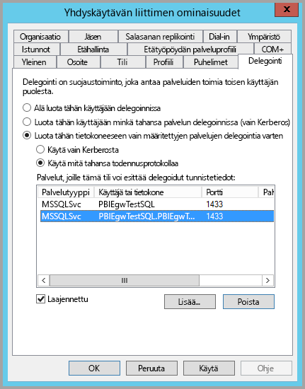

10. Jatka määritysprosessia siirtymällä kohtaan [Myönnä paikallisen käytännön oikeudet yhdyskäytävän palvelutilille yhdyskäytäväkoneessa](#grant-the-gateway-service-account-local-policy-rights-on-the-gateway-machine).

## <a name="configure-the-gateway-service-account-for-resource-based-kerberos-constrained-delegation"></a>Määritä yhdyskäytävän palvelutili resurssipohjaiselle rajoitetulle Kerberos-delegoinnille

> [!NOTE]
> Suorita tämän osion vaiheet, jos haluat ottaa käyttöön [resurssipohjaisen rajoitetun Kerberos-delegoinnin](/windows-server/security/kerberos/kerberos-constrained-delegation-overview#resource-based-constrained-delegation-across-domains). Muussa tapauksessa, jos haluat ottaa käyttöön vakiomuotoisen rajoitetun Kerberos-delegoinnin, suorita osan [Määritä yhdyskäytävän palvelutili vakiomuotoiselle rajoitetulle Kerberos-delegoinnille](#configure-the-gateway-service-account-for-standard-kerberos-constrained-delegation) vaiheet.

Käytät [resurssipohjaista rajoitettua Kerberos-delegointia](/windows-server/security/kerberos/kerberos-constrained-delegation-overview#resource-based-constrained-delegation-across-domains) kertakirjautumisyhteyden käyttöönottamiseksi Windows Server 2012:lle ja uudemmille versioille. Tämäntyyppinen delegointi sallii edustan ja taustan palveluiden olevan eri toimialueilla. Jotta tämä toimisi, taustapalvelun toimialueen on luotettava edustapalvelun toimialueeseen.

Seuraavissa vaiheissa oletuksena on paikallinen ympäristö, jossa on kaksi konetta eri toimialueilla: yhdyskäytäväkone ja SQL Serveriä käyttävä tietokantapalvelin, joka on jo määritetty Kerberos-pohjaiselle kertakirjautumiselle. Nämä vaiheet voidaan hyväksyä jossakin muussa tuetussa tietolähteessä, kunhan tietolähde on jo määritetty Kerberos-pohjaiselle kertakirjautumiselle. Tässä esimerkissä käytämme seuraavia asetuksia:

* Active Directory -edustatoimialue (Netbios): **ContosoFrontEnd**
* Active Directory -taustatoimialue (Netbios): **ContosoBackEnd**
* Yhdyskäytäväkoneen nimi: **OmaYhdyskäytäväkone**
* Yhdyskäytävän palvelutili: **ContosoFrontEnd\GatewaySvc**
* SQL Serverin tietolähteen koneen nimi: **TestSQLServer**
* SQL Serverin tietolähteen palvelutili: **ContosoBackEnd\SQLService**

Suorita seuraavat määritysvaiheet:

1. Käytä MMC-konsolin **Active Directory -käyttäjät ja -tietokoneet** -laajennusta toimialueen ohjauskoneessa **ContosoFrontEnd**-toimialueelle ja tarkista, että yhdyskäytävän palvelutiliin ei sovelleta delegointiasetuksia.

    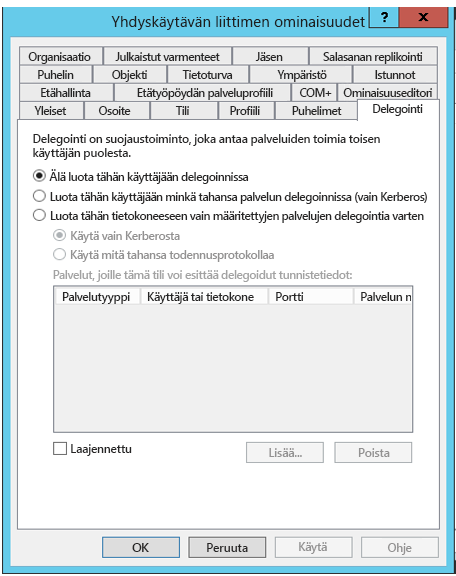

2. Käytä **Active Directory -käyttäjät ja -tietokoneet** -laajennusta toimialueen ohjauskoneessa **ContosoBackEnd**-toimialueelle ja tarkista, että taustapalvelutiliin ei sovelleta delegointiasetuksia.

    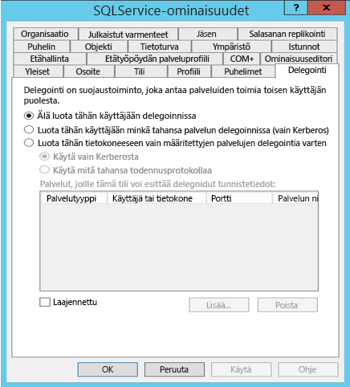

3. Tarkista tilin ominaisuuksien **Ominaisuuseditori**-välilehdeltä, että **msDS-AllowedToActOnBehalfOfOtherIdentity**-määritettä ei ole määritetty.

    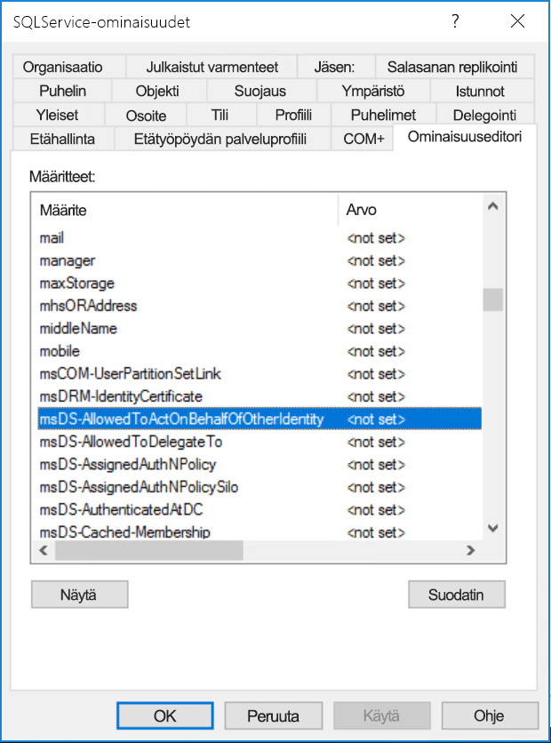

4. Luo **Active Directory -käyttäjät ja -tietokoneet** -laajennuksessa toimialueen ohjauskoneessa ryhmä **ContosoBackEnd**-toimialueelle. Lisää **GatewaySvc**-yhdyskäytävän palvelutili **ResourcDelGroup**-ryhmään. 

    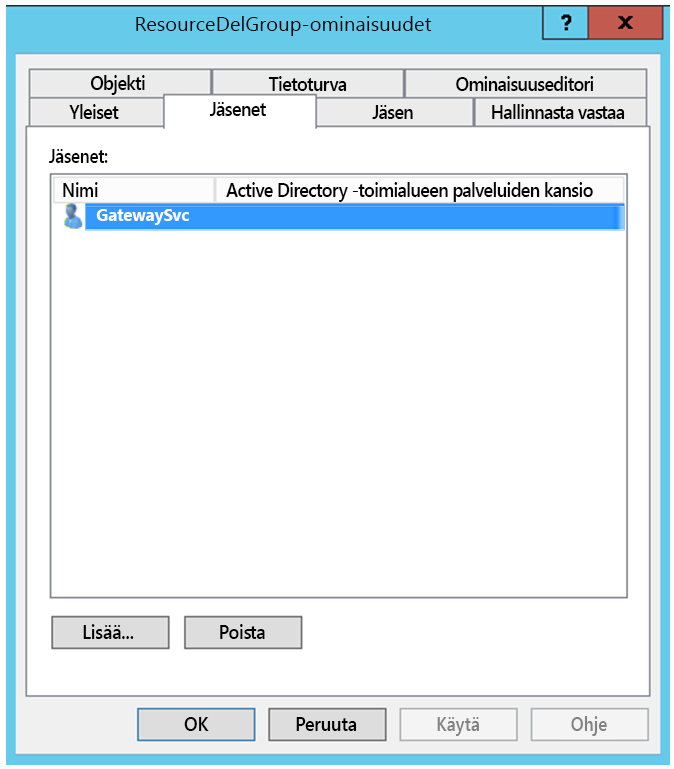

5. Avaa komentokehote ja suorita seuraavat komennot toimialueen ohjauskoneessa **ContosoBackEnd**-toimialueelle taustapalvelutilin **msDS-AllowedToActOnBehalfOfOtherIdentity**-määritteen päivittämiseksi:

    ```powershell
    $c = Get-ADGroup ResourceDelGroup
    Set-ADUser SQLService -PrincipalsAllowedToDelegateToAccount $c
    ```

6. Voit tarkistaa, että päivitys näkyy taustapalvelutilin ominaisuuksien **Ominaisuuseditori**-välilehdessä **Active Directory -käyttäjät ja -tietokoneet** -laajennuksessa. 

## <a name="grant-the-gateway-service-account-local-policy-rights-on-the-gateway-machine"></a>Myönnä paikallisen käytännön oikeudet yhdyskäytävän palvelutilille yhdyskäytäväkoneessa

Lopuksi koneessa, joka suorittaa yhdyskäytäväpalvelua (esimerkissämme **OmaYhdyskäytäväkone**), myönnä yhdyskäytävän palvelutilille  paikalliset käytännöt **Asiakkaaksi tekeytyminen todentamisen jälkeen** ja **Käyttöjärjestelmän osana toimiminen (SeTcbPrivilege)** . Suorita tämä määritys paikallisessa ryhmäkäytäntöeditorissa (**gpedit.msc**).

1. Suorita yhdyskäytäväkoneessa **gpedit.msc**.

2. Siirry kohtaan **Paikallisen tietokoneen käytäntö** &gt; **Tietokoneasetukset** &gt; **Windowsin asetukset** &gt; **Suojausasetukset** &gt; **Paikalliset käytännöt** &gt; **Järjestelmäoikeuksien osoitus**.

    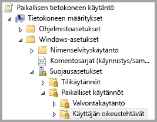

3. Valitse **Järjestelmäoikeuksien osoitus** -kohdan käytäntöluettelosta **Asiakkaaksi tekeytyminen todentamisen jälkeen**.

    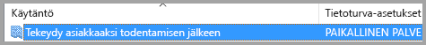
    
4. Napsauta hiiren kakkospainikkeella käytäntöä, avaa **Ominaisuudet** ja tarkastele sitten tililuetteloa. 

    Luettelon on sisällettävä yhdyskäytäväpalvelutili (**Contoso\GatewaySvc** tai **ContosoFrontEnd\GatewaySvc** riippuen rajoitetun delegoinnin tyypistä).

5. Valitse **Järjestelmäoikeuksien osoitus** -kohdan käytäntöluettelosta **Käyttöjärjestelmän osana toimiminen (SeTcbPrivilege)** . Varmista, että yhdyskäytävän palvelutili sisältyy tililuetteloon.

6. Käynnistä **Paikallinen tietoyhdyskäytävä** -palveluprosessi uudelleen.

### <a name="set-user-mapping-configuration-parameters-on-the-gateway-machine-if-necessary"></a>Määritä käyttäjien yhdistämisen määritysparametrit yhdyskäytäväkoneessa (jos tarpeen)

Jos Azure AD Connectia ei ole määritetty, noudata seuraavia toimia yhdistääksesi Power BI -palvelukäyttäjän paikalliseen Active Directory -käyttäjään. Jokaisella tällä tavalla yhdistetyllä Active Directory -käyttäjällä on oltava tietolähteesi kertakirjautumisoikeudet. Jos haluat lisätietoja, katso [Kaveri kuutiossa -video](https://www.youtube.com/watch?v=NG05PG9aiRw).

1. Avaa yhdyskäytävän päämääritystiedosto: Microsoft.PowerBI.DataMovement.Pipeline.GatewayCore.dll. Tämä tiedosto löytyy oletusarvoisesti sijainnista C:\Program Files\On-premises data gateway.

1. Valitse **ADUserNameLookupProperty**-arvo käyttämättömälle Active Directory -määritteelle. Käytämme määritettä `msDS-cloudExtensionAttribute1` seuraavassa vaiheessa. Tämä määrite on käytettävissä vain Windows Server 2012:ssa ja sitä uudemmissa versioissa. 

1. Määritä **ADUserNameReplacementProperty**-arvoksi `SAMAccountName` ja tallenna määritystiedosto.

1. Voit käynnistää yhdyskäytäväpalvelun uudelleen Tehtävienhallinnan **Palvelut**-välilehden kautta napsauttamalla hiiren kakkospainikkeella **Käynnistä uudelleen**.

    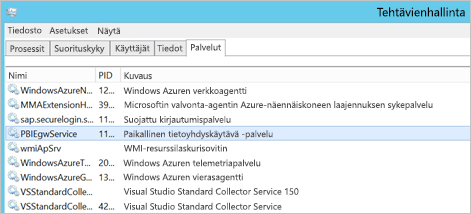

1. Määritä jokaiselle Power BI -palvelun käyttäjälle, jolle haluat ottaa käyttöön Kerberos-kertakirjautumisen, paikallisen Active Directory -käyttäjän `msDS-cloudExtensionAttribute1`-ominaisuus (kertakirjautumisoikeuksilla tietolähteeseen) Power BI -palvelun käyttäjän täydelliseksi käyttäjänimeksi (UPN:ksi). Jos esimerkiksi kirjaudut Power BI -palveluun nimellä test@contoso.com ja haluat yhdistää tämän käyttäjän paikalliseen Active Directory -käyttäjään, jolla on kertakirjautumisoikeudet (esimerkiksi test@LOCALDOMAIN.COM), määritä käyttäjän `msDS-cloudExtensionAttribute1` -määritteeksi test@contoso.com.

    Voit määrittää `msDS-cloudExtensionAttribute1`-ominaisuuden Active Directory -käyttäjät ja -tietokoneet -MMC-laajennuksen avulla:
    
    1. Käynnistä **Active Directory -käyttäjät ja -tietokoneet** toimialueen järjestelmänvalvojana.
    
    1. Napsauta toimialueen nimeä hiiren kakkospainikkeella, valitse **Etsi** ja kirjoita sen paikallisen Active Directory -käyttäjän nimi, johon haluat yhdistää.
    
    1. Valitse **Ominaisuuseditori**-välilehti.
    
        Etsi `msDS-cloudExtensionAttribute1`-ominaisuus ja kaksoisnapsauta sitä. Määritä sen arvoksi sen käyttäjän täydellinen käyttäjänimi (UPN), jolla kirjaudut sisään Power BI -palveluun.
    
    1. Valitse **OK**.
    
        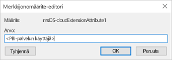
    
    1. Valitse **Käytä**. Varmista, että olet määrittänyt oikean arvon **Arvo**-sarakkeeseen.

## <a name="complete-data-source-specific-configuration-steps"></a>Viimeistele tietolähdekohtaiset määritysvaiheet

SAP HANA ja SAP BW sisältävät ylimääräisiä tietolähdekohtaisia määritystä koskevia vaatimuksia ja edellytyksiä, jotka sinun on täytettävä, ennen kuin voit muodostaa kertakirjautumisyhteyden yhdyskäytävän kautta näihin tietolähteisiin. Lisätietoja on kohdassa [SAP HANA -määritys](service-gateway-sso-kerberos-sap-hana.md) ja [SAP BW–- CommonCryptoLib (sapcrypto.dll) -määrityssivulla](service-gateway-sso-kerberos-sap-bw-commoncryptolib.md). Vaikka on mahdollista [määrittää SAP BW käytettäväksi gx64krb5 SNC -kirjaston](service-gateway-sso-kerberos-sap-bw-gx64krb.md) kanssa, tätä kirjastoa ei suositella, koska SAP ei enää tue sitä. Käytä sen sijaan CommonCryptoLib- _tai_ gx64krb5-kirjastoa SNC-kirjastona. Älä suorita molempien kirjastojen määritysvaiheita.

> [!NOTE]
> Vaikka muut SNC-kirjastot saattavat toimia BW-kertakirjautumisen kanssa, Microsoft ei virallisesti tue niitä.

## <a name="run-a-power-bi-report"></a>Power BI -raportin suorittaminen

Kun olet suorittanut kaikki määritysvaiheet, käytä Power BI:n **yhdyskäytävän hallintasivua** kertakirjautumisessa käytettävän tietolähteen määrittämiseen. Jos käytössäsi on useita yhdyskäytäviä, varmista, että valitset yhdyskäytävän, jonka olet määrittänyt Kerberos-kertakirjautumiselle. Varmista sitten tietolähteen kohdalla **Lisäasetukset** -kohdassa, että **Käytä DirectQuery-kyselyissä kertakirjautumista Kerberoksen kautta** -kohta on valittuna.

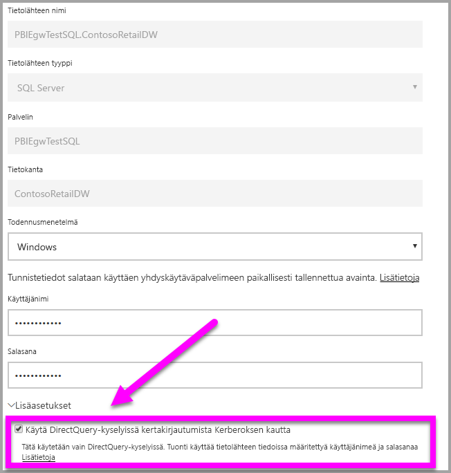

 Julkaise DirectQuery-pohjainen raportti Power BI Desktopista. Tämän raportin on käytettävä tietoja, joita käyttäjä voi käyttää ja jotka on yhdistetty (Azure) Active Directory -käyttäjään, joka kirjautuu Power BI -palveluun. Päivityksen toimintotavan vuoksi sinun täytyy käyttää DirectQueryä tuonnin sijaan. Kun yhdyskäytävä päivittää tuontipohjaisia raportteja, se käyttää **Käyttäjänimi**- ja **Salasana**-kenttiin syöttämiäsi tunnistetietoja tietolähteen luonnin aikana. Toisin sanoen Kerberos-kertakirjautumista *ei* käytetä. Kun julkaiset, valitse yhdyskäytävä, jonka olet määrittänyt kertakirjautumiselle, jos sinulla on useita yhdyskäytäviä. Power BI -palvelussa voit nyt päivittää raportin tai luoda uuden raportin julkaistun tietojoukon perusteella.

Tämä määritys toimii useimmissa tapauksissa. Kerberoksessa voi kuitenkin olla eri määrityksiä ympäristösi mukaan. Jos raportti ei lataudu, ota yhteyttä toimialueen järjestelmänvalvojaan asian selvittämiseksi. Jos tietolähteesi on SAP BW, saat lisätietoja myös tietolähdekohtaisista vianmääritysosiosta [CommonCryptoLib](service-gateway-sso-kerberos-sap-bw-commoncryptolib.md#troubleshooting)- ja [gx64krb5/gsskrb5](service-gateway-sso-kerberos-sap-bw-gx64krb.md#troubleshooting)-kirjastoille valitsemasi SNC-kirjaston mukaan.

## <a name="next-steps"></a>Seuraavat vaiheet

Lisätietoja paikallisesta tietoyhdyskäytävästä ja DirectQuerysta on seuraavissa resursseissa:

* [Mikä paikallinen tietoyhdyskäytävä on?](/data-integration/gateway/service-gateway-onprem)
* [DirectQuery Power BI:ssä](desktop-directquery-about.md)
* [DirectQueryn tukemat tietolähteet](desktop-directquery-data-sources.md)
* [DirectQuery ja SAP BW](desktop-directquery-sap-bw.md)
* [DirectQuery ja SAP HANA](desktop-directquery-sap-hana.md)
