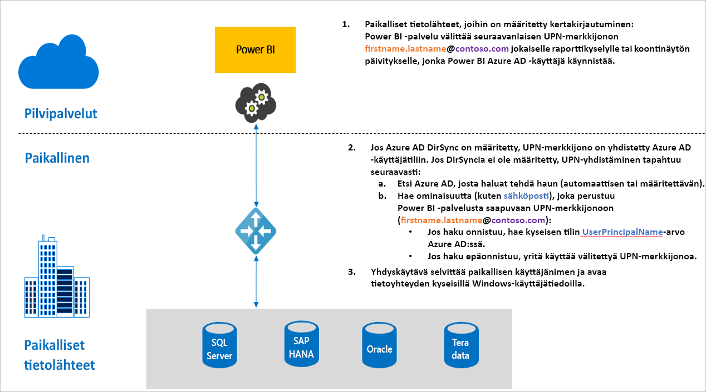

# Yleiskatsaus kertakirjautumisen (SSO) käyttämiseen Power BI -yhdyskäytävissä

Saumaton kertakirjautuminen mahdollistaa Power BI -raporttien ja -koontinäyttöjen päivittämisen reaaliaikaisesti paikallisista tiedoista, ja voit ottaa sen käyttöön määrittämällä paikallisen tietoyhdyskäytävän joko rajoitetun Kerberos-delegoinnin tai Security Assertion Markup Languagen (SAML) avulla. Paikallinen tietoyhdyskäytävä tukee kertakirjautumista DirectQueryllä, jota se käyttää yhteyden muodostamiseen paikallisiin tietolähteisiin.

Tällä hetkellä tuemme seuraavia tietolähteitä:

* SQL Server ([Kerberos](service-gateway-sso-kerberos.md))
* SAP HANA ([Kerberos](service-gateway-sso-kerberos.md) ja [SAML](service-gateway-sso-saml.md))
* SAP BW -sovelluspalvelin ([Kerberos](service-gateway-sso-kerberos.md))
* SAP BW -viestipalvelin ([Kerberos](service-gateway-sso-kerberos.md)) – julkinen esikatselu
* Oracle ([Kerberos](service-gateway-sso-kerberos.md)) – julkinen esikatselu
* Teradata ([Kerberos](service-gateway-sso-kerberos.md))
* Spark ([Kerberos](service-gateway-sso-kerberos.md))
* Impala ([Kerberos](service-gateway-sso-kerberos.md))

Emme tällä hetkellä tue SSO:ta [M-laajennuksissa](https://github.com/microsoft/DataConnectors/blob/master/docs/m-extensions.md).

Kun käyttäjä on vuorovaikutuksessa DirectQuery-raportin kanssa Power BI -palvelussa, jokainen ristisuodatus-, ositus-, lajittelu- ja raportin muokkaustoiminto voi aiheuttaa kyselyjä, jotka suoritetaan reaaliajassa pohjana olevalle paikalliselle tietolähteelle. Kun tietolähteelle määritetään kertakirjautuminen, kyselyt suoritetaan Power BI:n kanssa vuorovaikutuksessa (verkkosisällön tai Power BI -mobiilisovellusten kautta) olevan käyttäjän käyttäjätiedoilla. Näin kukin käyttäjä näkee tarkasti tiedot, joihin hänellä on oikeudet pohjana olevassa tietolähteessä. Kun kertakirjautuminen on määritetty, eri käyttäjien välimuistissa ei ole jaettuja tietoja.

## Kyselyn vaiheet suoritettaessa kertakirjautumista

SSO:n avulla suoritettavassa kyselyssä on kolme vaihetta, kuten seuraava kaavio osoittaa.

Seuraavassa on lisätietoja näistä vaiheista:

1. Jokaisessa kyselyssä **Power BI -palvelu** sisältää *käyttäjän täydellisen käyttäjätunnuksen* (UPN:n eli Power BI -palveluun kirjautuneena olevan käyttäjän täydellisen käyttäjänimen), kun kyselypyyntö lähetetään määritettyyn yhdyskäytävään.

2. Yhdyskäytävän on yhdistettävä Azure Active Directoryn täydellinen käyttäjätunnus paikallisen Active Directoryn käyttäjätietoihin.

   a.  Jos Azure AD DirSync (eli *Azure AD Connect*) on määritetty, yhdistäminen toimii automaattisesti yhdyskäytävässä.

   b.  Muussa tapauksessa yhdyskäytävä voi etsiä Azure AD:n täydellisen käyttäjätunnuksen ja yhdistää sen paikalliseen AD-käyttäjään tekemällä haun paikalliselta Active Directory -toimialueelta.

3. Yhdyskäytävän palveluprosessi tekeytyy yhdistetyksi paikalliseksi käyttäjäksi, avaa yhteyden pohjana olevaan tietokantaan ja lähettää kyselyn. Yhdyskäytävää ei tarvitse asentaa samaan tietokoneeseen kuin tietokanta.

## Seuraavat vaiheet

Nyt kun tiedät kertakirjautumisen perusteet yhdyskäytävän kautta, voit lukea lisätietoja Kerberoksesta ja SAML:sta:

* [Kertakirjautuminen (SSO) - Kerberos](service-gateway-sso-kerberos.md)
* [Kertakirjautuminen (SSO) - SAML](service-gateway-sso-saml.md)
